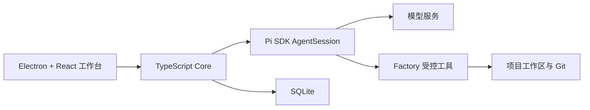

# SDLC Factory

SDLC Factory 是一个本地优先的桌面 AI 软件研发工作台。它以项目内持续多轮对话为主轴，通过显式 `/sdlc-*` 命令调用研发能力，由 AI 根据真实项目状态提供柔性提示，并由用户审核后形成正式基线。

当前正在复核的重构方向是：

- Electron + React 提供三栏桌面工作台；
- 左侧保留项目导航，中间平铺多轮对话，右侧聚合文件、变更、产物、证据、审核与基线；
- 输入框支持模型、推理强度、多附件、拖放和粘贴；
- TypeScript Core 负责本地项目事实、权限、审核、基线和持久化；
- Pi SDK 作为首版 Agent 运行时，提供进程内会话、模型调用、流式事件、工具循环和上下文压缩；
- `/sdlc-*` Skill 开始时读取 Core 解析的当前工作位置，AI 在普通回复中提示缺口，用户可以继续；
- 对话不绑定流程，消息不携带流程上下文，不建设强制阶段门禁；
- 只有用户通过待审核版本，系统才形成不可变基线。

## 当前文档

- [SDLC Factory 重构方案](docs/architecture/sdlc-factory-overall-design.md)——待用户复核，复核前不称为冻结方案。
- [2026-08-06 至 2026-08-07 重构讨论记录](docs/design-records/2026-08-06-to-07-reconstruction/README.md)——包含 `localhost:50620` 展示过的全部原始设计页面及用户提供的 Open Design 调研原文。
- [Agent 运行时选型与 Pi SDK 研究记录](docs/research/agent-runtime-selection-pi-sdk-2026-08-07.md)
- [Open Design 官方源码审计](docs/research/open-design-official-source-audit-2026-08-06.md)
- [Claude Code Game Studios 工作流引导机制审计](docs/research/claude-code-game-studios-workflow-guidance-audit-2026-08-06.md)

## 历史实现

[archive/legacy-v1.2](archive/legacy-v1.2/ARCHIVE-NOTICE.md) 仅保存 v1.2 历史实现快照，包括当时的代码、合同和文档。它不是当前方案，也不能作为新版实现依据。

当前只进行方案复核；在用户确认重构方案前，不制定或执行后续实施计划。
