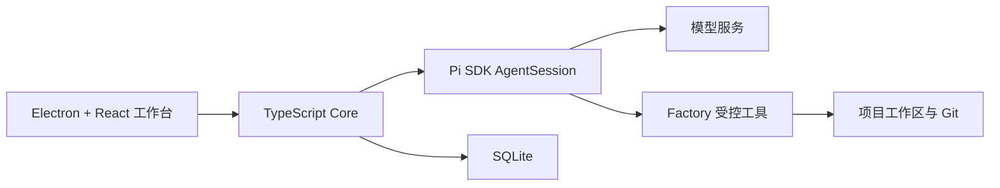

# SDLC Factory

SDLC Factory 是一个本地优先的桌面 AI 软件研发工作台。它以持续多轮对话完成需求、设计、编码和验证，通过显式 `/sdlc-*` 命令提供轻量流程提示，并由用户审核后形成正式基线。

当前目标架构已经统一为：

- Electron + React 提供桌面工作台；
- 本地 TypeScript Core 负责项目、对话、工具权限、审核、基线和持久化；
- Pi SDK 作为唯一首选 Agent 运行时，以进程内 `AgentSession` 提供模型调用、流式事件、工具循环和上下文压缩；
- SQLite 保存 Factory 产品事实，项目文件与 Git 保存在用户选择的工作区；
- Open Design 只作为桌面对话交互参考，不复用其多 CLI 运行架构；
- Claude Code Game Studios 只作为 `/sdlc-*` 命令和非强制阶段提醒参考。

## 当前权威文档

- [整体设计方案](docs/architecture/sdlc-factory-overall-design.md)
- [Agent 运行时选型与 Pi SDK 研究记录](docs/research/agent-runtime-selection-pi-sdk-2026-08-07.md)
- [Open Design 官方源码审计](docs/research/open-design-official-source-audit-2026-08-06.md)
- [Claude Code Game Studios 工作流引导机制审计](docs/research/claude-code-game-studios-workflow-guidance-audit-2026-08-06.md)

当前仓库处于新架构实施前的方案冻结阶段。旧版实现、合同和文档已经归档，不构成当前设计或后续实现依据。
