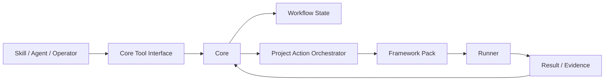

# SDLC Factory

SDLC Factory 1.0 是一个面向 AI Agent 的本地 SDLC Core。它用统一能力调用不同框架模板，向 Skill/Agent 暴露项目级工具，并记录需求、实现、人工审核和聚合测试状态。

当前只设计和实现 **1.0**，不保留 2.0 软件工厂方案。

## 主要流程

```text
创建多个 WorkItem
  → Operator 分别发布 Requirement Version
  → Agent 分别实现并绑定 Source Revision
  → Agent 提交人工审核
  → Operator 批准或要求修改
  → 把多个已批准 WorkItem 组成 TestBatch
  → Core 调用 Framework Pack 完成启动、检查、编译和测试
  → TestBatch 记录 Passed / Failed 与 Evidence
  → 通过后按需执行构建或打包
```

测试不从属于某个 WorkItem。一个 TestBatch 可以汇总多个已完成且已审核的 WorkItem，并冻结每项的需求版本、源码 revision 和审核决定；被测内容变化后，旧测试结果自动视为 `stale`。

## 具体方案



| 层次 | 责任 | 详细说明 |
|---|---|---|
| Core Tool Interface | 提供少量项目级工具，不暴露 React、Spring、Electron 等框架概念 | [1.0 主方案](docs/v1.0/README.md) |
| Workflow State | 分别维护需求、实现、审核、TestBatch 和 Operation 状态 | [领域与生命周期](docs/v1.0/appendices/A-domain-and-lifecycle.md) |
| Project Action Orchestrator | 把 `project.start/test/package` 编排成多个模块能力 | [Framework Pack 与 Runner](docs/v1.0/appendices/C-framework-pack-and-runner.md) |
| Framework Pack | 实现标准 Capability，生成声明式 Execution Plan | [Framework Pack 与 Runner](docs/v1.0/appendices/C-framework-pack-and-runner.md) |
| State / Evidence | 分离 Markdown 事实、JSON 状态索引和执行证据 | [状态与证据](docs/v1.0/appendices/B-state-and-evidence.md) |

1.0 支持前端单模块，也支持前端、后端等多模块组合。Core 是流程与状态的唯一裁决者；Framework Pack 不能修改流程状态，Agent 不能产生需求发布或人工审核决定。

## 文档

- [1.0 主方案](docs/v1.0/README.md)
- [附录 A：领域与生命周期](docs/v1.0/appendices/A-domain-and-lifecycle.md)
- [附录 B：状态与证据](docs/v1.0/appendices/B-state-and-evidence.md)
- [附录 C：Framework Pack 与 Runner](docs/v1.0/appendices/C-framework-pack-and-runner.md)
- [附录 D：项目目录规范](docs/v1.0/appendices/D-project-document-layout.md)
- [附录 E：实施与验收](docs/v1.0/appendices/E-implementation-and-acceptance.md)
- [1.0 机器合同](docs/v1.0/contracts/README.md)
- [领域词汇表](CONTEXT.md)

## 当前状态

仓库处于 1.0 设计阶段，尚无 Core、Framework Pack、Runner 或真实项目验收 Evidence。文档接受不等同于实现完成。
