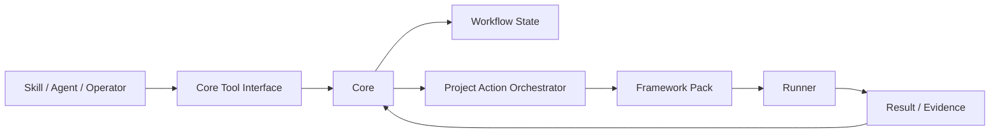

# SDLC Factory

SDLC Factory 是一个面向 AI Agent 的本地软件交付体系。1.0 定义工作项、测试批次、
框架适配包和执行器；1.1 方案在此基础上补齐专业 Agent、Skill、Hook、领域规则、
OpenCode 运行分析和最终产物符合性检查。

当前不保留 2.0 软件工厂方案。1.0 是基础合同，1.1 目前是待评审的升级方案。

## 1.1 方案草案

1.1 重点解决当前仍依赖 Codex 手工监督的问题：

- 专业角色如何分层委派，同时不把角色职责误做成目录权限；
- 如何独立分析 OpenCode 的公开运行事件、工具调用、阶段耗时、Token 和成本；
- 如何识别无进展重复调用和重试放大，而不使用固定次数门禁；
- 如何检查最终产物是否真正满足需求、协议、UI 原型和必测项；
- 如何用结构化交接替代从 Agent 聊天尾部解析 JSON；
- 如何分离产品交付证据与研发过程遥测；
- 大需求如何先规划、批准并拆成多个关联工作项；
- 如何通过观测 CLI 和 Codex 适配器独立分析会话执行；
- 如何在本地控制台呈现项目地图、运行、成本和产物报告。

系统不读取或保存模型私有思维链，只分析宿主和模型提供方明确公开的可观测运行行为。

详见 [SDLC Factory 1.1 主方案](docs/v1.1/README.md)。

## 主要流程

```text
创建 Project
  → 大需求可选：创建并批准 DeliveryPlan
  → 创建一个或多个 WorkItem
  → Operator 分别发布 Requirement Version
  → Agent 分别实现并绑定 Source Revision
  → Agent 提交人工审核
  → Operator 批准或要求修改
  → 把多个已批准 WorkItem 组成 TestBatch
  → Core 调用 Framework Pack 完成启动、检查、编译和测试
  → TestBatch 记录 Passed / Failed 与 Evidence
  → 通过后按需执行构建或打包
```

测试不从属于某个 WorkItem。一个 TestBatch 可以汇总多个已完成且已审核的 WorkItem，并冻结每项的需求版本、源码 revision 和审核决定；被测内容变化后，旧测试结果自动视为 `stale`。

## 具体方案



| 层次 | 责任 | 详细说明 |
|---|---|---|
| Core Tool Interface | 提供少量项目级工具，不暴露 React、Spring、Electron 等框架概念 | [1.0 主方案](docs/v1.0/README.md) |
| Workflow State | 分别维护需求、实现、审核、TestBatch 和 Operation 状态 | [领域与生命周期](docs/v1.0/appendices/A-domain-and-lifecycle.md) |
| Project Action Orchestrator | 把 `project.start/test/package` 编排成多个模块能力 | [Framework Pack 与 Runner](docs/v1.0/appendices/C-framework-pack-and-runner.md) |
| Framework Pack | 实现标准 Capability，生成声明式 Execution Plan | [Framework Pack 与 Runner](docs/v1.0/appendices/C-framework-pack-and-runner.md) |
| State / Evidence | 分离 Markdown 事实、JSON 状态索引和执行证据 | [状态与证据](docs/v1.0/appendices/B-state-and-evidence.md) |

1.0 支持前端单模块，也支持前端、后端等多模块组合。Core 是流程与状态的唯一裁决者；Framework Pack 不能修改流程状态，Agent 不能产生需求发布或人工审核决定。

## 文档

- [1.1 主方案草案](docs/v1.1/README.md)
- [1.1 专业协作与职责](docs/v1.1/appendices/A-professional-collaboration.md)
- [1.1 运行观察与成本分析](docs/v1.1/appendices/B-runtime-observability.md)
- [1.1 最终产物与需求符合性](docs/v1.1/appendices/C-artifact-conformance.md)
- [1.1 实施与验收](docs/v1.1/appendices/D-implementation-and-acceptance.md)
- [1.1 中文词汇与英文编码名](docs/v1.1/appendices/E-terminology-for-code.md)
- [1.1 主流 Agent 产品模式与借鉴](docs/v1.1/appendices/F-agent-product-patterns.md)
- [1.1 规划模式、观测 CLI 与项目控制台](docs/v1.1/appendices/G-planning-cli-and-console.md)
- [OpenCode 可观测性调研](docs/research/opencode-observability-2026-07-31.md)
- [主流 Agent 产品模式调研](docs/research/agent-product-patterns-2026-07-31.md)
- [SDLC Pipeline 插件模式问题复盘](docs/research/sdlc-pipeline-plugin-mode-lessons-2026-08-03.md)
- [1.0 主方案](docs/v1.0/README.md)
- [附录 A：领域与生命周期](docs/v1.0/appendices/A-domain-and-lifecycle.md)
- [附录 B：状态与证据](docs/v1.0/appendices/B-state-and-evidence.md)
- [附录 C：Framework Pack 与 Runner](docs/v1.0/appendices/C-framework-pack-and-runner.md)
- [附录 D：项目目录规范](docs/v1.0/appendices/D-project-document-layout.md)
- [附录 E：实施与验收](docs/v1.0/appendices/E-implementation-and-acceptance.md)
- [1.0 机器合同](docs/v1.0/contracts/README.md)
- [领域词汇表](CONTEXT.md)

## 当前状态

仓库处于方案设计阶段，尚无 Core、框架适配包、执行器或真实项目验收证据。
1.0 是基础方案，1.1 是升级草案；文档接受不等同于实现完成。
