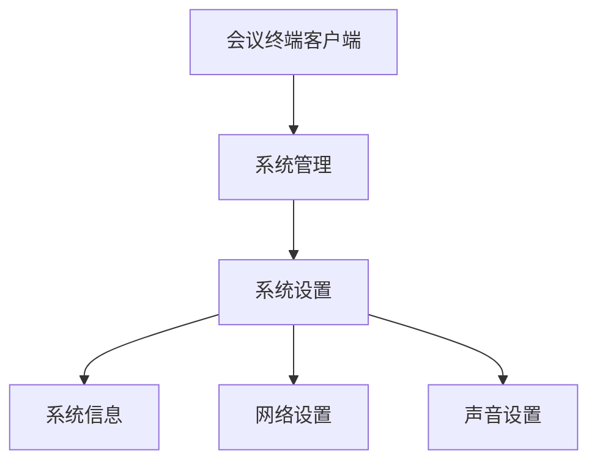

# MVP0 精简 SRS 与 SDD 文档设计

状态：评审草案

日期：2026-08-07

适用范围：MVP0 OpenCode Plugin 的需求分析、软件需求规格说明书生成、软件设计说明生成和后续 CU 计划输入

上位设计：[MVP0 OpenCode Plugin 实现设计](./mvp0-opencode-plugin-design.md)

调研依据：[标准 SRS 与 SDD 生成规范调研](../research/standard-srs-sdd-csci-mainstream-practices-2026-08-07.md)

## 1. 目标与裁剪结论

本设计不把完整 CSCI Data Item Description 原样复制为项目模板。CSCI 理念只用于检查软件范围、需求类别、接口、验证和追溯是否遗漏，不直接决定最终文档目录。

MVP0 的正式文档采用：

- 一份面向用户、产品、设计、编码和测试共同阅读的精简 SRS；
- 一份基于 SRS 继续完成架构、CU、组件、数据、接口和验证设计的精简 SDD；
- 详细 API、协议、数据字典和 UI 图片使用链接或按需附件，不复制进主文档；
- 对当前项目不适用的章节不生成空表和模板文字；
- 文档保留稳定标识、事实状态和关键条件，使 AI 可以继续设计、编码、测试和影响分析。

核心原则不是“内容越少越好”，而是：

1. 每项事实只有一个权威位置；
2. 正文保留下一阶段必须知道的信息；
3. 可从项目配置直接读取的易变细节不在多个文档重复维护；
4. 只在需求已明确时写成约束，未知内容保持未知；
5. 图使用可评审、可 Diff 的 Mermaid 源码；UI 截图章节预留但当前不生成。

## 2. 文档与事实边界

| 内容 | SRS | SDD | 外部引用或项目事实 |
| --- | --- | --- | --- |
| 系统目标、范围、角色和边界 | 定义 | 引用 | 原始需求来源 |
| 功能组成图 | 定义 | 映射到 CU 和组件 | 无 |
| 功能、子功能和行为条件 | 定义 | 说明如何实现 | 无 |
| 技术栈 | 记录必须采用或必须兼容的技术约束 | 记录实际版本、组件选择和理由 | `pom.xml`、`package.json`、锁文件、构建配置 |
| 运行环境 | 记录系统必须运行或兼容的目标环境 | 记录部署拓扑、资源分配和环境适配 | 环境清单、部署配置、设备资料 |
| 系统上下文图 | 多平台或多子系统时定义 | 引用并细化 | 无 |
| 整体系统架构图 | 不定义内部实现架构 | 定义 | 无 |
| 外部接口 | 定义平台、协议、认证、能力类别和交互要求 | 定义组件责任、时序和错误处理 | 详细 API/协议文档链接 |
| 性能、安全等质量目标 | 定义可验证目标或明确未知 | 定义实现方案和验证方案 | 测试报告、部署证据 |
| UI 截图与视觉验收 | 预留 | 预留 | 后续 UI 资料 |
| CU 与 ExecutionPlan | 只提供功能模块候选 | 正式定义 CU；批准后形成 Plan | `.sdlc-factory` 项目事实 |

## 3. 统一功能层级

SRS 正文使用面向业务和用户的中文层级，不要求读者理解 CSCI、CapabilityCandidate 或 RequirementItem 等内部术语。

```text
系统
└── 功能域
    └── 功能模块
        └── 功能
            └── 子功能需求
```

各层语义固定为：

| 层级 | 作用 | 示例 |
| --- | --- | --- |
| 系统 | 完整产品范围 | 会议终端客户端 |
| 功能域 | 对相关模块进行目录组织，不直接进入 ExecutionPlan | 系统管理 |
| 功能模块 | 一组内聚的用户能力；需求阶段是 CU 候选，设计阶段可正式化为 CU | 系统设置 |
| 功能 | 模块中的具体用户功能 | 系统信息、网络设置、声音设置 |
| 子功能需求 | 一个可观察、可验证的行为结果 | 显示系统版本、保存网络配置 |

“能够独立编码或测试”不是把功能提升为 CU 的充分条件。页面、菜单、按钮、Electron 进程、API Client 和测试工程默认不属于功能模块层级。设计阶段根据能力目标、业务内聚、数据和契约边界、生命周期及同级粒度决定 CU。

## 4. 精简 SRS 结构

权威文件固定为 `docs/requirements/software-requirements-specification.md`。

### 4.1 文档头

文档头只保留：

- 文档名称、版本和状态；
- 适用系统；
- RequirementCandidate 或 RequirementBaseline 引用；
- 本版本使用的来源引用；
- 最近一次修订摘要。

不生成合同编号、分发声明、页码规则、签章格式等当前项目不需要的 CSCI 文档包装。

### 4.2 系统概述

必须包含：

1. 系统目标和用户价值；
2. 系统范围及明确排除项；
3. 使用角色；
4. 主要运行场景；
5. 系统边界及依赖的外部平台、子系统或设备；
6. 已确认的全局约束；
7. 多平台或多子系统时的系统上下文图。

系统上下文图只表达系统与外部参与者的黑盒关系，不表达 Renderer、Main Process、Controller、Database 等内部设计组件。

### 4.3 技术栈与系统运行环境

该章节用于记录会约束设计和验收的项目事实，不能把未经确认的常见技术栈写成需求。

#### 4.3.1 技术栈约束

使用一张简表：

| 类别 | 技术或约束 | 性质 | 版本或兼容范围 | 来源/状态 |
| --- | --- | --- | --- | --- |
| 后端语言 | 例如 Java | 必须采用 / 当前已存在 / 建议 | 已确认时填写 | 来源或 `UNKNOWN` |
| 前端框架 | 例如 Vue | 必须采用 / 当前已存在 / 建议 | 已确认时填写 | 来源或 `UNKNOWN` |
| 数据库 | 例如 MySQL | 必须采用 / 当前已存在 / 建议 | 已确认时填写 | 来源或 `UNKNOWN` |
| 桌面运行时 | 例如 Electron | 必须采用 / 当前已存在 / 建议 | 已确认时填写 | 来源或 `UNKNOWN` |

三种性质不得混用：

- `必须采用`：用户、合同、兼容或运行环境明确要求，属于 SRS 约束；
- `当前已存在`：从目标项目中观察到的现状，不自动等于不可变需求；
- `建议`：设计候选，只能在 SDD 中决定，SRS 中保持开放。

SRS 只记录约束级技术信息。依赖精确版本、构建插件和组件组合由 SDD 引用项目配置，避免与 `pom.xml`、`package.json`、锁文件产生重复事实。

#### 4.3.2 目标运行环境

按实际适用项记录：

- 操作系统和架构；
- JRE/JDK、Node.js、浏览器或桌面运行时要求；
- 数据库和中间件；
- CPU、内存、磁盘等资源下限；
- 网络条件、代理、证书和端口限制；
- 外部设备或真实设备环境；
- 部署位置、时区、语言和区域设置；
- 开发、自动化测试、集成测试和真实验收环境的差异。

没有证据的值使用 `UNKNOWN`。本地开发环境不能冒充目标运行或真实验收环境。

### 4.4 功能组成

必须先给出完整产品的功能组成图，再给出模块目录。功能组成图使用 Mermaid，结构至少到“功能模块”，信息充分时展开到“功能”。

示例：



图和正文使用同一组名称。正文不再维护另一套 CapabilityCandidate 表；Plugin 可以从标题和稳定 ID 生成内部结构化索引。

### 4.5 功能需求

功能需求必须沿功能组成树展开，不建立与正文重复的需求总表。

```markdown
## 4. 系统管理

系统管理用于查看和维护设备的运行配置。

### 4.1 系统设置

系统设置用于集中查看和调整设备基础运行参数。

#### 4.1.1 系统信息

系统信息用于查看当前设备的软件版本、运行状态和运行时间。

##### FR-SYS-001 显示系统信息

- 概述：用户可以查看设备当前的软件版本、运行状态和运行时间。
- 前置条件：设备连接成功且用户具有查看权限。
- 约束条件：展示内容以目标设备返回结果为准。
- 后置条件：页面展示本次查询获得的设备信息，不修改设备状态。
- 异常结果：设备不可达或鉴权失败时展示明确错误。
- 验证要点：在已连接设备上查询并核对字段与设备响应一致。
```

子功能需求固定包含：

- 稳定 ID；
- 一句话概述；
- 前置条件；
- 约束条件；
- 后置条件；
- 验证要点。

`异常结果` 只在存在失败、替代或降级行为时出现。输入、输出、角色、状态等字段只在一句话和上述字段无法无歧义表达时增加，不生成空字段。

一个子功能需求只表达一个主要可观察结果。如果一句话需要使用多个彼此独立的“并且”，应拆成多个子功能需求。

### 4.6 非功能需求

非功能需求与功能需求分开，按实际适用项组织：

- 性能与时序；
- 安全、权限、凭据和隐私；
- 可靠性、可用性和恢复；
- 兼容性与可移植性；
- 可维护性与可测试性；
- 易用性和可访问性。

每条非功能需求必须说明作用范围和验证方式。没有来源的响应时间、并发量、资源用量和安全等级不能用“行业默认”补齐，应标记为开放问题或 `UNKNOWN`。

### 4.7 外部接口需求

当系统连接多个平台、子系统或设备时，每个外部对象建立独立章节：

```text
外部接口需求
├── 设备管理平台
├── 授权服务
└── 会议平台
```

每个章节记录：

1. 对端名称和责任边界；
2. 通信协议及传输安全；
3. 认证或授权方式；
4. 接口能力分类，例如设备认证、系统信息查询、配置读取；
5. 关键交互流程；
6. 超时、失败、重试和兼容要求；
7. 详细接口或协议文档链接；
8. 当前未知和依赖项。

正文不逐条罗列 Endpoint、请求字段和响应字段。接口能力和关键流程是 SRS 的权威内容；具体 API 结构以链接的接口文档为单一事实来源。

跨系统的认证、授权、状态同步等关键流程使用 Mermaid 时序图；简单交互使用三到五步文字即可。

### 4.8 用户界面需求

本章节当前保留，固定写明：

> 本章节预留。当前阶段不生成截图、页面标注或视觉验收要求；已有图片不自动证明交互、接口或业务规则。

在用户后续提供可用 UI 资料并明确要求纳入基线前，该章节不阻塞 RequirementCandidate。

### 4.9 假设、开放问题与来源

只记录会影响范围、功能行为、外部接口、非功能目标、技术约束、运行环境或验收的事项。每项标明：

- `ASSUMPTION | OPEN | UNKNOWN`；
- 影响章节；
- 需要谁提供什么信息；
- 解除条件。

来源追溯由稳定 ID 和 Plugin 元数据维护，不在正文复制一张人工维护的全量追溯矩阵。

## 5. 精简 SDD 结构

权威文件固定为 `docs/design/software-design-description.md`。SDD 引用实际使用的 RequirementBaseline 或 RequirementCandidate Hash，不复制 SRS 正文。

### 5.1 设计输入与架构驱动因素

- 需求版本和 Hash；
- 功能模块、关键场景和外部接口；
- 技术栈约束和目标运行环境；
- 主要非功能目标；
- 未决需求及设计承担的风险。

### 5.2 整体系统架构

必须包含一张整体系统架构图，表达：

- 系统内部主要运行时或组件；
- 外部平台、子系统和设备；
- 主要依赖方向；
- 数据、控制或调用关系；
- 信任边界。

架构图只出现对设计决策有意义的元素，不能把每个类、页面或函数画成组件。

### 5.3 技术架构与运行部署

记录：

- 实际采用的语言、框架、数据库、桌面运行时和构建工具；
- 精确版本的项目配置来源；
- 关键选型理由和替代方案；
- 进程、部署节点、数据库和外部设备拓扑；
- 开发、测试、集成和生产/真实设备环境差异；
- 资源、网络、证书和安全边界。

SDD 可以引用项目配置中的精确版本，不复制完整依赖清单。

### 5.4 功能模块与 CU 设计

设计首先把 SRS 功能模块映射为 CapabilityCandidate，再决定正式 CU。每个 CU 记录：

- CU 名称和内部 ID；
- 对应的功能模块、功能和子功能需求 ID；
- 业务目标、包含内容和不包含内容；
- 状态、数据责任、对外接口和依赖；
- 主要产品路径和测试路径；
- 验证义务和阻塞未知。

功能组成图用于解释用户能力；CU 图用于表达设计与执行边界，两者通过稳定 ID 关联，不能强制一一对应。

### 5.5 组件、数据、状态与错误设计

按实际复杂度描述：

- 组件职责及依赖方向；
- 关键数据模型和所有权；
- 状态机和生命周期；
- 错误分类、提示、恢复、重试和降级；
- 并发、一致性和幂等策略。

简单模块可以合并描述；只有需要独立理解或验证时才增加单独图表。

### 5.6 外部接口设计

按 SRS 中的外部平台或子系统保持同名章节，描述：

- 哪个组件负责调用或接收；
- 认证、凭据和信任边界；
- 关键时序和状态变化；
- 超时、重试、鉴权失效、版本和错误映射；
- 详细 API/协议文档链接。

SDD 同样不复制完整 Endpoint 清单。对设计有决定性影响的认证、授权和状态同步流程使用 Mermaid 时序图。

### 5.7 非功能实现与验证设计

逐项说明 SRS 中性能、安全、可靠性等目标如何由架构、组件、配置和测试实现。不得为 SRS 中不存在的非功能目标制造“已满足”结论。

### 5.8 需求覆盖与 ExecutionPlan 就绪性

Plugin 生成而非人工重复维护以下映射：

```text
子功能需求 ID -> CU -> 组件/路径 -> 验证义务
```

SDD 必须能回答：

- 每个子功能需求由哪个 CU 承担；
- 每个 CU 修改哪些范围、依赖谁、如何验证；
- 跨 CU 场景如何集成；
- 哪些项因未知输入而 `BLOCKED`；
- 是否具备形成 ExecutionPlan 的条件。

## 6. 图示规则

| 图 | 文档 | 规则 |
| --- | --- | --- |
| 功能组成图 | SRS，必须 | 完整产品范围，至少展开到功能模块 |
| 系统上下文图 | SRS，条件必需 | 存在多个平台、子系统或外部设备时生成 |
| 整体系统架构图 | SDD，必须 | 展示主要运行时、组件、外部依赖和信任边界 |
| 关键交互时序图 | SRS 或 SDD，条件必需 | SRS 表达需求级交互，SDD 表达组件级实现 |
| 部署图 | SDD，条件必需 | 运行节点、网络或设备环境不简单时生成 |
| UI 截图 | 当前不生成 | 保留章节，等待后续资料和明确要求 |

同一事实不在多张图中重复维护。所有图使用 Mermaid，节点名称与正文一致。

## 7. AI Harness / Agent 评审

### 7.1 评审结论

经 AI Harness 视角复核，用户提出的精简方向是合理的，但仅有“系统概述、功能组成、功能需求、非功能需求、外部接口”仍不足以稳定驱动下一步设计。加入以下内容后，可以作为 SDD 的有效输入：

1. 技术栈约束及其事实性质；
2. 目标运行环境和环境差异；
3. 子功能需求的稳定 ID；
4. 前置、约束、后置、异常和验证要点；
5. 多平台系统上下文和关键交互流程；
6. 明确的未知、假设和来源状态。

### 7.2 为什么需要继续精简

对 Agent 而言，文档过长的主要风险不是读取成本，而是权威事实被模板文字、重复清单和无关分支稀释。以下内容应从核心模板移除或改为按需生成：

- CSCI 合同包装、分发、页码和签章格式；
- 不适用章节的空表；
- 与项目配置重复的完整依赖版本清单；
- 从外部 API 文档复制的 Endpoint、字段和错误码；
- 同时存在功能图、候选表、需求总表和人工追溯表的重复表达；
- 没有来源的“行业默认”性能、安全和资源指标；
- 尚未进入 UI 验收范围的截图和视觉推断。

### 7.3 为什么不能继续删减

以下内容是 Agent 生成正确设计所需的最小信息，不能再删除：

- 系统边界和完整产品范围；
- 功能组成和稳定名称；
- 子功能的条件、结果和失败语义；
- 外部系统责任、协议、认证和关键流程；
- 技术与运行环境约束；
- 可验证的非功能目标；
- 稳定 ID、来源状态和阻塞未知。

缺少这些信息时，Agent 会通过猜测补齐架构、CU、接口或测试条件，生成形式完整但无法验证的设计。

### 7.4 对下一步 SDD 的指导能力

| SRS 输入 | SDD 可确定内容 |
| --- | --- |
| 系统边界、外部平台和上下文图 | 架构边界、外部依赖和信任边界 |
| 功能域、功能模块和功能组成图 | CapabilityCandidate、CU 候选和覆盖范围 |
| 子功能需求及条件 | 组件职责、状态、错误和验证义务 |
| 技术栈约束 | 技术架构、组件选型和兼容策略 |
| 目标运行环境 | 部署、资源、网络和环境适配设计 |
| 外部接口协议、认证和流程 | Client/Adapter、时序、重试和错误映射 |
| 非功能需求 | 性能、安全、可靠性实现及验证设计 |

因此，精简 SRS 可以指导 SDD，但前提是它不能退化为功能名称清单。每个叶子行为必须形成最小、稳定、可验证的需求记录。

### 7.5 对 Harness 的建议

Harness 不应把全部模板和标准常驻注入上下文。建议采用渐进加载：

1. `/sdlc-spec` 加载精简 SRS 的生成步骤和核心规则；
2. 发现外部系统时再加载接口章节规则；
3. 发现明确非功能目标时再加载对应质量规则；
4. `/sdlc-design` 只读取批准 SRS、相关来源和精简 SDD 规则；
5. 详细 API 通过链接或来源读取工具按需获取；
6. Plugin 负责 ID、Hash、父子关系、来源状态和覆盖率校验；
7. OpenCode Todo 只展示当前建议，不承载文档事实或 ExecutionPlan。

这比一个包含全部 CSCI 内容的长 Skill 更稳定，也比完全依赖模型自由发挥更可验证。

## 8. 生成与评审流程

### 8.1 SRS 生成

1. 读取登记来源和目标项目事实；
2. 区分用户要求、已观察现状、设计建议和未知；
3. 生成系统概述、技术约束和运行环境；
4. 生成完整功能组成图；
5. 按功能域、功能模块、功能和子功能需求展开正文；
6. 补充适用的非功能需求；
7. 按外部平台或子系统生成接口章节和关键流程；
8. 保留 UI 章节；
9. 校验稳定 ID、层级、条件、来源和未知；
10. 创建 RequirementCandidate，等待人工评审。

### 8.2 SDD 生成

1. 读取实际使用的 SRS 版本和 Hash；
2. 提取功能模块、技术约束、运行环境、接口和质量目标；
3. 生成整体系统架构图；
4. 将功能模块分析为 CU，并保持子功能需求覆盖；
5. 定义组件、数据、状态、错误和外部接口实现；
6. 生成关键时序和必要部署图；
7. 设计非功能目标的实现与验证；
8. 校验需求到 CU、组件和验证义务的覆盖；
9. 创建 DesignCandidate，等待人工评审；
10. DesignBaseline 形成后才保存 ExecutionPlan。

## 9. 完成标准

本设计转化为模板和 Skill 后，至少满足：

- SRS 对完整系统而不是当前页面或垂直切片进行描述；
- 功能组成图与正文层级、名称一致；
- 功能需求短而明确，不形成大段模板化文字；
- 每个子功能需求可被下一阶段引用和验证；
- Java、Vue、MySQL 等内容只有在有来源时才成为技术约束；
- 目标运行环境和本地开发/测试环境可以区分；
- 多个平台或子系统各自形成外部接口章节；
- 接口正文描述协议、能力和流程，详细内容使用链接；
- 性能、安全等内容作为非功能需求独立管理；
- SDD 包含整体系统架构图，并能从 SRS 推导 CU、组件和验证义务；
- UI 章节保留但不生成截图或推断规则；
- Harness 不重复维护可以从代码、配置或外部协议文档读取的事实。

## 10. 当前评审建议

推荐采用本设计作为 MVP0 SRS/SDD 模板和 Skill 改造依据。它保留了标准中不会因 AI 出现而失效的范围、接口、质量、环境和验证信息，同时删除了合同包装、空章节和重复事实。

在用户确认本文件前，不应据此修改权威 MVP0 设计、运行 Skill、模板或 Plugin 校验器。确认后再形成实现计划。
