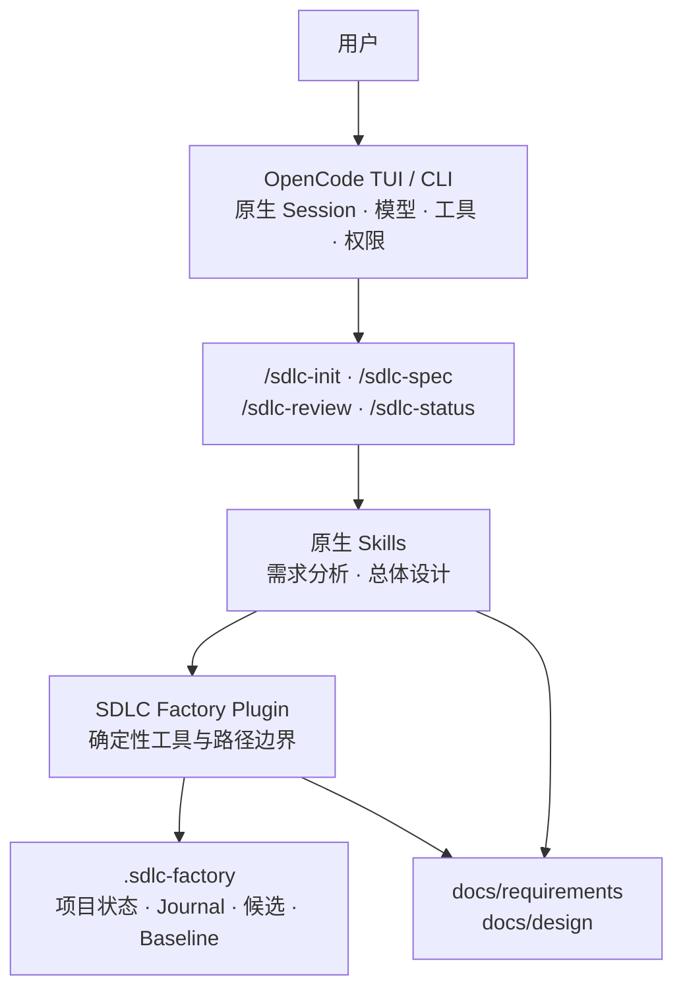

# MVP0 OpenCode Plugin 实现设计

状态：正式设计，用户已确认

日期：2026-08-07

上位需求：[SDLC Factory 总体需求与分阶段方案](../../README.md)

## 1. 设计目标

MVP0 不建设桌面产品，先在真实 OpenCode 中验证最关键的不确定性：

1. AI 能否基于真实项目资料持续进行需求分析，而不是生成通用模板文本；
2. AI 能否把已确认需求转化为有边界、有追溯、有验证方法的总体设计；
3. 项目级 Plugin 能否把工作文档、候选、人工审核和 Baseline 连接成可信闭环；
4. Claude Code Game Studios 式柔性引导能否提示缺口而不演变成强制阶段冻结；
5. OpenCode 重启或单轮失败后，项目事实能否恢复并继续。

MVP0 的成功标准不是“生成了两个 Markdown 文件”，而是用户认可文档质量，且所有审核、Hash、来源和恢复行为都来自真实执行证据。

## 2. 历史材料使用边界

| 历史来源 | 可以提供什么 | 不能代表什么 |
| --- | --- | --- |
| [legacy v1.2 需求与总体设计](../../archive/legacy-v1.2/docs/v1.2/03-requirement-and-design.md) | 原始输入真实性、Grilling、稳定条目 ID、候选、人工审核和 Baseline 的历史设计参考 | 旧版内容不会自动进入 MVP0；Spring Boot 和强制阶段门禁不再生效 |
| [brainstorming 记录](../design-records/2026-08-06-to-07-reconstruction/README.md) | 解释探索过哪些方向、界面和取舍 | HTML 未经过正式 Markdown 审阅确认，不是需求、设计或约定 |
| [Claude Code Game Studios 审计](../research/claude-code-game-studios-workflow-guidance-audit-2026-08-06.md) | 证明其真实实现是柔性引导而非统一硬门禁 | 审计结论不是 Factory 需求；只有根 README 明确采用的原则才生效 |
| [Open Design 源码审计](../research/open-design-official-source-audit-2026-08-06.md) | 提供 OpenCode Session、Plugin、权限和桌面交互的事实参考 | 不代表 Factory 已决定复制 Open Design 的产品或代码 |

发生冲突时，以根 README 的文档权威顺序和后续用户指令为准。本文件中的具体实现选择已经用户确认，属于 MVP0 正式约定。

## 3. MVP0 架构



### 3.1 OpenCode

OpenCode 负责：

- 模型调用和 Agent Loop；
- 原生 Session、多轮上下文和 Todo；
- Skill 按需加载；
- 文件、Shell、搜索和提问工具；
- 工具权限询问与事件输出。

MVP0 不复制 OpenCode 的 Session、模型、Todo 和工具循环。

### 3.2 Commands 与 Skills

Commands 是用户显式入口，不承担确定性业务写入。Skills 负责分析方法、提问原则、文档结构和交互规则：

- `/sdlc-init`：建立项目状态、登记原始资料和当前文档；
- `/sdlc-spec`：根据用户当前目标执行需求分析或总体设计；
- `/sdlc-review`：展示候选、差异、来源、Hash 和开放问题，并等待人工决定；
- `/sdlc-status`：显示当前建议工作位置、完成事实、主要缺口和一个推荐命令。

需求分析和总体设计使用两个独立原生 Skill，但都由已确认的 `/sdlc-spec` 命令按用户目标加载。这样可以独立维护分析方法，又不增加新的用户命令体系。

### 3.3 Plugin 确定性内核

Plugin 负责模型不能自行声明的事实：

- 校验项目根目录和允许访问的真实路径；
- 登记原始资料引用、媒体类型、内容 Hash 和时间；
- 查询工作文档、候选、审核和 Baseline；
- 对实际文件字节计算 SHA-256；
- 原子创建不可变候选快照；
- 校验人工审核消息中的候选 ID 与 Hash；
- 写入 ReviewRecord；
- 只有人工通过时创建 Baseline；
- 维护可恢复 Journal 和版本化状态文件。

Plugin 不保存技能正文副本，不把全部 Skill 注入系统提示，不代替 OpenCode 执行普通文件和 Shell 工具。

## 4. 项目文件布局

```text
<project>/
├─ .opencode/
│  ├─ commands/
│  │  ├─ sdlc-init.md
│  │  ├─ sdlc-spec.md
│  │  ├─ sdlc-review.md
│  │  └─ sdlc-status.md
│  ├─ plugins/
│  │  └─ sdlc-factory.ts
│  └─ skills/
│     ├─ sdlc-requirement-analysis/SKILL.md
│     └─ sdlc-overall-design/SKILL.md
├─ .sdlc-factory/
│  ├─ manifest.json
│  ├─ journal.jsonl
│  ├─ candidates/
│  ├─ reviews/
│  └─ baselines/
└─ docs/
   ├─ requirements/
   │  └─ software-requirements-specification.md
   └─ design/
      └─ software-design-description.md
```

`.opencode` 是可安装运行资源；`.sdlc-factory` 是项目级确定性事实；`docs` 是用户可读、可进入 Git 的工作文档。实现必须允许用户按团队策略选择是否把候选和 Baseline 一并纳入 Git，但不能因 Git 忽略策略丢失本地审核事实。

## 5. 柔性引导机制

### 5.1 状态查询

每个正式 Skill 开始时先调用只读状态查询。查询结果至少包含：

- 当前实际存在的原始资料和文档；
- 已冻结候选、ReviewRecord 和 Baseline；
- `CONFIRMED | MISSING | MANUAL | UNKNOWN` 的产物判断；
- 当前建议工作位置；
- 第一项未完成的主要工作；
- 一个推荐 Slash 命令；
- 当前命令缺少的不可替代输入；
- 已知风险与开放问题。

状态不能只因文件存在就标记 `CONFIRMED`；需要内容 Hash、候选或审核事实时必须读取对应确定性记录。没有证据时使用 `UNKNOWN`，不能推断为通过。

### 5.2 Skill 交互

当用户执行的命令与建议工作位置不一致时，Skill 按以下顺序回应：

1. 简短说明当前建议工作位置；
2. 列出会影响当前工作的具体缺口；
3. 给出一个主要推荐命令；
4. 说明继续执行的实际风险；
5. 询问用户是继续当前工作，还是先执行建议命令；
6. 等待用户再次输入，不自动调用下一个 Skill。

如果用户选择继续，Skill 正常工作，并把未确认输入记录为假设、临时边界或开放问题。Plugin 不改变建议工作位置，也不伪造前序完成事实。

### 5.3 真正停止的条件

Plugin 或 Skill 只能因为以下原因停止当前命令：

1. 目标、文件或参数不存在；
2. 缺少当前命令不可替代的输入，继续没有确定语义；
3. 请求超出工作区、违反权限或危险命令策略；
4. 候选 ID、Hash、状态或审核事务不一致。

需求没有 Baseline、设计仍有开放问题或建议阶段不匹配，只产生提醒，不产生统一硬阻断。

## 6. 需求分析

### 6.1 输入真实性

用户可以上传需求文档、图片、协议、接口说明和参考资料，也可以在对话中直接描述并逐轮补充。Plugin 登记来源引用和 Hash；AI 生成文档不能修改或冒充原始输入。

每条信息在文档中只能落入以下语义之一：

- 已有来源支持的事实；
- 用户明确确认的决定；
- 明确标注的假设；
- 尚待确认的开放问题；
- 无法获得证据的未知项。

### 6.2 Requirement Grilling

需求 Skill 应：

1. 先提取已有事实，不重复询问已知信息；
2. 建立目标、边界、角色、业务对象、规则、场景、非功能约束和外部依赖地图；
3. 只询问会改变范围、可观察验收、公共接口、数据或错误语义的关键问题；
4. 每轮优先提出一个关键问题，并给出推荐答案及影响；
5. 大需求先形成 Feature Map，再识别 CapabilityCandidate；
6. 信息不足时继续同一 OpenCode Session；
7. 共享理解稳定后生成工作 SRS，不自动提交或批准。

### 6.3 SRS 固定内容

`software-requirements-specification.md` 至少包含：

1. 项目目标与系统边界；
2. 利益相关者、角色与权限；
3. 功能组成和跨功能业务场景；
4. 业务对象、规则与数据需求；
5. 使用稳定 ID 的 RequirementItem 与验收条件；
6. CapabilityCandidate 及初步关系；
7. 内部、跨系统和外部接口需求；
8. 性能、可靠性、安全及其他非功能要求；
9. 运行、测试环境与验证方法；
10. 来源追溯、假设和开放问题。

验证方法只使用 `INSPECTION | ANALYSIS | DEMONSTRATION | TEST`。

## 7. 总体设计

### 7.1 输入策略

总体设计优先使用已经批准的 RequirementBaseline。如果它不存在，用户仍可以选择继续：

- Skill 明确说明需求尚未成为 Baseline；
- 设计引用实际使用的 SRS 工作版本或候选 Hash；
- 所有未确认需求以假设、临时接口或开放问题呈现；
- 后续需求变化不会静默改写已冻结设计候选；
- 用户可以对承担该风险的设计候选作出独立审核决定。

因此稳定引用是数据完整性要求，但 Requirement 阶段不是 Design 命令的执行锁。

### 7.2 Design Grilling

设计 Skill 至少覆盖：

- 系统和技术架构；
- 模块职责、边界与依赖方向；
- 全局数据模型、数据归属和一致性；
- 外部接口、能力单元接口和兼容策略；
- 跨能力流程、事务、并发和错误处理；
- 安全、权限、部署和环境约束；
- RequirementItem 到设计元素和验证方法的追溯；
- Capability Map、能力单元依赖、独立实现和验证边界；
- 风险、假设、开放问题和替代方案。

Capability Map 和验证覆盖作为总体设计章节，不在 MVP0 形成额外正式主文档。

## 8. 候选、审核与 Baseline

### 8.1 状态关系

```text
工作文档
  → 按实际字节固定 Candidate + SHA-256
  → WAITING_FOR_HUMAN
      ├─ 退回修订 → 工作文档继续修改 → 新 Candidate
      ├─ 暂缓     → Candidate 保持不变
      └─ 通过     → ReviewRecord + Baseline
```

Candidate 和 Baseline 一旦创建不得原地修改。工作文档可以继续变化，但变化只能形成新 Candidate。

### 8.2 人工决定校验

正式决定必须来自当前 OpenCode Session 中的用户消息，并明确包含：

- 决定类型；
- Candidate ID；
- Candidate 内容 Hash。

Plugin 从 Session 上下文读取实际用户消息并与当前候选校验，不能信任模型转述的“用户已批准”。错误 Hash、过期候选、重复决定或模型自行调用批准工具必须失败并留下真实错误记录。

OpenCode 当前官方 Plugin 文档说明 Plugin 上下文包含 Client，自定义工具上下文包含 Session 标识；公开 Client 提供 Session 消息查询能力。由于 Plugin/SDK 接口仍可能演进，MVP0 必须锁定经过验证的 OpenCode 和 `@opencode-ai/plugin` 精确版本，并用兼容性测试证明“读取当前 Session 实际用户消息”可用。若锁定版本无法提供该能力，审核必须改为独立、直接的用户操作入口；不得退化成信任模型传入批准参数。[OpenCode Plugin 文档](https://opencode.ai/docs/plugins/) [OpenCode SDK 文档](https://opencode.ai/docs/sdk/)

### 8.3 冻结语义

审核通过只冻结该候选的精确内容和引用，不会：

- 禁止用户继续修改工作文档；
- 禁止执行其他 `/sdlc-*` 命令；
- 自动切换项目阶段；
- 自动运行下一条命令；
- 把对话或 Session 标记为完成。

## 9. 错误、恢复与权限

- 网络、认证、模型和工具错误只结束当前调用；已产生内容和文件变更保持真实状态；
- Journal 记录操作开始、结果、失败和恢复信息，不把中断写成成功；
- OpenCode 重启后从项目文件恢复，不重复登记来源或覆盖候选；
- 所有 Plugin 路径先解析真实路径，再校验位于当前工作区；
- 外部目录默认拒绝，只有用户明确授权后才允许只读或写入；
- `.env`、凭据目录、危险 Shell 和破坏性 Git 操作遵循拒绝或询问策略；
- Plugin 自定义工具必须有自身路径校验，不能只依赖 OpenCode UI 权限提示；
- 未运行、未知、超时、跳过和校验器异常不能表示通过。

## 10. 验证方案

### 10.1 确定性测试

- 路径越界和符号链接逃逸；
- Hash 与实际文件字节一致；
- Candidate、ReviewRecord 和 Baseline 不可原地修改；
- 错误 Hash、过期候选、重复审核和模型自行批准被拒绝；
- Journal 中断恢复和原子写入；
- 状态查询对缺失证据返回 `UNKNOWN` 或 `MISSING`；
- 已忽略文件、空文件和无法读取文件不会被误判为完成。

### 10.2 实际 OpenCode 验证

必须在一个独立、真实的目标项目中执行：

1. 安装 Plugin，并通过 `/sdlc-init` 登记真实资料；
2. 使用不完整需求触发针对性问题；
3. 多轮补充后生成 SRS 并完成候选、退回、新候选和批准；
4. 在需求未批准的情况下执行设计，验证系统只提示并允许用户继续；
5. 基于实际需求版本生成总体设计并完成审核；
6. 修改工作文档后确认旧 Candidate 和 Baseline 不变；
7. 重启 OpenCode 后用 `/sdlc-status` 恢复；
8. 执行权限和审核负向用例。

不使用只证明命令能启动的通用 smoke 项目代替真实流程。

### 10.3 人工质量检查

用户必须检查：

- 文档是否反映真实业务而不是套话；
- 关键歧义是否通过提问暴露；
- RequirementItem 是否可观察、可验收；
- 设计是否逐项追溯需求；
- 能力单元边界是否可独立理解和验证；
- 假设、未知项和风险是否明确；
- 是否足以支撑后续实施计划。

## 11. 向 MVP1 交付的稳定边界

MVP0 不实现桌面 Harness，但必须为 MVP1 留下以下稳定合同：

- 版本化 Plugin 包和内容 Hash；
- 版本化 `manifest`、Candidate、ReviewRecord 和 Baseline 格式；
- 稳定 ID、时间、路径、内容 Hash 和来源引用；
- 可订阅的 Plugin 领域事件；
- 可由 OpenCode SDK 调用的同一组确定性工具；
- 项目本地事实优先，SQLite 只能建立投影。

MVP0 不提前实现 SDK Client、桌面 IPC、SQLite Schema、跨项目目录和遥测 UI。
