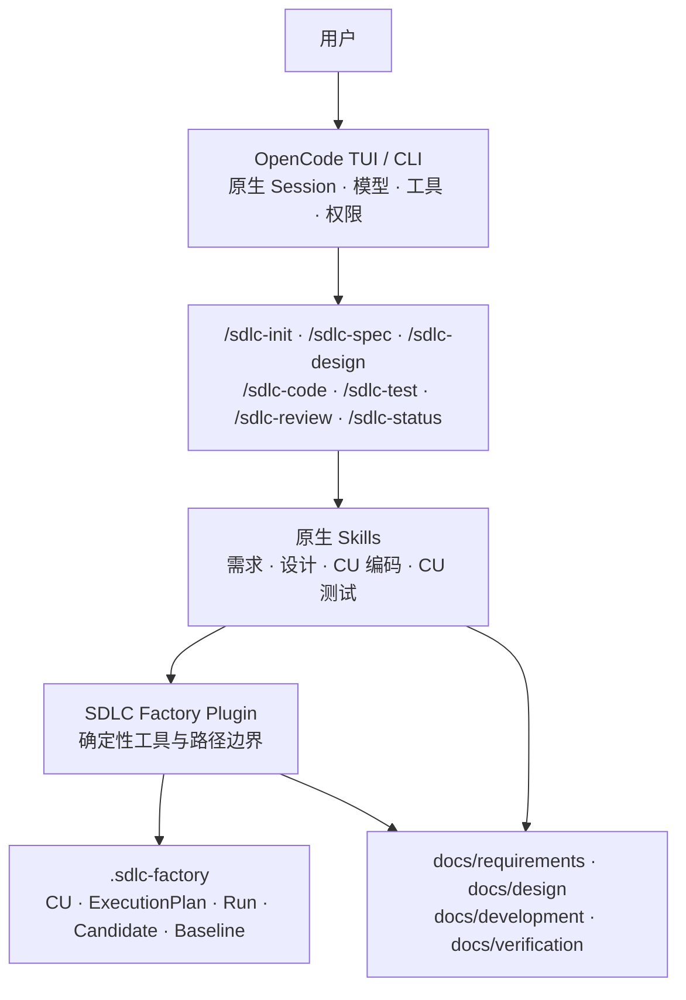

# MVP0 OpenCode Plugin 实现设计

状态：正式设计，用户已确认

日期：2026-08-07

上位需求：[SDLC Factory 总体需求与分阶段方案](../../README.md)

## 1. 设计目标

MVP0 不建设桌面产品，先在真实 OpenCode 中验证最关键的不确定性：

1. AI 能否基于真实项目资料持续进行需求分析，而不是生成通用模板文本；
2. AI 能否把已确认需求转化为有边界、有追溯、有验证方法的总体设计和正式 CapabilityUnit；
3. OpenCode Todo 能否参与规划而不成为第二套项目事实，Plugin 能否形成可恢复但不自动执行的 ExecutionPlan；
4. OpenCode 能否按照用户显式选择的 CU 完成编码、测试、返工和系统集成验证；
5. 项目级 Plugin 能否把工作文档、代码 Diff、执行证据、候选、人工审核和各类 Baseline 连接成可信闭环；
6. Claude Code Game Studios 式柔性引导能否提示缺口而不演变成强制阶段冻结；
7. OpenCode 重启或单轮失败后，项目事实能否恢复并继续。

MVP0 的成功标准不是“生成了几个文件”，而是在真实目标项目中完成从需求到系统验收的完整流程，用户认可文档和实现质量，且所有审核、Hash、来源、代码、测试和恢复行为都来自真实执行证据。

## 2. 历史材料使用边界

| 历史来源 | 可以提供什么 | 不能代表什么 |
| --- | --- | --- |
| [legacy v1.2 需求与总体设计](../../archive/legacy-v1.2/docs/v1.2/03-requirement-and-design.md) | 原始输入真实性、Grilling、稳定条目 ID、候选、人工审核和 Baseline 的历史设计参考 | 旧版内容不会自动进入 MVP0；Spring Boot 和强制阶段门禁不再生效 |
| [brainstorming 记录](../design-records/2026-08-06-to-07-reconstruction/README.md) | 解释探索过哪些方向、界面和取舍 | HTML 未经过正式 Markdown 审阅确认，不是需求、设计或约定 |
| [Claude Code Game Studios 审计](../research/claude-code-game-studios-workflow-guidance-audit-2026-08-06.md) | 证明其真实实现是柔性引导而非统一硬门禁 | 审计结论不是 Factory 需求；只有根 README 明确采用的原则才生效 |
| [Open Design 源码审计](../research/open-design-official-source-audit-2026-08-06.md) | 提供 OpenCode Session、Plugin、权限和桌面交互的事实参考 | 不代表 Factory 已决定复制 Open Design 的产品或代码 |

发生冲突时，以根 README 的文档权威顺序和后续用户指令为准。本文件中的具体实现选择已经用户确认，属于 MVP0 正式约定。

## 3. MVP0 架构



### 3.1 OpenCode

OpenCode 负责：

- 模型调用和 Agent Loop；
- 原生 Session、多轮上下文和 Todo；
- Skill 按需加载；
- 文件、Shell、搜索和提问工具；
- 工具权限询问与事件输出。

MVP0 不复制 OpenCode 的 Session、模型、Todo 和工具循环。

### 3.2 Commands 与 Skills

Commands 是用户显式入口，不承担确定性业务写入。Skills 负责分析方法、提问原则、文档结构和交互规则：

- `/sdlc-init`：建立项目状态、登记原始资料和当前文档；
- `/sdlc-spec`：执行需求分析并维护需求规格说明书；
- `/sdlc-design`：执行总体设计、正式 CU 拆分，并结合 OpenCode Todo 形成 ExecutionPlan；
- `/sdlc-code <CU名称>`：显式执行指定 CU 的编码工作；缺少名称时只给出建议命令；
- `/sdlc-test <CU名称>`：显式执行指定 CU 的测试工作；`/sdlc-test system` 执行系统集成测试；
- `/sdlc-review [CU名称]`：展示候选、差异、来源、Hash 和开放问题，并等待人工决定；
- `/sdlc-status`：显示当前建议工作位置、完成事实、主要缺口和一个推荐命令。

每个命令只加载当前工作所需的 Skill。命令名称表达明确语义，不允许 `/sdlc-spec` 根据模型判断偷偷切换到设计，也不允许任何命令自动调用下一条推荐命令。

### 3.3 Plugin 确定性内核

Plugin 负责模型不能自行声明的事实：

- 校验项目根目录和允许访问的真实路径；
- 登记原始资料引用、媒体类型、内容 Hash 和时间；
- 查询工作文档、候选、审核和 Baseline；
- 校验正式 CU 的稳定名称、内部 ID、依赖和验证引用；
- 保存版本化 ExecutionPlan，并从项目事实推导唯一 RecommendedAction；
- 将推荐动作投影为一个 OpenCode Todo，但不把 Todo 当作完成证据；
- 绑定实际 OpenCode Session、Git 基点、Diff、命令结果和 Evidence；
- 对实际文件字节计算 SHA-256；
- 原子创建不可变候选快照；
- 校验人工审核消息中的候选 ID 与 Hash；
- 写入 ReviewRecord；
- 只有人工通过时创建 Baseline；
- 维护可恢复 Journal 和版本化状态文件。

Plugin 不保存技能正文副本，不把全部 Skill 注入系统提示，不代替 OpenCode 执行普通文件和 Shell 工具。

## 4. 项目文件布局

```text
<project>/
├─ .opencode/
│  ├─ commands/
│  │  ├─ sdlc-init.md
│  │  ├─ sdlc-spec.md
│  │  ├─ sdlc-design.md
│  │  ├─ sdlc-code.md
│  │  ├─ sdlc-test.md
│  │  ├─ sdlc-review.md
│  │  └─ sdlc-status.md
│  ├─ plugins/
│  │  └─ sdlc-factory.ts
│  └─ skills/
│     ├─ sdlc-requirement-analysis/SKILL.md
│     ├─ sdlc-overall-design/SKILL.md
│     ├─ sdlc-cu-coding/SKILL.md
│     └─ sdlc-cu-testing/SKILL.md
├─ .sdlc-factory/
│  ├─ manifest.json
│  ├─ journal.jsonl
│  ├─ execution-plans/
│  ├─ runs/
│  ├─ evidence/
│  ├─ candidates/
│  ├─ reviews/
│  └─ baselines/
└─ docs/
   ├─ requirements/
   │  └─ software-requirements-specification.md
   ├─ design/
   │  └─ software-design-description.md
   ├─ development/
   │  └─ implementation-plan.md
   └─ verification/
      └─ verification-report.md
```

`.opencode` 是可安装运行资源；`.sdlc-factory` 是项目级确定性事实；`docs` 是用户可读、可进入 Git 的工作文档。实现必须允许用户按团队策略选择是否把候选和 Baseline 一并纳入 Git，但不能因 Git 忽略策略丢失本地审核事实。

## 5. 核心概念与权威关系

| 概念 | 作用域 | 权威内容 | 是否触发执行 |
| --- | --- | --- | --- |
| CapabilityUnit（CU） | 项目级 | 可独立编码、独立测试的能力边界、依赖、接口和验证要求 | 否 |
| ExecutionPlan | 项目级 | CU 的计划顺序、依赖、验证引用和阶段安排 | 否 |
| RecommendedAction | 当前状态查询 | 从计划与实际事实推导出的唯一建议动作和完整命令 | 否 |
| OpenCode Todo | Session 级 | 当前建议或当前命令的可见工作提示 | 否 |
| ExecutionRecord | 项目级 | 实际 Session、输入版本、Git、工具、命令、结果和错误 | 执行后记录 |
| Candidate / Baseline | 项目级 | 待审核版本和人工批准的不可变版本 | 否 |

权威关系固定为：

```text
DesignBaseline
  → ExecutionPlan
  → 推导一个 RecommendedAction
  → 投影一个 OpenCode Todo
  → 用户显式输入命令
  → ExecutionRecord / Candidate
  → 人工审核后形成 Baseline
  → 基于新事实重新推导下一条建议
```

Plan 可以生成 Todo 投影，Todo 不能自动改写 Plan；Todo 状态不能证明 CU 完成。OpenCode 当前 Todo 只提供 Session 内的内容、状态、优先级和位置，不包含 CU 依赖、设计 Hash、Git 基点和验证引用，因此不得作为项目级 ExecutionPlan 或 Baseline。[OpenCode Session Todo 源码](https://github.com/anomalyco/opencode/blob/dev/packages/opencode/src/session/todo.ts) [OpenCode Todo 工具源码](https://github.com/anomalyco/opencode/blob/dev/packages/opencode/src/tool/todo.ts)

## 6. 柔性引导机制

### 6.1 状态查询

每个正式 Skill 开始时先调用只读状态查询。查询结果至少包含：

- 当前实际存在的原始资料和文档；
- 已冻结候选、ReviewRecord 和 Baseline；
- 当前 ExecutionPlan 版本、CU 顺序、依赖和失效情况；
- `CONFIRMED | MISSING | MANUAL | UNKNOWN` 的产物判断；
- 当前建议工作位置；
- 第一项未完成的主要工作；
- 一个 RecommendedAction、一个 OpenCode Todo 和一条包含 CU 名称的完整 Slash 命令；
- 当前命令缺少的不可替代输入；
- 已知风险与开放问题。

状态不能只因文件存在就标记 `CONFIRMED`；需要内容 Hash、候选或审核事实时必须读取对应确定性记录。没有证据时使用 `UNKNOWN`，不能推断为通过。

### 6.2 Skill 交互

当用户执行的命令与建议工作位置不一致时，Skill 按以下顺序回应：

1. 简短说明当前建议工作位置；
2. 列出会影响当前工作的具体缺口；
3. 给出一个主要推荐命令，并把同一建议投影为一个 Todo；
4. 说明继续执行的实际风险；
5. 询问用户是继续当前工作，还是先执行建议命令；
6. 等待用户再次输入，不自动调用下一个 Skill。

如果用户选择继续，Skill 正常工作，并把未确认输入记录为假设、临时边界或开放问题。Plugin 不改变建议工作位置，也不伪造前序完成事实。

`/sdlc-code` 或 `/sdlc-test` 缺少 CU 名称时只显示推荐 CU 和完整命令，然后停止。用户可以显式输入非推荐 CU 名称；Skill 必须说明依赖缺口和风险并等待用户决定。Plugin 使用当前设计中唯一的 CU 名称解析内部 `cu_id`，名称不存在或不唯一时不得猜测。

引导层只投影当前的一条 Todo。进入已显式触发的命令后，OpenCode 可以用原生 Todo 细分当前 CU 的内部步骤；这些步骤不进入 ExecutionPlan，也不能预先代表后续 CU 已被选择。

### 6.3 真正停止的条件

Plugin 或 Skill 只能因为以下原因停止当前命令：

1. 目标、文件或参数不存在；
2. 缺少当前命令不可替代的输入，继续没有确定语义；
3. 请求超出工作区、违反权限或危险命令策略；
4. 候选 ID、Hash、状态或审核事务不一致。

需求没有 Baseline、设计仍有开放问题或建议阶段不匹配，只产生提醒，不产生统一硬阻断。

## 7. 需求分析

### 7.1 输入真实性

用户可以上传需求文档、图片、协议、接口说明和参考资料，也可以在对话中直接描述并逐轮补充。Plugin 登记来源引用和 Hash；AI 生成文档不能修改或冒充原始输入。

每条信息在文档中只能落入以下语义之一：

- 已有来源支持的事实；
- 用户明确确认的决定；
- 明确标注的假设；
- 尚待确认的开放问题；
- 无法获得证据的未知项。

### 7.2 Requirement Grilling

需求 Skill 应：

1. 先提取已有事实，不重复询问已知信息；
2. 建立目标、边界、角色、业务对象、规则、场景、非功能约束和外部依赖地图；
3. 只询问会改变范围、可观察验收、公共接口、数据或错误语义的关键问题；
4. 每轮优先提出一个关键问题，并给出推荐答案及影响；
5. 大需求先形成 Feature Map，再识别 CapabilityCandidate；
6. 信息不足时继续同一 OpenCode Session；
7. 共享理解稳定后生成工作 SRS，不自动提交或批准。

### 7.3 SRS 固定内容

`software-requirements-specification.md` 至少包含：

1. 项目目标与系统边界；
2. 利益相关者、角色与权限；
3. 功能组成和跨功能业务场景；
4. 业务对象、规则与数据需求；
5. 使用稳定 ID 的 RequirementItem 与验收条件；
6. CapabilityCandidate 及初步关系；
7. 内部、跨系统和外部接口需求；
8. 性能、可靠性、安全及其他非功能要求；
9. 运行、测试环境与验证方法；
10. 来源追溯、假设和开放问题。

验证方法只使用 `INSPECTION | ANALYSIS | DEMONSTRATION | TEST`。

## 8. 总体设计与 CU 正式化

### 8.1 输入策略

总体设计优先使用已经批准的 RequirementBaseline。如果它不存在，用户仍可以选择继续：

- Skill 明确说明需求尚未成为 Baseline；
- 设计引用实际使用的 SRS 工作版本或候选 Hash；
- 所有未确认需求以假设、临时接口或开放问题呈现；
- 后续需求变化不会静默改写已冻结设计候选；
- 用户可以对承担该风险的设计候选作出独立审核决定。

因此稳定引用是数据完整性要求，但 Requirement 阶段不是 Design 命令的执行锁。

### 8.2 Design Grilling

设计 Skill 至少覆盖：

- 系统和技术架构；
- 模块职责、边界与依赖方向；
- 全局数据模型、数据归属和一致性；
- 外部接口、能力单元接口和兼容策略；
- 跨能力流程、事务、并发和错误处理；
- 安全、权限、部署和环境约束；
- RequirementItem 到设计元素和验证方法的追溯；
- Capability Map、能力单元依赖、独立实现和验证边界；
- 风险、假设、开放问题和替代方案。

Capability Map 和验证覆盖作为总体设计章节，不在 MVP0 形成额外正式主文档。

### 8.3 CapabilityUnit

需求阶段只产生 CapabilityCandidate；总体设计阶段才把候选正式化为 CapabilityUnit。每个 CU 必须包含：

- 稳定内部 `cu_id` 和当前 DesignBaseline 内唯一的 `cu_name`；
- 业务目标、职责边界和不包含内容；
- 数据归属、公开接口和跨 CU 契约；
- RequirementItem 与 Validation Assertion 引用；
- 上游依赖和受影响下游；
- 独立编码范围、允许修改的边界和独立测试方法。

DesignCandidate 的人工审核同时覆盖总体设计、Capability Map、CU 边界、依赖和验证覆盖。CU 名称是用户命令参数；内部 ID 用于重命名、版本和追溯，不能要求用户在日常命令中输入 ID。

MVP0 不恢复旧版 `StageTask`、Coding/Testing Child Session、容量队列和 Runtime Lease。OpenCode Todo 可以分解当前 CU 内部工作，但不会成为新的领域层级。

## 9. ExecutionPlan、RecommendedAction 与 Todo

### 9.1 ExecutionPlan

ExecutionPlan 是版本化项目事实，不是自动执行队列。每个版本至少记录：

- `plan_version`、对应 DesignCandidate 或 DesignBaseline 的引用与 Hash；
- CU 的内部 ID、唯一名称、计划顺序和依赖；
- Requirement、DesignSlice 和 Validation Assertion 引用；
- `CODING → CODE_REVIEW → TESTING → TEST_REVIEW` 阶段安排；
- 根据 Baseline 和 ExecutionRecord 可重建的状态投影。

`/sdlc-design` 期间，OpenCode 可以用原生 Todo 辅助分析顺序和实施步骤；Skill 随后通过 Plugin 工具提交结构化 PlanDraft。Plugin 必须对照实际设计候选校验 CU、依赖和验证引用，不能直接把 Todo 文本解析成 ExecutionPlan。DesignBaseline 形成后，Plugin 将有效 PlanDraft 绑定为首个 ExecutionPlan 版本。

用户可以显式要求调整顺序；调整必须经过依赖校验并产生新 `plan_version`。Todo 的编辑、排序或完成不会静默创建计划版本。ExecutionPlan 版本化但不是 Baseline；SystemAcceptanceBaseline 绑定其精确版本。

### 9.2 RecommendedAction 与一个 Todo

RecommendedAction 是状态查询基于 ExecutionPlan、Candidate、Baseline、Finding 和实际文件动态推导的唯一下一建议，不单独持久化。输出必须同时包含：

```text
推荐动作：编码 CU“<CU名称>”
Todo：执行 /sdlc-code <CU名称>
推荐命令：/sdlc-code <CU名称>
```

推荐只产生提示，不触发命令。用户没有再次输入完整命令时，Plugin 不创建 Coding/Test Run，不修改 CU 状态，也不自动进入下一 CU。Todo 丢失或切换 Session 后，可从 ExecutionPlan 和项目事实重新投影。

## 10. 按 CU 编码、测试与系统验收

### 10.1 `/sdlc-code <CU名称>`

命令固定当前 Design 引用、ExecutionPlan 版本、CU、Git 基点和实际 OpenCode `session_id`。Coding Skill 只处理该 CU 授权范围，可以使用 OpenCode Todo 分解内部实现步骤，并持续记录：

- 修改文件、累计 Diff 和工作树状态；
- 实际执行的构建、静态检查和开发者测试；
- 命令、退出码、关键输出摘要和 Evidence Hash；
- 假设、开放问题、越界修改和未验证项。

命令完成后形成 CodeCandidate 并停止，只推荐 `/sdlc-review <CU名称>`，不得自动审核、测试或选择下一 CU。CodeCandidate 至少绑定 Git base、结果 tree/commit、累计 Diff Hash、输入版本和 ExecutionRecord。人工批准后形成该 CU 的 CodeBaseline。

### 10.2 `/sdlc-test <CU名称>`

Testing Skill 重新读取项目事实，不能信任 Coding Skill 的成功叙述。它绑定 CU CodeBaseline、验证断言、测试环境和实际 Session，设计或补充测试并记录 `PASSED | FAILED | SKIPPED | BLOCKED`。

测试可以修改项目声明的测试专用路径，并把 TestChangeSet 固定进 TestCandidate；修改产品代码必须停止正式测试结论，生成 Finding 并建议重新执行 `/sdlc-code <CU名称>`。TestBaseline 绑定 CodeBaseline、TestChangeSet、精确命令、退出码、环境和 Evidence，不以聊天摘要作为依据。

命令完成后只推荐 `/sdlc-review <CU名称>`。审核通过形成 CU TestBaseline；失败或退回后保留 Finding 和历史记录，修复必须产生新的 CodeCandidate、CodeBaseline 和 TestCandidate。

### 10.3 上游变化与 STALE

Requirement 或 Design 形成新 Baseline 时，Plugin 根据引用和影响关系标记受影响的 CU Code/Test Baseline 为 `STALE`。未受影响 CU 保持有效。用户仍可继续任何有确定输入的命令，但带有 `STALE`、`FAILED`、`BLOCKED` 或未验证项的范围不能被描述为当前系统验收通过。

### 10.4 `/sdlc-test system`

系统集成测试绑定当前 ExecutionPlan 版本、DesignBaseline、参与 CU 的 Code/Test Baseline、接口版本、跨 CU 场景和环境。命令由用户显式输入，不因全部 CU 通过而自动运行。

用户可以在存在缺口时执行并获得真实 Finding，但只有全部验收范围 CU 的 Baseline 当前有效、必测跨 CU 场景通过且人工审核批准时，才能形成 SystemAcceptanceBaseline。

## 11. 候选、审核与 Baseline

### 11.1 状态关系

```text
工作文档 / CU Diff / 测试结果 / 系统验收结果
  → 按实际字节固定 Candidate + SHA-256
  → WAITING_FOR_HUMAN
      ├─ 退回修订 → 工作文档继续修改 → 新 Candidate
      ├─ 暂缓     → Candidate 保持不变
      └─ 通过     → ReviewRecord + Baseline
```

Candidate 和 Baseline 一旦创建不得原地修改。工作文档可以继续变化，但变化只能形成新 Candidate。

MVP0 使用 RequirementBaseline、DesignBaseline、逐 CU CodeBaseline、逐 CU TestBaseline 和 SystemAcceptanceBaseline。不存在独立 DeliveryPlan 或“Todo Baseline”。

### 11.2 人工决定校验

正式决定必须来自当前 OpenCode Session 中的用户消息，并明确包含：

- 决定类型；
- Candidate ID；
- Candidate 内容 Hash。

Plugin 从 Session 上下文读取实际用户消息并与当前候选校验，不能信任模型转述的“用户已批准”。错误 Hash、过期候选、重复决定或模型自行调用批准工具必须失败并留下真实错误记录。

OpenCode 当前官方 Plugin 文档说明 Plugin 上下文包含 Client，自定义工具上下文包含 Session 标识；公开 Client 提供 Session 消息查询能力。由于 Plugin/SDK 接口仍可能演进，MVP0 必须锁定经过验证的 OpenCode 和 `@opencode-ai/plugin` 精确版本，并用兼容性测试证明“读取当前 Session 实际用户消息”可用。若锁定版本无法提供该能力，审核必须改为独立、直接的用户操作入口；不得退化成信任模型传入批准参数。[OpenCode Plugin 文档](https://opencode.ai/docs/plugins/) [OpenCode SDK 文档](https://opencode.ai/docs/sdk/)

### 11.3 冻结语义

审核通过只冻结该候选的精确内容和引用，不会：

- 禁止用户继续修改工作文档；
- 禁止执行其他 `/sdlc-*` 命令；
- 自动切换项目阶段；
- 自动运行下一条命令；
- 把对话或 Session 标记为完成。

## 12. 错误、恢复与权限

- 网络、认证、模型和工具错误只结束当前调用；已产生内容和文件变更保持真实状态；
- Journal 记录操作开始、结果、失败和恢复信息，不把中断写成成功；
- 每个实际命令形成 ExecutionRecord，绑定 Session、命令、CU、输入 Hash、Git 和终态；
- 只有明确终态记录才能标记完成；进程退出、Session idle 或 Todo completed 不能代替成功证据；
- OpenCode 重启后从项目文件恢复 ExecutionPlan、当前 CU、运行记录和候选，不重复登记来源或覆盖候选；
- 所有 Plugin 路径先解析真实路径，再校验位于当前工作区；
- 外部目录默认拒绝，只有用户明确授权后才允许只读或写入；
- `.env`、凭据目录、危险 Shell 和破坏性 Git 操作遵循拒绝或询问策略；
- Plugin 自定义工具必须有自身路径校验，不能只依赖 OpenCode UI 权限提示；
- 未运行、未知、超时、跳过和校验器异常不能表示通过。

## 13. 验证方案

### 13.1 确定性测试

- 路径越界和符号链接逃逸；
- Hash 与实际文件字节一致；
- Candidate、ReviewRecord 和 Baseline 不可原地修改；
- 错误 Hash、过期候选、重复审核和模型自行批准被拒绝；
- Journal 中断恢复和原子写入；
- CU 名称唯一性、依赖校验、计划版本和影响失效传播；
- RecommendedAction 只产生一个 Todo，Todo 变化不会自动创建 Run 或改写 Plan；
- CodeCandidate、TestCandidate 和 SystemAcceptanceCandidate 绑定正确输入版本；
- 状态查询对缺失证据返回 `UNKNOWN` 或 `MISSING`；
- 已忽略文件、空文件和无法读取文件不会被误判为完成。

### 13.2 实际 OpenCode 验证

必须在一个独立、真实的目标项目中执行：

1. 安装 Plugin，并通过 `/sdlc-init` 登记真实资料；
2. 使用不完整需求触发针对性问题；
3. 多轮补充后生成 SRS 并完成候选、退回、新候选和批准；
4. 在需求未批准的情况下执行 `/sdlc-design`，验证系统只提示并允许用户继续；
5. 形成包含正式 CU、依赖和验证断言的 DesignBaseline 与 ExecutionPlan；
6. 验证状态只给一个 CU 名称、一个 Todo 和一条命令，且没有任何自动执行；
7. 显式执行 `/sdlc-code <CU名称>`，完成 CodeCandidate、退回、修订和 CodeBaseline；
8. 显式执行 `/sdlc-test <CU名称>`，完成失败、返工、复验和 TestBaseline；
9. 验证上游变化只使受影响 CU 变为 `STALE`；
10. 显式执行 `/sdlc-test system` 并完成 SystemAcceptanceBaseline；
11. 修改工作文档后确认旧 Candidate 和 Baseline 不变；
12. 重启 OpenCode 后用 `/sdlc-status` 恢复 Plan、当前建议和运行事实；
13. 执行路径、权限、Plan/Todo 和审核负向用例。

不使用只证明命令能启动的通用 smoke 项目代替真实流程。

### 13.3 人工质量检查

用户必须检查：

- 文档是否反映真实业务而不是套话；
- 关键歧义是否通过提问暴露；
- RequirementItem 是否可观察、可验收；
- 设计是否逐项追溯需求；
- 能力单元边界是否可独立理解和验证；
- ExecutionPlan 是否来自设计事实且没有隐含自动推进；
- 每个 CU 的代码、测试和 Finding 是否绑定精确版本；
- 系统验收是否覆盖跨 CU 场景；
- 假设、未知项和风险是否明确；
- 是否足以支撑后续实施计划。

## 14. 向 MVP1 交付的稳定边界

MVP0 不实现桌面 Harness，但必须为 MVP1 留下以下稳定合同：

- 版本化 Plugin 包和内容 Hash；
- 版本化 `manifest`、CU、ExecutionPlan、ExecutionRecord、Candidate、ReviewRecord 和 Baseline 格式；
- 稳定 ID、时间、路径、内容 Hash 和来源引用；
- 可订阅的 Plugin 领域事件和 RecommendedAction 投影；
- 可由 OpenCode SDK 调用的同一组确定性工具；
- 项目本地事实优先，SQLite 只能建立投影。

MVP0 不提前实现 SDK Client、桌面 IPC、SQLite Schema、跨项目目录和遥测 UI。
