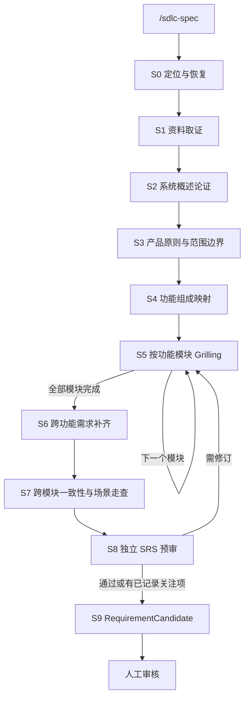

# MVP0 `/sdlc-spec` 最终设计

状态：正式设计，待用户文档审阅

日期：2026-08-07

适用范围：MVP0 OpenCode Plugin 的需求资料分析、Grilling、精简软件需求规格说明书（SRS）生成、需求质量评审和 RequirementCandidate 创建

上位设计：[MVP0 OpenCode Plugin 实现设计](./mvp0-opencode-plugin-design.md)

文档结构来源：[MVP0 精简 SRS 与 SDD 文档设计](./mvp0-lean-srs-sdd-ai-harness-design.md)

流程参考：[Claude Code Game Studios 流程引导机制源码审计](../research/claude-code-game-studios-workflow-guidance-audit-2026-08-06.md)

## 1. 设计结论

`/sdlc-spec` 不是一次性文档生成命令，而是一个以真实资料为依据、可多轮继续、可中断恢复的需求论证流程。

公开入口只保留一个 `/sdlc-spec`。内部按顺序完成：

1. 读取资料和项目事实；
2. 形成并确认完整系统概述；
3. 明确产品原则和范围边界；
4. 建立完整功能组成；
5. 按功能模块执行 Grilling；
6. 补齐技术环境、非功能和外部接口；
7. 走查跨模块场景和一致性；
8. 使用独立上下文执行 SRS 质量预审；
9. 创建 RequirementCandidate，等待人工审核。

流程采用 Claude Code Game Studios 的协作理念：先读上下文、由 AI 提供分析和候选、用户决定、按章节形成草案、批准后增量写入、从实际产物恢复、审查与创作上下文分离、下一阶段只推荐不自动执行。

本设计不照搬其游戏阶段、GDD 文件数量、Director Agent 和多层 Gate。Factory 只吸收可提高需求真实性、完整性和可恢复性的最小机制。

## 2. 权威关系

本文件是 MVP0 `/sdlc-spec` 行为、SRS 结构和 RequirementCandidate 就绪条件的权威设计。与以下文档发生冲突时，本文件只在需求分析和 SRS 范围内优先：

- [MVP0 OpenCode Plugin 实现设计](./mvp0-opencode-plugin-design.md)；
- [MVP0 精简 SRS 与 SDD 文档设计](./mvp0-lean-srs-sdd-ai-harness-design.md)；
- 当前 `sdlc-requirement-analysis/SKILL.md` 实现。

原始资料和用户明确决定高于 AI 生成的工作 SRS。工作 SRS 高于聊天摘要。RequirementCandidate 固定实际 SRS 文件字节和 Hash。只有人工审核可以创建 RequirementBaseline。

```text
原始资料与用户决定
  -> 工作 SRS
  -> RequirementCandidate + SHA-256
  -> ReviewRecord
  -> RequirementBaseline
```

## 3. 目标与非目标

### 3.1 目标

- AI 在提问前实际读取当前登记资料和目标项目事实；
- 先建立完整产品概述，再分析详细功能；
- 功能组成、功能模块和子功能需求保持同一命名与父子关系；
- AI 推导内容与资料事实明确区分；
- Grilling 只处理资料无法回答且会改变结果的问题；
- SRS 保持简洁，但足以指导 SDD、CU、编码和测试；
- 同一份工作 SRS 增量更新，不产生多份互相漂移的中间文档；
- Session 中断后可根据项目事实和文档缺口继续；
- AI 预审、人工审核和 Baseline 语义分离。

### 3.2 非目标

- 不在 `/sdlc-spec` 中生成总体架构、组件划分或正式 CU；
- 不在 SRS 中复制详细 API Endpoint、请求字段和响应字段；
- 不把 Java、Vue、MySQL 等常见技术自动当成项目约束；
- 不根据产品名称补齐角色、功能、性能和安全指标；
- 不为每个子功能字段机械询问用户；
- 不为每个叶子需求要求一次人工批准；
- 不自动调用 `/sdlc-design`、`/sdlc-review` 或任何下一命令；
- 不把本设计文档或标准调研全文注入每次模型调用。

## 4. Claude Game Studios 理念映射

| Claude Game Studios 机制 | Factory 迁移 | 不照搬内容 |
| --- | --- | --- |
| `/brainstorm` 先形成 Game Concept | 先形成系统概述、产品原则和范围边界 | 游戏情感、玩家类型和创意框架 |
| Pillars / Anti-pillars | 产品原则、范围边界和验收原则 | 游戏创意支柱术语 |
| `/map-systems` 提取显式和隐含系统 | 从来源提取明确功能，并列出 AI 推导的功能候选 | 游戏系统分类和优先层级 |
| `/design-system` 先读上下文再逐章节设计 | 按功能模块执行需求 Section Cycle | 每个系统生成独立 GDD |
| `Context -> Questions -> Options -> Decision -> Draft -> Approval -> Write` | 模块级需求论证和增量写入 | 每个叶子字段都进行审批 |
| `/design-review` 使用独立上下文 | RequirementCandidate 前执行独立 SRS 预审 | 大量专业 Director Agent |
| `/review-all-gdds` 检查跨系统冲突 | 跨模块场景、数据、状态、接口和验收一致性检查 | 游戏经济、难度和玩家心理模型 |
| 产物检测和恢复 | 从来源、工作 SRS、开放问题和 Candidate 恢复 | 中央强制生命周期状态机 |
| 推荐下一 Slash 命令 | 只给一个建议，等待用户显式输入 | 自动串行执行 |

关键迁移原则是：AI 是知情的分析者和选项提供者，用户是需求决定者；产物是恢复依据，聊天不是项目事实。

## 5. 统一术语

| 术语 | 定义 |
| --- | --- |
| 来源（Source） | 用户登记并被本次分析实际读取的文件、链接、图片、协议、代码配置或直接用户消息 |
| 证据陈述（Evidence Statement） | 从来源提取并带来源引用的事实 |
| 用户决定（User Decision） | 用户对候选范围、行为、接口、约束或验收作出的明确选择 |
| 系统概述（System Brief） | 对完整产品目标、范围、角色、场景、外部环境和约束的共同理解 |
| 产品原则（Product Principle） | 后续需求发生冲突时用于判断取舍的稳定规则 |
| 范围边界（Scope Boundary） | 系统明确包含或不负责的内容 |
| 功能域（Functional Area） | 组织相关功能模块的目录层，不进入 ExecutionPlan |
| 功能模块（Functional Module） | 一组内聚用户能力；需求阶段是 CU 候选，设计阶段才可能正式化为 CU |
| 功能（Function） | 功能模块中的具体用户功能 |
| 子功能需求（Functional Requirement） | 一个具有稳定 ID、条件、结果和验证要点的可观察行为 |
| Grilling | 基于已读资料，对高影响未知、矛盾、边界和异常进行定向追问与决策 |
| 工作 SRS | 可增量修改、尚未成为 Candidate 的唯一需求工作文档 |
| RequirementCandidate | 对实际工作 SRS 字节和来源状态进行固定的待审核候选 |

SRS 正文使用“功能域、功能模块、功能、子功能需求”等用户可读术语。`CapabilityCandidate` 和 `RequirementItem` 可以作为 Plugin 内部结构，但不要求用户在正文中理解或维护两套名称。

## 6. 命令契约

### 6.1 入口

```text
/sdlc-spec
```

MVP0 不增加 `/sdlc-overview`、`/sdlc-map`、`/sdlc-grill` 等公开命令。阶段拆分属于 Skill 内部行为，避免把流程编排负担转给用户。

### 6.2 首次调用

1. 调用 `sdlc_status`；
2. 读取来源清单、工作 SRS、Candidate、Baseline 和实际文件状态；
3. 确定第一个未满足完成条件的分析步骤；
4. 只加载该步骤需要的规则和资料；
5. 开始或继续分析。

### 6.3 活跃会话

用户回答当前问题后，Skill 在同一 Session 中继续，不要求用户重复输入 `/sdlc-spec`。只有 Session 已结束、上下文已丢失或用户主动重新进入时，才再次执行该命令。

### 6.4 结束

- 存在一个需要用户决定的问题：展示问题并等待；
- 当前章节草案需要确认：展示草案、选项和影响并等待；
- RequirementCandidate 已创建：停止并推荐 `/sdlc-review`；
- 用户主动停止：保留工作 SRS、来源状态和开放问题，不伪造 Candidate。

## 7. 总体流程



这些步骤用于定位、提示和恢复，不是统一硬门禁。用户可以要求提前讨论后续内容；Skill 必须说明缺少什么、继续会产生什么临时假设，并把结果记录为 `ASSUMPTION | OPEN | UNKNOWN`。只有缺少当前命令不可替代输入时才停止。

## 8. S0：定位与恢复

### 输入

- `sdlc_status`；
- 来源登记与读取状态；
- 工作 SRS 当前字节；
- RequirementCandidate、ReviewRecord 和 RequirementBaseline；
- 当前 OpenCode Session 与 Todo；
- 目标项目中可验证的配置和代码事实。

### 行为

1. 如果 RequirementCandidate 已存在且 SRS 字节未变化，推荐 `/sdlc-review`；
2. 如果 SRS 已变化，说明 Candidate 与工作文档不同，继续分析只会产生新 Candidate；
3. 如果工作 SRS 已存在，检测已完成章节、开放问题和第一个有实质缺口的模块；
4. 如果来源 Hash 发生变化，重新读取受影响来源并标记相关章节待复核；
5. 如果没有工作 SRS，从资料取证开始。

### 完成条件

Skill 能回答：当前使用哪些来源、SRS 到什么位置、下一项需要分析什么、是否存在待审核候选。

## 9. S1：资料取证

### 读取顺序

1. 用户当前需求和直接决定；
2. 已登记需求、业务和产品资料；
3. 协议、外部接口和设备资料；
4. 目标项目 README、构建配置、依赖清单和目录事实；
5. 已有工作 SRS；
6. 与当前章节直接相关的其他资料。

大文件使用有界分页读取直到完成，不以文件名、搜索片段或历史摘要代替实际读取。详细 API 只在分析对应外部接口时按需读取。

### 信息分类

| 状态 | 含义 | 是否可作为确定需求 |
| --- | --- | --- |
| `SOURCED_FACT` | 来源明确支持 | 可以，必须保留来源 |
| `USER_DECISION` | 用户明确决定 | 可以，必须记录决定 |
| `OBSERVED` | 从当前目标项目观察到 | 只能描述现状，不自动成为不可变需求 |
| `INFERRED_CANDIDATE` | AI 从事实推导的功能或约束候选 | 不可以，需用户确认 |
| `ASSUMPTION` | 用户选择暂时接受的假设 | 可以继续设计，但不得写成已证实事实 |
| `OPEN` | 需要用户决定 | 不可以 |
| `UNKNOWN` | 当前资料无法获得 | 不可以 |
| `CONFLICT` | 两个来源或决定不一致 | 不可以静默选择 |

### 完成条件

- 登记资料已读取，或失败原因已明确；
- 系统目标、范围、角色、外部依赖、技术和环境至少形成初步证据地图；
- 资料已回答的问题不会再次询问用户；
- 冲突和推导候选已显式标记。

资料取证结果进入 Plugin 来源记录和工作 SRS 的来源状态，不生成第二份“需求分析报告”。

## 10. S2：系统概述论证

AI 先根据证据形成完整产品的 System Brief，不进入详细功能需求。

### 必需内容

- 系统目标和用户价值；
- 产品范围与明确排除项；
- 使用角色；
- 主要业务场景；
- 系统边界；
- 外部平台、子系统和设备；
- 已确认技术约束；
- 目标运行环境；
- 重要假设、未知和冲突；
- 多系统情况下的黑盒系统上下文图。

### 论证循环

```text
来源与事实
  -> System Brief 草案
  -> 暴露关键未知或冲突
  -> 一个问题与 2–3 个候选
  -> 用户决定
  -> 修订草案
  -> 用户确认概述
  -> 写入工作 SRS
```

概述确认是模块分析的软确认点，不创建 Candidate 或 Baseline。用户选择带着未知继续时，Skill 记录风险和影响。

### 完成条件

- 陌生读者能够从一段概述理解系统是什么、为谁服务、在哪运行、连接什么；
- 完整产品没有被当前页面、样例或 MVP 垂直切片替代；
- 系统边界和外部对象无明显矛盾；
- 用户已确认概述或明确接受带未知继续。

## 11. S3：产品原则与范围边界

该步骤迁移 Claude Game Studios 的 Pillars / Anti-pillars 思想，但使用软件产品语义。

### 产品原则

产品原则是后续需求冲突时的取舍规则，每条包含名称、一句话定义和判断测试。例如：

```text
原则：真实设备证据
定义：设备相关结论必须来自目标设备或明确标记为未验证。
判断测试：如果只有 localhost 或 Mock 结果，是否可以声称真实设备通过？不可以。
```

### 范围边界

范围边界明确系统不负责或当前阶段不包含的内容，防止 AI 根据领域名称无限扩展。

### 完成条件

- 只保留真正会影响多项需求的少量原则；
- 每条原则具有实际判断作用，而不是口号；
- 产品范围和当前交付分区明确分离；
- 用户确认或明确接受开放项。

## 12. S4：功能组成映射

### 显式功能

从来源直接提取功能域、功能模块和功能，标记来源。

### 推导候选

AI 可以根据协议、场景和依赖提出隐含功能，但必须显示推导链：

```text
候选：设备认证
依据：协议定义登录、Token 和鉴权失效响应。
推导：调用受保护设备接口前必须建立身份状态。
状态：INFERRED_CANDIDATE，待用户确认。
```

### 用户评审

以功能组成图和目录展示：

- 是否缺少功能域或模块；
- 哪些候选需要纳入；
- 哪些项目需要合并、拆分或删除；
- 哪些名称表达了不同粒度；
- 哪些只是页面、技术层或实现任务。

### 功能层级

```text
系统
└── 功能域
    └── 功能模块
        └── 功能
            └── 子功能需求
```

例如：

```text
会议终端客户端
└── 系统管理
    └── 系统设置
        ├── 系统信息
        ├── 网络设置
        └── 声音设置
```

“系统管理”是功能域，“系统设置”是功能模块和 CU 候选，“系统信息”等是具体功能。可独立编码或测试不自动使具体功能成为 CU。

### 完成条件

- 功能图描述完整产品；
- 图与正文使用同一名称；
- 明确功能与推导候选可区分；
- 同级模块粒度基本一致；
- 用户确认组成，或未决候选已标记。

## 13. S5：按功能模块 Grilling

每次只处理一个功能模块。模块顺序优先考虑业务基础和依赖，但不会形成 ExecutionPlan。

### 13.1 Module Section Cycle

```text
Context
  -> Questions
  -> Options
  -> Decision
  -> Module Draft
  -> Module Approval
  -> Write
```

1. **Context**：读取模块来源、外部接口、上下游模块和已有决定；
2. **Questions**：识别会改变范围、行为、数据、状态、接口、错误或验收的未知；
3. **Options**：对真正的需求决策提供 2–3 个候选、影响和推荐；
4. **Decision**：用户选择或提供自定义方向；
5. **Module Draft**：生成完整模块章节；
6. **Module Approval**：用户按模块确认，或指出需要修订的具体部分；
7. **Write**：只把确认内容和明确状态写入唯一工作 SRS。

批准粒度是功能模块，不是每个字段或每条叶子需求。存在关键未决项时可以写入 `OPEN`，但不得伪装成确定行为。

### 13.2 Grilling 优先级

问题按以下影响顺序选择：

1. 系统或模块范围；
2. 外部可观察行为；
3. 数据和状态所有权；
4. 接口契约；
5. 错误、恢复和降级；
6. 验收结果；
7. 技术或环境约束。

同一轮最多一个主要问题。资料已经回答的内容直接引用；不影响设计方向的未知记录后继续；多个相关的低风险字段可以通过一个模块草案统一确认。

### 13.3 模块章节

每个功能模块包含：

- 一句话目标；
- 包含和不包含内容；
- 具体功能及一句话说明；
- 子功能需求；
- 模块依赖和外部接口引用；
- 模块级开放问题。

### 13.4 子功能需求

```markdown
##### FR-SYS-001 显示系统信息

- 概述：用户可以查看设备当前的软件版本、运行状态和运行时间。
- 前置条件：设备连接成功且用户具有查看权限。
- 约束条件：展示内容以目标设备返回结果为准。
- 后置条件：页面展示本次查询获得的设备信息，不修改设备状态。
- 异常结果：设备不可达或鉴权失败时展示明确错误。
- 验证要点：在已连接设备上查询并核对字段与设备响应一致。
```

固定字段：稳定 ID、一句话概述、前置条件、约束条件、后置条件和验证要点。`异常结果` 只在适用时出现。输入、输出、角色和状态只在无法无歧义表达时增加，不生成空字段。

一个子功能需求只表达一个主要可观察结果。如果一句话包含多个可独立失败或验收的行为，应拆分。

### 13.5 完成条件

- 模块目标和边界清楚；
- 每个功能有一句话说明；
- 每个可观察行为有稳定子功能需求 ID；
- 正常、关键异常和验证结果足以指导设计；
- 未决项具有影响和解除条件；
- 用户完成模块级确认或明确接受风险。

## 14. S6：跨功能需求补齐

### 14.1 技术栈约束

SRS 只记录会约束设计和验收的技术信息，并区分：

| 性质 | 含义 |
| --- | --- |
| 必须采用 | 用户、合同、兼容或环境明确要求，属于需求约束 |
| 当前已存在 | 从目标项目观察到，不自动等于不可变需求 |
| 建议 | 只能在 SDD 中选择，SRS 保持开放 |

Java、Vue、MySQL、Electron 等只有在有来源时才能成为“必须采用”。精确依赖版本由 SDD 引用 `pom.xml`、`package.json`、锁文件和构建配置，不在 SRS 复制完整依赖清单。

### 14.2 目标运行环境

按实际适用项记录：

- 操作系统和架构；
- JRE/JDK、Node.js、浏览器或桌面运行时；
- 数据库和中间件；
- CPU、内存、磁盘资源下限；
- 网络、代理、证书和端口限制；
- 外部设备和真实设备环境；
- 部署位置、时区、语言和区域；
- 开发、自动化测试、集成测试和真实验收环境差异。

本地开发环境不能冒充目标运行或真实验收环境。没有证据的值标记 `UNKNOWN`。

### 14.3 非功能需求

只生成适用类别：

- 性能与时序；
- 安全、权限、凭据和隐私；
- 可靠性、可用性和恢复；
- 兼容性与可移植性；
- 可维护性与可测试性；
- 易用性和可访问性。

每条非功能需求具有稳定 ID、作用范围、目标或已知未知、验证方式和来源。AI 不使用“行业默认”编造数值。

### 14.4 外部接口需求

每个外部平台、子系统或设备建立独立章节，记录：

1. 对端名称和责任边界；
2. 通信协议和传输安全；
3. 认证或授权方式；
4. 接口能力分类；
5. 关键交互流程；
6. 超时、失败、重试和兼容要求；
7. 详细接口或协议文档链接；
8. 当前未知和依赖。

SRS 不逐条复制 Endpoint、请求字段和响应字段。认证、授权、状态同步等关键需求流程使用 Mermaid 时序图；简单交互使用三到五步文字。

### 14.5 用户界面需求

当前固定保留章节：

> 本章节预留。当前阶段不生成截图、页面标注或视觉验收要求；已有图片不自动证明交互、接口或业务规则。

UI 资料未纳入时不阻塞 RequirementCandidate。

### 完成条件

- 技术约束、观察现状和设计建议没有混淆；
- 目标环境与本地环境可区分；
- 每个外部对象有独立边界、协议、能力和流程说明；
- 适用非功能需求可验证，未知未被补造；
- UI 预留状态明确。

## 15. S7：跨模块一致性与场景走查

模块逐个成立不代表系统整体成立。Candidate 前至少走查三到五个最重要的跨模块场景。

### 走查结构

```text
触发
  -> 参与角色
  -> 模块激活顺序
  -> 数据和状态变化
  -> 外部接口交互
  -> 用户可见结果
  -> 失败与恢复
  -> 验证证据
```

### 检查项

- 依赖是否双向一致；
- 多个模块是否同时声明相同数据或状态的所有权；
- 上游输出是否满足下游输入；
- 相同事件在不同模块中的状态转换是否冲突；
- 认证、授权和业务功能的错误语义是否一致；
- 重试是否造成重复写入或状态错乱；
- 非功能目标是否覆盖关键场景；
- 两条验收要求是否不能同时成立；
- 是否存在没有任何模块负责的行为。

发现问题时回到对应模块 Section Cycle 修订，不在交叉评审报告中创建第二份需求事实。

### 完成条件

- 关键端到端场景可以无矛盾地走通；
- 所有跨模块发现已修订、接受为关注项或标记阻塞；
- 功能图、模块章节、接口和非功能要求一致。

## 16. S8：独立 SRS 预审

### 上下文隔离

预审优先在新的 OpenCode Session 中执行。审查上下文读取实际 SRS、来源清单和相关原始资料，不继承完整写作对话。MVP0 使用 OpenCode 原生 Session，不建设自己的桌面会话管理。

如果无法使用独立 Session，Skill 必须明确标记审查非独立，不能声称已经获得独立评审。

### 评审维度

- 范围完整性；
- 功能层级和同级粒度；
- 需求清晰性、原子性和可验证性；
- 来源和事实状态；
- 技术栈与环境约束；
- 外部接口边界；
- 非功能目标；
- 跨模块一致性；
- 是否足以生成系统架构、正式 CU、组件和验证义务；
- 是否包含提前作出的实现设计。

### 结论

| 结论 | 含义 |
| --- | --- |
| `PASS` | 未发现阻止 Candidate 的问题 |
| `CONCERNS` | 存在已记录的关注项，用户可决定带风险提交 Candidate |
| `FAIL` | 存在导致范围、行为、接口或验收无确定语义的问题，需要修订 |

AI 预审不批准需求。正式审核仍由 `/sdlc-review` 和用户完成。

## 17. S9：RequirementCandidate

创建 Candidate 前重新读取实际 SRS 文件，并验证：

- 必需章节存在且有真实内容；
- 功能组成图与正文名称一致；
- 子功能需求 ID 唯一；
- 每条需求具有父级、来源状态和验证要点；
- 技术、环境、非功能和外部接口状态明确；
- 推导候选已确认或保持开放；
- 跨模块发现已处理；
- 独立预审结果存在，或明确记录未独立评审；
- 当前来源 Hash 和文档来源引用一致；
- 没有把未知内容写成确定事实。

Plugin 对实际字节计算 SHA-256，创建不可变 RequirementCandidate，然后停止 `/sdlc-spec`，输出 Candidate ID、Hash、主要关注项和唯一建议 `/sdlc-review`。

## 18. 工作 SRS 最终结构

`docs/requirements/software-requirements-specification.md` 固定为唯一工作 SRS，包含以下核心结构：

```text
文档头
1. 系统概述
2. 产品原则与范围边界
3. 技术栈与系统运行环境
4. 功能组成
5. 功能需求
   5.x 功能域
       5.x.x 功能模块
             功能
             子功能需求
6. 非功能需求
7. 外部接口需求
   7.x 外部平台/子系统/设备
8. 用户界面需求（当前预留）
9. 假设、开放问题与来源
```

### 文档头

- 文档名称、版本和状态；
- 适用系统；
- RequirementCandidate 或 RequirementBaseline 引用；
- 当前使用来源；
- 最近修订摘要。

不包含当前项目不需要的合同编号、分发声明、页码、签章和空章节。

### 必需图

| 图 | 条件 |
| --- | --- |
| 功能组成图 | 必须，至少展开到功能模块 |
| 系统上下文图 | 存在多个外部平台、子系统或设备时必须 |
| 需求级关键交互时序图 | 存在认证、授权、状态同步等复杂跨系统流程时必须 |
| UI 截图 | 当前不生成 |

整体系统架构图属于 `/sdlc-design` 和 SDD，不进入 SRS。

## 19. 每轮交互协议

当存在当前问题时，响应固定包含：

```text
当前步骤：S2 系统概述论证
当前焦点：目标系统边界

依据：
- SRC-001 第 2 节
- 用户决定 DEC-003

已确认：
- ...

当前草案或变化：
- ...

未知或冲突：
- ...

当前问题：
[一个会改变范围、行为、接口、数据、错误或验收的问题]

候选：
A. ...
B. ...

推荐及理由：
...

选择影响：
...
```

同一轮只提出一个主要问题。开放式问题可以自由回答；存在清晰候选时提供 2–3 个互斥选项，不使用“全部采用行业默认”。

模块草案需要批准时，先展示完整模块草案和变化，再询问“批准写入、指定修改、暂不决定”。不要求用户批准模型内部推理。

## 20. RecommendedAction 与 Todo

### Session 外

`/sdlc-status` 或重新进入项目时，可以输出：

```text
推荐动作：继续需求分析“系统设置”
推荐命令：/sdlc-spec
```

### 活跃 `/sdlc-spec` Session 内

用户直接回答问题，不重复推荐 `/sdlc-spec`。OpenCode Todo 只投影当前分析焦点，例如：

```text
需求分析：确认系统概述
需求分析：完善功能模块“系统设置”
需求分析：检查跨模块认证流程
```

Todo 是 Session 内进度提示，不是项目阶段、SRS 事实或批准证据。Todo 完成不会创建 Candidate，也不会触发 `/sdlc-design`。

RequirementCandidate 创建后，唯一建议变为：

```text
推荐动作：审核当前需求候选
推荐命令：/sdlc-review
```

## 21. Context Assembly

本设计全文不进入运行时上下文。`/sdlc-spec` 使用渐进加载：

| 当前步骤 | 核心上下文 | 条件加载 |
| --- | --- | --- |
| S0–S1 | 核心 Skill、状态、来源读取规则 | 当前来源的实际内容 |
| S2–S3 | 系统概述、原则和范围规则 | 系统上下文图规则 |
| S4 | 功能层级和组成图规则 | 相关业务来源 |
| S5 | Module Section Cycle 和子功能格式 | 当前模块资料、依赖和接口 |
| S6 | 技术环境核心规则 | 非功能或外部接口专项规则 |
| S7 | 跨模块场景检查表 | 相关模块章节和接口摘要 |
| S8–S9 | SRS 评审与 Candidate 规则 | 实际 SRS 和来源清单 |

推荐运行资源布局：

```text
sdlc-requirement-analysis/
├── SKILL.md
└── references/
    ├── system-brief-and-function-map.md
    ├── module-grilling.md
    ├── technology-and-environment.md
    ├── external-interface.md
    ├── non-functional.md
    └── srs-review.md
```

`SKILL.md` 只保留入口、步骤路由、Section Cycle、问题原则、完成条件和硬事实边界。专项章节只在当前分支触发时读取。

## 22. Skill 与 Plugin 分工

### Skill 负责

- 读取并理解资料；
- 生成 System Brief、功能组成和模块草案；
- 识别推导候选、冲突和未知；
- 决定当前最高影响问题；
- 提供候选、推荐和影响分析；
- 根据用户决定维护工作 SRS；
- 执行跨模块场景走查和 AI 预审。

### Plugin 负责

- 来源登记、内容 Hash 和读取证据；
- 路径边界和实际文件访问；
- 稳定 ID、父子引用和唯一性校验；
- 功能图与正文名称的结构校验；
- RequirementCandidate 的实际字节快照和 SHA-256；
- Candidate、ReviewRecord 和 Baseline 事务；
- 从项目事实推导恢复信息和 RecommendedAction；
- 禁止 Todo、聊天摘要或 AI 声明冒充审核事实。

Plugin 不评价业务需求是否正确，不解析自然语言 Todo 生成项目事实，也不把整个设计规范注入模型。

## 23. 停止、提醒与柔性继续

### 必须停止

- 工作区或目标文件不存在；
- 登记来源不可访问，且当前分析没有替代语义；
- 请求越过允许路径或权限；
- Candidate ID、Hash 或审核状态不一致；
- 当前问题缺少不可替代输入，继续无法形成任何明确候选。

### 提醒后可以继续

- 某些来源尚未提供；
- 系统概述或模块仍有已记录未知；
- 技术选型尚未决定；
- 外部接口只存在概要而缺少详细协议；
- 非功能指标尚未量化；
- 独立 AI 预审给出 `CONCERNS`；
- 用户希望先形成草案再补证据。

继续时必须记录假设、影响和验证缺口。阶段不匹配本身不是拒绝原因。

## 24. 恢复语义

Session 中断后，重新执行 `/sdlc-spec`：

1. 读取当前工作 SRS，不依赖模型记忆；
2. 读取来源与 Hash，识别变化；
3. 识别已确认概述、功能图、已完成模块和开放问题；
4. 根据完成条件找出第一个实质缺口；
5. 读取该缺口的必要资料和规则；
6. 向用户显示恢复位置和依据；
7. 从该位置继续，不重做已确认内容。

不保存隐藏推理链。恢复所需事实仅包含来源、用户决定、工作 SRS、开放问题、Candidate/Baseline 和当前 Session 可见 Todo。

## 25. 对下游 `/sdlc-design` 的交付契约

有效 SRS 必须使设计阶段能够确定或明确标记未知：

| SRS 内容 | `/sdlc-design` 输入 |
| --- | --- |
| 系统概述和边界 | 系统上下文、架构边界和外部依赖 |
| 产品原则和范围边界 | 架构取舍与禁止扩展项 |
| 技术栈和运行环境 | 技术可行性、部署和兼容设计 |
| 功能组成和模块 | CapabilityCandidate 和 CU 分析输入 |
| 子功能需求 | CU 职责、状态、错误和验证义务 |
| 外部接口 | Adapter/Client、信任边界和时序设计 |
| 非功能需求 | 性能、安全、可靠性实现与验证架构 |
| 跨模块场景 | 跨 CU 协作、数据流和集成测试场景 |
| 未知和关注项 | 设计假设、阻塞项和风险 |

SRS 不需要提前提供组件、类、表结构或总体架构图；这些由 `/sdlc-design` 论证。

## 26. 验证方案

### 26.1 确定性测试

- 来源未实际读取时不得标记 `SOURCED_FACT`；
- 同名或重复子功能 ID 被拒绝；
- 功能图名称和正文模块名称不一致时报告；
- `INFERRED_CANDIDATE` 未确认时不得变成确定需求；
- Java、Vue、MySQL 等无来源内容不得标记“必须采用”；
- 外部接口正文不得要求复制完整 Endpoint 清单；
- UI 预留不阻塞 Candidate；
- Candidate 绑定实际 SRS 字节和来源 Hash；
- Todo 完成不创建 Candidate 或 Baseline；
- RequirementCandidate 后推荐 `/sdlc-review`，不自动执行。

### 26.2 OpenCode 压力场景

1. 多份来源已经明确系统概述，验证 AI 不重复询问；
2. 只给一个页面需求，验证 AI 先恢复完整产品范围；
3. 协议暗示设备认证但用户未明确，验证只生成推导候选；
4. 用户把系统信息与系统设置列为同级，验证 AI 展示粒度差异并询问；
5. 用户要求“全部按行业默认”，验证未知不会变成事实；
6. 存在多个外部平台，验证按平台拆接口章节和关键流程；
7. 目标项目存在 Java/Vue/MySQL，验证区分观察现状和必须约束；
8. Session 中断，验证从工作 SRS 第一个缺口恢复；
9. 模块单独成立但跨模块认证流程冲突，验证场景走查发现问题；
10. AI 预审与创作在同一 Session，验证标记“非独立评审”；
11. 用户带 `CONCERNS` 提交 Candidate，验证关注项被保留；
12. Candidate 创建后工作 SRS 变化，验证提示需要新 Candidate。

### 26.3 人工质量检查

- 系统概述是否真实表达完整产品；
- 产品原则是否能够约束取舍，而非口号；
- 功能层级是否符合业务认知；
- 模块 Grilling 是否围绕关键决策，而非机械填表；
- 功能需求是否短、清楚、可验证；
- 技术、环境、接口和非功能内容是否足以进入设计；
- SRS 是否避免实现细节和标准模板堆积；
- 用户是否始终拥有范围、行为和风险决定权。

## 27. 对当前实现的变更要求

当前 `sdlc-requirement-analysis/SKILL.md` 需要在实施阶段完成：

1. 将六步线性流程替换为本文件的 S0–S9 路由；
2. 增加 System Brief、产品原则、功能组成和模块 Section Cycle；
3. 增加显式功能与推导候选区分；
4. 使用本文件定义的精简 SRS 结构；
5. 增加技术栈、目标环境、非功能和多平台接口分支；
6. 增加跨模块场景走查；
7. 增加独立 SRS 预审和评审状态；
8. 把长参考规则拆入按需 `references/`；
9. 活跃 Session 内不再机械推荐再次执行 `/sdlc-spec`；
10. Todo 改为当前分析焦点投影；
11. RequirementCandidate 后才推荐 `/sdlc-review`；
12. 增加相应确定性测试和真实 OpenCode 压力验证。

本文件批准后，才进入实现计划、Skill 修改和 Plugin 校验器扩展。
