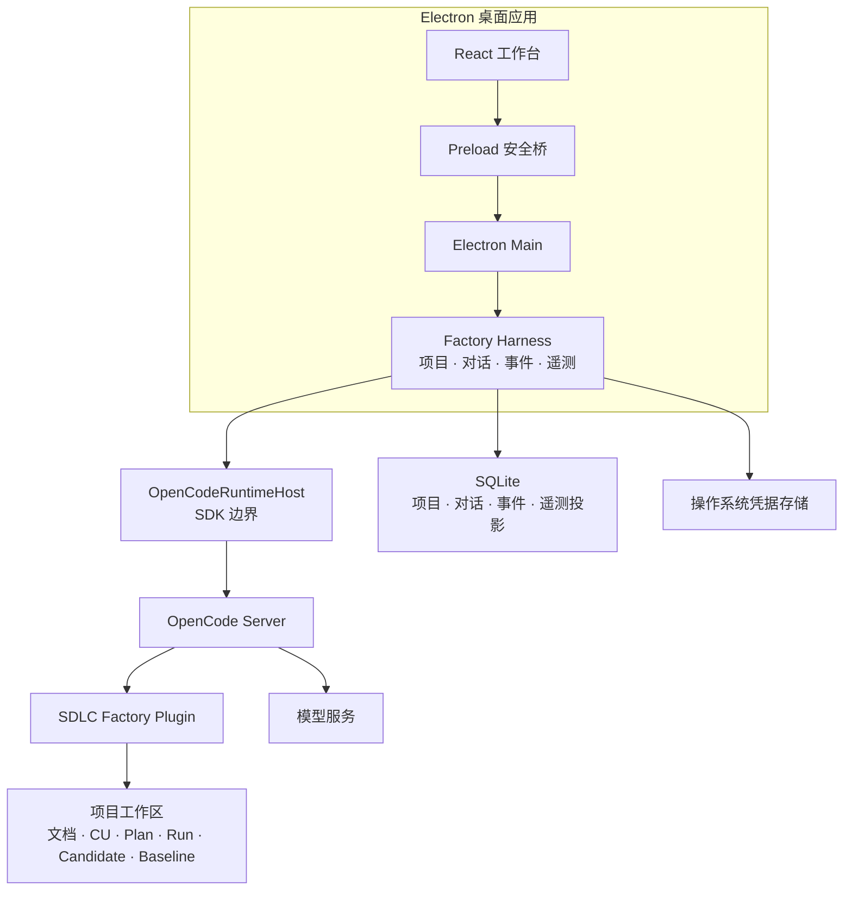

# MVP1 桌面 Harness 实现设计

状态：正式设计，用户已确认

日期：2026-08-07

上位需求：[SDLC Factory 总体需求与分阶段方案](../../README.md)

前置条件：[MVP0 OpenCode Plugin 实现设计](mvp0-opencode-plugin-design.md)通过验收

## 1. 设计目标

MVP1 不重新设计研发流程，而是把 MVP0 已验证的 Plugin、Skills、CU、ExecutionPlan、执行记录、候选和 Baseline 合同集成成桌面项目工厂。

MVP1 必须回答：

1. Electron 工作台能否管理多个本地项目和持续对话；
2. Factory Harness 能否通过 OpenCode SDK 稳定启动、连接、停止和恢复原生 Session；
3. OpenCode 事件能否转换为可持久化、可渲染、可审计的 Factory 事件；
4. 文件、候选、审核和 Baseline 能否在会话视图与项目聚合视图中保持同一事实；
5. 本地遥测能否定位排队、上下文、模型、工具、持久化和渲染慢在哪里；
6. 项目创建、导入、Plugin 安装和健康检查能否形成可恢复的项目管理闭环。

## 2. MVP1 范围

### 2.1 包含

- Electron + React 桌面应用；
- Preload 安全桥和 Electron Main；
- TypeScript Factory Harness；
- `@opencode-ai/sdk` Client 和 OpenCode Server 生命周期；
- Project、Conversation 与 OpenCode Session 的稳定绑定；
- 多轮消息、附件、工具、权限、错误和停止事件；
- SQLite 项目、对话、事件与本地遥测索引；
- 项目创建、导入、打开、Plugin 安装、版本锁定和健康检查；
- MVP0 的 `/sdlc-init`、`/sdlc-spec`、`/sdlc-design`、`/sdlc-code`、`/sdlc-test`、`/sdlc-review`、`/sdlc-status`；
- SRS、总体设计、CU、ExecutionPlan、代码 Diff、测试证据、候选、ReviewRecord 和 Baseline 的桌面展示与人工审核；
- Windows 进程停止、崩溃恢复和应用重启恢复。

### 2.2 不包含

- Pi、Codex、Claude Code 等第二 Runtime；
- 多 Runtime 注册表或通用 Agent 市场；
- 云端控制面、远程执行和多用户协作；
- 通用工作流引擎、强制阶段状态机或自动推进；
- 把每轮聊天包装成 Factory 领域任务；
- 发布、部署和制品分发工厂；
- Plugin 市场、通用记忆平台和企业组织权限；
- 将 OpenCode 权限描述为 OS 级强隔离沙箱。

## 3. 总体架构



## 4. 权威职责

### 4.1 React Renderer

Renderer 负责显示和用户交互：

- 项目导航；
- 多轮消息时间线；
- 模型、推理强度和附件输入；
- 工具、权限、变更、错误和等待状态；
- 文件、候选、审核和 Baseline 聚合视图；
- 停止、重试、继续和人工审核操作。

Renderer 不直接访问 Node.js、OpenCode SDK、SQLite、文件系统或凭据，不保存第二套项目状态。

### 4.2 Factory Harness

Harness 是桌面产品控制面，负责：

- 项目创建、导入、打开、关闭和最近项目；
- Conversation 创建、选择、归档和恢复；
- OpenCode Server 与 Session 生命周期；
- 本轮模型、推理强度、附件版本和权限配置；
- OpenCode 事件接收、排序、持久化和 UI 投影；
- Plugin 安装、版本、内容 Hash 和健康状态；
- 本地遥测、错误分类和恢复策略；
- 调用 Plugin 的确定性审核能力；
- 读取项目工作区事实并建立 SQLite 索引。

Harness 不判断需求或设计内容是否专业正确，不代替用户审核，也不改写 Plugin 已冻结的候选和 Baseline。

### 4.3 OpenCodeRuntimeHost

`OpenCodeRuntimeHost` 是 Harness 与 OpenCode SDK 之间唯一边界，负责：

- 启动或连接指定 OpenCode Server；
- 创建、恢复、停止和释放原生 Session；
- 发送 Prompt、附件、模型和推理参数；
- 订阅并标准化消息、工具、权限、Diff、错误和 Session 事件；
- 执行 Abort、超时和一次有界恢复；
- 返回实际生效的 Runtime 版本、模型和结束原因。

OpenCode SDK 类型不得进入 Renderer、Plugin Artifact 合同和审核/Baseline 领域接口。

### 4.4 SDLC Factory Plugin

MVP1 继续使用 MVP0 的 Plugin 作为项目内研发流程与事实边界：

- Commands/Skills 仍由 OpenCode 原生加载；
- CU、ExecutionPlan、ExecutionRecord、Candidate、ReviewRecord 和 Baseline 仍按项目本地合同生成；
- 柔性引导规则不因桌面集成而变成 Harness 命令拦截；
- Harness 通过 SDK 调用同一确定性工具，不复制一份审核实现；
- Plugin 包版本和内容 Hash 绑定到项目。

### 4.5 项目工作区与 SQLite

项目工作区是原始资料、工作文档、CU、ExecutionPlan、执行记录、候选和 Baseline 的可移植事实源。SQLite 保存：

- Project 和本地目录；
- Conversation、Message 和 OpenCode Session 绑定；
- 附件引用和消息来源；
- 事件索引、运行状态和本地遥测；
- 文件、CU、ExecutionPlan、ExecutionRecord、Candidate、ReviewRecord 和 Baseline 的可查询投影；
- Plugin 版本和健康检查结果。

SQLite 不保存另一份可独立修改的正式文档正文，也不能绕过 Plugin 直接制造 Baseline。

## 5. 项目工厂

### 5.1 创建与导入

MVP1 支持：

- 创建新的本地项目目录；
- 导入已有本地 Git 或非 Git 项目；
- 校验真实路径、读写权限和目录冲突；
- 登记项目名称、目录、创建方式和最近打开时间；
- 打开项目前检查 OpenCode、Plugin 和状态格式兼容性。

创建项目只建立可工作的项目容器，不自动宣称需求、设计或初始化已经完成。

### 5.2 Plugin 安装与升级

Harness 负责：

1. 读取 Factory 内置或选定的 Plugin 包；
2. 展示版本、来源和内容 Hash；
3. 检查目标项目现有 `.opencode` 资源和冲突；
4. 经用户确认后原子安装；
5. 保存安装快照和受影响文件清单；
6. 启动 OpenCode 后执行真实 Plugin 加载检查；
7. 升级时保留项目状态，并验证状态格式迁移。

配置文件存在不等于 Plugin 已加载；必须通过实际 OpenCode 调用验证可见行为。

### 5.3 项目概览

项目概览聚合：

- Plugin 和 Runtime 健康；
- 最近 Conversation 和运行状态；
- 原始资料、SRS、总体设计、CU、ExecutionPlan 和开放问题；
- 当前候选、待审核项和 Baseline；
- 最近错误、权限请求和恢复结果；
- 当前建议工作位置和一个推荐命令。

建议工作位置仍然只用于引导，不是项目锁。

## 6. Conversation 与 OpenCode Session

### 6.1 领域边界

- Conversation 是桌面产品中的长期用户对话；
- OpenCode Session 是 Runtime 上下文载体；
- Message 是对话显示和恢复所需的产品记录；
- Session idle、模型回复结束和工具成功都不代表 SDLC 工作完成；
- Requirement、Design、Candidate 和 Baseline 状态来自项目事实，不来自对话阶段字段。

### 6.2 绑定与恢复

一个活动 Conversation 绑定一个 OpenCode Session。Harness 保存：

- OpenCode Session ID；
- 项目真实路径和工作区指纹；
- Runtime 与 Plugin 精确版本；
- 模型、供应商和关键配置；
- 最近已持久化消息游标；
- Session 创建、恢复和失效原因。

只有项目路径、Runtime/Plugin 版本和必要配置兼容时才原生恢复。条件不满足时，Harness 明确报告原因，经用户确认后创建新 Session，并从 Factory 保存的消息和项目事实建立必要上下文；不能伪装成原生恢复成功。

### 6.3 并发

同一 Conversation 同一时间只允许一个前台模型轮次，避免并发写入和事件乱序。用户可以：

- 停止当前轮次；
- 在当前轮结束后发送下一条消息；
- 将输入排队；
- 在另一个 Conversation 工作。

这是技术并发约束，不是生命周期阶段门禁。

## 7. 桌面工作台

MVP1 采用三栏工作台布局。

### 7.1 左侧

- 项目列表和当前项目；
- Conversation 列表和历史；
- 新建、导入、打开和设置；
- 常用 `/sdlc-*` 命令入口。

### 7.2 中间

- 用户消息与 AI 回复按时间平铺；
- 当前轮的思考摘要、工具、权限、变更、测试、预览和错误可展开；
- 历史轮次保留结果与状态，过程默认收起；
- 候选和审核卡出现在相关消息位置；
- 等待用户、部分完成、中断和失败可以在同一 Conversation 继续；
- 长对话分页加载并使用虚拟滚动。

### 7.3 右侧

- 概览；
- 文件；
- 变更；
- 产物；
- 证据；
- 审核与 Baseline；
- Runtime 与 Plugin 健康；
- 本地遥测。

中间卡片回答“这一轮发生了什么”，右侧面板回答“项目当前有什么”；两者读取同一 Harness 投影。

### 7.4 输入区

- 普通文本和 Slash 命令补全；
- 真实可用的模型和推理强度；
- 多文件选择、拖放、粘贴和移除；
- 发送前显示实际项目、模型和附件；
- 流式执行中的停止与排队输入；
- 失败时不得静默切换模型或供应商。

## 8. 柔性引导在 MVP1 中的保持方式

MVP1 不在 Electron IPC 或 Harness 中增加统一的“阶段是否允许执行”接口。流程保持为：

```text
用户显式执行 /sdlc-* 命令
  → OpenCode 加载对应 Skill
  → Skill 调用 Plugin 只读状态查询
  → AI 展示建议工作位置、主要缺口和推荐命令
  → 用户决定继续当前命令或另行执行建议命令
```

桌面可以美化这段普通回复和状态投影，但不能把它变成禁用按钮、阶段锁或自动跳转。只有目标无效、不可替代输入缺失、安全或审核事务不成立时，当前操作才真正停止。

## 9. 审核与 Baseline

### 9.1 审核入口

用户可以从会话审核卡或右侧审核页打开同一个 Candidate。界面展示：

- Candidate ID、类型、版本和 Hash；
- 实际正文和相对上一版本的 Diff；
- 来源资料、使用的 SRS/设计引用和开放问题；
- Plugin、Skill、模型和 Session 引用；
- 确定性校验结果和未知项；
- 通过、退回修订和暂缓操作。

### 9.2 决定执行

Renderer 提交结构化用户决定，Harness 调用 Plugin 的审核能力。Plugin 重新读取 Candidate、校验 Hash 和状态后写入 ReviewRecord；通过时创建 Baseline。Harness 只持久化结果投影和事件，不自行拼装 Baseline。

审核通过不会停止 Conversation、冻结工作文档或自动执行下一命令。

## 10. 本地遥测

MVP1 默认只在本机记录：

- Harness 排队和上下文准备耗时；
- OpenCode Server 启动和连接耗时；
- 首事件、模型生成和工具执行耗时；
- 持久化和 Renderer 批量刷新耗时；
- 输入/输出 Token、模型报告的用量和可用时的成本；
- 工具名称、结果、权限请求、等待和拒绝；
- Session 创建、恢复、冷启动和失效原因；
- Abort、超时、重试、进程退出和错误分类；
- Plugin 版本、健康检查和迁移结果。

日志默认不得保存凭据；Prompt、附件正文、源代码和模型输出的全文采集必须有单独的数据分类和用户开关。没有明确配置时不向外部遥测服务发送项目数据。

## 11. 错误与恢复

- 网络、认证、模型、SDK、Server 或工具错误只结束当前轮次；
- 已收到的增量文本、工具结果和文件变更保持真实状态；
- Harness 不自动重放可能产生副作用的工具；
- 只允许不会重放副作用的一次有界连接恢复；
- 停止操作必须终止对应 OpenCode 工作，并在 Windows 上验证进程树状态；
- 应用崩溃后根据 SQLite 事件和项目 Journal 区分完成、中断和未知；
- SQLite 与项目事实不一致时，以 Plugin 的不可变 Candidate、ReviewRecord 和 Baseline 为准，重建投影；
- 未运行、未知、超时、跳过和遥测缺失不能显示为成功。

## 12. 安全边界

- Preload 只暴露白名单 IPC，并校验所有参数；
- Renderer 不启用任意 Node.js 能力；
- 模型凭据保存在操作系统凭据存储；
- OpenCode 只在用户授权的项目目录运行；
- Plugin 和 Harness 都执行真实路径校验，防止符号链接和目录穿越；
- 外部目录、危险 Shell、Git push、删除和凭据访问使用明确的 allow/ask/deny；
- Plugin 安装和升级绑定来源、版本、Hash 和受影响文件；
- OpenCode 权限是应用授权边界，不宣称提供 OS 级 syscall、文件系统或网络沙箱。

## 13. MVP1 端到端流程

```text
启动桌面应用
→ 创建或导入本地项目
→ 检查 OpenCode 和 Plugin
→ 用户确认安装或升级 Plugin
→ Harness 启动或连接 OpenCode Server
→ 创建或恢复 Conversation / OpenCode Session
→ 用户显式执行一条 /sdlc-* 命令
→ Plugin 返回项目事实，AI 提供柔性提示
→ 用户持续完成需求、设计、CU 编码、测试和系统验收
→ /sdlc-review 固定当前文档、CU Code/Test 或系统验收候选
→ 用户在桌面审核
→ Plugin 生成 ReviewRecord / Baseline
→ Harness 更新项目、会话和遥测投影
→ 应用重启后恢复项目和 Conversation
```

## 14. 验收标准

MVP1 必须真实演示：

1. 创建和导入两个不同本地项目，并分别安装、验证 Plugin；
2. 通过 SDK 创建 OpenCode Session，持续多轮对话并停止一次运行；
3. 应用重启后恢复项目、Conversation 和兼容的原生 Session；
4. 原生恢复不安全时明确降级，经用户确认后建立新 Session；
5. 运行 MVP0 的需求、设计、ExecutionPlan、逐 CU 编码测试和系统验收闭环；
6. 设计未确认时执行后续工作，只提示风险，不因阶段顺序禁用命令；
7. 会话卡和右侧面板展示同一文件、Candidate、ReviewRecord 和 Baseline；
8. SQLite 删除可重建的投影后，可以从项目事实恢复正式产物索引；
9. 遥测能区分排队、Server、首事件、生成、工具、持久化和渲染耗时；
10. 错误 Hash、越界路径、危险命令和无效审核会被拒绝；
11. 停止、失败和等待用户不会被显示为工作完成；
12. 实际运行没有 Pi、多 Runtime、强制阶段状态机或自动命令推进。

## 15. 后续扩展条件

发布、部署、制品分发、远程执行、多用户和第二 Runtime 都必须单独提出需求、形成正式 Markdown 设计并经用户确认。MVP1 的项目、Conversation、RuntimeHost 和 Plugin 合同可以支持后续扩展，但不得提前实现未确认能力。
