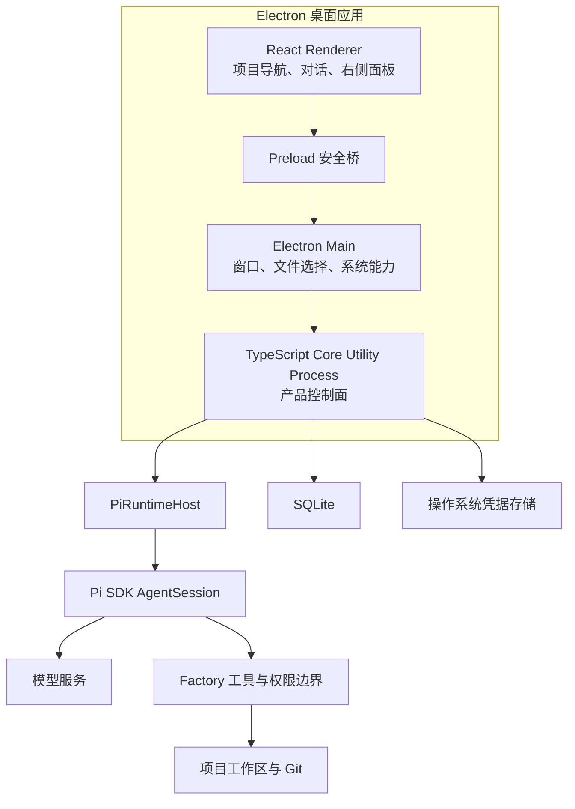

# SDLC Factory 整体设计方案

状态：当前唯一权威方案

日期：2026-08-07

运行时决策：Pi SDK

## 1. 设计结论

SDLC Factory 重构为本地优先的 Electron 桌面研发工作台。产品围绕项目内持续多轮对话展开，用户通过显式 `/sdlc-*` 命令发起需求、设计、编码、测试和审核工作；系统根据项目事实提示当前缺口，但不建设强制阶段门禁。

最终架构采用以下决策：

- Pi SDK 是首版唯一 Agent 运行时，不建设 OpenCode、Codex、Claude Code 等多 CLI 适配层。
- Open Design 只参考项目导航、对话时间线、输入框、附件、模型选择和右侧项目面板等交互，不复用其 daemon、多 CLI 探测和运行时编排。
- Factory Core 是项目、权限、审核、基线和产品持久化的唯一权威；Pi 只负责模型调用、Agent Loop、工具调用编排和上下文管理。
- 对话不绑定流程。每次执行 `/sdlc-*` 命令前，Core 只解析当前项目事实，AI 据此提示缺口和推荐命令。
- 阶段提示不阻止用户继续。只有命令缺少不可替代输入，或者涉及安全、数据完整性、审核和基线事务时，当前操作才停止。
- AI 不能决定正式完成、推进项目阶段、批准审核或生成基线。
- 正式结果只有一条路径：工作内容 → 待审核版本 → 用户审核决定 → 不可变基线。

运行时选型的官方证据、性能问题和风险边界见[《Agent 运行时选型与 Pi SDK 研究记录》](../research/agent-runtime-selection-pi-sdk-2026-08-07.md)。

## 2. 总体架构



### 2.1 Electron Renderer

Renderer 只负责显示和用户交互，不直接访问 Node.js、Pi SDK、SQLite、文件系统或模型凭据。它通过 Preload 暴露的窄接口调用 Core，并订阅纯增量事件。

### 2.2 Electron Main 与 Preload

Main 负责窗口生命周期、系统文件选择、通知和 Core Utility Process 的启动与恢复。Preload 只暴露经过校验的项目、对话、输入、审核和事件订阅接口；禁用 Renderer 的任意 Node.js 能力。

### 2.3 TypeScript Core

Core 是本地唯一产品控制面，负责：

- 项目、工作目录和 Git 状态；
- 对话、消息、附件和本轮运行记录；
- Pi `AgentSession` 的创建、驻留、释放和恢复；
- 模型、推理强度和供应商配置；
- Factory 自定义工具及允许／询问／拒绝策略；
- `/sdlc-*` 命令、当前工作位置和缺口解析；
- 文件、变更、产物和证据索引；
- 待审核版本、审核决定和不可变基线；
- SQLite 事务、迁移、事件日志和性能指标。

Core 不建设通用工作流引擎，也不维护一套强制阶段状态机。

### 2.4 PiRuntimeHost

`PiRuntimeHost` 是 Factory 与 Pi SDK 之间唯一适配边界。它只负责：

- 创建和恢复 `AgentSession`；
- 设置本轮模型、推理强度、系统指令和附件；
- 把 Factory 自定义工具注册给 Pi；
- 把 Pi 事件转换成 Factory 的纯增量事件；
- 执行停止、超时和有界重试；
- 返回本轮结束原因、用量和性能指标。

Pi SDK 类型不能进入 Renderer、审核、基线和 SQLite 领域接口。Pi 升级只允许影响 `PiRuntimeHost` 及其兼容性测试。

## 3. Pi SDK 运行模型

### 3.1 一个对话对应一个 AgentSession

每个活跃对话维护一个长驻 `AgentSession`。同一对话的多轮输入复用该会话，不为每条消息启动 CLI 子进程，也不重复探测运行时。

活跃会话驻留 Core 内存；闲置后释放。Factory 保存恢复所需的 Pi 会话引用和运行时版本，应用重启后按原对话恢复。恢复失败时保留完整产品对话，由用户确认后建立新的 Pi 会话，不伪装成原生续接。

Pi 会话是模型上下文载体，不是项目流程、审核或基线事实。

### 3.2 模型和推理强度

输入框允许用户在每轮发送前选择可用模型和推理强度。Core 在运行开始时固化本轮配置，并写入运行记录。模型配置变化不得自动改变项目阶段、审核状态或基线。

模型目录由 Pi Provider 能力和用户已配置凭据共同确定。界面只显示当前真实可用的组合；失败时不得静默切换模型或供应商。

### 3.3 流式事件

Core 订阅 Pi SDK 的进程内事件，转换为以下产品事件：

- 文本增量；
- 思考状态摘要；
- 工具开始、进度、结果和失败；
- 文件变更和差异；
- 用户输入请求；
- 用量与性能指标；
- 本轮完成、等待用户、停止或失败。

事件必须只传输新增部分，禁止像旧 JSON CLI 模式一样反复序列化累计消息。Core 对 Renderer 实施背压和批量刷新，完整历史通过分页查询加载。

### 3.4 上下文与压缩

Pi 负责模型上下文窗口和自动压缩，Factory 负责保存完整原始对话和正式项目事实。压缩摘要只能作为后续模型输入，不能替代原消息、审核证据或基线正文。

稳定系统指令、项目规则和 Skill 说明保持可缓存前缀；只把本轮必要文件、附件和状态结果加入上下文，禁止每轮注入完整项目树、全部研究文档和无关历史。

## 4. Factory 受控工具

首版不直接暴露 Pi 默认的完整 `read`、`write`、`edit`、`bash` 工具集，而是由 Factory 注册自己的工具：

- `read`：读取授权工作区内的文件；
- `search`：按文件名和内容检索；
- `write`：创建或整体写入文件；
- `edit`：应用可审计补丁；
- `shell`：通过 Windows PowerShell 执行命令；
- `test`：执行项目声明的验证命令并记录结果；
- `git_status`、`git_diff`：只读获取真实变更；
- `sdlc_status`：读取当前工作位置、基线和明显缺口；
- `request_user_input`：向用户发起结构化选择；
- `submit_review`：创建待审核版本，不代表审核通过。

所有工具调用在真正执行前经过统一权限判断：

```text
允许：在当前授权范围内直接执行
询问：暂停本轮，等待用户确认
拒绝：不执行，并把原因返回给 AgentSession
```

文件工具必须限制在项目工作区和明确授权的附件目录。Shell 必须记录命令、工作目录、开始时间、退出码和停止原因，并能终止完整进程树。模型凭据保存在操作系统凭据存储中，不写入 SQLite、项目文件、提示词和普通日志。

## 5. 对话与桌面工作台

项目工作区保持三栏结构。

### 5.1 左侧项目导航

- 项目和最近对话；
- 当前选中的持续对话；
- 历史对话和分叉；
- 项目文件入口；
- 常用 `/sdlc-*` 命令。

### 5.2 中间多轮对话

- 用户和 AI 消息按时间平铺；
- 工具过程、文件变更、测试、预览和错误跟随对应回复；
- 历史过程默认折叠，当前过程展开；
- 输入框支持模型、推理强度、多个附件、拖放和粘贴；
- 用户可在流式执行时停止、追加指令或排队下一条输入；
- 审核卡直接出现在会话时间线中；
- 长会话使用分页和虚拟滚动，不一次渲染完整历史。

### 5.3 右侧项目面板

右侧面板支持隐藏、缩窄和页签切换，页签为：

- 概览；
- 文件；
- 变更；
- 产物；
- 证据；
- 审核与基线。

会话内卡片说明“本轮发生了什么”，右侧面板聚合“项目当前有什么”。两处读取同一 Core 事实，不维护两套状态。

## 6. 对话、命令与阶段提示

对话只是正常多轮交流，不绑定 Requirement、Design、Coding、Testing 等流程阶段，也不为消息增加可切换的工作上下文。

首批命令为：

- `/sdlc-init`：初始化项目规则和基础信息；
- `/sdlc-spec`：澄清需求、总体设计和能力单元边界；
- `/sdlc-code`：针对明确目标实施代码修改；
- `/sdlc-test`：执行验证并整理真实结果；
- `/sdlc-review`：固定当前精确内容并提交用户审核。

命令由对应 Skill 实现，不建设通用流程编排器。每次执行命令前统一采用以下过程：

```text
用户执行 /sdlc-* 命令
  → Skill 调用只读 sdlc_status
  → Core 根据项目文件、最近命令、待审核版本和基线解析当前工作位置
  → AI 说明尚未完成的内容和建议命令
  → 用户决定继续当前命令，或者自行执行建议命令
```

Core 不根据对话措辞判断阶段，不因上一阶段未完成而拒绝命令，也不在后台自动执行建议命令。

当前命令只有以下情况可以停止：

1. 命令目标或参数不存在；
2. 缺少当前命令不可替代的直接输入；
3. 操作违反安全、权限或数据完整性要求；
4. 审核或基线事务不满足一致性条件。

阶段只用于定位和建议，不是命令执行权限。

## 7. 审核与基线

面向用户统一使用“审核”，不使用 Gate 或门禁。领域语言只保留：

- 工作内容：仍在多轮对话和项目工作中持续修改的内容；
- 能力候选：尚未确定为正式能力单元的潜在业务能力；
- 能力单元：用户确认边界并纳入设计基线的独立交付能力；
- 待审核版本：`/sdlc-review` 固定下来的精确内容版本；
- 审核决定：用户作出的通过、驳回或暂缓；
- 基线：审核通过后形成的不可变权威结果。

```text
/sdlc-review
  → 固定正文、差异、证据引用和内容摘要
  → 在对话中显示审核卡
  → 用户查看并选择通过、驳回或暂缓
  → 通过时在同一事务中写入审核决定和新基线
```

AI 可以建议审核，可以整理待审核内容，但不能代替用户作出决定。一次 Agent 回复或 Pi 会话结束不表示工作完成，也不能自动形成基线。

## 8. 持久化边界

SQLite 保存产品实际需要的数据：

- 项目和工作目录；
- 对话、消息和附件；
- Pi 会话引用、运行时版本和恢复状态；
- 每轮模型、推理强度、状态、事件索引、用量和耗时；
- `/sdlc-*` 命令名称、开始时间、结束时间、结果和摘要；
- 项目文件索引、变更、产物和证据引用；
- 待审核版本、审核决定和基线。

`Conversation`、`Message` 和本轮运行记录只是实现聊天与恢复所需的技术数据，不进入 Factory 领域语言，也不承担阶段、审核或基线语义。

不保存：

- 对话绑定的生命周期阶段；
- 消息级流程上下文；
- 通用流程节点、分支和合并；
- 强制阶段迁移记录；
- 把聊天轮次包装成领域执行任务的结构；
- Pi 压缩摘要作为权威事实。

项目文件和 Git 是工作内容事实；SQLite 中的审核与基线是正式治理事实。两者通过内容摘要和精确文件引用关联。

## 9. 错误与恢复

- 同一对话同一时间只允许一个 Agent turn 执行；这是并发约束，不是流程门禁。
- 用户停止时，Core 中止 Pi 请求和正在执行的工具，并终止相关进程树。
- 网络、认证、模型或工具错误只结束本轮，不改变审核和基线。
- 已经产生的文本、工具结果和文件变更保留并明确标记状态，不伪装成完整成功。
- Pi 会话恢复必须校验对话、项目路径和运行时版本；校验失败时明确告知用户并建立新会话。
- 首次输出超时、空闲超时和总运行上限分别记录；只允许一次有界重试，且不得重放已经产生副作用的工具调用。
- 未运行、未知、超时、跳过和校验器异常不能记录为测试通过。
- 禁止无限自动重试和失败后静默切换模型或供应商。

## 10. 性能设计

首版从架构上避免已知慢路径：

- 使用进程内 Pi SDK，不为每轮输入启动 CLI；
- 活跃对话复用 `AgentSession`；
- 流式事件只发送增量，不通过 stdout 传输累计 JSON；
- 消息分页加载，Renderer 使用虚拟滚动；
- 文件索引增量更新，不因每个产物事件重扫完整项目树；
- 上下文按需组装，稳定前缀保持不变；
- Pi 自动压缩只影响模型上下文，不修改完整产品历史；
- 分别记录排队、上下文准备、模型首事件、生成、工具、持久化和渲染耗时。

在完整功能开发前必须完成 Pi SDK 性能与治理纵切。纵切使用同一模型、提示词和项目，对比 Pi SDK 与直接 CLI 的首轮和后续轮次，至少验证：

1. 后续轮次不会创建新的 CLI 进程；
2. 流事件的数据量随实际新增输出线性增长；
3. 停止能够终止模型请求和 Windows 工具进程树；
4. 应用重启后能够恢复对话，失败时能够明确降级为新会话；
5. 文件越界、危险命令和凭据访问能够触发询问或拒绝；
6. 性能数据可以区分框架开销与模型生成耗时。

性能纵切用于验证 Pi SDK 集成边界，不重新引入多运行时产品设计。

## 11. 外部项目参考边界

### 11.1 Open Design

只参考以下交互：

- 左侧项目导航、中间多轮对话和可收起右侧面板；
- 流式消息、工具过程、错误和文件变更的时间线表达；
- 模型选择、推理强度、附件上传和停止操作；
- 会话内卡片与右侧项目聚合视图的配合。

不复用 daemon、多 CLI 注册表、CLI 探测、CLI 参数构造、JSON 输出解析、原生 CLI 会话恢复、Atom Pipeline、Memory 和 Plugin 运行时。源码事实与风险见[《Open Design 官方源码审计》](../research/open-design-official-source-audit-2026-08-06.md)。

### 11.2 Claude Code Game Studios

只参考以下工作方式：

- Slash Command 显式触发工作；
- 执行前读取项目阶段和产物事实；
- AI 列出未完成事项并推荐具体命令；
- 用户决定继续还是返回补充；
- 推荐命令不自动执行，不建设全局阶段拦截器。

源码事实见[《Claude Code Game Studios 工作流引导机制审计》](../research/claude-code-game-studios-workflow-guidance-audit-2026-08-06.md)。

### 11.3 Multica

Multica 是面向 Issue、任务队列、智能体和本地 CLI 的团队调度平台，会增加服务端、守护进程和任务工作区，并不能消除底层模型或 CLI 延迟。其许可证还对商业嵌入、对外托管和品牌移除设有附加条件，因此不进入 Factory 架构，也不作为实现来源。证据见[《Agent 运行时选型与 Pi SDK 研究记录》](../research/agent-runtime-selection-pi-sdk-2026-08-07.md)。

## 12. 验收标准

新版方案实现后必须可以真实演示：

1. Electron 应用创建或打开本地项目，并进入持续多轮对话。
2. 同一对话由长驻 Pi `AgentSession` 连续处理多轮，应用重启后可恢复。
3. 输入框可以选择真实可用的模型和推理强度，并上传多个文件。
4. 文本、工具、文件变更、测试和错误按时间线增量显示，长会话不会一次加载全部历史。
5. 文件和 Shell 工具严格限制在授权范围，危险操作会询问或拒绝。
6. 设计未完成时执行 `/sdlc-code`，AI 能列出具体缺口并推荐 `/sdlc-spec` 或 `/sdlc-review`。
7. 用户选择继续后，Core 不以阶段顺序拒绝 `/sdlc-code`。
8. `/sdlc-review` 能固定精确内容，只有用户通过才形成不可变基线。
9. AI 回复、Pi turn 结束、工具成功或测试完成都不能自动推进阶段或形成基线。
10. 左侧项目导航保留，中间为平铺多轮对话，右侧面板可切换文件、变更、产物、证据和审核基线。
11. 网络、模型、Pi 会话或工具失败后，已有对话、文件变更、审核和基线均可解释、可恢复。
12. 当前代码和文档中不存在多 CLI 注册表、强制阶段门禁、消息流程上下文或聊天轮次领域化设计。

## 13. 首版不做

- 多运行时选择和 CLI 自动探测；
- Codex、OpenCode、Claude Code CLI 兼容适配器；
- Multica 式团队任务平台、服务端队列和远程 Agent；
- 多用户、组织和远程协作；
- 云端 Factory 控制平面；
- 自定义生命周期或可视化流程编排；
- 后台自动执行下一条 `/sdlc-*` 命令；
- 自动从任意对话判断正式完成；
- 通用插件市场、复杂记忆治理和评分流水线。

首版只验证一个闭环：

> 本地项目持续对话 → `/sdlc-*` 命令工作 → AI 提示当前缺口 → 用户决定继续 → 显式审核 → 形成不可变基线。
