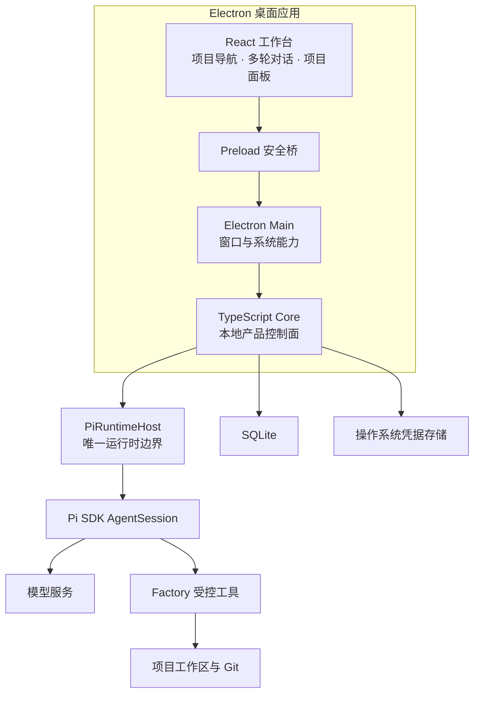

# SDLC Factory 重构方案

状态：待用户复核

日期：2026-08-07

运行时决策：Pi SDK

设计记录：[2026-08-06 至 2026-08-07 重构讨论记录](../design-records/2026-08-06-to-07-reconstruction/README.md)

## 1. 本方案解决什么

SDLC Factory 是本地优先的 Electron 桌面研发工作台。它让用户围绕一个本地项目持续进行多轮对话，并用显式 `/sdlc-*` 命令调用需求、设计、编码、测试和审核能力。

本方案首先满足以下已经确认的需求：

1. 桌面工作台保留左侧项目导航、中间对话区和右侧项目面板。
2. 对话是长期、连续、平铺的多轮时间线，不要求智能体在一轮内完成全部工作。
3. 对话不绑定流程，消息不携带可切换的流程上下文。
4. 用户通过 `/sdlc-*` 命令显式触发正式研发工作，普通对话不会自动推进流程。
5. 命令开始时，Core 根据项目事实解析当前工作位置、最近执行情况和明显缺口。
6. AI 在普通回复中说明缺口并推荐命令，用户仍可选择继续当前命令；系统不增加阶段拦截层。
7. 输入框支持选择模型、选择推理强度、上传多个文件、拖放和粘贴。
8. 文件变更、测试、预览、产物和错误跟随对应回复显示；右侧面板提供跨轮次聚合视图。
9. AI 回复结束、工具成功或一次运行结束都不能代表流程完成，也不能自动形成正式结果。
10. 只有显式提交审核、用户作出决定并通过，才能形成不可变基线。
11. 首版使用 Pi SDK，避免每轮启动 CLI、累计 JSON 流和多运行时适配带来的复杂度与性能风险。
12. Open Design 已实现的成熟交互和小型独立代码可以适当迁移，但不照搬其完整产品和多 CLI daemon。

在用户完成本轮文档复核前，本文件是待确认的重构方案，不是已经冻结的实施合同。

## 2. 明确删除的复杂度

新版不再继承 v1.2，也不实现早期讨论稿中的以下设计：

- 对话与需求、设计、编码、测试阶段强绑定；
- 消息级“工作上下文”或用户可切换的流程作用域；
- Core 命令拦截层、独立阶段警告卡和越级拒绝；
- 从任意聊天文字推断流程已经开始或已经完成；
- 通用工作流引擎、阶段分支合并和可配置生命周期；
- 把每条消息包装成领域任务、Invocation、Attempt、ExecutionRun 或 Handoff；
- OpenCode、Codex、Claude Code 等多 CLI 注册、探测、参数翻译和恢复适配；
- 为附件增加用户可见的“受治理输入区”；
- 把“本轮完成”“测试通过”或“智能体认为完成”当成审核通过；
- 先建立复杂资源、插件和记忆治理平台，再验证核心闭环。

其中，对话、消息、本轮运行等记录仍是实现聊天、流式显示和恢复所必需的技术数据，但不进入 Factory 领域语言，也不承担流程、审核或基线语义。

## 3. 总体架构



### 3.1 Electron 工作台

Renderer 只负责显示和交互，不直接访问 Node.js、Pi SDK、SQLite、文件系统或模型凭据。Preload 只暴露经过校验的项目、对话、输入、文件、审核和事件订阅接口。

Electron Main 负责窗口生命周期、文件选择、系统通知、操作系统集成，以及 Core 的启动、停止和恢复。

### 3.2 TypeScript Core

Core 是本地唯一产品控制面，负责：

- 打开、创建和管理项目工作区；
- 保存完整多轮对话及每轮真实状态；
- 管理 Pi 会话、模型、推理强度和供应商配置；
- 注册受控文件、Shell、测试、Git 和项目状态工具；
- 在 `/sdlc-*` Skill 开始时解析当前工作位置与缺口；
- 索引项目文件、累计变更、产物、证据和后台进程；
- 创建待审核版本，保存用户审核决定并生成基线；
- 维护 SQLite 事务、迁移、事件日志和性能指标。

Core 不根据对话措辞自动改变流程，不建立通用阶段状态机，也不拦截用户选择继续执行的命令。

### 3.3 PiRuntimeHost

`PiRuntimeHost` 是 Core 与 Pi SDK 之间唯一适配边界，负责：

- 创建、复用、释放和恢复 `AgentSession`；
- 固定本轮模型、推理强度、系统指令、附件与工具；
- 把 Factory 工具注册给 Pi；
- 把 Pi 事件转换为 Factory 的增量事件；
- 执行停止、超时和有界重试；
- 返回本轮结束原因、用量和性能数据。

Pi SDK 类型不能进入 Renderer、审核、基线和 SQLite 领域接口。以后即使更换 Agent 运行时，也只允许替换 `PiRuntimeHost`，不能改写产品事实。

## 4. 桌面工作台

### 4.1 左侧项目导航

左侧保留：

- 项目和当前项目入口；
- 项目内持续对话和历史对话；
- 项目文件入口；
- 常用 `/sdlc-*` 命令；
- 需要时显示分叉或历史，但不把它们包装成流程节点。

### 4.2 中间多轮对话

中间区域是一条长期时间线：

- 用户消息与 AI 回复按时间平铺；
- 当前轮的思考摘要、工具过程、文件变更、测试和预览可展开；
- 历史轮次默认收起过程，但保留结果与状态；
- 一轮可以结束为完成、等待用户、部分完成、中断、停止或失败；
- 后续输入继续同一对话，不要求上一轮产出完整候选；
- 审核卡出现在相关对话位置，并可跳转到右侧审核详情；
- 长对话分页加载并使用虚拟滚动。

会话内卡片回答“这一轮发生了什么”，不承担项目全局汇总。

### 4.3 右侧项目面板

右侧面板回答“项目当前有什么”，支持隐藏、缩窄、覆盖打开和页签切换。首版页签为：

- 概览；
- 文件；
- 变更；
- 产物；
- 证据；
- 审核与基线。

宽屏同时显示三栏；中等宽度默认收起右栏并覆盖打开；窄屏把左右两栏收进抽屉。会话卡和右侧面板读取同一份 Core 事实，不保存两套状态。

### 4.4 输入框

输入框必须支持：

- 普通文本和 `/` 命令补全；
- 每轮发送前选择真实可用的模型；
- 每轮发送前选择该模型支持的推理强度；
- 多文件选择、拖放、粘贴和移除；
- 流式执行中的停止；
- 必要时追加下一条消息或排队输入。

发送时 Core 固定本轮实际模型、推理强度、附件版本和内容摘要。失败时不得静默切换模型、供应商或推理强度。

### 4.5 附件与项目文件

附件不建立用户可见的独立治理区域：

1. 用户选择、拖放或粘贴文件；
2. 文件像 Open Design 一样进入项目文件视图，并跟随当轮消息显示附件芯片；
3. 后续轮次可以通过文件视图或 `@` 再次引用；
4. Core 在后台记录来源消息、文件版本、顺序、大小、类型和内容摘要；
5. 路径越界、超限或无法读取必须明确提示，不能静默忽略。

## 5. 多轮对话与运行时

一个活跃对话复用一个 Pi `AgentSession`，避免每轮启动 CLI 和重复探测。Pi 会话只是模型上下文载体，不是 Factory 流程状态。

Factory 保存完整原始对话、文件事实、审核和基线；Pi 负责模型上下文窗口和压缩。Pi 的压缩摘要只能用于后续模型输入，不能替代原消息、审核证据或基线内容。

应用重启后，Core 尝试恢复相应 Pi 会话。恢复失败时：

- 完整产品对话和项目文件仍然保留；
- 界面明确说明原生会话无法续接；
- 经用户确认后建立新 Pi 会话并从必要上下文继续；
- 不伪装成原生恢复成功。

同一对话同一时间只运行一个模型轮次。这是防止并发写入的技术约束，不是流程门禁。用户可以停止当前轮次后执行其他命令，或者把下一条输入排队。

## 6. `/sdlc-*` 命令与柔性提示

普通对话不自动进入正式流程。正式研发能力由用户显式执行命令触发：

- `/sdlc-init`：初始化项目规则和基础信息；
- `/sdlc-spec`：澄清需求、总体设计和能力单元边界；
- `/sdlc-code`：围绕明确目标修改代码；
- `/sdlc-test`：执行验证并整理真实结果；
- `/sdlc-review`：固化待审核版本并请求用户决定。

每条命令由对应 Skill 实现，不建设通用流程编排器。统一交互如下：

```text
用户执行 /sdlc-* 命令
  → 对应 Skill 开始
  → Skill 调用只读项目状态工具
  → Core 根据项目文件、最近命令、运行状态、待审核版本和基线解析当前工作位置
  → AI 在普通回复中列出明显缺口、风险和建议命令
  → 用户选择继续当前命令，或者自行执行建议命令
```

这里的“当前工作位置”是 Core 根据真实项目事实给出的解释和提示，不是强制阶段状态。Core 不根据聊天内容猜测阶段，不自动执行推荐命令，也不因上一阶段未完成而拒绝当前命令。

例如设计尚未确认时执行 `/sdlc-code`，AI 应说明未完成的能力单元边界和审核，并建议 `/sdlc-spec` 或 `/sdlc-review`；用户回复“继续”后，当前 Skill 继续执行。

命令仅在以下情况停止，而不是提供“仍然执行”：

1. 当前模型轮次仍在运行，必须先等待或停止，避免并发写入；
2. 命令目标或必要参数不存在；
3. 缺少该命令不可替代的直接输入；
4. 操作违反文件范围、权限、安全或数据完整性要求；
5. 审核与基线事务无法满足一致性条件。

这些是执行安全和事务约束，不是阶段顺序约束。

## 7. 能力单元、审核与基线

面向用户只保留必要概念：

- **能力候选**：对话中发现但边界尚未确认的潜在业务能力；
- **能力单元**：通过对话或结构化用户输入确认边界的独立交付能力；
- **工作内容**：仍在多轮对话和项目工作区持续修改的内容；
- **待审核版本**：`/sdlc-review` 固定下来的精确正文、差异、文件版本和证据引用；
- **审核决定**：用户作出的通过、驳回或暂缓；
- **基线**：审核通过后形成的不可变权威结果。

能力候选不是“被冻结的 CU”，确认能力单元也不等于审核通过。真正被固定的是某次提交的待审核版本；只有用户通过后，系统才创建并启用基线。发布如果以后需要，是基线之后的独立动作，不能与审核通过混为一谈。

```text
/sdlc-review
  → 固定待审核正文、差异、证据引用和内容摘要
  → 在会话中显示审核卡
  → 用户查看并选择通过、驳回或暂缓
  → 通过时在一个 SQLite 事务中写入审核决定和不可变基线
```

AI 可以整理待审核内容、指出风险并建议审核，但不能代替用户作出决定。模型回复结束、Pi turn 结束、文件写入成功或测试通过都不能自动形成基线。

## 8. 持久化边界

SQLite 只保存产品真实需要的数据：

- 项目与工作目录；
- 多轮对话、消息、附件引用和本轮状态；
- Pi 会话引用、运行时版本和恢复状态；
- 每轮模型、推理强度、事件索引、用量和耗时；
- `/sdlc-*` 命令名称、开始时间、结束状态和摘要；
- 文件索引、累计变更、产物、证据和后台进程引用；
- 待审核版本、审核决定和基线。

不保存或不引入：

- 对话绑定的生命周期阶段；
- 消息级流程上下文；
- 泛化流程节点、分支和合并；
- 强制阶段迁移记录；
- 把聊天轮次领域化的任务层；
- 把 Pi 压缩摘要当作权威事实。

项目文件与 Git 保存工作内容事实；SQLite 保存交互、运行记录以及正式审核和基线事实。待审核版本通过内容摘要和精确文件引用连接两者。

## 9. 工具、权限与安全

Factory 向 Pi 注册受控工具，而不是直接开放无限制的文件系统和 Shell：

- 读取与搜索；
- 创建与补丁编辑；
- PowerShell 命令；
- 测试执行；
- Git 状态与差异；
- 只读项目状态；
- 结构化用户输入；
- 创建待审核版本。

所有工具调用执行前经过允许、询问或拒绝判断。文件操作限制在用户授权工作区及明确授权的外部文件；Shell 记录命令、工作目录、时间、退出码和停止原因，并可终止完整 Windows 进程树。

模型凭据保存在操作系统凭据存储中，不进入 SQLite、项目文件、提示词、设计记录或普通日志。

## 10. 错误、恢复与真实性

- 网络、认证、模型、Pi 或工具错误只结束当前轮次，不改变审核和基线。
- 已产生的文本、工具结果和文件变更必须保留并标记为部分完成、中断或失败。
- 等待用户不是失败，后续输入继续同一对话。
- 只允许不会重放副作用的一次有界恢复重试；禁止无限自动重试。
- 未运行、未知、超时、跳过和校验器异常都不能记录为测试通过。
- 文件变更、测试和证据必须来自真实工具结果，不能由 AI 文本声明替代。

## 11. 性能边界

首版通过以下方式避免已经识别的慢路径：

- 使用进程内 Pi SDK，不为每轮创建 CLI 子进程；
- 活跃对话复用 `AgentSession`；
- 流式事件只发送新增部分，不反复传输累计 JSON；
- 对话分页加载，界面使用虚拟滚动和批量刷新；
- 文件索引增量更新，不因每个事件扫描完整项目树；
- 只装配本轮必要上下文，稳定系统指令保持可缓存前缀；
- 分别记录排队、上下文准备、模型首事件、生成、工具、持久化和渲染耗时。

Pi SDK 的选型依据、性能疑虑与验证要求见[《Agent 运行时选型与 Pi SDK 研究记录》](../research/agent-runtime-selection-pi-sdk-2026-08-07.md)。

## 12. Open Design 代码参考边界

Open Design 是界面与交互实现的重要参考，不再是运行时架构模板。

可以在固定上游提交、核对许可证并保留修改说明后，优先迁移或改写以下小型、边界清晰的实现：

- 模型与推理强度选择器；
- 文件选择、拖放、粘贴和附件芯片；
- 消息、工具过程、差异和错误的呈现方式；
- 右侧面板的折叠、页签和响应式行为；
- 与 Pi 事件合同相容的流式状态机和小型工具函数。

不整文件照搬强耦合的大型聊天组件，也不迁移：

- daemon 与多 CLI 注册表；
- CLI 探测、参数构造和累计 JSON 解析；
- 原生 CLI 会话恢复模型；
- Open Design 的产品数据库、Artifact Pipeline、Memory 和 Plugin 运行时；
- 自动批准、权限绕过或缺失信号视为成功的逻辑。

详细源码事实见[《Open Design 官方源码审计》](../research/open-design-official-source-audit-2026-08-06.md)。原始讨论和各版界面见[重构讨论记录](../design-records/2026-08-06-to-07-reconstruction/README.md)。

## 13. Claude Code Game Studios 参考边界

只参考其工作方式：

- Slash Command 显式触发；
- Skill 开始时读取项目状态；
- AI 说明缺口并推荐具体命令；
- 用户决定继续还是返回补充；
- 推荐命令不自动执行，也不建设全局阶段拦截器。

源码分析见[《Claude Code Game Studios 工作流引导机制审计》](../research/claude-code-game-studios-workflow-guidance-audit-2026-08-06.md)。

## 14. 验收标准

方案实施后必须能够真实演示：

1. Electron 应用创建或打开本地项目，并进入持续多轮对话。
2. 左侧项目导航、中间平铺时间线和可收起右侧面板完整可用。
3. 同一对话复用 Pi `AgentSession`，应用重启后尝试恢复，失败时明确降级。
4. 输入框可选择真实可用的模型和推理强度，并上传多个文件。
5. 附件成为项目文件，后续可再次引用，后台能追溯来源和版本。
6. 文本、工具、文件变更、测试、预览和错误按轮次增量显示。
7. 右侧面板跨多轮聚合文件、变更、产物、证据、审核和基线。
8. 设计未完成时执行 `/sdlc-code`，AI 能说明具体缺口并推荐 `/sdlc-spec` 或 `/sdlc-review`。
9. 用户选择继续后，Core 不以阶段顺序拒绝 `/sdlc-code`。
10. 一轮结束为等待用户、部分完成、中断或失败后，可以在同一对话继续。
11. `/sdlc-review` 固定精确待审核版本，只有用户通过才形成不可变基线。
12. AI 回复、Pi turn、工具成功或测试通过都不能自动推进流程或形成基线。
13. 文件越界、危险命令和凭据访问会询问或拒绝，并留下真实记录。
14. 代码和正式文档中不存在多 CLI 注册表、强制阶段门禁、消息流程上下文或聊天轮次领域化设计。

## 15. 首版闭环

首版只验证：

> 本地项目持续多轮对话 → 用户显式执行 `/sdlc-*` → AI 根据 Core 项目事实提示缺口 → 用户决定继续 → 形成待审核版本 → 用户审核 → 不可变基线。

多运行时、远程 Agent、多用户协作、通用插件市场、可配置生命周期、自动流程推进和云端控制面均不进入首版。
