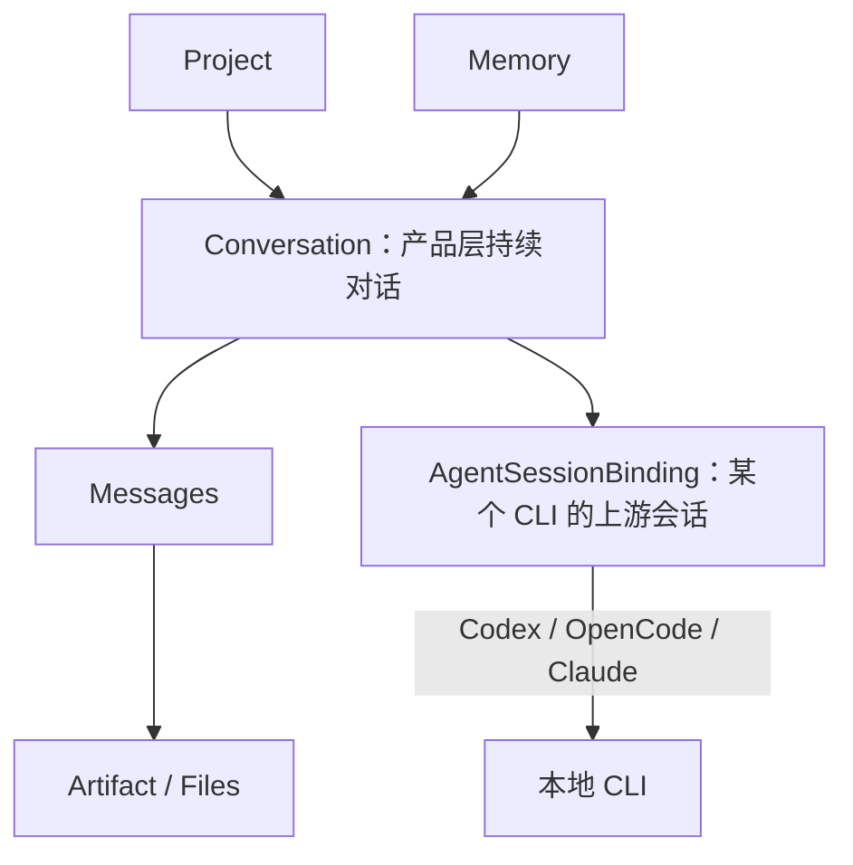
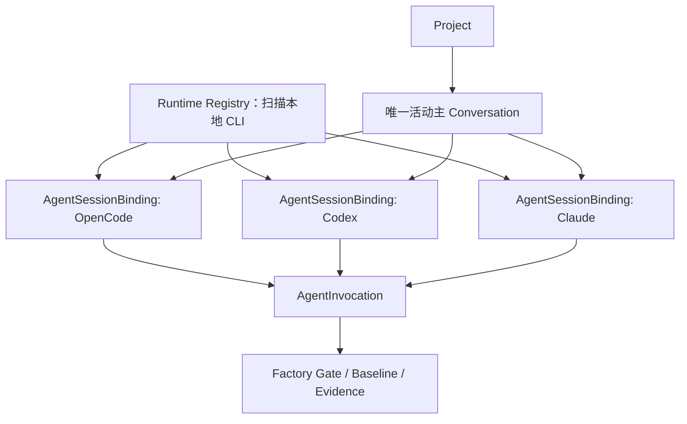

分析结论：Open Design 的整体理念非常值得 Factory 借鉴，但应借鉴它的“会话与执行器解耦、原生能力优先、项目持续工作区、分层记忆”，不能照搬其弱治理的 Artifact 工作流。

## 1. Open Design 确实是开源项目

Open Design 官方仓库为 `nexu-io/open-design`，使用 Apache-2.0。其定位是本地优先、Agent-native 的设计工作区，桌面端只是本地 daemon/CLI 的界面层。[官方仓库说明](https://github.com/nexu-io/open-design/blob/main/README.md)

它支持 Codex、OpenCode、Claude Code 等多种本地 CLI，并通过统一 daemon、Skill 和 MCP 层调用；官方当前列出了 25 种本地 CLI 执行器。[CLI 支持列表](https://github.com/nexu-io/open-design/blob/main/README.md#platform-compatibility)

但需要区分：

- 开源的是本地运行时、CLI、Skills、设计系统、插件体系和桌面端。
- Open Design Cloud 是独立托管服务，不能简单等同于“全部云端实现也开源”。
- 本地安装包还配置了遥测端点；Factory 如果参考，需要继续保持自己的数据、权限与审计边界。

你本地安装的是 Open Design `0.18.0`，与当前官方 Release 一致。[0.18.0 Release](https://github.com/nexu-io/open-design/releases)

## 2. 它真正值得借鉴的不是 UI，而是分层

Open Design 的核心判断是：不再造一个 Agent，而是把产品做成薄的 Skill、Design System、Plugin 和 Adapter 层，复用用户已有的 Codex、OpenCode 或 Claude Code。[官方设计理念](https://open-design.ai/blog/why-we-built-open-design-as-a-skill-layer/)

本地数据库实际结构进一步证明了这一点：

````

````

关键不是“项目直接绑定一个 OpenCode Session”，而是：

- 项目拥有产品层 `Conversation`。
- `Conversation` 再按 `agent_id` 绑定底层 CLI Session。
- 消息属于 Conversation。
- 单次执行可以拥有 `run_id`，但 Conversation 不等于 Run。
- 更换 CLI 不需要销毁项目和对话，只需要建立新的底层 Agent Session 绑定。

这比当前 Factory 合同中：

```
FactorySession → opencode_session_id
```

更合理、更具扩展性。

## 3. “一个项目一个主会话”需要准确理解

本地现有 6 个 Open Design 项目，每个确实都只有一个 Conversation；UI 也是“打开项目即进入一条持续对话”。

但数据库没有 `project_id` 唯一约束，界面还存在：

- 对话历史；
- “从这里分叉”；
- 多条用户消息导航；
- 按 Agent 保存不同的底层 Session。

所以其准确语义是：

> 一个项目拥有一个默认、持续、当前的主对话工作面，但可以有历史、分叉和不同 Agent 的底层会话绑定。

Factory 应采用更严格的版本：

```
Project
└─ 唯一 ACTIVE ProjectMainConversation
   ├─ Requirement / Design 连续对话
   ├─ 历史分叉，只读
   ├─ RuntimeSessionBinding(OpenCode)
   ├─ RuntimeSessionBinding(Codex，可选)
   └─ CU Child Sessions
```

数据库可以用部分唯一索引保证每个项目只有一个活动主会话，而不是禁止所有历史 Conversation。

## 4. 当前 Factory 合同建议进一步修订

现有 `FactorySession` 直接要求 `opencode_session_id`，这与“可选择 CLI”的目标存在冲突。

建议拆成两个合同：

### ProjectMainConversation

产品层稳定身份：

- `conversation_id`
- `project_id`
- `conversation_type`
- `current_stage`
- `state`
- `parent_conversation_id`
- `current`
- `archived`

### RuntimeSessionBinding

执行器层会话：

- `binding_id`
- `conversation_id`
- `runtime_kind`
- `agent_id`
- `upstream_session_id`
- `model`
- `cwd`
- `stable_prompt_hash`
- `last_message_id`
- `resume_capability`
- `state`

这样可以做到：

- 当前 MVP 仍然只实现 `OpenCode SDK Adapter`。
- 合同不再把 OpenCode 焊死在领域模型中。
- 未来增加 Codex CLI Adapter 时不修改 Project、Gate、Baseline。
- CLI 切换必须显式执行，不能在调用失败时静默换模型或换执行器。
- 切换执行器后创建新 Binding；不能假装不同 CLI 共享了同一个原生上下文。

我不建议现在直接把 OpenCode SDK 改成 CLI 调用。更合理的是保留：

```
Spring Boot Control Plane
→ Host Adapter SPI
→ OpenCode SDK Adapter（当前生产实现）
→ Codex/OpenCode CLI Adapter（未来通过 TCK 后启用）
```

Renderer 仍然不能直接启动 CLI。

## 5. Run 语义也可以借鉴其分层

Open Design 的 Message 可以关联 `run_id`，但 Conversation 与 Agent Session 都是独立实体。

Factory 应继续区分：

- `Message`：用户或 Agent 的对话内容。
- `AgentInvocation`：一次模型/工具调用，可失败、取消、重试。
- `ExecutionRun`：编码、测试、初始化、系统验收等受控执行边界。
- `StageSubmission`：需求或设计候选提交。
- `Gate/Baseline`：人工裁决和权威事实。

因此普通消息可以产生一次 `AgentInvocation`，但不能自动产生 `ExecutionRun`、Gate 或 Baseline。这正好解决此前“每发一条消息就创建 Run”的错误设计。

## 6. 记忆功能值得采用，但必须增加治理

你本地 Open Design 的记忆配置当前是：

- Memory：启用；
- Profile：启用；
- Rewrite：启用；
- Verify：启用；
- Chat Auto Extraction：关闭。

这个默认组合其实很合理：记忆可以参与上下文，但不应把每次聊天自动沉淀成永久事实。

Factory 建议采用四层记忆：

| 层级                 | 内容                             | 权威性               |
| -------------------- | -------------------------------- | -------------------- |
| UserProfileMemory    | 表达偏好、技术偏好、操作习惯     | 非项目事实           |
| ProjectMemory        | 项目术语、长期约束、已确认惯例   | 必须有来源和验证时间 |
| SessionWorkingMemory | 当前阶段摘要、开放问题、Todo     | 可重建、非基线       |
| Baseline             | 已批准需求、设计、代码、测试事实 | 唯一权威来源         |

必须保持：

- Memory 不能覆盖 Baseline。
- 对话自动提取只能生成 `PROPOSED` Memory。
- 经人工确认或确定性验证后才能进入 `ACTIVE`。
- Memory 需要来源、Hash、`verified_at`、失效条件和 `SUPERSEDED` 状态。
- 阶段切换时压缩会话上下文，但不销毁主 Conversation。
- 执行器切换时通过 Factory 组装可移植 Memory，不能依赖某个 CLI 私有记忆自动迁移。

## 7. 页面可以直接借鉴的结构

本地 Open Design 页面值得参考：

- 首页：最近项目、工作目录、执行器/模型、能力类型、设计体系。
- 项目以 Workspace Tab 打开，而不是每次跳转到完全不同页面。
- 一个项目默认一条主对话工作面。
- 对话历史用导航点定位，不把每轮执行变成一张巨大 Run 卡片。
- 工具调用默认折叠在 Agent 消息内。
- 失败内嵌显示，保留已完成工具结果，允许继续对话恢复。
- 当前产物以文件卡片呈现。
- 支持从某条消息分叉。
- Agent、模型、Plugin 在会话头部可见。

Factory 可以采用：

```
顶部：项目 Workspace Tabs

左栏：项目、主会话、Child Session、历史分叉
中栏：持续对话、Grilling、Todo、产物、Diff、人工 Gate
右栏：Lifecycle、Evidence、Baseline、Memory、Run 关联
```

但执行器选择不应放在每条消息输入框旁随意切换，建议放到项目配置或明确的“切换执行器”命令中，因为这会改变可恢复性、模型证据和权限边界。

## 最终建议

应当参考 Open Design，并继续修订当前方案：

1. 把 `FactorySession` 拆为产品层 Conversation 与执行器层 Session Binding。
2. 明确每项目唯一活动主 Conversation，允许历史和分叉。
3. 保留 OpenCode SDK 为当前唯一生产 Adapter，但让合同保持运行时中立。
4. 增加受治理的分层 Memory，而不是简单复制聊天记录。
5. 普通消息只形成 `AgentInvocation`，不形成 `ExecutionRun`。
6. UI 参考 Open Design 的持续对话、项目标签、历史导航、内嵌工具轨迹和产物卡片。
7. Gate、Baseline、Evidence、错误恢复继续由 Factory 加固，不能退化成普通聊天确认。

这会比当前“FactorySession 直接绑定 OpenCode Session”的合同更准确，也是下一轮合同修订最优先的部分。

18:42

你有看github源码么？opendesign有个扫描本地cli，然后在其会话中就使用的是那个cli,而不是写死的。

18:46

Worked for 1分钟 42秒

你说得对。上一轮我的结论不够准确：当时没有完整审阅 GitHub 的运行时源码，只看了 README、本地安装包和数据库。刚才已经直接拉取并检查了官方源码。

Open Design 的真实机制是：

1. daemon 启动后遍历运行时注册表。
2. 扫描本机 `PATH`，探测每个 CLI 的：
   - 可执行文件
   - 版本
   - 登录状态
   - 可用模型
   - CLI 参数能力
3. UI 只展示检测可用的 CLI。
4. 每次对话请求携带用户选择的 `agentId`。
5. daemon 根据 `agentId` 找到对应 Adapter，以项目目录作为 `cwd` 启动该 CLI。
6. 捕获 CLI 原生 Session ID，下一轮继续同一个 CLI 原生会话。

对应源码：

- [CLI 扫描与能力探测](https://github.com/nexu-io/open-design/blob/main/apps/daemon/src/runtimes/detection.ts)
- [CLI Adapter 注册表](https://github.com/nexu-io/open-design/blob/main/apps/daemon/src/runtimes/registry.ts)
- [OpenCode CLI Adapter](https://github.com/nexu-io/open-design/blob/main/apps/daemon/src/runtimes/defs/opencode.ts)
- [Codex CLI Adapter](https://github.com/nexu-io/open-design/blob/main/apps/daemon/src/runtimes/defs/codex.ts)
- [原生 Session 恢复](https://github.com/nexu-io/open-design/blob/main/apps/daemon/src/agent-session-resume.ts)
- [Agent Session 合同](https://github.com/nexu-io/open-design/blob/main/packages/contracts/src/api/agent-sessions.ts)

OpenCode 的执行方式明确是：

```
首次消息：
opencode run --format json ...

捕获 OpenCode 返回的 sessionID

后续消息：
opencode run --format json -s <sessionID> ...
```

Codex 则使用：

```
首次消息：
codex exec ...

后续消息：
codex exec resume <thread_id> ...
```

最关键的数据关系是：

```
PRIMARY KEY (conversation_id, agent_id)
```

也就是说，同一条产品会话可以分别保存：

```
Conversation
├─ OpenCode Agent Session
├─ Codex Agent Session
├─ Claude Agent Session
└─ 其他本地 CLI Session
```

切换 CLI 时：

- 如果这个 CLI 在当前 Conversation 已有有效 Session，就恢复它。
- 如果第一次选择这个 CLI，就创建新 CLI Session，并用完整 Conversation Transcript 初始化上下文。
- 之后再次选择该 CLI，继续它自己的原生 Session。
- Model、`cwd` 或会话游标发生不安全变化时，不盲目 resume，而是重新播种上下文。

因此，我上一轮所说的“当前仍固定 OpenCode，只在未来预留其他 Adapter”和“执行器不宜在会话中选择”需要修正。参考 Open Design 后，Factory 更合理的目标应该是：

````

````

合同应调整为：

- 删除 `FactorySession.opencode_session_id` 这种单运行时硬绑定。
- 主体改为 `ProjectConversation`。
- 增加 `(conversation_id, agent_id)` 维度的 `AgentSessionBinding`。
- 增加本地 CLI 扫描结果 `RuntimeCapability`。
- 项目可以配置默认 CLI、允许的 CLI 和默认模型。
- 会话顶部允许显式切换 CLI/Model。
- 每次调用记录实际 `agent_id`、CLI 版本、模型、Session ID、`cwd` 和权限。
- 普通消息产生 `AgentInvocation`，仍然不产生 Factory 领域 `ExecutionRun`。
- Factory 的 Gate、Baseline、Evidence 不受切换 CLI 影响。

所以准确结论是：Open Design 不是“为每个 Agent 预留一个未来 Adapter”，而是已经实现了“扫描本机 CLI → 会话中选择 → 持久化该 CLI 原生 Session → 后续原生恢复”的完整运行机制。Factory 当前合同确实还没有达到这个设计。

18:48

关于openDesign的会话还有内置的技能插件又是什么实现的，能否照抄，请仔细分析其源码。

18:55

Worked for 3分钟 53秒

## 结论

我仔细核对了 Open Design 官方仓库当前提交 `9ce7b3a`。结论是：

> 可以复用它的 CLI 发现、原生会话续接、Skill 包格式、Plugin Manifest、不可变快照等机制；不能把整套会话、Prompt 编排和 Atom Pipeline 原样搬进 Factory。

尤其需要纠正一个认识：

> Open Design 虽然兼容原生 `SKILL.md`，但运行时并不是完全交给选中的 CLI 原生发现 Skill。它会由 daemon 读取 Skill 正文，再统一拼进 system prompt。

这与 Factory 当前确定的“OpenCode 原生 Skill tool 按需加载”存在本质差异。

本次只分析，没有修改仓库代码。

------

## 一、Open Design 的会话到底怎么实现

Open Design 实际上有三层对象：

```
Project
└─ Conversation                  Open Design 自己的持续对话
   ├─ Messages                   UI 展示的消息和工具事件
   ├─ Agent Session: OpenCode    OpenCode 原生 sessionID
   ├─ Agent Session: Codex       Codex 原生 thread id
   └─ Agent Session: Claude      Claude 原生 session id
```

### 1. Conversation 是持续的，Run 是一次调用

数据库中：

- 一个 Project 可以有多个 Conversation；
- 一个 Conversation 有连续 Messages；
- 每个 `(conversation_id, agent_id)` 对应一个原生 CLI Session；
- 所以它并不是数据库强制的“一个项目只能一个会话”，只是产品默认把主要 Conversation 当作项目工作区。

源码合同可见：

- [Conversation、Messages、Agent Session 表定义](https://github.com/nexu-io/open-design/blob/9ce7b3aeec5eb77300f7661562afda3e5935bd60/apps/daemon/src/db.ts#L163-L227)
- [Conversation 创建与从某条消息分叉](https://github.com/nexu-io/open-design/blob/9ce7b3aeec5eb77300f7661562afda3e5935bd60/apps/daemon/src/routes/project/conversations.ts#L81-L174)

Open Design 中每次发送消息仍会产生一次运行调用，但这只是“本轮 Agent 调用”，不是项目生命周期阶段完成。

因此映射到 Factory 时应当是：

| Open Design           | Factory                                  |
| --------------------- | ---------------------------------------- |
| Conversation          | Factory Session                          |
| 每轮 chat run         | AgentInvocation / InvocationAttempt      |
| CLI native session    | `opencode_session_id`                    |
| Plugin pipeline stage | 可选工作流提示，不是 LifecycleStage      |
| Fork conversation     | 新的分支 Session                         |
| Artifact              | CandidateArtifact / StageSubmission 产物 |

绝不能把 Open Design 的“每轮 run”直接映射为 Factory `ExecutionRun`。你之前指出的偏差是对的。

### 2. 它确实续接本地 CLI 原生会话

Open Design 启动时扫描已安装的 CLI：

- 注册表定义 Claude、Codex、OpenCode、Cursor、Gemini 类 CLI 等；
- 并发执行 executable、版本、认证、模型、能力探测；
- 用户在页面选中哪个 CLI，daemon 就使用对应 Adapter。

相关源码：

- [CLI Runtime 注册表](https://github.com/nexu-io/open-design/blob/9ce7b3aeec5eb77300f7661562afda3e5935bd60/apps/daemon/src/runtimes/registry.ts#L1-L79)
- [并发探测 Runtime](https://github.com/nexu-io/open-design/blob/9ce7b3aeec5eb77300f7661562afda3e5935bd60/apps/daemon/src/runtimes/detection.ts#L385-L415)

OpenCode Adapter 首轮执行：

```
opencode run --format json
```

捕获 OpenCode 返回的 `sessionID`，后续执行：

```
opencode run --format json -s <sessionID>
```

参见 [OpenCode Runtime Adapter](https://github.com/nexu-io/open-design/blob/9ce7b3aeec5eb77300f7661562afda3e5935bd60/apps/daemon/src/runtimes/defs/opencode.ts#L41-L87)。

### 3. 会话恢复保护值得照搬

Open Design 并非拿到 session id 就无脑续接。恢复前检查：

- Model 是否变化；
- CWD 是否变化；
- Conversation 是否已被其他 Agent 推进；
- 保存的上一条 Assistant Message 是否仍是当前游标；
- 稳定 Prompt 是否发生变化。

不满足条件就创建新的原生 Session，并用完整 Conversation Transcript 重新播种，而不是伪装成续接。

参见：

- [原生 Session Resume Guard](https://github.com/nexu-io/open-design/blob/9ce7b3aeec5eb77300f7661562afda3e5935bd60/apps/daemon/src/agent-session-resume.ts#L44-L127)
- [续接时只发送最新请求，重新建会话时发送完整历史](https://github.com/nexu-io/open-design/blob/9ce7b3aeec5eb77300f7661562afda3e5935bd60/apps/daemon/src/server.ts#L9489-L9658)

这部分非常适合 Factory Node Host Adapter。

但它解决的是“CLI Session 损坏或失效后的上下文恢复”，不是：

- Git 工作区回滚；
- StageSubmission 退回；
- Baseline 版本恢复；
- ExecutionRun 失败补偿。

Factory 仍需保留自己的 Git checkpoint、失败 Evidence、Stage 修订和 Baseline 影响传播。

------

## 二、内置 Skill 是怎么实现的

### 1. Skill 包使用标准 `SKILL.md`

标准目录结构：

```
skill-root/
├─ SKILL.md
├─ assets/
└─ references/
```

它兼容 Claude Code/Agent Skills 格式，同时增加可选的 `od:` frontmatter，包括：

- mode；
- surface；
- scenario；
- design-system；
- craft；
- critique policy；
- example prompt。

参见 [Skills Protocol](https://github.com/nexu-io/open-design/blob/9ce7b3aeec5eb77300f7661562afda3e5935bd60/docs/skills-protocol.md#L13-L121)。

Skill 来源优先级是：

```
用户安装 Skill
> Open Design 内置 Skill
```

同名用户 Skill 可以覆盖内置版本，但不会删除内置文件。每次列表请求重新扫描目录，不依赖重启。[扫描和覆盖实现](https://github.com/nexu-io/open-design/blob/9ce7b3aeec5eb77300f7661562afda3e5935bd60/apps/daemon/src/skills.ts#L229-L342)。

### 2. 关键差异：它不是纯 CLI 原生 Skill 加载

Open Design 实际执行链是：

```
扫描 SKILL.md
→ 解析 frontmatter
→ 获取完整 Markdown 正文
→ 合并 Design System / Craft / Memory / Plugin
→ 拼入统一 System Prompt
→ 发送给选中的 CLI
```

源码明确写着：

```
## Active skill — <skill-name>

Follow this skill's workflow exactly.

<完整 SKILL.md 正文>
```

参见：

- [Prompt Composer 的 Skill 设计](https://github.com/nexu-io/open-design/blob/9ce7b3aeec5eb77300f7661562afda3e5935bd60/packages/contracts/src/prompts/system.ts#L1-L30)
- [实际拼接 Active Skill](https://github.com/nexu-io/open-design/blob/9ce7b3aeec5eb77300f7661562afda3e5935bd60/apps/daemon/src/prompts/system.ts#L1171-L1208)
- [选择主 Skill 和组合多个 Skill](https://github.com/nexu-io/open-design/blob/9ce7b3aeec5eb77300f7661562afda3e5935bd60/apps/daemon/src/server.ts#L8150-L8262)

有 side files 时，它会把整个 Skill 复制到项目下：

```
<project>/.od-skills/<skill>/
```

然后在 Prompt 中告诉 Agent 文件的相对路径和绝对回退路径。[Side file staging 设计](https://github.com/nexu-io/open-design/blob/9ce7b3aeec5eb77300f7661562afda3e5935bd60/docs/skills-protocol.md#L123-L149)。

### 3. Factory 是否应该照抄

不应该照抄 Prompt 注入层。

Factory 当前合同明确要求：

- Skill 安装到 `.opencode/skills/<skill-id>/SKILL.md`；
- OpenCode 使用原生 Skill tool 按需加载；
- Java/Node 不复制完整 Skill 正文；
- Factory 只固定 Skill ID、版本、Hash、适用阶段和实际使用记录。

对应本地设计：[持续会话与原生 Skills](D:/workspace/sdlc-factory/docs/v1.2/02-continuous-sessions-and-native-skills.md)。

推荐复用：

- `SKILL.md + assets + references` 包格式；
- Skill 安装、校验和安全复制；
- 用户版本覆盖内置版本的思路；
- SemVer、来源、内容 Hash；
- Side file 路径安全；
- Workspace 级可见性；
- Skill 健康检查。

不复用：

- `skillBody` 全量拼接到固定 system prompt；
- 根据正文关键词推断 mode；
- Java/Node 决定 Skill 内部步骤；
- 把 Grilling、Brainstorming、Coding、Testing 再编码成平台流程。

------

## 三、Open Design 的 Plugin 是什么

Open Design Plugin 不是传统 Electron 插件，也不是 OpenCode Plugin。

它本质是：

```
Plugin
├─ SKILL.md                 Agent 工作方法
├─ open-design.json         声明式 Manifest
├─ assets/
├─ references/
└─ 可选 Pipeline / GenUI / MCP / Connector 声明
```

官方定义明确表示：

- 插件不挂载常驻 UI 进程；
- 不拥有自己的 `postMessage`/RPC 生命周期；
- 不直接执行任意 Node 入口；
- 它是被 Agent 消费的“意图、上下文和长任务工作流包”。

参见 [Plugin 设计定义](https://github.com/nexu-io/open-design/blob/9ce7b3aeec5eb77300f7661562afda3e5935bd60/docs/plugins-spec.md#L1-L30)。

### Plugin Apply 链路

```
安装 Plugin
→ 解析 SKILL.md / open-design.json
→ 校验输入
→ 解析 Skill、Design System、Craft、Asset、MCP、Atom 引用
→ 计算 Manifest SHA-256
→ 检查 Trust / Capability
→ 生成 AppliedPluginSnapshot
→ 绑定 Project / Conversation / Run
→ 拼入 Prompt
```

重要实现：

- [Manifest 校验和 capability vocabulary](https://github.com/nexu-io/open-design/blob/9ce7b3aeec5eb77300f7661562afda3e5935bd60/packages/plugin-runtime/src/validate.ts#L1-L93)
- [上下文引用解析](https://github.com/nexu-io/open-design/blob/9ce7b3aeec5eb77300f7661562afda3e5935bd60/packages/plugin-runtime/src/resolve.ts#L1-L172)
- [稳定 SHA-256 算法](https://github.com/nexu-io/open-design/blob/9ce7b3aeec5eb77300f7661562afda3e5935bd60/packages/plugin-runtime/src/digest.ts#L1-L49)
- [Apply 主流程](https://github.com/nexu-io/open-design/blob/9ce7b3aeec5eb77300f7661562afda3e5935bd60/apps/daemon/src/plugins/apply.ts#L91-L175)
- [不可变 Snapshot 持久化](https://github.com/nexu-io/open-design/blob/9ce7b3aeec5eb77300f7661562afda3e5935bd60/apps/daemon/src/plugins/snapshots.ts#L1-L174)

这套 `AppliedPluginSnapshot` 很值得 Factory 借鉴。它解决了：

- Plugin 升级后历史执行仍可重建；
- 输入值不会漂移；
- Skill/Asset/MCP/Atom 绑定可审计；
- Capability 授权可追踪；
- Run 可以固定使用的 Plugin 版本。

------

## 四、Plugin Pipeline 和 Atom 的真实成熟度

这是源码分析中最需要警惕的部分。

Open Design Plugin 可以声明：

```
discovery
→ plan
→ generate
→ critique
```

每个 Stage 由若干 Atom 组成，例如：

- `discovery-question-form`
- `todo-write`
- `file-read`
- `file-write`
- `patch-edit`
- `build-test`
- `diff-review`
- `handoff`

但是当前实现并没有做到“每个 Atom 都有独立、确定性的执行器和证据”。

源码明确显示：

- Agent loop 仍拥有实际阶段执行；
- 部分 Atom 只是 Prompt 片段；
- 没有真实 Worker 的 Atom 使用宽松默认结果；
- 默认信号包括 `critique.score=4`、`preview.ok=true`、`user.confirmed=true`；
- Atom Worker 报错会被记录成 note，但不会让 Stage 失败。

参见：

- [Pipeline Runner 的实际边界](https://github.com/nexu-io/open-design/blob/9ce7b3aeec5eb77300f7661562afda3e5935bd60/apps/daemon/src/plugins/pipeline-runner.ts#L1-L54)
- [Atom Registry 的宽松默认信号和错误吞并](https://github.com/nexu-io/open-design/blob/9ce7b3aeec5eb77300f7661562afda3e5935bd60/apps/daemon/src/plugins/atoms/registry.ts#L83-L141)
- [大量内置 Atom 实际注册为 permissive worker](https://github.com/nexu-io/open-design/blob/9ce7b3aeec5eb77300f7661562afda3e5935bd60/apps/daemon/src/plugins/atoms/built-ins.ts#L1-L68)

因此：

> Open Design Plugin Pipeline 适合设计生成、协作提示和创意任务，不适合作为 Factory 的 Requirement Gate、Design Gate、测试证据或 System Acceptance 权威执行器。

Factory 绝不能接受：

```
未观察到失败
= preview.ok true
= critique 4 分
= 阶段通过
```

Factory 必须坚持：

```
缺少证据
= UNKNOWN / NOT_PROVIDED
≠ PASSED
```

------

## 五、安全和安装机制能否复用

这部分总体值得复用。

Open Design 安装器包含：

- Local、GitHub、HTTPS tarball 来源；
- 下载大小限制，默认 50 MB；
- SHA-256 integrity；
- 拒绝 symlink/hardlink；
- archive staging；
- lockfile；
- restricted/trusted 两级信任；
- Capability 缺失时阻止 Apply；
- Snapshot 固定已授权能力。

但它也有一个 Factory 不应直接采用的策略：

> 本地安装的 Plugin 默认 `trusted`。

参见 [Trust 默认规则](https://github.com/nexu-io/open-design/blob/9ce7b3aeec5eb77300f7661562afda3e5935bd60/apps/daemon/src/plugins/trust.ts#L1-L75)。

Factory 更合理的是：

```
本地来源 ≠ 自动可信

可信状态 =
来源策略
+ 内容 Hash
+ 操作员批准
+ 项目权限范围
+ Runtime 能力限制
```

特别是 `bash`、`subprocess`、`network`、`fs:write`，不能因为文件来自本地目录就自动获得。

------

## 六、最终复用判断

| 模块                                  | 判断         | Factory 处理                              |
| ------------------------------------- | ------------ | ----------------------------------------- |
| CLI 扫描和 Runtime Registry           | 可直接借鉴   | 放入 Node Host Adapter                    |
| CLI Adapter 接口                      | 可借鉴       | 为 OpenCode/Codex/Claude 分别实现         |
| 原生 Session ID 捕获与续接            | 强烈建议复用 | 保持 `FactorySession ↔ nativeSessionId`   |
| Model/CWD/Message Cursor Resume Guard | 强烈建议复用 | 增加 Host Version 和 Project Revision     |
| Conversation Fork                     | 可改造       | Factory 中作为显式分支 Session，不是回滚  |
| `SKILL.md` 包格式                     | 可采用       | 保持 OpenCode 原生兼容                    |
| Skill 安装、版本、Hash、来源          | 可采用       | Spring Boot 保存权威登记                  |
| Skill 正文全量注入 Prompt             | 不采用       | OpenCode 原生 Skill tool 加载             |
| Plugin Manifest                       | 建议改造采用 | 定义 `factory-plugin.json` 或兼容子集     |
| AppliedPluginSnapshot                 | 强烈建议采用 | 改成 PostgreSQL 不可变事实                |
| Trust/Capability 模型                 | 改造采用     | 本地不得自动 trusted                      |
| Atom Pipeline                         | 不照抄       | 只能作为声明/建议，不能推进生命周期       |
| permissive 默认成功信号               | 严禁采用     | 未提供证据即非成功                        |
| Open Design Gate/GenUI                | 仅借鉴 UI    | Factory Gate 仍由 Spring Boot 合同执行    |
| 每条消息创建 Run                      | 不采用       | 映射为 AgentInvocation，不是 ExecutionRun |

------

## 七、建议的 Factory 落地结构

```
Spring Boot Control Plane
├─ Project / LifecycleStage
├─ StageSubmission / Gate / Baseline
├─ ExecutionRun / Evidence
├─ SkillDefinition / PluginDefinition
├─ AppliedCapabilitySnapshot
└─ PermissionGrant

Node/TypeScript Host Adapter
├─ RuntimeDetector
├─ RuntimeRegistry
├─ OpenCodeAdapter
├─ NativeSessionBinding
├─ ResumeGuard
└─ InvocationEventMapper

项目工作区
├─ .opencode/skills/
│  ├─ factory-requirement-grilling/
│  ├─ factory-design-grilling/
│  ├─ factory-cu-planning/
│  ├─ factory-coding/
│  └─ factory-testing/
└─ .factory/
   ├─ capabilities.lock.json
   └─ checkpoints/
```

Plugin 在 Factory 中建议只负责声明：

- 可用 Skill；
- AgentDefinition；
- PromptTemplate；
- RuleSet；
- Artifact Template；
- 确定性 Validator；
- MCP/工具需求；
- 权限需求；
- 适用 LifecycleStage。

它不能：

- 自行批准 Gate；
- 自行形成 Baseline；
- 把聊天回复当正式审核；
- 将 Atom 默认信号当 Evidence；
- 覆盖 Spring Boot 生命周期；
- 在未经批准时执行任意 Node/Java 扩展代码。

------

## 八、能否直接复制源码

许可证层面，Open Design 根仓库是 [Apache License 2.0](https://github.com/nexu-io/open-design/blob/9ce7b3aeec5eb77300f7661562afda3e5935bd60/LICENSE)，允许修改和商业使用，但需要保留许可证、版权和必要声明。

不过：

- `skills/`、`plugins/`、`design-templates/` 中存在大量独立 `LICENSE`；
- 不能因为根仓库是 Apache-2.0 就默认所有第三方 Skill 和素材都能一起复制；
- 品牌、商标、示例素材及外部移植内容需要逐包审计。

工程上建议采用：

> 复制少量成熟、独立、带测试的底层模块；架构模式可以参考，但不要 fork 整个 Open Design daemon。

最值得直接移植或重写的优先级是：

1. Runtime Registry 和本地 CLI 探测；
2. OpenCode/Codex/Claude 原生 Session Adapter；
3. Resume Guard；
4. Skill 安装与内容 Hash；
5. Plugin Manifest 解析、Digest、Lockfile；
6. Applied Capability Snapshot；
7. 安全归档解压。

明确不移植：

1. Open Design 的完整 system prompt；
2. Design/Craft/Skill/Plugin 多层 Prompt 堆叠；
3. permissive Atom Worker；
4. 每条消息的 Run 领域语义；
5. SQLite 权威状态；
6. Open Design 特定 Artifact/Canvas/Preview 生命周期。

所以最终答案不是“照抄 Open Design”，而是：

> 把它的 Host 层和资源分发层提炼出来；Factory 生命周期、证据、审核、基线和原生 OpenCode Skill 策略保持独立。