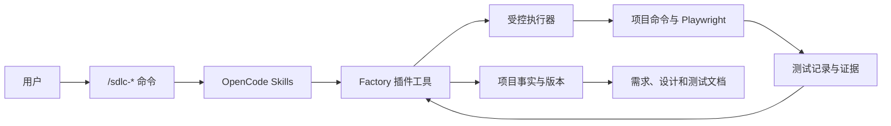

# 插件验证阶段总体设计

文档编号：DESIGN-01
状态：正式方案，等待实现
更新日期：2026-08-07

## 1. 目标

插件验证阶段使用 OpenCode 项目级插件、命令和 Skills，验证以下最小闭环：

1. 从真实资料建立产品概述和需求地图；
2. 按业务模块生成、审核和版本化需求；
3. 按同一业务模块生成设计和测试说明；
4. 按业务模块编码、执行单元测试和模块集成测试；
5. 记录外部接口、环境和真实测试证据；
6. 使用 Playwright 验证跨模块关键用户流程；
7. 形成可追溯的系统测试报告和系统验收版本；
8. 会话中断后从项目事实恢复，不依赖模型记忆。

本阶段不建设 Factory 自有桌面会话管理，不引入通用工作流引擎，也不保留旧的能力单元模型。

## 2. 设计原则

### 2.1 一套业务模块贯穿全流程

项目只维护一套业务模块划分。业务模块在需求阶段建立，并贯穿设计、编码和测试。

```text
业务模块
├─ 模块需求
├─ 模块设计
├─ 测试说明
├─ 代码和测试代码
└─ 测试结果
```

如果业务模块过大，必须在需求阶段经用户确认后拆分；后续阶段不得新建平行执行层级。

### 2.2 文档正文与结构化事实分离

Markdown 保存用户可读正文，包括需求、设计、测试说明和测试报告。结构化状态保存：

- 稳定编号；
- 修订号和父版本；
- 文件清单和 SHA-256；
- 依赖和作用范围；
- 候选、审核和已批准版本；
- 生命周期状态和执行记录；
- 测试记录和证据索引。

原始日志、截图、视频、Playwright 跟踪文件和二进制制品保存在证据目录，不复制进结构化状态或 Markdown 正文。

### 2.3 AI 不能创建正式事实

AI 可以生成草案、候选说明、影响分析和测试建议，但以下事实只能由系统校验或用户审核形成：

- 内容哈希；
- 候选是否绑定当前文件；
- 审核结果；
- 已批准版本；
- 命令退出码；
- 测试通过、失败、跳过或阻塞；
- 系统验收是否成立。

### 2.4 最小上下文

每个 `/sdlc-*` Skill 开始时先查询项目状态，再按目标业务模块装配最小上下文。上下文必须记录来源、版本、内容哈希、纳入原因和裁剪状态。

不得把全部需求、全部设计、完整会话和全量日志一次性放入模型上下文。

## 3. 总体结构



职责如下：

| 组成 | 职责 |
| --- | --- |
| 命令 | 公开入口和参数说明 |
| Skills | 阅读上下文、分析问题、维护草案、提出候选 |
| Factory 插件工具 | 路径、版本、审核、生命周期、执行和证据的确定性校验 |
| 受控执行器 | 执行编译、测试、启动、健康检查和 Playwright |
| 项目文档 | 用户可读的需求、设计、测试说明和报告 |
| 结构化状态 | 不可变版本、关系、审核和证据索引 |

## 4. 项目目录合同

目标项目采用以下逻辑目录：

```text
<project>/
├─ .opencode/
│  ├─ commands/
│  │  ├─ sdlc-init.md
│  │  ├─ sdlc-spec.md
│  │  ├─ sdlc-design.md
│  │  ├─ sdlc-code.md
│  │  ├─ sdlc-test.md
│  │  ├─ sdlc-review.md
│  │  └─ sdlc-status.md
│  ├─ skills/
│  └─ plugins/
├─ .sdlc-factory/
│  ├─ manifest.json
│  ├─ revisions/
│  ├─ candidates/
│  ├─ reviews/
│  ├─ approved-versions/
│  ├─ runs/
│  ├─ test-runs/
│  ├─ environments/
│  └─ journal.jsonl
├─ docs/
│  ├─ requirements/
│  ├─ design/
│  ├─ verification/
│  └─ development/
├─ evidence/
│  └─ <run-id>/
└─ <product source>
```

`.sdlc-factory` 保存结构化项目事实；`docs` 保存用户可读正文；`evidence` 保存执行输出。用户不需要直接编辑 `.sdlc-factory`。

## 5. 公开命令

| 命令 | 作用 |
| --- | --- |
| `/sdlc-init` | 初始化项目、来源和允许访问目录 |
| `/sdlc-spec [业务模块名称]` | 维护产品概述、需求地图或模块需求 |
| `/sdlc-design <业务模块名称>` | 维护模块设计、接口设计和测试说明 |
| `/sdlc-code <业务模块名称>` | 编码模块并维护测试代码 |
| `/sdlc-test <业务模块名称>` | 执行模块测试 |
| `/sdlc-test system` | 执行系统集成和 Playwright 测试 |
| `/sdlc-review [对象名称]` | 审核当前候选版本 |
| `/sdlc-status` | 查询版本、缺口、失效范围和建议命令 |

命令参数使用用户可读的业务模块名称。系统内部使用稳定编号，用户不需要输入内部编号。

## 6. 业务模块和需求地图

业务模块是项目进度、编码范围和测试范围的稳定节点，例如“系统管理”。“用户管理”“角色权限”等是业务模块内部功能组。

需求地图至少保存：

- 业务模块稳定编号和名称；
- 模块包含的功能组；
- 模块间执行依赖；
- 模块引用的外部接口；
- 适用的全局和模块非功能需求；
- 当前模块需求已批准版本；
- 需求层开放问题和变更影响。

关系必须区分：

- 执行依赖：影响模块能否进入下一阶段和建议命令；
- 接口约束：说明模块依赖的接口合同；
- 质量约束：说明适用的非功能要求；
- 需求追溯：连接来源、需求条目、设计和测试。

不能把接口约束和质量约束误当成可执行业务模块。

## 7. 候选、审核和已批准版本

### 7.1 工作草案

工作草案可以多次修改，不具有正式状态。系统记录当前文件和来源变化，但不因为文件存在就认为完成。

### 7.2 候选版本

提交候选时，插件重新读取实际文件，固定：

- 对象类型和稳定编号；
- 文件路径、顺序、大小和 SHA-256；
- 父版本；
- 输入版本；
- 来源版本；
- 提交会话；
- 变更摘要和影响分析。

多文件候选必须按规范化路径排序并拒绝重复路径。任何文件变化都会使候选与工作区不同。

### 7.3 人工审核

审核决定必须来自当前会话中的用户直接消息，并绑定候选编号和完整 SHA-256。决定包括：

- 通过；
- 退回并说明原因；
- 暂缓并保留关注项。

通过后形成不可变的已批准版本。审核时必须重新验证候选文件或读取不可变字节快照，不能只信任旧的候选元数据。

## 8. 版本和修订

每个业务模块、外部接口和非功能需求使用稳定编号和单调递增修订号。总需求版本和总设计版本只组合精确的已批准版本。

修订记录为追加式事实，包含：

- 原版本和目标候选；
- 变更对象和需求条目；
- 变更原因和来源；
- 文字整理、语义澄清、行为变化或结构变化；
- 受影响的设计、代码、测试和下游模块；
- 人工确认的影响结论。

回退必须创建新版本并引用历史内容，不删除历史记录。

## 9. 项目进度和编码待办清单

项目进度是生命周期事实的只读当前投影，不是独立计划、自动执行队列或新的事实来源。总设计版本批准后，`/sdlc-status` 实时计算完整项目进度；总设计批准前只显示当前生命周期阶段和缺失门槛。

完整项目进度按业务模块展示：

- 稳定编号和名称；
- 当前阶段；
- 未开始、进行中、等待审核、挂起、阻塞、完成或失效；
- 精确的当前需求、设计、代码和测试版本号；
- 单元、模块和系统测试的当前结果；
- 阻塞原因和唯一建议命令。

项目进度不独立持久化、不拥有业务版本号，也不允许人工或模型直接修改。每次查询都从候选、审核、已批准版本、运行、测试记录和追加式事件重新推导。历史变化保留在这些底层事实中，项目进度本身只展示最新状态。

挂起表示显式暂停并允许恢复；阻塞表示缺少依赖、批准、环境、工具或权限；等待审核表示已有候选等待用户决定。三者不得互相替代，命令成功退出也不能直接产生完成状态。

用户可以显式选择非推荐模块。系统应说明依赖缺口和风险，但只有数据不完整、路径越界、缺少必要批准或权限不允许时才拒绝执行。

OpenCode 编码待办清单只拆解当前模块的一次编码过程，不能改变生命周期事实或项目进度。命令结束时显示的“下一步待办”只是下一条建议命令，也不属于编码待办清单。

## 10. 按模块编码

`/sdlc-code <业务模块名称>` 固定：

- 模块需求已批准版本；
- 模块设计和测试说明已批准版本；
- 总需求版本和总设计版本；
- 当前模块及依赖模块的生命周期状态和精确版本号；
- Git 基点；
- 实际 OpenCode 会话编号；
- 允许修改的产品路径和测试路径。

输入门槛通过并建立运行记录后，编码代理必须先调用 OpenCode 原生 `todowrite` 建立编码待办清单，再修改产品代码。清单至少包含：

- 核对模块需求、模块设计、测试说明和允许修改路径；
- 建立或更新能够失败的相关测试；
- 完成最小代码修改；
- 执行编译、静态检查和相关测试；
- 检查差异、模块边界和需求覆盖；
- 形成代码候选、测试记录和未完成事项摘要。

插件必须在编码开始前确认当前构建代理可以使用 `todowrite` 和 `todoread`。工具不可用或权限被拒绝时，运行进入阻塞状态，不得退化为一段无法更新的普通文本计划后继续编码。

编码代理每完成一个有证据的步骤就更新待办清单；失败、跳过或阻塞不得标记为完成。运行结束时，插件把待办清单摘要、未完成原因和会话编号写入执行记录。待办清单不得自动触发下一模块、修改项目进度或替代人工审核。

OpenCode 规划模式只用于编码前的只读分析。进入实际编码后必须使用构建模式和编码待办清单；规划模式输出不能替代已批准设计，也不能作为代码完成证据。

编码必须同时维护测试代码，并执行编译、静态检查和相关测试。完成后形成代码候选和测试记录，停止等待人工审核，不自动进入下一模块。

## 11. 测试和系统验收

### 11.1 模块测试

`/sdlc-test <业务模块名称>` 重新读取已批准代码和测试说明，使用项目原生工具执行：

- 单元测试；
- 模块内部集成测试；
- 接口契约测试；
- 必要的界面模块测试。

测试结果记录为 `PASSED | FAILED | SKIPPED | BLOCKED`。测试执行结束不等于审核通过；测试记录经审核后才形成模块测试结果已批准版本。

### 11.2 系统测试

`/sdlc-test system`：

1. 校验参与模块的代码和测试结果版本；
2. 根据代码、测试、依赖、环境和工具链指纹判断记录是否仍有效；
3. 只重新执行失效或受影响的原生测试；
4. 启动完整应用并等待就绪；
5. 检查外部接口和测试环境；
6. 使用 Playwright 执行跨模块关键用户流程；
7. 生成结构化测试记录和用户可读报告；
8. 等待人工审核系统验收。

Playwright 不执行单元测试。测试代码必须预先存在，系统测试阶段不实时要求 AI 重新生成全套测试。

## 12. 环境和外部接口

环境配置保存：

- 环境编号和用途；
- 实际接口地址；
- 应用启动方式和端口；
- 数据库、消息系统和外部依赖版本；
- 凭据引用；
- 内容哈希和有效时间。

需求文档不写死测试地址，设计文档不保存明文凭据。测试记录保存本次解析出的实际地址、环境配置版本和脱敏后的连接证据。

## 13. 状态查询和恢复

`/sdlc-status` 从项目事实推导：

- 当前总需求和总设计版本；
- 需求地图节点和关系；
- 各业务模块需求、设计、代码和测试状态；
- 各业务模块精确的当前版本号；
- 挂起、阻塞和等待审核状态；
- 待审核候选；
- 已失效版本和影响范围；
- 测试环境和最近测试记录；
- 唯一建议命令。

会话中断后，Skill 从这些事实恢复。不得保存或迁移模型隐藏推理，也不得把聊天摘要当作恢复依据。

## 14. 安全边界

- 来源读取只允许初始化时登记的目录；
- 所有路径经过规范化和真实路径校验；
- 文档写入限制在目标项目受控目录；
- 外部命令必须经过权限规则和受控执行器；
- 明文凭据不得进入文档、提示词、结构化状态或日志；
- 测试截图、视频和跟踪文件按证据保留策略处理；
- 模型不能自行扩大业务模块范围、修改生命周期事实或伪造项目进度。

## 15. 验收条件

插件验证阶段完成需要真实目标项目证明：

1. 至少两个业务模块完成需求、设计、编码和模块测试；
2. 需求地图可以展示版本、依赖和影响传播；
3. 外部接口和非功能需求可以独立版本化并按作用范围装配；
4. 任一文件变化都会使旧候选或测试记录失效；
5. 模块测试使用原生执行器，系统测试使用 Playwright 验证跨模块流程；
6. 测试报告由真实记录自动生成；
7. 人工审核、错误哈希、重复审核和越权操作均通过正反测试；
8. OpenCode 重启后可以恢复当前模块、候选、版本和测试状态；
9. 模型上下文只包含当前模块所需内容；
10. 未知、失败、跳过和阻塞没有被描述成通过；
11. 项目进度只由生命周期事实推导，删除投影后可以完整重建。

## 16. 当前实现差距

当前 `packages/opencode-plugin` 仍使用单一需求文档、能力单元、独立执行计划和旧测试流程。它只保留作为实验代码，不符合本设计。

后续实现必须同步修改：

- 数据结构和持久化目录；
- 候选、审核和版本服务；
- 需求地图和修订记录；
- 删除 `ExecutionPlan`、计划目录和 `sdlc_plan_save`，由状态工具推导项目进度；
- 影响传播、生命周期状态和执行记录；
- OpenCode 编码待办清单及其运行摘要；
- 命令和 Skills；
- 测试记录、环境配置和报告生成；
- 自动化测试和真实目标项目验证。

不得通过把旧字段简单改名来伪装完成重构。
