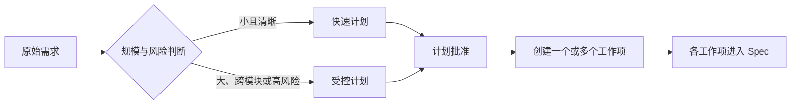
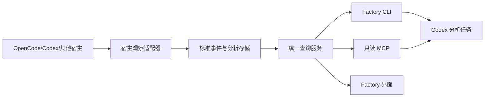

# 主流 AI 编程 Agent 的计划、产物与观测模式调研

> 调研日期：2026-07-31
>
> 证据范围：Kiro、TRAE、ZCode、Codex、Claude Code、GitHub Copilot、Cursor 的官方文档、官方产品说明与官方开放接口。未采用媒体评测、社区教程或第三方推测。
>
> 用途：为 SDLC Factory 1.1 后续补充“大需求计划模式、项目级产物、观察器 CLI、分析界面、项目管理和 Codex 外部分析接口”提供事实依据。

本文使用三类结论：

- **已确认事实**：官方文档或官方开放接口直接支持。
- **必要推断**：由多项官方事实组合得出，但不是厂商承诺。
- **Factory 建议**：面向 SDLC Factory 的设计选择，不代表被调研产品当前能力。

## 一、结论摘要

1. 主流产品已经普遍提供“先计划、后实施”，但存在两种不同路线：
   - Kiro 将需求、设计和任务保存为项目内 Markdown，属于“规格产物驱动”。
   - Codex、Claude Code、GitHub Copilot、Cursor、TRAE 和 ZCode 更多以会话内计划、待办清单和人工批准为中心，计划不一定是项目的长期权威产物。
2. 大需求不能只靠把单次提示词写得更长。比较成熟的做法是：
   - 先进行只读调查和澄清；
   - 形成可审阅计划；
   - 拆成带依赖的任务或执行切片；
   - 批准后再进入写入模式；
   - 对高风险任务保留分阶段审批。
3. 项目级长期信息普遍放在版本控制内的规则或说明文件中，例如 `AGENTS.md`、`CLAUDE.md`、`.cursor/rules/`、`.kiro/steering/`。会话记录、工具输出和临时计划则通常保存在产品运行目录或云端，不等于项目事实。
4. Agent、Skill、Hook、Rules、MCP 已成为共同的扩展语言。Factory 应提供自己的中立合同，不能直接把某一家产品的目录结构或事件字段写进 Core。
5. 各产品的可观测能力差异很大：
   - Codex、Claude Code 和 GitHub Copilot SDK 已提供较强的结构化事件、Token、工具和耗时能力。
   - Cursor CLI 提供实时 JSON 事件，管理接口提供用量与成本查询。
   - Kiro、TRAE 和 ZCode 的可视界面较完整，但官方资料没有证明它们都具备稳定、完整的程序化 Trace/Eval 接口。
6. 厂商的任务面板、后台 Agent 页面和会话列表解决的是“运行管理”，不能代替 Factory 的项目、需求版本、工作项、审批、测试批次和发布状态。
7. Factory 的观察器应当首先提供 CLI 和稳定 JSON/JSONL 输出。Factory 界面、Codex 分析和未来自动评估都应消费同一查询接口，不能各自解析 OpenCode 原始日志。
8. Factory 不应承诺分析模型私有思维链。可审计对象应是模型调用、可见推理用量、工具轨迹、错误、重试、无进展循环、上下文变化、人工介入和最终产物。
9. Factory 的差异化不在于再做一个 IDE，而在于提供：
   - 跨宿主的生命周期合同；
   - 项目级任务地图；
   - 结构化计划与审批；
   - 交付证据和运行遥测分离；
   - 可复现的耗时、Token、成本和质量分析；
   - 独立于执行 Agent 的最终产物符合性检查。

## 二、产品模式总览

| 产品 | 大需求计划 | 项目长期信息 | 扩展能力 | 程序化运行与观测 | 界面与项目管理 | 主要借鉴点 |
|---|---|---|---|---|---|---|
| Kiro | 标准 Spec 与 Quick Spec；需求→设计→任务→执行 | `.kiro/specs/`、`.kiro/steering/`、`AGENTS.md` | Custom Agent、Subagent、Hook、MCP | 有 headless；Spec CLI 3.0 仍为 Early Access，未确认完整阶段 Trace | Spec、任务依赖与执行监视 | 项目内规格产物、快慢双轨 |
| Codex | `/plan`、执行计划模板、计划后继续同一任务 | `AGENTS.md`、Skill、插件、配置 | Agent、Skill、Hook、MCP、插件 | `codex exec --json`、输出 Schema、SDK、App Server、OTel | App 任务、云任务、计划与审阅 | CLI/API 优先、结构化事件、可插拔分析 |
| Claude Code | Plan Mode、计划批准、任务和 Agent Team | `CLAUDE.md`、Rules、Skill、Agent Memory | Subagent、Skill、Hook、MCP、Plugin | `--output-format stream-json`、Agent SDK、OTel、用量统计 | Desktop、Agent View、任务列表、计划审阅 | 计划审批、父子 Trace、运行目录分层 |
| GitHub Copilot | CLI Plan Mode、任务分解、Fleet | Instructions、Spaces、Agent Profile | Agent、Skill、Hook、MCP、Plugin、SDK | CLI prompt、SDK 事件、Token/成本/时长、会话预算 | Agents Panel、Issue/PR/Projects | 会话管理与项目工作项结合 |
| Cursor | Plan、结构化待办与依赖 | `.cursor/rules/`、Memory、`AGENTS.md` | Rules、MCP、Hooks、Custom Modes | headless、JSON/stream-json、Admin API | Background Agents、Dashboard、Linear | 实时进度、下钻、用量与成本界面 |
| TRAE | SOLO Coder Plan；Builder 的 PRD→任务→代码→预览→发布 | Rules、Memory、Skills | Agent、Skill、Rules、MCP | 官方资料未确认通用 headless/JSON Trace | 工作台、任务、Diff、预览和中途干预 | 端到端操作体验和可视反馈 |
| ZCode | Plan Mode；Goal Mode 有目标、预算、迭代和验证 | Skill、Command、Agent、Repo Wiki | Agent、Skill、Hook、MCP、Plugin、LSP | 有本地用量与日志导出；未确认稳定 headless JSON Trace | Goal 卡、任务组、工作区、时间线 | 长任务 Goal 合同与资源卡 |

## 三、大需求如何进入 Plan，而不是直接编码

### 3.1 Kiro：规格产物驱动

**已确认事实**：

Kiro 的标准 Spec 按顺序形成 Requirements、Design、Tasks 和 Execution，并把前三类产物保存为：

```text
.kiro/specs/<spec-name>/
├── requirements.md
├── design.md
└── tasks.md
```

任务可以带依赖，执行时按依赖关系分波次处理独立任务。Kiro CLI 提供 `/spec new`、`/spec <name>` 和 `/spec run <name>`。[Kiro CLI Specs](https://kiro.dev/docs/cli/v3/specs/)；[Kiro Specs](https://kiro.dev/docs/specs/)

Kiro 同时提供 Quick Spec，一次形成相同类型的规格产物，但不要求每个阶段之间都单独批准。官方建议把标准 Spec 用于高风险、陌生技术、合规或复杂需求，把 Quick Spec 用于范围清晰、风险较低的工作。[Quick Spec](https://kiro.dev/docs/specs/quick-spec/)；[Spec best practices](https://kiro.dev/docs/specs/best-practices/)

**Factory 建议**：

Factory 应借鉴“双轨”，但不应照搬文件名和每次都生成三篇长文：

- **快速计划**：范围清晰、单模块、低风险时，一次形成“需求版本、执行切片、验收矩阵”，批准一次后进入实现。
- **受控计划**：跨模块、高风险、存在资料冲突或需要架构决策时，按“需求澄清→设计决定→任务图”逐阶段审阅。

### 3.2 Codex：只读计划、执行计划模板与后续实施

**已确认事实**：

Codex 官方建议复杂、模糊或难描述的任务先使用 Plan Mode。Plan Mode 可以读取上下文、提出澄清问题并形成计划，通过 `/plan` 或 `Shift+Tab` 进入；更长任务还可以使用 `PLANS.md`/执行计划模板。[Codex best practices](https://learn.chatgpt.com/guides/best-practices)；[Codex execution plans](https://developers.openai.com/cookbook/articles/codex_exec_plans)

`AGENTS.md` 用于项目长期约定，包括目录、构建测试命令、工程规则、限制和完成标准。官方明确建议保持它简洁，把计划、评审或架构等专题内容拆到单独文件。[Custom instructions with AGENTS.md](https://learn.chatgpt.com/docs/agent-configuration/agents-md)

**必要推断**：

Codex 的 Plan Mode 解决“本次任务先想清楚再改”，`AGENTS.md` 解决“项目长期怎么工作”，二者都不是完整项目需求管理系统。Factory 仍需维护需求版本、工作项关联和审批事实。

### 3.3 Claude Code：计划是受控执行模式

**已确认事实**：

Claude Code 的 Plan Mode 只允许读取和探索，不修改源文件。计划完成后，用户可以继续反馈、批准并选择后续权限模式，也可以打开 Markdown 计划进行编辑。[Permission modes](https://code.claude.com/docs/en/permission-modes)

Claude Code 在退出 Plan Mode 前会把计划写到文件，再调用 `ExitPlanMode` 请求批准；Hook 能收到计划正文和路径。[Hooks reference: ExitPlanMode](https://code.claude.com/docs/en/hooks)

默认情况下，计划文件位于 `~/.claude/plans/`，属于会话运行数据；默认清理周期之后可能被删除。可以用 `plansDirectory` 改为项目相对目录。[The `.claude` directory](https://code.claude.com/docs/en/claude-directory)；[Settings: `plansDirectory`](https://code.claude.com/docs/en/settings)

**Factory 建议**：

“模型生成计划文件”不等于“计划已经成为权威项目状态”。Factory 应采用：

```text
计划候选 → 人工批准 hash → 已发布计划版本 → 生成工作项/切片
```

未批准计划可以短期保存，但必须有生命周期和清理规则；批准后由 Core 发布，不要求模型重新输出同一正文。

### 3.4 GitHub Copilot、Cursor、TRAE 和 ZCode

**已确认事实**：

- GitHub Copilot CLI 的 Plan Mode 会分析请求、询问澄清问题并在写代码前形成结构化计划。[About GitHub Copilot CLI](https://docs.github.com/en/copilot/concepts/agents/copilot-cli/about-copilot-cli)
- Cursor 的 Agent 可以为复杂任务建立带依赖的待办列表，并在界面中实时更新；Plan 和待办当前不适用于 Auto Mode。[Cursor Planning](https://docs.cursor.com/en/agent/planning)
- TRAE SOLO Coder 的 Plan Mode 用于在编码前讨论架构、依赖和策略；SOLO Builder 展示 PRD→任务→代码→预览→发布的工作流。[TRAE SOLO](https://www.trae.ai/blog/product_solo_1112)；[TRAE changelog](https://www.trae.ai/changelog)
- ZCode 提供 Plan Mode；其 Goal Mode 进一步把 objective、状态、Token、耗时、工具调用、迭代和验证时间线作为运行对象展示。[ZCode Agents](https://zcode.z.ai/en/docs/agents)；[ZCode Goal](https://zcode.z.ai/en/docs/goal)

**Factory 建议**：

Factory 的 Plan 不是新增一个与 Spec 重复的生命周期阶段，而是：



Plan 负责项目级拆分、依赖、优先级和验收边界；Spec 负责一个工作项的需求版本。这样不会把一次大需求硬塞进一个无限增长的 Pipeline，也不会让 Plan 与 Spec 重复写同一正文。

## 四、“产物”应分成四层

主流产品的实践表明，不能把所有内容都叫“中间产物”。

### 4.1 项目事实

长期有效、可版本化、可被多个工作项引用：

- 项目目标和范围；
- 模块地图；
- 技术和架构决定；
- 领域术语；
- 外部系统和协议引用；
- 当前已发布需求版本之间的关系。

Kiro 用 Steering 保存产品、技术和结构信息；Codex 使用 `AGENTS.md`；Claude Code 使用 `CLAUDE.md` 和 Rules；Cursor 使用项目 Rules。[Kiro Steering](https://kiro.dev/docs/steering/)；[Claude Code Memory](https://code.claude.com/docs/en/memory)；[Cursor Rules](https://docs.cursor.com/context/rules)

**Factory 建议**：项目事实必须由 Factory 自己建模，并可生成人类可读项目地图。它们不是聊天摘要，也不能让后台 Memory 自动覆盖。

### 4.2 工作项交付产物

经过批准并对生命周期有约束力：

- 需求版本；
- 设计决定；
- 已批准执行计划；
- 源码修订引用；
- 审核决定；
- 测试结果；
- 发布记录。

这些是交付证据，能够参与门禁。

### 4.3 运行遥测

为诊断效率、成本和异常服务：

- 会话和子会话；
- 模型步骤；
- 工具调用和结果摘要；
- Token、耗时、成本；
- 重试、取消、错误和人工等待；
- 可见推理用量和无进展循环。

运行遥测不能直接证明需求完成，也不应被塞进状态索引。

### 4.4 临时运行数据

- 未批准计划候选；
- 被截断工具原文；
- 临时截图和调试日志；
- 会话恢复缓存；
- Hook 临时数据。

它们必须有过期、清理和脱敏策略。Claude Code 官方把 transcript、tool results、file history、plans、debug 和 tasks 列为可清理的应用数据，这种分层值得借鉴，但 Factory 应自行定义保留期。[The `.claude` directory](https://code.claude.com/docs/en/claude-directory)

## 五、专业 Agent、Skill、Hook 和规则如何分层

### 5.1 共同趋势

**已确认事实**：

- Codex 插件可以包含 Skill、MCP、Hook 等能力；`AGENTS.md` 提供分层项目说明。[Plugin architecture](https://developers.openai.com/plugins/concepts/plugins)；[Codex Hooks](https://learn.chatgpt.com/docs/hooks)
- Claude Code 提供 Subagent、Skill、Hook、MCP 和 Plugin；Subagent 有独立上下文、工具、模型、权限、记忆和可选 worktree。[Claude Code Subagents](https://code.claude.com/docs/en/sub-agents)
- GitHub Copilot CLI 提供 Custom Instructions、Hooks、Skills、Custom Agents、MCP 和 Plugins。[Customizing Copilot CLI](https://docs.github.com/en/copilot/how-tos/copilot-cli/customize-copilot/overview)
- Kiro 提供 Custom Agents、Subagents、Hooks、Steering 和 MCP。[Kiro Custom Agents](https://kiro.dev/docs/cli/custom-agents/)；[Kiro Hooks](https://kiro.dev/docs/cli/hooks/)
- ZCode 插件可以打包 Skill、Command、Agent、MCP、Hook 和 LSP。[ZCode Plugins](https://zcode.z.ai/en/docs/plugin)
- TRAE 支持自定义 Agent、Rules、Tools、MCP、Skills 和项目 Memory。[TRAE product thought](https://www.trae.ai/blog/product_thought_0428)；[TRAE changelog](https://www.trae.ai/changelog)

### 5.2 Factory 的中立合同

| 层 | 负责什么 | 不负责什么 |
|---|---|---|
| Agent | 角色、专业判断、交接责任 | 不定义生命周期真相 |
| Skill | 可重复任务方法、参考资料、脚本 | 不长期注入所有正文 |
| Hook | 捕获事件、轻量校验、阻止明显危险操作 | 不执行重型分析，不决定业务阶段 |
| Rule | 持久工程约定和领域规则 | 不代替确定性 Schema/门禁 |
| MCP/工具 | 访问外部数据和提交结构化结果 | 不把供应商私有格式写进 Core |
| Core | 状态机、不变量、证据绑定、审批、发布 | 不解析某个 Agent 的聊天包装 |

TRAE 官方说明规则和聊天历史发生冲突时会令模型混乱，说明“规则优先级”仍是提示行为，不能代替 Core 校验。[TRAE Rules tutorial](https://www.trae.ai/blog/trae_tutorial_0825)

### 5.3 多 Agent 不是默认答案

Claude Code 官方明确指出 Agent Teams 会显著增加 Token，适合可独立并行的研究、评审和跨层工作，不适合顺序任务、同文件编辑或依赖密集工作。[Claude Code Agent Teams](https://code.claude.com/docs/en/agent-teams)

GitHub Copilot Fleet 也建议只并行可以预先拆开的独立单元，避免紧耦合和同文件竞争。[Copilot Fleet mode](https://docs.github.com/en/copilot/how-tos/copilot-sdk/features/fleet-mode)

**Factory 建议**：

- Main 保持主线、审批和全局状态；
- Specialist 只在专业判断确有价值时启用；
- Tester 独立检查实现是合理的；
- 小任务默认不派发多 Agent；
- 并行任务必须有明确文件/模块所有权、依赖和交接 Schema；
- 专业角色是职责边界，不是目录 ACL。

## 六、可观测性和 CLI 能力对比

### 6.1 Codex

**已确认事实**：

`codex exec --json` 输出 JSONL，事件包括 thread、turn、item、tool、plan update 和 error；`turn.completed` 带输入、缓存输入、输出和推理输出 Token。`--output-schema` 可以要求最终结果符合 JSON Schema。[Codex non-interactive mode](https://learn.chatgpt.com/docs/non-interactive-mode)

Codex App Server 面向深度产品集成，提供认证、会话历史、审批和流式 Agent 事件；Codex SDK 可以创建、继续和恢复线程。[Codex App Server](https://learn.chatgpt.com/docs/app-server)；[Codex SDK](https://learn.chatgpt.com/docs/codex-sdk)

Codex 支持 OTel，能记录 API 请求、流事件、工具决策、工具结果、工具耗时、每轮 Token、Hook 和 MCP 指标。[Codex advanced configuration](https://learn.chatgpt.com/docs/config-file/config-advanced)

### 6.2 Claude Code

**已确认事实**：

Claude Code 非交互模式支持 `json` 和 `stream-json`，也能用 JSON Schema 约束最终结果，并提供最大预算和最大轮数。[Claude Code CLI reference](https://code.claude.com/docs/en/cli-usage)

`/usage` 展示会话 Token、API 时长、墙钟时长和估算成本；官方提示本地估算不等同于最终账单。[Manage costs](https://code.claude.com/docs/en/costs)

Claude Agent SDK 的增强 OTel 能把 interaction、llm request、tool、permission wait、execution 和 hook 建成父子 Span；子 Agent 的模型和工具 Span 可以挂在父 Agent 的 Task 工具下。[Agent SDK observability](https://code.claude.com/docs/en/agent-sdk/observability)

### 6.3 GitHub Copilot

**已确认事实**：

Copilot SDK 流式事件包含 Agent 消息、工具执行、子 Agent、Skill、Token、缓存、费用、单次 API 时长、供应商调用 ID 和上下文窗口使用量；会话结束事件还包含累计 API 时长和代码变更量。[Copilot SDK streaming events](https://docs.github.com/en/copilot/how-tos/copilot-sdk/features/streaming-events)

SDK 可以给会话设置 AI Credits 软预算，并通过事件通知额度变化和耗尽后的人工决定。[Copilot SDK session limits](https://docs.github.com/en/copilot/how-tos/copilot-sdk/features/session-limits)

GitHub Agents Panel 能查看会话状态、日志、Token 和时长，并从 Issue、PR 或 Agents UI 发起任务。[Managing agent sessions](https://docs.github.com/en/copilot/how-tos/copilot-on-github/use-copilot-agents/manage-and-track-agents)

### 6.4 Cursor

**已确认事实**：

Cursor CLI 的 headless 模式支持 `text`、`json` 和 `stream-json`。实时流包含 session、工具开始/完成、工具结果、最终结果和 `duration_ms`/`duration_api_ms`；官方说明 print 模式不输出 thinking 事件。[Cursor output format](https://docs.cursor.com/en/cli/reference/output-format)；[Cursor headless CLI](https://docs.cursor.com/en/cli/headless)

Cursor Admin API 可查询按用户和日期的使用事件，包括模型、Token、缓存、费用和请求类型；Dashboard 展示后台 Agent 状态、日志和资源使用。[Cursor Admin API](https://docs.cursor.com/en/account/teams/admin-api)；[Cursor Dashboard](https://docs.cursor.com/en/account/teams/dashboard)

### 6.5 Kiro、TRAE 和 ZCode 的边界

**已确认事实**：

- Kiro 有 `kiro-cli chat --no-interactive`、退出码和工具预授权，但 CLI 3.0 Spec 仍为 Early Access，当前资料没有证明 `/spec` 已能稳定 headless 自动化。[Kiro headless](https://kiro.dev/docs/cli/headless/)；[Kiro CLI v3](https://kiro.dev/docs/cli/v3/)
- TRAE 展示任务进度、工具、Diff、控制台和用量，但本次官方资料未确认通用 CLI、结构化 JSONL、阶段 Span 或独立 Eval API。[TRAE changelog](https://www.trae.ai/changelog)；[TRAE Max Mode usage](https://www.trae.ai/blog/trae_update_0902)
- ZCode Goal 和 Usage Stats 能显示 Token、耗时、迭代、工具调用和验证历史，也能导出故障日志；本次官方资料未确认稳定的 headless JSON Trace API。[ZCode Goal](https://zcode.z.ai/en/docs/goal)；[ZCode Usage Stats](https://zcode.z.ai/en/docs/usage-stats)；[ZCode Feedback](https://zcode.z.ai/en/docs/feedback)

**必要推断**：

“界面上能看到”不等于“Factory 能稳定采集”。Factory 观察器必须通过版本化 Host Adapter 处理差异，并对字段缺失明确标记 `unavailable`。

## 七、Factory 观察器为什么必须提供 CLI

### 7.1 推荐接口

CLI 应是观察器的第一等入口：

```text
sdlc-factory observe run --host opencode -- <host command...>
sdlc-factory observe attach --host opencode --session <id>
sdlc-factory analyze build --run <run-id>
sdlc-factory report export --run <run-id>
sdlc-factory console serve
sdlc-factory project list
sdlc-factory project show --project <project-id>
sdlc-factory work-item show --work-item <work-item-id>
sdlc-factory export analysis-bundle --run <run-id> --redact
```

每个查询命令至少支持：

```text
--format table
--format json
--format jsonl
```

`observe run` 应直接等待宿主进程或事件终态，不能固定 `sleep`。运行后再查询/导出完整会话和子会话做对账。

### 7.2 CLI、API、MCP 和界面的关系



约束：

- CLI 和 MCP 只读查询默认不得改变生命周期；
- UI 不直接解析 OpenCode JSONL；
- Codex 不直接扫描 Factory 内部目录猜状态；
- 所有消费者使用同一个版本化查询 Schema；
- 原始日志只保存一次，索引保存 ID、时间、状态、大小、hash 和引用；
- 敏感正文按需、脱敏、授权后读取。

## 八、用 Codex 独立分析 Factory 运行

### 8.1 推荐闭环

1. Factory 通过 OpenCode Host Adapter 运行真实任务。
2. 观察器采集并归一化根会话、子会话、模型步骤、工具和阶段事件。
3. Factory 生成脱敏分析包：
   - 工作项和需求版本引用；
   - 生命周期事件；
   - 工具统计、错误和重复摘要；
   - 阶段耗时；
   - Token/成本账本；
   - 交付产物及其 hash；
   - 测试证据；
   - 已知缺失字段。
4. Codex 通过 CLI 或只读 MCP 读取分析包。
5. Codex 输出结构化诊断和升级建议，不直接修改运行历史。
6. 被接受的改进进入新的 Factory WorkItem，经正常 Spec、Code、Review 和 Test。
7. 使用同一基准场景重跑，比较耗时、Token、错误和产物符合性。

### 8.2 Codex 输出合同

建议要求 Codex 输出：

```json
{
  "run_id": "RUN-*",
  "confirmed_findings": [],
  "hypotheses": [],
  "plugin_defects": [],
  "host_limitations": [],
  "prompt_or_model_effects": [],
  "recommended_changes": [],
  "regression_cases": [],
  "evidence_refs": []
}
```

这与 Codex 的 JSONL 和 `--output-schema` 能力匹配，但 Factory 仍需验证 Schema、证据引用和 run_id，不能把自然语言结论直接写成 Core 状态。[Codex non-interactive mode](https://learn.chatgpt.com/docs/non-interactive-mode)

## 九、Factory 界面和项目管理应呈现什么

### 9.1 项目总览

- 项目目标、模块地图和技术基线；
- 活跃、阻塞、待审批、已完成工作项；
- 工作项之间的来源、依赖、替代和关联修复关系；
- 当前发布版本和未解决风险；
- 最近运行的成功率、总时长和总成本。

GitHub Agents Panel、Cursor Dashboard、TRAE 工作台和 ZCode Task Management 都证明“集中查看多个运行和介入状态”具有实际价值，但 Factory 要在此基础上增加生命周期和交付证据。[GitHub agent sessions](https://docs.github.com/en/copilot/how-tos/copilot-on-github/use-copilot-agents/manage-and-track-agents)；[Cursor Dashboard](https://docs.cursor.com/en/account/teams/dashboard)；[ZCode Task Management](https://zcode.z.ai/en/docs/task-management)

### 9.2 工作项详情

- 原始需求及 hash；
- 当前需求版本；
- 计划、需求、实现、人工审核、测试和交付预览状态；
- 审批人、审批时间和审批对象 hash；
- 关联源码修订和变更文件；
- 测试批次和必测结果；
- 回退或“关联新任务”入口。

### 9.3 运行分析

- 阶段墙钟时间、模型时间、工具时间、人工等待和重试时间；
- 输入、缓存、输出和推理 Token；
- 实际总消耗、成功路径消耗和返工消耗；
- 工具调用数量、错误、重试、重复内容、输出大小和截断；
- 父子会话树和委派关系；
- 无进展回路和上下文压缩；
- 宿主估算成本、供应商账单成本和数据可信度。

### 9.4 最终产物符合性

- 需求/验收项→设计决定→变更→测试→证据覆盖矩阵；
- UI 原型比对；
- 协议和接口解析；
- 安全与凭据检查；
- 必测项的 `passed/failed/skipped/blocked`；
- 缺失、矛盾、不确定和需要人工判断的项目；
- 结论下钻到证据，不显示未经验证的“全部完成”。

界面必须把“运行遥测”和“交付证据”分栏。工具都成功不代表需求完成；测试通过也不代表 UI 与原型一致。

## 十、从当前插件问题固化出的 1.1 不变量

| 当前已暴露问题 | 1.1 应固化的合同 | 黑盒验收 |
|---|---|---|
| 原始需求被模型改写 | Host 在模型处理前按字节保存，记录 hash | 中文弯引号等字节保持不变 |
| 外部资料摄取递归复制、hash、转写造成膨胀 | 外部资料默认只保存受控引用；只有交付需要的资产才原格式复制到目标项目 | 目录不生成 `SRC-*` 仓库，不把 PNG 转 Markdown |
| 用目录 ACL 表达 Agent 角色 | Agent 是职责和交接边界；项目权限由统一安全策略控制 | Main/Coder/Tester 能按任务读取项目，违规修改由 diff/scope 检查发现 |
| 子 Agent 交接被 `<task_result>` 包装破坏 | 使用专用结构化 handoff 工具和 Schema | 前后有说明文字也不影响真实结构化提交 |
| 明确 test issue 后仍先 reverify 旧结果 | 反馈分类决定下一迁移；实现问题直接回 Code/Test 修复 | 不重复执行已知必失败旧验证 |
| 必测项可 `SKIP + exit 0` 假通过 | TestResult 原生四态；必测项只接受 passed | skipped/blocked 不得满足门禁 |
| Tester brief 的只读/可写/允许交接文件混淆 | 分开 `inspection_scope`、`delivery_targets`、`allowed_handoff`、`observed_diff` | Agent 收到无矛盾合同 |
| Spec 硬门禁读取次数和文件类型 | 观测异常默认告警；预算基于进展、风险和历史基线 | 合理分段读取不被固定“6 次”拒绝 |
| 上下文隔离导致各角色重复读取不同资料 | 为每阶段生成小型上下文清单；以引用和 hash 去重，不注入所有资料 | 同一尝试内无无效重复；跨角色只读其任务所需资料 |
| `cost=0` 被当成真正零成本 | 成本保存数值、来源和可信度；不可确认时为 unavailable | Provider 返回 0 时界面显示“估算为 0/实际未知” |
| 固定 `sleep` 轮询长进程 | 前台进程/事件终态等待，结束后对账 | 无固定睡眠；断流可恢复 |
| 审批时模型重交同一 Spec | 短期 Candidate + hash 确认；Core 发布正文 | 批准不再次消耗模型生成相同正文 |
| Token 总表混入终止和重试 | 分实际总量、成功路径、返工开销 | 取消会话计入实际总量，不计入成功路径 |
| 父子运行重复计时 | Span 保留父子关系；墙钟不按子 Span 简单求和 | 并行子 Agent 不导致阶段耗时翻倍 |
| 最终页面与高保真原型不符但流程可继续 | 独立产物检查器；关键不符合进入人工审查或阻断 | UI、协议、安全均有独立证据 |
| 每次 Pipeline 割裂，缺少项目地图 | Project→Module→WorkItem→RequirementVersion 关系是 Core 领域对象 | 第二个需求可关联第一次的模块、决定和发布版本 |

这些规则应分别进入 Schema、Core 不变量、Host Adapter 或黑盒回归；不要全部写成 Agent 提示词。

## 十一、适合借鉴与不应照搬

### 11.1 适合借鉴

- Kiro：标准/快速 Spec 双轨、项目内可审阅规格、任务依赖。
- Codex：Plan 与长期说明分离、CLI/JSON Schema/App Server/OTel。
- Claude Code：计划批准、父子 Trace、运行数据与项目配置分层、可配置清理。
- GitHub Copilot：Agents Panel、Issue/PR/Projects 入口、会话预算和 SDK 事件。
- Cursor：实时 JSON 工具流、后台 Agent 管理、Token/成本 Dashboard。
- TRAE：PRD→任务→实现→预览的界面体验、Diff 和中途干预。
- ZCode：Goal 的目标、预算、迭代、验证时间线和项目任务卡。

### 11.2 不应照搬

- 不要求每个小需求都生成长篇 requirements/design/tasks。
- 不把会话计划、todo 或自动 Memory 当作项目权威事实。
- 不把全部 Spec、规则和源资料注入每个角色上下文。
- 不把“最多 200 次工具调用”或更大上下文当作解决思维爆炸。
- 不让 Agent 自报完成后直接修改 Core 状态。
- 不让 Hook 承担长耗时模型分析或生命周期决策。
- 不把某厂商专有 session/event 格式固化进 Core。
- 不把管理 Dashboard 的活跃度、代码行数或请求数当作交付质量。
- 不默认启用多 Agent；上下文隔离和并行都有 Token 与协调成本。
- 不长期保存完整可见推理正文，更不宣称获得私有思维链。

## 十二、建议纳入 SDLC Factory 1.1 的升级顺序

### P0：先固定合同

1. 增加 DeliveryPlan、短期草案和计划版本合同。
2. 增加快速计划和受控计划进入条件。
3. 将当前插件问题写成 Core 不变量和黑盒验收。
4. 定义运行遥测与交付证据的严格边界。

### P1：观察器 CLI

1. OpenCode Host Observation Adapter。
2. 标准 Run/Event/Tool/ModelUsage/Span Schema。
3. 前台运行、事件等待、递归子会话对账。
4. `observe/analyze/report/export` CLI。
5. 耗时、Token、成本和工具膨胀报告。

### P2：最终产物检查

1. 需求覆盖矩阵。
2. 必测四态和证据新鲜度。
3. UI、协议、安全等专业检查器。
4. 独立评估结论，不允许评估 Agent 直接通过门禁。

### P3：项目管理与报告界面

1. 项目地图和工作项看板。
2. 审批、回退和关联新任务。
3. 会话树、阶段耗时、Token、成本、工具与错误。
4. 产物符合性和证据下钻。
5. 同一查询 API 支持 CLI、UI 和 MCP。

### P4：Codex 迭代闭环

1. 脱敏分析包。
2. 只读 CLI/MCP。
3. Codex 结构化诊断 Schema。
4. 将确认的缺陷转成 Factory WorkItem。
5. 用固定基准场景进行前后对比和回归。

## 十三、ZCode 名称说明

本文将用户所说的 “ZCode”理解为 Z.ai/智谱旗下 `zcode.z.ai` 的 Agentic Development Environment，官方入口为 [ZCode documentation](https://zcode.z.ai/en/docs/welcome)。

另有同名的 `zcodeapp.com` 产品，定位于 Apple 平台和 Xcode/Agent 工作台，不属于本文对比范围。若用户实际指的是后者，需要单独重新调研，不能复用本节结论。

## 十四、官方来源登记

以下来源均于 2026-07-31 访问：

- Kiro：[Specs](https://kiro.dev/docs/specs/)、[CLI Specs](https://kiro.dev/docs/cli/v3/specs/)、[Steering](https://kiro.dev/docs/steering/)、[Hooks](https://kiro.dev/docs/cli/hooks/)、[Headless](https://kiro.dev/docs/cli/headless/)
- OpenAI Codex：[Best practices](https://learn.chatgpt.com/guides/best-practices)、[AGENTS.md](https://learn.chatgpt.com/docs/agent-configuration/agents-md)、[Non-interactive mode](https://learn.chatgpt.com/docs/non-interactive-mode)、[App Server](https://learn.chatgpt.com/docs/app-server)、[Advanced configuration](https://learn.chatgpt.com/docs/config-file/config-advanced)
- Claude Code：[Permission modes](https://code.claude.com/docs/en/permission-modes)、[Subagents](https://code.claude.com/docs/en/sub-agents)、[Agent teams](https://code.claude.com/docs/en/agent-teams)、[CLI reference](https://code.claude.com/docs/en/cli-usage)、[Agent SDK observability](https://code.claude.com/docs/en/agent-sdk/observability)
- GitHub Copilot：[Copilot CLI](https://docs.github.com/en/copilot/concepts/agents/copilot-cli/about-copilot-cli)、[Customization](https://docs.github.com/en/copilot/how-tos/copilot-cli/customize-copilot/overview)、[Streaming events](https://docs.github.com/en/copilot/how-tos/copilot-sdk/features/streaming-events)、[Agent sessions](https://docs.github.com/en/copilot/how-tos/copilot-on-github/use-copilot-agents/manage-and-track-agents)
- Cursor：[Planning](https://docs.cursor.com/en/agent/planning)、[Headless CLI](https://docs.cursor.com/en/cli/headless)、[Output format](https://docs.cursor.com/en/cli/reference/output-format)、[Admin API](https://docs.cursor.com/en/account/teams/admin-api)、[Dashboard](https://docs.cursor.com/en/account/teams/dashboard)
- TRAE：[SOLO](https://www.trae.ai/blog/product_solo_1112)、[Product thought](https://www.trae.ai/blog/product_thought_0428)、[Changelog](https://www.trae.ai/changelog)、[Rules tutorial](https://www.trae.ai/blog/trae_tutorial_0825)
- ZCode：[Welcome](https://zcode.z.ai/en/docs/welcome)、[Goal](https://zcode.z.ai/en/docs/goal)、[Task management](https://zcode.z.ai/en/docs/task-management)、[Plugins](https://zcode.z.ai/en/docs/plugin)、[Usage stats](https://zcode.z.ai/en/docs/usage-stats)
