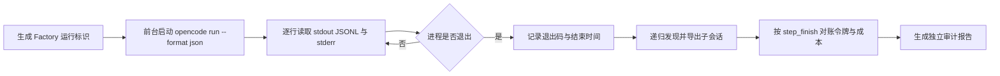

# OpenCode 可观测性与独立审计调研

> 调研日期：2026-07-31
>
> 基准版本：本机正式 CLI `opencode 1.18.10`，对应官方仓库标签 `v1.18.10`、提交 `7902e04c3a67f7c69726bc955efb46e29214c797`
>
> 证据范围：OpenCode 官方文档、官方 GitHub 源码、`opencode --help` 及子命令帮助。未采用博客、社区插件和第三方推测。

本文为 SDLC Factory 1.1 的 OpenCode 可观测性、耗时与成本分析、工具结果膨胀分析、独立运行审计提供事实依据。正文使用三类结论：

- **已确认事实**：官方文档、CLI 帮助或固定版本源码直接支持。
- **源码推断**：由多处源码组合得出，尚未用真实供应商全矩阵验证。
- **方案建议**：面向 SDLC Factory 1.1 的设计选择，不是 OpenCode 当前承诺。

## 一、结论摘要

1. **已确认事实**：`opencode run --format json` 输出的是按行 JSON（JSONL），但不是完整公共事件总线。1.18.10 只输出根会话的 `step_start`、`step_finish`、终态 `tool_use`、完成的 `text`、可选 `reasoning` 和 `error`。
2. **已确认事实**：每条 JSON 顶层的 `timestamp` 是 CLI 输出该行时调用 `Date.now()` 生成的“观察时间”，不是服务端原始事件时间。工具、文本、可见推理块另有自身开始/结束时间；步骤开始和结束部件没有内建时间字段。
3. **已确认事实**：工具的完整状态模型是 `pending → running → completed | error`，但 `run --format json` 只输出 `completed` 和 `error`。要观察开始、运行、重试、权限请求及子会话，必须补充插件事件或服务端事件流。
4. **已确认事实**：`step_finish` 的 `input` 是扣除缓存读取、缓存写入后的非缓存输入；`output` 已扣除 `reasoning`；缓存读写和推理令牌单列。`cost` 主要是 OpenCode 依据模型价格计算的估算值，不应称为“供应商账单”。
5. **源码推断**：同一助手消息发生多步工具调用时，消息级 `cost` 累加，但消息级 `tokens` 会被最后一步覆盖。会话聚合量通过每个 `step-finish` 部件累加。因此精确分析应以 `step_finish` 为明细、会话汇总为对账，不能把消息令牌与步骤令牌相加。
6. **已确认事实**：根会话调用 `task` 时会建立带 `parentID` 的子会话；父工具结果只包装子会话最后一个文本部件，并带回子会话 ID。根 `run` 的 JSON 流会过滤子会话事件，因此仅统计根流会系统性漏算子代理耗时、令牌和成本。
7. **方案建议**：不得把“思维链分析”作为产品能力。应改称“可观测推理行为分析”，只分析供应商实际暴露的推理块、推理令牌、工具选择、重试、委派、回路、证据引用和最终产物；不声称获取模型私有思维链。
8. **已确认事实**：通用工具包装默认把单次结果限制为 2,000 行或 50 KiB，完整原文另存临时截断目录；但大量调用、工具输入、元数据、附件、父子会话复制和多通道重复存档仍会造成总体膨胀。
9. **方案建议**：1.1 采用“前台进程或服务端事件流等待 + 结束后递归会话对账”，取消固定 `sleep`。事件流负责低延迟，导出/查询负责断流恢复和完整性校验。

## 二、`opencode run --format json` 能稳定观察什么

官方 CLI 将 `--format json` 描述为“raw JSON events”，适合脚本化运行；源码进一步显示它是对公共事件流的筛选和重包装，而不是原样转发。[CLI 文档：run](https://opencode.ai/docs/cli/#run)；[1.18.10 `run.ts` 事件筛选与输出](https://github.com/anomalyco/opencode/blob/7902e04c3a67f7c69726bc955efb46e29214c797/packages/opencode/src/cli/cmd/run.ts#L678-L804)

### 2.1 实际输出事件

| 顶层 `type` | 输出条件 | 可直接取得 | 主要缺口 |
|---|---|---|---|
| `step_start` | 根会话收到 `step-start` 部件更新 | `sessionID`、部件 ID、消息 ID、可选快照 | 部件没有开始时间；顶层时间只是 CLI 观察时间 |
| `step_finish` | 根会话收到 `step-finish` 部件更新 | 结束原因、快照、单步成本、输入/输出/推理/缓存令牌 | 不含模型、代理和阶段语义；需要与消息/会话数据关联 |
| `tool_use` | 工具状态到达 `completed` 或 `error` | 工具名、调用 ID、输入、结果或错误、工具开始/结束时间、元数据 | 不输出 `pending`、`running`；结果可能很大 |
| `text` | 文本部件已有 `time.end` | 文本、文本开始/结束时间 | 只输出完成文本，不输出增量 |
| `reasoning` | 推理部件已有 `time.end` 且命令启用 `--thinking` | 供应商暴露的推理文本、开始/结束时间、元数据 | 可能完全不存在，也不代表模型私有推理 |
| `error` | 根会话出现 `session.error`，或命令/提示请求直接失败 | 结构化错误名及数据 | 权限请求/拒绝本身不作为 JSON 事件输出 |

这些部件和状态的正式结构见固定版本 Schema：推理部件、步骤结束、工具四态、助手消息和会话信息均有明确字段定义。[会话 Schema：推理、步骤与工具状态](https://github.com/anomalyco/opencode/blob/7902e04c3a67f7c69726bc955efb46e29214c797/packages/schema/src/v1/session.ts#L118-L313)；[会话 Schema：消息与会话](https://github.com/anomalyco/opencode/blob/7902e04c3a67f7c69726bc955efb46e29214c797/packages/schema/src/v1/session.ts#L453-L568)

### 2.2 时间戳的含义

**已确认事实**：

- 顶层 `timestamp` 在 CLI 的 `emit()` 中使用 `Date.now()` 生成，是“该 JSON 行写到标准输出时”的时间。
- `message.part.updated` 原始事件本身带事件时间，但 `run` 重包装时只传递 `part`，没有保留原始事件时间。[部件更新事件 Schema](https://github.com/anomalyco/opencode/blob/7902e04c3a67f7c69726bc955efb46e29214c797/packages/schema/src/v1/session.ts#L612-L620)
- 工具 `running/completed/error` 状态包含 `time.start`，终态还包含 `time.end`。
- 文本和推理部件包含 `time.start` 与可选 `time.end`。
- 助手消息包含 `time.created` 与可选 `time.completed`；会话包含 `time.created`、`time.updated`。
- `step-start` 与 `step-finish` 部件自身没有开始/结束时间。

**方案建议**：规范中同时保存两个时间：

- `observed_at_ms`：采集器收到/写入事件的时间。
- `occurred_at_ms`：部件或状态自带的开始/结束时间；没有就留空，不能用观察时间伪装。

耗时优先使用同一部件的 `end - start`。阶段墙钟耗时由 Factory 的阶段开始/结束事件计算，不应从相邻 OpenCode JSON 行猜测。

### 2.3 会话、子会话与 `task`

OpenCode 官方文档确认子代理使用子会话，并支持在父子会话之间导航；服务端提供 `GET /session/:id/children` 查询直接子会话。[代理文档：子会话](https://opencode.ai/docs/agents/#usage)；[服务端文档：会话与事件接口](https://opencode.ai/docs/server/#sessions)

固定版本源码进一步确认：

- `task` 新建会话时写入 `parentID: ctx.sessionID`。
- 父工具元数据包含 `parentSessionId`、`sessionId` 和子代理使用的模型。
- 子任务返回值取子会话最后一个文本部件，再包装为 `<task ...><task_result>...</task_result></task>`。
- 可用 `task_id` 恢复已有子会话。
- 根 `run` 循环按 `part.sessionID === rootSessionID` 过滤，因此子会话的步骤、工具和成本不进入根 JSON 流。[`task` 子会话和结果包装](https://github.com/anomalyco/opencode/blob/7902e04c3a67f7c69726bc955efb46e29214c797/packages/opencode/src/tool/task.ts#L40-L75)；[`task` 会话创建与元数据](https://github.com/anomalyco/opencode/blob/7902e04c3a67f7c69726bc955efb46e29214c797/packages/opencode/src/tool/task.ts#L136-L213)

**源码推断**：父会话保留子任务最终文本包装，子会话又保留完整对话。若审计器同时摄取父工具输出和子会话文本，内容量会重复；令牌/成本按各自模型步骤相加是正确的，但文本大小统计必须区分“原始产生量”和“跨会话重复注入量”。

### 2.4 工具状态与错误边界

工具状态 Schema 支持：

- `pending`：原始参数尚在生成。
- `running`：输入已解析，含开始时间。
- `completed`：含完整输入、输出、标题、元数据、开始/结束时间及可选附件。
- `error`：含完整输入、错误字符串、开始/结束时间及可选元数据。

`run --format json` 只在终态发出 `tool_use`。会话级错误另发 `error`；CLI 累积会话错误并将进程退出码设为失败。权限请求在非 `--auto` 模式会被 CLI 自动拒绝，但不会作为 JSON 行输出。[`run.ts` 工具、错误、权限与退出处理](https://github.com/anomalyco/opencode/blob/7902e04c3a67f7c69726bc955efb46e29214c797/packages/opencode/src/cli/cmd/run.ts#L715-L837)

因此：

- **已确认事实**：`tool_use.error` 与顶层 `error` 是两条不同错误通道。
- **已确认事实**：退出码非零是运行失败信号，但退出码为零只表示 OpenCode 请求没有以这些错误结束，不代表业务需求满足。
- **方案建议**：分析器分别记录 `tool_error`、`session_error`、`process_error`、`permission_rejected`、`timeout` 和 `audit_failure`，不能归并成一个“Agent 失败”。

## 三、步骤令牌与成本的含义和局限

### 3.1 字段语义

OpenCode 将供应商/AI SDK 用量归一化后写入每个 `step-finish`。固定版本计算逻辑如下：[用量与成本计算源码](https://github.com/anomalyco/opencode/blob/7902e04c3a67f7c69726bc955efb46e29214c797/packages/opencode/src/session/session.ts#L338-L406)

| 字段 | 1.18.10 中的含义 | 注意事项 |
|---|---|---|
| `tokens.input` | `inputTokens - cacheRead - cacheWrite`，下限为 0 | 是非缓存输入，不是请求上下文总量 |
| `tokens.output` | `outputTokens - reasoningTokens`，下限为 0 | 不含单列的推理令牌 |
| `tokens.reasoning` | 供应商/SDK 报告的推理令牌；缺失时为 0 | `0` 可能是无推理、未暴露或供应商未报告 |
| `tokens.cache.read` | 缓存命中的输入令牌 | 是否收费及价格由模型价格信息决定 |
| `tokens.cache.write` | 缓存写入令牌；还会从部分供应商元数据补取 | 不同供应商支持程度不同 |
| `tokens.total` | 供应商可选的总量 | 不保证存在，也不应假定等于上述字段之和 |
| `cost` | OpenCode 按模型价格和令牌计算的估算值；Copilot 特例可使用 `totalNanoAiu` | 不是通用的供应商实际账单 |

成本计算会：

- 按上下文长度选择模型价格档位；
- 分别计算非缓存输入、普通输出、缓存读、缓存写；
- 暂时按普通输出价格计算推理令牌；
- 对缺失或非有限值归零；
- `opencode stats` 用美元符号展示结果。[`stats` 的成本与令牌展示](https://github.com/anomalyco/opencode/blob/7902e04c3a67f7c69726bc955efb46e29214c797/packages/opencode/src/cli/cmd/stats.ts#L310-L347)

### 3.2 应如何汇总

**已确认事实**：

- 每个 `step_finish` 都有本步骤的令牌和成本。
- 会话数据库通过 `step-finish` 部件增量维护会话总成本和各类令牌，并在部件更新/删除时先撤销旧值再加新值，适合做总量对账。[会话用量投影](https://github.com/anomalyco/opencode/blob/7902e04c3a67f7c69726bc955efb46e29214c797/packages/core/src/session/projector.ts#L90-L107)；[步骤部件更新时的增减](https://github.com/anomalyco/opencode/blob/7902e04c3a67f7c69726bc955efb46e29214c797/packages/core/src/session/projector.ts#L312-L329)

**源码推断**：

- 处理每个步骤结束时，助手消息 `cost += usage.cost`，但 `tokens = usage.tokens`。所以消息成本累计、消息令牌只保留最后一步。[步骤处理源码](https://github.com/anomalyco/opencode/blob/7902e04c3a67f7c69726bc955efb46e29214c797/packages/opencode/src/session/processor.ts#L438-L455)
- `opencode stats` 的总体令牌使用会话聚合量；模型分组令牌使用消息级令牌。因此多步骤助手消息的“按模型令牌分组”存在少算早期步骤的风险，需用回放测试确认具体供应商形态。[`stats` 聚合源码](https://github.com/anomalyco/opencode/blob/7902e04c3a67f7c69726bc955efb46e29214c797/packages/opencode/src/cli/cmd/stats.ts#L163-L209)

**方案建议**：

1. 明细唯一权威来源：递归会话树中的 `step_finish`。
2. 会话汇总：只用于对账，不再加到明细总和。
3. 助手消息令牌：仅作兼容展示，不参与精确成本核算。
4. 根会话与所有子会话分别汇总，再按 Factory 的`阶段/运行操作/角色`标签聚合。
5. 并行子会话的成本和令牌可相加；耗时不能相加，应同时报告墙钟耗时、累计代理耗时和关键路径耗时。

### 3.3 `cost = 0` 应如何表述

禁止写：

> 供应商成本为 0 / 本次免费。

建议写：

> OpenCode 记录的估算成本为 `0`；实际供应商结算成本未知。

只有同时具备权威的零价格配置、明确的计费方案和完整令牌上报时，才可额外标注“按当前价格表估算为免费”。原因是源码会把缺失价格、缺失用量、非有限值等归零；订阅、额度抵扣、包月、内部路由和最终账单也不由该字段表达。

建议成本记录增加：

```json
{
  "estimated_cost_usd": 0,
  "cost_source": "opencode_estimate",
  "price_metadata_present": false,
  "billing_status": "unknown",
  "display": "OpenCode 估算为 0；实际结算未知"
}
```

## 四、不要获取“私有思维链”，改做可观测推理行为分析

### 4.1 能观察什么

**已确认事实**：

- CLI 的 `--thinking` 含义是显示 thinking blocks；非交互 `run` 默认不显示。
- OpenCode 仅在上游流出现 `reasoning-start / reasoning-delta / reasoning-end` 时构造并持久化 `ReasoningPart`，包含上游提供的文本、元数据和本地记录的开始/结束时间。[推理流适配源码](https://github.com/anomalyco/opencode/blob/7902e04c3a67f7c69726bc955efb46e29214c797/packages/opencode/src/session/llm/ai-sdk.ts#L150-L190)；[推理部件处理源码](https://github.com/anomalyco/opencode/blob/7902e04c3a67f7c69726bc955efb46e29214c797/packages/opencode/src/session/processor.ts#L280-L313)
- 即使不使用 `--thinking`，供应商已暴露的推理部件仍可能存在于会话导出中；`--thinking` 只控制 `run` 是否把完成的推理部件输出成 JSON/终端文本。

### 4.2 不能声称什么

**方案边界**：

- 不声称取得模型未公开的内部推理。
- 不把 `ReasoningPart.text` 当成完整、逐字、真实的私有思维链。
- 不以是否存在推理文本判断模型是否“思考过”。
- 不要求执行模型泄露隐藏提示词或内部推理作为质量门禁。

建议将能力名称统一为：

> **可观测推理行为分析**

其输入和指标包括：

- 供应商明确暴露的推理块数量、字符量、持续时间；
- `reasoning` 令牌及其在总输出中的占比；
- 工具选择序列、调用间隔、成功率、错误率；
- 同参重复调用、失败后无变化重试、循环和长时间无进展；
- 子代理委派深度、扇出、恢复同一 `task_id` 的次数；
- 缓存命中、上下文压缩、输入增长；
- 计划/交接声明与真实工具、差异、测试证据之间的一致性；
- 最终产物对批准需求的可追溯覆盖。

这些指标评价的是“可见行为与结果”，不是读取模型私有心理过程。

## 五、会话导出、任务包装、插件事件如何支持独立审计

### 5.1 会话导出

`opencode export [sessionID]` 导出指定会话的 `info + messages[] + parts[]`；不会递归导出子会话。`--sanitize` 会脱敏会话标题/目录、系统文本、普通文本、推理文本、文件信息、子任务提示、工具输入输出、补丁和快照等。[CLI 文档：export](https://opencode.ai/docs/cli/#export)；[导出与脱敏源码](https://github.com/anomalyco/opencode/blob/7902e04c3a67f7c69726bc955efb46e29214c797/packages/opencode/src/cli/cmd/export.ts#L20-L215)；[导出命令只读取指定会话](https://github.com/anomalyco/opencode/blob/7902e04c3a67f7c69726bc955efb46e29214c797/packages/opencode/src/cli/cmd/export.ts#L230-L290)

限制：

- CLI `session list --format json` 只列根会话，且输出不含 `parentID`；不能靠它还原完整子会话树。[会话列表源码](https://github.com/anomalyco/opencode/blob/7902e04c3a67f7c69726bc955efb46e29214c797/packages/opencode/src/cli/cmd/session.ts#L70-L121)
- 应通过父 `task` 元数据中的 `sessionId`，或服务端 `/session/:id/children` 递归发现子会话。
- `--sanitize` 仍保留结构、令牌、成本、时间和工具名，适合统计审计。
- **源码推断**：当前脱敏函数没有统一清洗工具错误字符串和助手错误对象，供应商响应正文、路径或秘密仍可能从错误通道泄露。Factory 不能把 `--sanitize` 视为完整的数据防泄漏方案。

### 5.2 `task` 包装

父会话的 `task` 工具终态提供：

- 子会话 ID；
- 父会话 ID；
- 子代理模型；
- 父工具开始/结束时间；
- 子任务最终文本包装。

它适合建立父子因果边，但不适合代替子会话审计，因为：

- 子任务只回传最后一个文本部件；
- 子会话内部步骤、工具错误、重试、令牌、成本不会被完整带回；
- 大的最终文本会再次进入父会话上下文，造成实际令牌放大。

### 5.3 插件钩子和事件

官方插件接口提供：

- 通用 `event` 订阅；
- `tool.execute.before` 和 `tool.execute.after`；
- 命令执行前、消息、权限、环境等钩子。

官方文档列出的事件包括会话创建/更新/错误/状态、消息部件更新、权限、命令、文件、工具等。[插件文档：事件与钩子](https://opencode.ai/docs/plugins/#events)；[1.18.10 插件接口源码](https://github.com/anomalyco/opencode/blob/7902e04c3a67f7c69726bc955efb46e29214c797/packages/plugin/src/index.ts#L217-L285)

`session.status` 完整状态是：

- `idle`
- `busy`
- `retry`，带 `attempt`、消息和下一次重试时间

[会话状态事件 Schema](https://github.com/anomalyco/opencode/blob/7902e04c3a67f7c69726bc955efb46e29214c797/packages/schema/src/session-status-event.ts#L1-L41)

建议组合：

| 来源 | 用途 | 不应承担 |
|---|---|---|
| 前台 `run --format json` | 兼容当前运行方式、拿根会话终态工具/步骤/文本/错误、随进程退出收口 | 完整事件、子会话、权限与重试审计 |
| 插件 `event` | 捕获全量实例事件、父子会话、权限、重试和状态变化，注入 Factory 关联标识 | 生命周期真相、复杂业务路由、重型分析 |
| 工具前后钩子 | 记录调用因果、原始输入大小、输出大小和关联 ID | 单独判断调用是否可靠结束 |
| 服务端 SSE `/event` | 外部独立采集、低耦合等待、断线重连 | 长期唯一存档 |
| 递归会话导出/API 查询 | 运行结束后补全和对账 | 实时等待 |

**已确认事实**：1.18.10 的通用 `event` 回调由运行时以 `void hook.event(...)` 触发，不等待异步回调完成；普通触发型钩子则逐个等待。因此 `event` 适合轻量镜像，但不能作为唯一可靠落盘通道；把重型分析放在工具前后钩子中又会延长被测工具耗时。[插件运行时：事件回调与触发型钩子](https://github.com/anomalyco/opencode/blob/7902e04c3a67f7c69726bc955efb46e29214c797/packages/opencode/src/plugin/index.ts#L245-L310)

**方案建议**：真正“独立”的审计器放在 OpenCode 进程外。插件只做薄事件镜像和关联，不在钩子中做模型分析；否则审计器与被审计运行共享崩溃域，还可能因钩子变慢而改变被测耗时。

## 六、用前台进程与事件流替代固定 `sleep`

OpenCode 1.18.10 的本地非交互 `run` 会先订阅事件，再发送命令/提示，内部一直消费事件，直到根会话 `session.status=idle`，随后进程退出；错误会反映为 JSON 错误和非零退出码。[`run.ts` 前台等待源码](https://github.com/anomalyco/opencode/blob/7902e04c3a67f7c69726bc955efb46e29214c797/packages/opencode/src/cli/cmd/run.ts#L789-L862)

推荐流程：



约束：

1. 不使用 `Start-Process` 后固定等待若干秒再查状态；直接持有进程句柄并异步读取管道。
2. 超时是监督器策略：到达明确期限后中断/调用会话 abort，并记录 `timed_out`，不能用无限延长或循环 `sleep` 掩盖。
3. 若采用 `opencode serve`，先订阅 SSE，再提交异步提示，等待根会话及已发现子会话进入 `idle`；断流时立即重连并通过 `/session/status`、消息查询和递归子会话查询对账。
4. 固定轮询不能替代 readiness。应用和设备测试应由 Harness 使用健康检查、端口、窗口或设备协议的确定性 readiness 探针。
5. 父会话退出不等于后台子代理全部结束。存在后台任务时，审计收口条件必须覆盖完整子会话树，或明确产出 `blocked/incomplete_child_sessions`。

## 七、工具调用结果是否“爆炸”的分析方法

### 7.1 OpenCode 已有的单次保护

**已确认事实**：1.18.10 的通用工具包装默认限制单次结果：

- 最多 2,000 行；
- 最多 50 KiB；
- 超限时将完整原文写入临时截断目录，返回预览和路径提示；
- 临时完整结果默认保留 7 天；
- 可通过 `tool_output.max_lines`、`tool_output.max_bytes` 调整；
- 如果工具自己已经设置 `metadata.truncated`，通用包装不再重复截断。

[通用工具结果截断实现](https://github.com/anomalyco/opencode/blob/7902e04c3a67f7c69726bc955efb46e29214c797/packages/opencode/src/tool/truncate.ts#L13-L141)；[工具包装应用截断](https://github.com/anomalyco/opencode/blob/7902e04c3a67f7c69726bc955efb46e29214c797/packages/opencode/src/tool/tool.ts#L115-L151)

因此不能表述为“每个通用工具都能无限输出”。但该保护只限制包装后的单次普通输出，不等于整个运行记录有总量上限。

### 7.2 已确认的总体风险来源

- `tool_use` JSON 包含完整工具输入、包装后输出和元数据，整个 JSON 事件没有第二层总大小限制。
- 会话导出也包含相同内容。
- `task` 将子会话最后文本再次包装进父工具输出。
- 工具输入没有相同的通用 50 KiB 结果上限。
- 大量工具调用都可分别接近上限；附件、补丁和元数据还会增加记录体积。
- CLI JSONL、插件事件、工具后钩子和会话导出若各自保存正文，会多通道复制。
- 工具输出会进入后续模型上下文，但 OpenCode 没有给出“某一个工具输出精确导致多少输入令牌”的独立字段。

因此“工具结果令牌”不能用下一步输入令牌直接倒推；缓存、系统提示、历史消息、压缩和多个工具都会同时影响下一步输入。

### 7.3 建议指标

每个工具调用记录：

```json
{
  "tool_name": "task",
  "call_id": "call_xxx",
  "input_bytes": 1024,
  "output_bytes": 86420,
  "output_original_bytes": 340112,
  "metadata_bytes": 320,
  "serialized_event_bytes": 88451,
  "attachment_bytes": null,
  "opencode_truncated": true,
  "opencode_output_path_present": true,
  "output_sha256": "…",
  "content_storage": "artifact_ref",
  "truncated_for_analysis": true,
  "child_session_id": "ses_xxx"
}
```

阶段报告至少包含：

- 工具调用次数、成功/错误/超时次数；
- 包装后结果与原始结果总字节数、P50/P95/P99/最大值、最大结果前十；
- OpenCode 截断次数、截断比例及临时原文引用数；
- `结果字节 / 输入字节` 放大比；
- 同内容哈希重复次数和重复字节；
- 子任务回传文本与子会话末尾文本的重复字节；
- 超过单次阈值、阶段阈值、上下文比例阈值的调用；
- 大结果后下一步骤输入增长、缓存命中和是否触发压缩，仅标记相关性，不声称单因果。

**方案建议**：原始大结果写入受控证据存储，事件索引只保存长度、哈希、媒体类型、截断标识和引用。分析模型默认只看摘要与前后有限片段，需要复核时再按权限读取原文。

## 八、SDLC Factory 1.1 的采集与审计接口建议

### 8.1 分层边界

建议独立出三类能力：

1. **运行采集器**：确定性采集 OpenCode 进程、事件、会话树、工具、时间、令牌和成本；不做质量判断。
2. **运行行为审计器**：分析循环、重试、委派、工具结果膨胀、耗时和成本；只输出观察与告警。
3. **产物符合性审查器**：读取批准需求、项目事实、实际差异、验证证据和交付清单，逐需求判定 `通过/不通过/受阻/证据不足`。

三者都不直接推进工作项状态。确定性 Core 根据绑定版本向量的审计证据执行门禁。

### 8.2 标准事件记录

建议 Factory 事件采用中文文档、稳定英文编码字段：

```json
{
  "schema_version": "1.0",
  "event_id": "evt_…",
  "sequence": 42,
  "source": "opencode_run_json",
  "source_version": "1.18.10",
  "factory_run_id": "run_…",
  "work_item_id": "wi_…",
  "stage_id": "code",
  "operation_id": "op_…",
  "role": "实现负责人",
  "session_id": "ses_…",
  "parent_session_id": null,
  "message_id": "msg_…",
  "part_id": "prt_…",
  "call_id": null,
  "event_type": "step_finished",
  "observed_at_ms": 0,
  "occurred_at_ms": null,
  "duration_ms": null,
  "payload_ref": "evidence://…",
  "payload_bytes": 0,
  "payload_sha256": "…",
  "redaction": {
    "policy": "factory-default-v1",
    "applied": true
  }
}
```

接口要求：

- 接受 JSONL、插件事件、SSE 和会话导出四种来源；
- 规范化后使用同一事件结构；
- 用 `session_id + message_id + part_id + 状态/结束时间` 幂等去重；
- 保存原始来源版本与事件哈希，禁止静默改写；
- 允许事件迟到和断线后补录；
- 阶段、运行操作、角色来自 Factory 关联上下文，不从提示词猜测；
- `step_finish` 令牌明细不可变；修正通过补偿事件完成。

### 8.3 隐私与脱敏

最低要求：

- 默认不把普通文本、推理文本、工具输入输出、文件内容、补丁、环境变量写进分析索引。
- 单独清洗错误字符串、供应商响应正文/请求头、路径、URL、命令参数和权限匹配模式。
- 密钥、令牌、Cookie、认证头、连接串先规则脱敏，再做模型分析。
- 原文证据加密、按工作项隔离、最小权限、设置保留期限；统计层只使用长度、哈希、分类和引用。
- 推理文本按最高敏感级别处理，不用于跨项目训练或长期留存。
- 对每条报告记录脱敏策略版本；脱敏失败时停止外发，而不是回退到原文。

### 8.4 可测试性

建立不依赖真实供应商的回放测试包：

| 场景 | 必测断言 |
|---|---|
| 无工具普通回复 | 根进程正常收口，文本与单步用量可对账 |
| 工具成功/失败 | 四态事件规范化正确；`run` 缺失的开始态可由插件/SSE补齐 |
| 会话错误/权限拒绝 | 错误来源分类不混淆，退出码一致 |
| 有/无可见推理 | 都能完成；无推理不判失败 |
| 多步同一助手消息 | 以 `step_finish` 汇总，不被消息最后一步令牌覆盖 |
| 缓存读写 | 非缓存输入、缓存读写分列，合计规则正确 |
| 成本为零/价格缺失 | 显示“估算为 0，账单未知”，不显示“免费” |
| 子代理与嵌套子代理 | 递归会话树完整，根流不会被误当全量 |
| 后台子代理 | 根退出后仍等待子树，或明确标记不完整 |
| 中断时 pending/running 工具 | 终态为取消/错误，不伪造 completed |
| 超大工具结果 | 原始证据落盘，索引限长，阈值告警触发 |
| 脱敏导出含错误正文 | Factory 二次脱敏可拦截潜在秘密 |
| SSE 断线重连 | 幂等去重，导出对账补齐遗漏事件 |

关键不变量：

- 每个 `step_finish` 只计费一次。
- 会话汇总必须等于步骤明细之和；不等则报告 `usage_reconciliation_failed`。
- 完成审计前必须得到完整子会话树，或明确输出 `blocked`。
- `cost=0` 永远不能自动推出“免费”。
- 可见推理缺失永远不能自动推出“未推理”或“质量差”。
- 运行成功永远不能自动推出“产物符合需求”。

## 九、对 1.1 文档措辞的直接建议

将原“OpenCode 插件思维链分析”改为：

> **OpenCode 运行可观测性与推理行为审计**

将能力描述写成：

> 采集 OpenCode 及子代理会话的步骤、工具、错误、耗时、令牌、缓存和成本估算，分析可见的推理块、工具选择、委派、重试、循环与证据使用。系统不获取、不要求、也不声称还原模型私有思维链。

将成本描述写成：

> 报告 OpenCode 归一化的令牌用量和估算成本；实际供应商账单、订阅抵扣和额度消耗以供应商结算为准。

将完成描述写成：

> OpenCode 进程成功只证明运行完成。最终产物是否符合需求由独立产物符合性审查器基于批准需求、实际差异、验证证据和交付清单逐项判断，再由确定性 Gate 决定是否允许交付。

## 十、证据分级后的最终判断

### 已确认事实

- `run --format json` 是有限事件投影，不是完整事件总线。
- 根流不包含子会话内部事件。
- 工具终态包含完整输入输出，存在结果膨胀和敏感信息风险。
- 通用工具有单次 2,000 行/50 KiB 截断，但没有整个运行记录的总量保护。
- `step_finish` 提供分列令牌与 OpenCode 成本估算。
- 插件事件、服务端 SSE、子会话查询和会话导出可组合成更完整的独立采集。
- 前台本地 `run` 会等待根会话 idle，适合替代固定 sleep。

### 源码推断

- 消息级令牌可能只保留多步骤中的最后一步，按模型统计可能少算；应通过固定回放测试锁定。
- `--sanitize` 对错误通道的脱敏不完整；Factory 需要二次脱敏。
- 同时保存父任务包装和子会话文本会造成内容重复，需单独计算重复注入量。

### 方案建议

- 1.1 独立出运行采集、运行行为审计、产物符合性审查三种能力。
- 运行采集采用事件优先、导出对账、递归子会话、前台等待。
- 以步骤明细核算令牌和成本，以会话聚合量对账。
- 将“思维链分析”改为“可观测推理行为分析”，并写明不可获取私有思维链。
- 工具大结果采用原文证据存储加轻量索引，默认不把原文送入分析模型。
