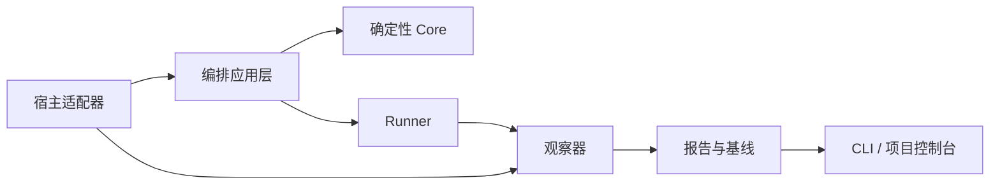

# OpenCode 插件模式问题复盘与后续 SDLC 编排参考

- 状态：经验复盘，供后续架构与编排设计参考
- 日期：2026-08-03
- 基线：SDLC Pipeline 0.25.0
- 证据：`CHANGELOG.md`、当前实现与回归、隔离项目真实 `init → spec → code → test` 运行

本文总结 SDLC Pipeline 在 OpenCode 插件模式下经历的主要问题、已完成的修复、仍然存在的
结构性风险，以及后续 SDLC Factory 和流程编排必须遵守的边界。本文不是当前插件的机器合同，
不改变现有 Task 状态机。

## 1. 结论

当前插件已经从包含 Source 摄取、Context Pack、Candidate Revision、目录权限和复杂运行恢复的
重型实现，收敛为一个轻量的单 Task 交付状态机。这个方向适合快速验证 OpenCode 中的
`Spec → Code → Human Review → Test → Finalize` 流程。

实际迭代证明，主要问题不是缺少更多门禁或更多提示词，而是曾把以下不同责任放进同一个插件：

- 项目与工作项管理；
- Agent 角色编排；
- 会话上下文管理；
- 外部参考资料管理；
- 生命周期状态机；
- 构建和测试执行；
- 运行观测与性能诊断；
- 正式产物存储。

后续架构应以确定性 Core 为中心，但不能让 Core 变成文件摄取器、会话管理器、提示词生成器或
宿主专属 Hook。插件是宿主适配器，不是软件工厂的完整领域模型。

## 2. 当前基线

0.25.0 当前只管理一个活动 Task，状态为：

```text
spec
→ awaiting_spec_approval
→ code
→ human_review
→ test
→ awaiting_release_approval
→ finalized
```

返工通过显式事件完成：

- `implementation_issue`：Human Review/Test 回到 Code；
- `requirements_issue`：Human Review/Test 回到 Spec；
- `test_issue`：留在 Test 并开始新的测试迭代；
- `review_passed`：Human Review 进入 Test；
- Finalized 后发现问题：创建关联的新 Task。

当前边界：

- OpenCode 管理会话和子代理上下文；
- 插件管理宿主工具、Task 派发和事件接入；
- Python Core 管理 Task 状态、正式 Spec、门禁和证据；
- 外部资料由 OpenCode 按用户授权读取；
- Git 管理正式代码和文档历史；
- 插件不自动执行 Git 回滚，也不恢复 OpenCode 会话。

截至本文生成时，当前源码回归为 40 项通过，JavaScript 语法检查和 `git diff --check` 通过。
这些结果证明 Core 和 Adapter 的局部合同成立，不等于真实 OpenCode 全流程、真实业务功能和发布
在任意项目中都已自动通过。

## 3. 演进过程暴露的架构信号

| 阶段 | 引入的主要能力 | 后续暴露的问题 |
|---|---|---|
| 0.7 | 原始输入、结构化分析、Context Pack | 上下文逐渐重复、正文和索引职责混合 |
| 0.9 | SourceEnvelope、Anchor、Journal、证据边 | Source 和运行模型进入 Core，复杂度明显增加 |
| 0.10 | Feature Contract、失败熔断、Delivery Memory | 单功能合同难覆盖真实大型需求和返工 |
| 0.12–0.13 | 聚焦检查、异步进程、Coder 步数和 Deadline | 固定预算不能解决任务切片过大和模型长推理 |
| 0.14 | 分片 Candidate、Revision、结构化 Spec 工具 | 模型频繁猜 ID、字段和 Schema，工具交互膨胀 |
| 0.15 | Storage Layout v3、Source/Candidate/Record 分层 | 存储和摄取成为产品主体，偏离交付主线 |
| 0.25 | 紧凑阶段 Brief、Pending Spec、确定性 Reverify | 恢复轻量，但 Handoff、Hook 和观测仍未完全解耦 |

这段演进说明，不能继续采用“每发现一个 Agent 异常，就增加一个字段、目录、门禁或子系统”的
升级方式。新能力必须先回答：它属于 Core 事实、宿主行为、运行遥测，还是仅仅属于提示建议。

## 4. 实际全流程测试结论

最近一次完整隔离运行完成了 `init → spec → code → test`，停在
`awaiting_release_approval`，没有自动发布。记录中的主要性能数据为：

- Spec 生成约 5 分 49 秒；
- Coder 约 17 分钟；
- Tester 约 6 分钟；
- Spec 有一次模型推理达到 4096 Token，约 149 秒；
- 没有发现同一路径重复读取；
- 慢主要来自各角色读取大量不同资料、模型长推理和工具调用后的继续生成；
- Token 总表混入终止、重试和最终成功会话，不能代表一次干净运行成本；
- Provider 返回的 `cost=0` 不能证明实际成本为零。

该运行还证明，固定 `sleep` 不是 OpenCode 执行方式本身，只是旧监督脚本的轮询方式。正确实现应
直接等待前台进程、事件流或会话终态，并在结束后补全根会话和子会话记录。

因此，性能问题不能用“Spec 最多读取六次”“禁止读取 CSS/JavaScript”“目录最多 64 个文件”
等固定门禁解决。应观测无进展重复、输出体积、错误指纹、阶段耗时和历史基线，在异常时告警或
请求人工决定。

## 5. 问题矩阵

| 问题 | 实际表现 | 0.25.0 状态 | 后续编排约束 |
|---|---|---|---|
| Core 负责外部资料 | 递归扫描、复制、Hash、Anchor、`sources/SRC-*` | 已删除 | Core 只保存正式需求和产物引用 |
| 原格式被破坏 | PNG 等二进制被转成 Markdown 内容 | 已删除 | 交付需要的资产由实现者原格式复制到目标项目 |
| 目录文件数门禁 | 大目录超过固定数量后 Spec 卡死 | 已删除 | 读取量只观测，不按固定次数阻断 |
| 角色目录 ACL | Main/Coder/Tester 无法读取或修改任务所需文件 | 已删除 | 角色表示职责，权限由统一安全策略管理 |
| Context Pack 膨胀 | Main、Hook、子代理重复注入需求、Spec 和源码清单 | 已改为紧凑 Brief | 通过引用和按需选择提供上下文 |
| 单个 Coder 任务过大 | 六项需求在 300/600/900 秒仍超时且无 Handoff | 未由 Deadline 解决 | 按可验收纵向切片执行 |
| Schema 由模型猜测 | ID、关联字段、Selector 和扩展点反复提交失败 | 已大部分由 Core 规范化 | 可派生字段必须由 Core 生成 |
| Handoff 解析脆弱 | `<task_result>` 包装、解释文字或围栏导致 JSON 失败 | 当前使用容错提取 | 改为结构化 Handoff 工具或 Output Schema |
| 新反馈仍复验旧结果 | 明确测试修复反馈到达后仍可能优先 Reverify | 仍有顺序风险 | 新事实先失效旧执行计划，再选择动作 |
| Tester 与 Core 重复验证 | Tester 完整运行 compile/lint/test，Core 再执行一遍 | 已通过 Brief 收敛 | Agent 做聚焦验证，Runner 做权威验证 |
| Mandatory 假通过 | `SKIP + exit 0` 可满足测试门禁 | 已修复为仅 `pass` 通过 | 结果原生区分 pass/fail/skipped/blocked |
| 原始输入被改写 | 模型转义、引号变化或保存前去除首尾空白 | 未严格解决 | Host 必须在模型前按字节保存并计算 Hash |
| Secret 混入输入 | 密码可能随命令参数进入 `input.md` 或日志 | 未建立完整通道 | 凭据只由运行时 Secret Provider 注入 |
| 成本零值歧义 | Provider 未返回成本时保存为 `0` | 未解决 | 区分实际值、估算值和 unavailable |
| 父子时间重复计算 | Main 等待时间和子代理耗时被简单相加 | 观测不足 | 用 Span 和墙钟区分包含关系 |
| 一次会话等于一次任务 | 项目能力被多个 Pipeline 割裂 | 当前只支持单 Task | Factory 增加 Project、Plan、WorkItem 和 RunRecord |
| 自动回退语义不清 | 回到 Code/Spec 被误解为自动恢复 Git | 当前只做状态迁移 | 证据失效与源码回退必须分离 |

## 6. 当前实现仍存在的风险

### 6.1 Handoff 仍依赖聊天文本

`scripts/sdlc_core/adapter.py::_extract_json()` 会从 Agent 最终文本中寻找最后一个 JSON 对象。
Tester 输出丢失时，Core 还可以根据已声明测试文件的实际 Diff 生成恢复收据。

这比直接解析整个聊天稳定，但仍有风险：

- Agent 原本报告的 `open_issues` 可能随输出丢失；
- Core 根据文件变化生成收据，容易被误解为 Core 替 Agent 作出语义声明；
- 不同宿主对 Task 最终文本的包装方式可能继续变化。

后续应提供专用的 `handoff_submit` 命令或宿主结构化输出接口。Core 只验证结构化数据和实际 Diff，
不得从自然语言推断交付结论，也不得制造 Agent 没有表达的“无问题”声明。

### 6.2 Hook 仍承担长编排

当前 `tool.execute.before` 生成阶段 Brief，`tool.execute.after` 校验 Handoff、执行
compile/package/start/readiness 或 Test gate，并推进 Task 状态。

因此一个 OpenCode `task` 调用同时包含：

```text
子代理执行
→ Handoff 解析
→ Diff 校验
→ 生命周期门禁
→ 状态迁移
```

任何一步失败都会表现为同一次 Task 交互异常，使子代理失败、Hook 失败、Runner 失败和状态迁移失败
难以区分。后续 Hook 应只捕获事件和建立关联，长运行由显式 Operation Orchestrator 管理。

### 6.3 门禁和状态迁移不是一个原子操作

Reverify 和 Task 后置 Hook 都会先调用生命周期工具，再单独提交 Task Transition。如果门禁已成功而
第二次调用失败，会留下“证据已通过但 Task 状态未推进”的现场。

后续 Core 应提供类似以下原子动作：

```text
complete_code_gate(task_id, iteration, expected_hash)
complete_test_gate(task_id, iteration, expected_hash)
```

Core 在同一事务内校验绑定、保存证据并推进状态。重复调用返回相同结果，而不是再次执行门禁。

### 6.4 原始输入并非严格字节级保存

当前 `record_input()` 在写入前使用 `text.strip()`。此外，文本先经过模型决定是否调用工具，再到达
Core，无法证明它与用户提交的原始字节完全一致。

后续应由 Host Adapter 在模型处理之前保存：

```text
input_ref
input_hash
captured_at
content_type
redaction_status
```

模型收到引用或脱敏副本。Secret 不进入普通需求输入。

### 6.5 Token 和成本只能做粗粒度统计

当前插件按 Agent 阶段累加完成消息的输入、输出、推理、缓存和成本，但缺少：

- `run_id`、根会话和子会话关系；
- 阶段起止和人工等待；
- 每个工具调用的耗时与结果体积；
- 成功路径、取消路径和返工路径；
- 成本来源和可信度；
- Provider 未返回成本时的 `unavailable` 状态。

这些数据不足以独立判断提示词是否爆炸、Context 是否浪费，或者某次优化是否真正有效。

### 6.6 合同文档仍有轻微漂移

`docs/operational-boundaries.md` 仍写着 Core 管理“写入范围”，而 ADR-0006 已决定删除
`write-check`/`path-check`，范围只用于 Diff 审计。后续应建立单一领域词汇和合同测试，避免 README、
ADR、Agent 提示词与实现分别表达不同边界。

## 7. 后续 SDLC 编排职责



### 7.1 Core

负责：

- Project、DeliveryPlan、WorkItem、TestBatch 和 Operation 状态；
- 内容 Hash、版本绑定和证据失效；
- 审批和人工决定；
- 原子状态迁移；
- 必测结果语义；
- 正式产物引用和轻量 JSON 索引。

不负责：

- 读取用户整个外部目录；
- 保存或恢复 Agent 会话；
- 拼接长提示词；
- 决定某个模型应该读取几个文件；
- 实现 OpenCode 专属事件协议；
- 根据聊天文本猜测 Handoff。

### 7.2 编排应用层

负责：

- 大需求是否先进入 Plan；
- 工作项拆分和依赖；
- 角色选择与分层委派；
- 阶段上下文选择；
- 用户反馈分类；
- Retry、Reverify、Rollback 和 Stop 的决策；
- 调用 Core 和 Runner 完成一个原子业务动作。

### 7.3 Host Adapter

负责：

- 模型前捕获用户原始输入；
- 启动、等待和关联主会话/子代理；
- 将 OpenCode/Codex 事件转换为标准事件；
- 使用宿主提供的结构化输出；
- 安全注入运行时凭据；
- 处理宿主升级、重启和能力探测。

Host Adapter 不拥有生命周期真相。

### 7.4 Runner

负责确定性执行：

- tool probe；
- compile、lint、typecheck、package；
- start、readiness、functional test、cleanup；
- 命令、退出码、stdout/stderr 和产物证据；
- Windows 进程树、编码和 PID 身份。

Runner 不决定需求是否正确，也不批准交付。

### 7.5 Observer

负责：

- Run、Session、Turn、Model Step 和 Tool Span；
- 阶段墙钟、模型时间、工具时间和人工等待；
- Token、缓存、成本来源和可信度；
- 重复读取、无进展重试、错误指纹和输出体积；
- 成功路径、实际总量和返工开销；
- 基线对比与数据完整度。

Observer 只报告，不修改工作流状态。应优先提供稳定 CLI 和 JSON/JSONL，再由项目控制台和
Codex 分析适配器消费同一查询接口。

### 7.6 Agent、Skill、Hook 和规则

- Agent：承担专业判断和阶段交付；
- Skill：提供按需加载的专业流程和知识；
- Hook：捕获、关联、通知和轻量保护；
- 领域规则：表达编码、架构、协议、UI 和测试约定；
- Core Policy：只保存真正可确定执行的不变量。

角色隔离是可选执行策略，不是固定生命周期规则。Tester 独立检查具有较高价值；Coder 是否使用
独立上下文，应根据任务规模、模型能力和上下文成本决定。小而清晰的实现没有必要为了形式强制产生
新的长会话。

## 8. 必须固化的不变量

1. JSON 是索引，不保存会话正文、长错误或完整 Spec。
2. 正式 Markdown 只保存用户批准或交付需要的事实。
3. 原始输入在模型之前捕获，模型不能改写后再冒充原文。
4. 外部文件不是 Pipeline 产物，不复制为 `SRC-*` 仓库。
5. 图片、字体、压缩包等文件不得被通用转换为 Markdown。
6. Agent 角色是职责，不是目录 ACL。
7. 新用户反馈优先于旧 Handoff 和旧 Reverify 计划。
8. Handoff 必须结构化，不能依赖聊天尾部 JSON。
9. 必测项只有 `pass` 可以通过；`skipped` 和 `blocked` 不得假绿。
10. Gate 成功、证据保存和状态迁移必须原子化。
11. 固定文件数、读取次数和 Token 数默认只用于告警，不用于硬阻断。
12. 失败、取消和重试计入实际成本，但与成功路径分开报告。
13. 父子 Agent 时间不能简单相加为阶段墙钟。
14. Provider 未提供成本时必须记录 `unavailable`，不能记录为确定的零。
15. 回到 Spec/Code/Test 只表示工作流返工，不等于自动 Git 回滚。
16. Finalized 后发现问题创建关联 WorkItem，不改写已完成历史。
17. Hook 保持薄；长运行和状态迁移由应用层与 Core 完成。
18. 会话恢复属于宿主，不属于 Core。
19. 凭据通过运行时 Secret 通道注入，不进入需求、日志和 Git。
20. 任何“完整通过”声明必须同时有生命周期、功能、产物和发布边界证据。

## 9. 大需求与角色策略

### 9.1 大需求

当一个目标包含多个独立验收结果、跨模块、跨设备或存在协议和原型冲突时，先形成项目级
DeliveryPlan，再创建多个 WorkItem。Plan 负责拆分、依赖、风险和验收轮廓；每个 WorkItem 的
Spec 负责正式需求，不重复保存同一正文。

### 9.2 Coder

- 小任务可以由当前实现上下文直接完成；
- 需要专用代码模型、上下文较长或影响面较大时派发独立 Coder；
- 大任务按纵向切片派发，不通过不断延长 Deadline 维持单一任务；
- 每片形成结构化 Handoff，最后统一执行权威 Code gate。

### 9.3 Tester

Tester 默认保持独立上下文，因为其价值在于不继承 Coder 的结论。Tester 可以读取完整项目，但
Brief 应明确区分：

- 只读实现文件；
- 允许修改的测试文件；
- Handoff 允许声明的文件；
- Core 最终观察到的实际 Diff。

Tester 只运行新增 Selector 的聚焦检查；完整预检和权威测试由 Runner 执行。

## 10. 验证策略

后续验证采用四层，而不是每次都运行昂贵的真实全流程：

1. Core 单元测试：状态、Hash、审批、失效、幂等和原子迁移；
2. Adapter 合同测试：原始输入、结构化 Handoff、事件转换和 Secret 脱敏；
3. Trace Replay：使用固定 OpenCode/Codex JSONL 回放父子会话、错误和 Token；
4. 真实全流程：仅在版本候选和关键宿主变更时运行隔离项目。

真实全流程报告必须分别给出：

- Init、Spec、Code、Human Review、Test 和 Release Approval 状态；
- 每阶段墙钟、模型时间、工具时间和人工等待；
- 实际总 Token、成功路径 Token 和返工 Token；
- 成本值、来源和可信度；
- 工具失败、重试、Handoff 和门禁结果；
- 最终产物与需求、原型、协议和必测项的符合性。

业务代码能运行或人工验证成功，不能替代被阻塞的 Pipeline gate；同样，所有 Core 单元测试通过也
不能替代真实宿主集成和业务验收。

## 11. 后续升级决策

当前 `sdlc-pipeline` 应继续作为：

- OpenCode 单 Task 流程验证器；
- Core 状态和门禁原型；
- Host Adapter 与结构化 Handoff 的实验场；
- 真实失败场景的回归数据来源。

它不应继续扩展为项目管理界面、通用资料库、会话恢复系统或多项目软件工厂。这些能力应进入
独立的 SDLC Factory 应用层、Observer 和项目查询模型，并通过稳定接口复用当前已经验证的 Core
不变量。

下一阶段优先级：

1. 结构化 Handoff 和原子 Gate Transition；
2. Host 前置原始输入捕获与 Secret 通道；
3. Observer CLI、RunRecord 和 Trace Replay；
4. Project、DeliveryPlan 和多 WorkItem 编排；
5. 本地项目控制台和 Codex 独立分析适配器。
