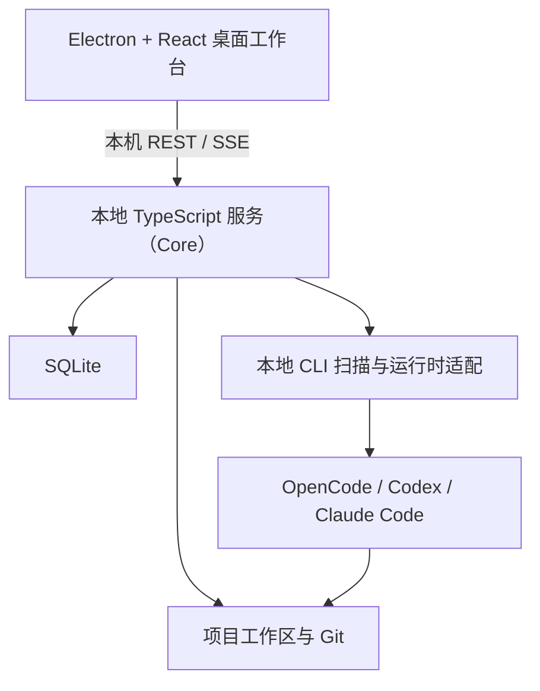

# SDLC Factory 重构设计

状态：已完成逐节确认，等待最终文档审阅

日期：2026-08-06

## 1. 设计结论

SDLC Factory 重构为本地优先的桌面软件开发工作台：交互和本地 CLI 运行机制参考 Open Design，流程提示参考 Claude Code Game Studios，正式审核与基线继续由 Factory 自己保证。

本次重构采用以下原则：

- 对话是正常的多轮对话，不绑定流程，也不携带可切换的流程上下文。
- `/sdlc-*` 命令显式触发对应 Skill；执行前读取当前事实，由 AI 提示缺口和建议命令。
- 阶段只用于定位和建议，不构成命令执行权限，不建立强制阶段门禁。
- 用户可以在看见风险提示后继续执行后续命令。
- AI 不能判断工作何时正式完成，也不能自行推进阶段或生成基线。
- 正式结果只有一条路径：工作内容 → 待审核版本 → 审核决定 → 基线。
- 保留必要的软件交付治理，不复制 `sdlc-pipeline` 的完整审批状态机、候选发布协议和恢复分支。

本设计将替代现有 `README.md` 和 `docs/v1.2` 中“阶段不能越级”“会话绑定阶段”“每个阶段由 Core 强制迁移”等目标设计。替换动作在本文通过审阅后执行。

## 2. 总体架构



### 2.1 桌面工作台

Electron 负责窗口、本地服务启动、文件选择和系统通知；React 负责项目导航、对话、输入框、右侧项目上下文及审核界面。界面只调用本地服务，不维护第二套业务状态。

### 2.2 本地 TypeScript 服务

本地服务是唯一产品控制面，负责：

- 项目与工作目录；
- 对话记录和流式事件；
- 本地 CLI 扫描、调用和原生会话恢复；
- 项目文件、变更、产物和证据索引；
- `/sdlc-*` 命令状态查询；
- 待审核版本、审核决定和基线；
- SQLite 事务和迁移。

不再为流程编排保留独立 Spring Boot 控制平面。现有 Java 实现只作为迁移来源，不再是目标架构组成部分。

### 2.3 本地 CLI 运行层

运行层扫描本机已安装且可用的 CLI。创建项目时选择默认运行时，项目中保持固定；模型和推理强度允许在每次输入时选择。显式更换运行时需要重新建立原生会话，不能因失败静默切换。

首批运行时为 OpenCode、Codex 和 Claude Code。运行差异全部收进各自适配器，不向 UI 和 SDLC Skill 暴露命令行参数、事件格式及恢复细节。

## 3. 对话实现

对话处理直接参考 Open Design 的实现方式，包括：

- 项目内持续多轮对话；
- 流式文本、工具过程、文件变更和错误事件；
- 捕获并恢复所选 CLI 的原生会话；
- 原生会话不可安全恢复时，用已有对话重新建立上下文；
- 上传、拖放、粘贴和再次引用项目文件；
- 从历史消息继续或分叉；
- 失败后保留已完成内容，在原对话继续工作。

`Conversation`、`Message` 和本轮运行记录只是实现对话所需的技术数据，不进入 Factory 领域语言，也不承担流程、审核或基线语义。不再定义消息工作上下文、对话当前流程、`AgentInvocation`、`InvocationAttempt` 或把聊天轮次包装成 `ExecutionRun`。

同一对话中的一条智能体回复结束，只表示本轮调用结束。它可以结束于完成、等待用户、中断或失败，不表示某个 SDLC 阶段完成。

## 4. 命令与阶段提示

首批命令保持少而明确：

- `/sdlc-init`：初始化项目所需内容；
- `/sdlc-spec`：澄清需求、总体设计和能力单元边界；
- `/sdlc-code`：针对明确目标实施代码修改；
- `/sdlc-test`：运行验证并整理真实结果；
- `/sdlc-review`：把当前精确内容提交给用户审核。

命令由对应 Skill 实现，不建设通用工作流引擎。所有 `/sdlc-*` Skill 采用相同的起始约定：

```text
用户执行命令
  → Skill 只读调用 sdlc_status
  → Core 返回当前建议阶段、最近命令状态、已有基线和明显缺口
  → AI 在当前对话中说明风险并推荐命令
  → 用户继续当前命令，或者自行执行建议命令
```

`sdlc_status` 根据实际文件、最新基线、待审核版本、最近命令状态和未解决事项解析当前工作位置，不从对话措辞猜测，也不锁定流程作用域。

当总体设计尚未完成而用户执行 `/sdlc-code` 时，AI 应在对话中显示：

> 当前仍处于总体设计工作。
>
> 尚未完成：
> - 能力单元边界尚未确认，建议执行 `/sdlc-spec`
> - 当前设计尚未审核，建议执行 `/sdlc-review`
>
> 你正在执行 `/sdlc-code`。可以继续，但可能基于未确认设计产生返工。

这里没有 Core 拒绝、统一命令拦截器或独立警告卡。用户确认继续后，当前 Skill 正常工作。AI 只能推荐命令，不能自动替用户执行。

当前命令只有以下情况可以停止：

1. 命令目标或参数不存在；
2. 缺少当前命令不可替代的直接输入，继续执行没有实际意义；
3. 操作违反安全、权限或数据完整性要求；
4. 正式审核或基线事务本身不满足一致性条件。

“上一阶段尚未完成”不能单独成为拒绝原因。

## 5. 审核与基线

面向用户统一使用“审核”，不再使用“Gate”或“门禁”。领域语言只保留：

- **工作内容**：多轮对话和项目工作中持续形成、仍可修改的内容；
- **能力候选**：尚未确定为正式能力单元的潜在业务能力；
- **能力单元**：用户确认边界并纳入设计基线的独立交付能力；
- **待审核版本**：`/sdlc-review` 固定下来的精确内容版本；
- **审核决定**：用户作出的通过、驳回或暂缓；
- **基线**：审核通过后形成的不可变权威结果。

审核流程为：

```text
/sdlc-review
  → 固定当前精确内容和内容摘要
  → 在对话内显示审核卡
  → 用户查看正文、差异、问题和证据
  → 通过 / 驳回 / 暂缓
  → 通过时原子写入审核决定和新基线
```

AI 可以在合适时机建议执行 `/sdlc-review`，但不能因为一次回复结束而自动发起审核，也不能代替用户作出审核决定。驳回或暂缓不覆盖现有基线，用户继续在原对话中修订。

审核和基线具有强一致性，但它们只约束正式结果，不扩张为所有开发命令的阶段门禁。

## 6. 最小数据结构

SQLite 只保存产品实际需要的数据：

- 项目及其工作目录、默认运行时；
- 对话、消息、附件和原生 CLI 会话标识；
- 本轮运行状态、所用模型、推理强度和流式事件；
- `/sdlc-*` 命令名称、开始时间、结束时间、结果和摘要；
- 项目文件、变更、产物和证据引用；
- 待审核版本、审核决定和基线。

不再保存：

- 对话绑定的生命周期阶段；
- 消息级工作上下文；
- 通用流程节点、流程分支和流程合并；
- 强制阶段迁移记录；
- 为聊天轮次建立的领域 `ExecutionRun`；
- `sdlc-pipeline` 式多层候选发布和恢复审批状态。

命令运行状态只是回答“是否仍在执行”和支持错误恢复，不拥有阶段推进权。

## 7. 桌面工作台

项目工作区采用三栏布局：

### 7.1 左侧项目导航

- 项目和最近对话；
- 当前选中的持续对话；
- 历史对话或分叉；
- 项目文件入口；
- 常用 `/sdlc-*` 命令。

### 7.2 中间多轮对话

- 用户和智能体消息按时间平铺；
- 工具过程、文件变更、测试、预览和错误跟随对应回复；
- 历史过程默认折叠，当前过程展开；
- 输入框支持模型、推理强度和多个文件；
- 审核卡直接出现在会话时间线中。

### 7.3 右侧项目上下文

右侧栏保留并支持隐藏、缩窄和页签切换，页签为：

- 概览；
- 文件；
- 变更；
- 产物；
- 证据；
- 审核与基线。

会话内卡片用于说明“本轮发生了什么”，右侧栏用于聚合“项目当前有什么”。两处展示同一事实，不建立两套数据。

宽屏显示三栏；中等宽度默认收起右栏，按需覆盖打开；窄屏将左右两栏变成抽屉。

## 8. 错误与恢复

- 同一对话同一时间只运行一个智能体回复；用户可以停止后继续输入。这是运行时串行约束，不是流程门禁。
- CLI 退出、网络、认证或模型错误只结束本轮运行，不改变审核和基线。
- 原生会话可以安全续接时恢复；模型、工作目录或会话游标不一致时重新建立原生会话并恢复对话上下文。
- 部分输出和已经完成的工具结果保留在原消息内，但不自动成为正式产物或证据。
- 未运行、未知、超时、跳过和校验器异常不能被记录为验证通过。
- 禁止无限自动重试和失败后静默切换运行时或模型。

## 9. Open Design 与 Claude Code Game Studios 的复用边界

### 9.1 直接参考 Open Design 代码

- 本地 CLI 注册、扫描和故障隔离；
- OpenCode、Codex、Claude Code 的启动、事件解析和原生会话恢复；
- 对话消息流、工具事件、停止和错误内嵌；
- 模型选择、推理强度和文件上传；
- 左侧项目导航、主对话工作区和可收起的右侧栏；
- Skill 包扫描、安全复制和路径校验。

迁移代码时必须固定所参考提交、保留 Apache-2.0 要求，并逐项核对第三方 Skill、插件和素材许可证。参考源码和验证结论见[《Open Design 官方源码审计》](../../research/open-design-official-source-audit-2026-08-06.md)。

### 9.2 只参考 Claude Code Game Studios 的 Skill 约定

- 通过显式 Slash 命令进入工作；
- 执行前读取项目阶段和产物事实；
- AI 列出未完成事项并推荐具体命令；
- 用户决定继续还是返回补充；
- 不自动执行推荐命令，不建设全局阶段拦截器。

参考源码和验证结论见[《Claude Code Game Studios 工作流引导机制审计》](../../research/claude-code-game-studios-workflow-guidance-audit-2026-08-06.md)。

### 9.3 明确不复用

- Open Design 的宽松 Atom Pipeline；
- 缺少观测结果时默认成功；
- 把完整 Skill、记忆和插件内容无边界堆叠进提示词；
- `sdlc-pipeline` 的全阶段状态机、强制越级拒绝和多层审批恢复；
- 通用工作流画布、可配置流程语言和后台自动推进。

## 10. 当前实现迁移方向

1. 保留 Electron + React 外壳，按 Open Design 工作台重构项目页。
2. 以 TypeScript 本地服务替代 Spring Boot 控制平面，并迁移仍有价值的项目、审核、基线和证据逻辑。
3. 从 Open Design 提炼运行时扫描、适配器、对话流和原生会话恢复代码。
4. 将现有阶段 Skill 改为显式 `/sdlc-*` 命令，并统一增加 `sdlc_status` 起始步骤。
5. 删除阶段越级拒绝、会话阶段绑定、消息工作上下文和通用流程状态机。
6. 将 `Gate`、`StageSubmission` 等用户界面和合同统一改为审核、待审核版本和审核决定。
7. 保留不可变基线、真实证据和审核事务；简化其外围状态。
8. 重写 README 和旧 `docs/v1.2`，只保留通过审阅后的最终设计。

## 11. 验收标准

重构完成后必须可以真实演示：

1. 创建项目时只显示本机探测成功的运行时，并能进入持续对话。
2. 对话框可以选择模型和推理强度，可以上传多个文件。
3. 多轮对话、工具过程、文件变更和失败恢复按时间线正常工作。
4. 设计未完成时执行 `/sdlc-code`，AI 能指出具体缺口并推荐 `/sdlc-spec` 或 `/sdlc-review`。
5. 用户选择继续后 `/sdlc-code` 正常执行，Core 不以阶段顺序拒绝。
6. `/sdlc-review` 能固定精确内容，在会话内完成通过、驳回或暂缓。
7. 只有审核通过才形成不可变基线；AI 回复结束不能形成基线。
8. 左侧项目导航保留，中间为平铺多轮对话，右侧栏可隐藏并切换文件、变更、产物、证据及审核基线。
9. 应用重启后可以恢复项目、对话、项目文件和安全可续接的原生 CLI 会话。
10. 代码和文档中不存在把普通消息、聊天轮次或跨阶段命令映射为强制生命周期迁移的逻辑。

## 12. 首版不做

- 多用户、组织、角色权限和远程协作；
- 云端控制平面；
- 自定义生命周期或可视化流程编排；
- 后台自动执行下一条 `/sdlc-*` 命令；
- 多运行时自动故障切换；
- 自动从任意对话判断正式完成；
- 复杂记忆治理、评分流水线或通用插件编排。

首版只验证一个闭环：**本地项目持续对话 → 命令工作 → AI 阶段提醒 → 用户可继续 → 显式审核 → 形成基线。**
