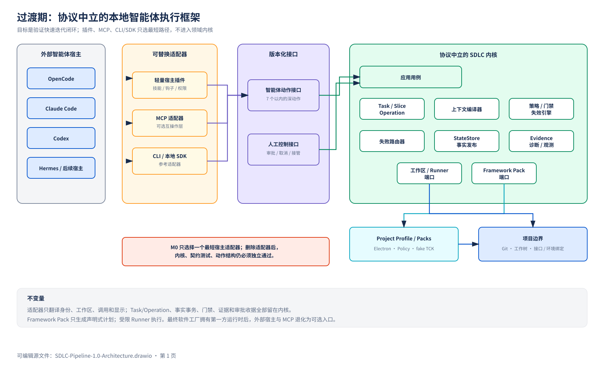

# SDLC Pipeline 1.0 主方案

状态：Conditional Go；仅允许 Gate 0 固化与技术探针，尚无实现验证

日期：2026-07-30

## 1. 定位

1.0 是一个本地、协议中立的 Project Harness：

> Core 管理 ProjectFacts、Task、Execution Slice、Operation、Gate、Evidence、审批和事实发布；Agent 负责生成与修改；Operator 负责真正的人类决定；Framework Pack 描述不同技术栈的执行能力。

1.0 只解决单项目快速迭代，不建设完整软件工厂平台。

### 1.1 目标

- Task 可跨 Session、模型和 Host 恢复；
- 大 Task 按 Requirement/AC 拆成可恢复 Execution Slice；
- 状态、门禁、失效和完成由 Core 确定性裁决；
- 人工审批与 Agent Action 分属不同信任域；
- 一个真实 Electron Framework Pack 跑通 build/test/start/readiness/functional/cleanup；
- Gate 绑定精确输入与 Evidence，只重跑失效范围；
- FileStateStore 在并发、幂等和崩溃后恢复到唯一状态；
- Adapter 删除后，Core、TCK 和 lifecycle 测试仍独立通过。

### 1.2 不进入 1.0

- 多项目控制面和远程服务；
- 第一方 Agent Runtime；
- 自动 commit、push、release 或 deploy；
- 动态多 Agent 组织；
- SQLite/服务数据库；
- hostile-code sandbox；
- 组织级 RBAC、配额、组合视图和自动学习。

这些能力只在 [2.0 演进路线](../v2.0/README.md) 中保留方向。

## 2. 主架构



1.0 由六个主要模块构成：

| 模块 | 责任 |
|---|---|
| Domain Kernel | TaskStage、OperationStatus、GateStatus、Suspension、失效规则和不变量 |
| Application | Use Case、幂等、乐观并发、FactChangeSet、审批与 Delivery |
| State/Evidence | 事件、快照、Evidence、Receipt、事务恢复和诊断引用 |
| Harness Runtime | Workspace、进程树、readiness、timeout、cancel、cleanup、redaction |
| Framework Pack | 项目识别、Capability 和声明式 ExecutionPlan |
| Adapters | reference CLI/SDK 与一个 Host Adapter；只做输入输出翻译 |

每个活动 Project 由本地 Core Supervisor 承载 Application、恢复和 Operation；项目命令进入独立 Runner Worker。调用与依赖方向固定：

```text
Host / Reference Adapter
  → Agent Interface 或 Operator Interface
  → Application Use Case
      → pure Domain Kernel
      → StateStorePort
      → FrameworkPackPort
      → HarnessRuntimePort
```

Application 编排 Port；Domain 不依赖基础设施。Adapter、Framework Pack、Runner 和 Host hook 都不能拥有 Task 生命周期真相。进程拓扑见 [ADR-002](adr/ADR-002-Local-Core-Runner-Topology.md)。

## 3. 主流程

```text
ProjectFacts
  → Task Open / Resume
  → Proposal + Slice Plan + FactChangeSet
  → Spec Validate
  → Operator Approve Spec
  → Implement Slice
  → slice / review-entry Gate Operation
  → Failure Router
      ├─ product → Implementing
      ├─ spec → Draft + Spec Approval stale
      ├─ test_contract → 按 fault_origin 修测试或挂起 Pack/parser
      ├─ infrastructure → 有限重试后 Suspension
      └─ environment/policy/revision/budget → Suspension
  → Operator Accept Review
  → acceptance / delivery gates
  → Delivery Preview
  → Operator Approve Delivery
  → internal facts_finalize Operation
  → Finalized
```

核心规则：

- Task 是批准与交付边界，不是无限大的执行容器；M0 记录 rollback strategy，但不承诺普通工作区自动回滚；
- Execution Slice 是 Task 内按 Requirement/AC 划分的纵向结果；
- Attempt 绑定 `slice_id + phase`；
- 长 Gate 由 Operation 表达，Host 断开不等于取消；
- Suspension 保留 `resume_stage`，恢复时不能猜测阶段；
- Finalized 不回退，后续问题创建关联 Task；
- 未知变化默认保守失效；
- 完成声明必须能追到当前 Revision Vector 的新鲜 Evidence。

详细状态与 revision 规则见 [附录 A](appendices/A-domain-and-lifecycle.md)。

## 4. 协议中立接口

### 4.1 Agent Interface

M0 最多暴露 7 个动作：

| Action | 作用 |
|---|---|
| `sdlc_status` | 返回 Task、Slice、Operation、Gate、Suspension 和下一步 |
| `sdlc_task_open` | 创建 Task 或显式恢复已有 Task |
| `sdlc_context_get` | 编译当前动作的最小上下文 |
| `sdlc_spec_validate` | 校验并冻结 Proposal、Plan 和 FactChangeSet |
| `sdlc_gate_run` | 创建 Gate Operation，立即返回 operation ID |
| `sdlc_observation_record` | 记录 Agent/Test/Parser observation |
| `sdlc_delivery_prepare` | 验证 Evidence 并生成 Delivery Preview |

Agent Interface 不暴露审批、豁免、Git、发布、状态跳转或原始模板命令。

权威请求见 [AgentActionRequest](contracts/agent-action-request.schema.json)，统一结果见 [ActionResult](contracts/action-result.schema.json)。`sdlc_task_open(create)` 必须使用空 `task_id/expected_task_version`；resume 和其余 Task 动作必须显式绑定 Task 版本。长操作只返回 `accepted + operation_id`。

### 4.2 Operator Interface

Operator 负责：

```text
approve spec
accept review
approve delivery
suspend / resume
reconcile revision
cancel Task / Operation
diagnose show / export
```

M0 Receipt 使用 `local_unverified`，但请求仍必须来自 Agent/Runner 权限域之外的 Operator channel。远程身份与签名不在 1.0 范围。

权威请求见 [OperatorActionRequest](contracts/operator-action-request.schema.json)，可信决定见 [OperatorReceipt](contracts/operator-receipt.schema.json)。Environment、Pack 和 Policy binding 使用独立 Operator Action 与 revision，不能混入普通 FactChangeSet。

### 4.3 三个核心 Port

```text
StateStorePort
  load(project_ref, task_id)
  commit(task_commit)
  recover(project_ref)

FrameworkPackPort
  describe()
  inspect_project(project_view)
  plan(capability_request)

HarnessRuntimePort
  run(execution_plan, revision, environment, cancellation)
  inspect(operation_ref)
```

这些接口保持小而深；Domain 先完成裁决，Application 再提交 [TaskCommit](contracts/task-commit.schema.json)。文件、进程、Parser、Probe、Clock 等实现细节留在 Adapter/Runtime 内部。

## 5. 数据与事实

ProjectFacts 是已完成 Task 形成的当前有效需求、架构、接口和验证事实。Task 只保存增量：

```text
Proposal
Execution Slice Plan
FactChangeSet
Attempt / Operation / GateRun
Evidence refs
Operator Receipts
Delivery
```

Spec Approval 冻结增量但不立即改写 ProjectFacts。Delivery Finalization 重新检查 revision 和 Evidence，事务性应用 FactChangeSet，成功后才生成新的 `facts_revision` 和 Finalized。

Delivery Approval 只产生 Receipt；Core 随后执行不可由 Agent 调用的 `facts_finalize` Operation。Finalized 必须生成不可变 [DeliveryManifest](contracts/delivery-manifest.schema.json) 与 source bundle，使当时源码状态可审计和重建。

JSON 只保存索引、状态、ID、哈希和引用；可阅读的需求、决策、计划和交付摘要使用 Markdown。目录及写入者规范见 [附录 D](appendices/D-project-document-layout.md)。

## 6. Framework Pack 与 Runner

Framework Pack 只生成声明式 ExecutionPlan，不直接执行命令或修改状态。1.0 提供：

- 一个 `electron-react` 真实 Pack；
- 一个 fake Pack 用于 TCK；
- `project.inspect`、`dependencies.restore`、`code.check`、`test.unit`、`app.start`、`app.ready`、`test.functional`、`app.stop`、`package.build`；
- Pack digest pinning、输入/输出、路径、环境、Secret、网络、资源、readiness、cleanup 和 invalidationInputs。

Runner 安全等级为 `local_constrained`：clean environment、canonical path、进程树回收、timeout、临时 Electron profile、端口回收、Secret/日志脱敏和资源上限。无法强制的限制必须进入 Receipt，不能静默忽略。

详细契约见 [附录 C](appendices/C-framework-pack-and-runner.md)。

## 7. 1.0 交付阶段

### M0：Contract & Canary

固化领域词汇、机器可解析矩阵、Manifest/Action Schema、Core Supervisor、FileStateStore、Windows Runner 探针、fake TCK、Electron canary 和 reference adapter。canary、CrashPoint 和 Shadow Replay 只在可丢弃隔离 clone/worktree 内运行。

退出条件：

- 故障注入下状态可恢复；
- Host 断开后 Supervisor 仍拥有 Operation；
- Gate 失效可由 input digest 重算；
- 真实 Electron 流程完成 start/readiness/functional/cleanup；
- Agent Interface 及正常工具权限不能产生 Operator Approval；同一 OS 用户完全失陷不在 M0 保证内；
- 每个 Finalized Task 均可导出 DeliveryManifest 和 source bundle；
- Adapter 删除后 Core/TCK 仍通过。

### M1：Local Project Harness

增加 Task worktree provider、revision reconciliation、第二 Adapter conformance、浏览器可读 Evidence、显式 Git commit 集成和一个合规 canary。

1.0 完成条件：

- 两个真实项目持续使用；
- 两个基于同一旧 revision 的 Task 能确定性协调；
- 跨 Session 恢复和定向返工稳定；
- 一个 CSCI/接口追溯或 SBOM canary 通过；
- Delivery 仍不自动 push。

实施切片、timebox、26 个黑盒场景和停止条件见 [附录 E](appendices/E-delivery-and-acceptance.md)。

## 8. 开工前必须确认

1. Task / Execution Slice / Operation 的语义和矩阵；
2. Revision Vector、GateInputManifest 和 Reconciliation；
3. FactChangeSet 与 FileStateStore 恢复事务；
4. Agent/Operator 信任域；
5. Interface Catalog、Environment Binding 和 Secret Ref；
6. ContextBundle、WorkspaceManifest、FactChangeSet、DeliveryManifest 和 Error Envelope；
7. Framework Pack / Runner enforcement matrix；
8. 遵循已接受的 [ADR-002 本地运行拓扑](adr/ADR-002-Local-Core-Runner-Topology.md)；
9. 遵循已接受的 [ADR-001 Core 切换策略](adr/ADR-001-Core-Cutover.md)。

## 9. 详细文档

- [A：领域与生命周期](appendices/A-domain-and-lifecycle.md)
- [B：状态、证据与恢复](appendices/B-state-evidence-and-recovery.md)
- [C：Framework Pack 与 Runner](appendices/C-framework-pack-and-runner.md)
- [D：项目文档与目录规范](appendices/D-project-document-layout.md)
- [E：实施切片与验收](appendices/E-delivery-and-acceptance.md)
- [F：评审意见处置](appendices/F-review-disposition.md)
- [1.0 机器可解析合同](contracts/README.md)
- [ADR-001：Core 切换策略](adr/ADR-001-Core-Cutover.md)
- [ADR-002：本地 Core/Runner 运行拓扑](adr/ADR-002-Local-Core-Runner-Topology.md)
- [可编辑架构图](diagrams/SDLC-Pipeline-1.0-Architecture.drawio)
