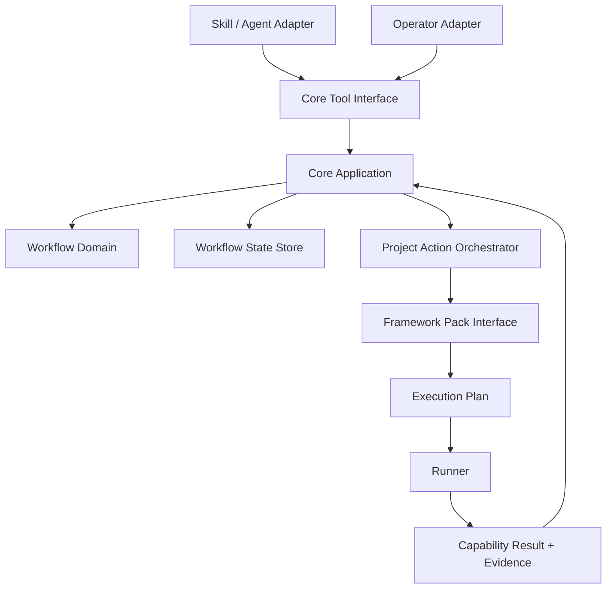

# SDLC Factory 1.0 主方案

状态：Draft

日期：2026-07-31

## 1. 定位

1.0 解决四个问题：

1. 框架模板实现统一 Capability；
2. Core 组合 Capability，并向大模型隐藏框架概念；
3. 多个 WorkItem 分别推进需求、实现和人工审核；
4. 多个已审核 WorkItem 可以汇总到同一 TestBatch 统一测试。

1.0 是本地单 Project Core，不建设通用软件工厂、知识库或长期记忆系统。

### 1.1 目标

- 前端单模块和前后端多模块使用同一套 Project Action；
- Framework Pack 只描述和实现能力，不拥有流程状态；
- Skill/Agent 只调用项目级工具，不拼接框架命令；
- 需求、实现、人工审核、测试和执行均有明确状态；
- TestBatch 绑定精确 Requirement Version 和 Source Revision；
- Markdown 保存可读事实，JSON 保存状态索引，Evidence 保存运行结果；
- 同一 Core 串行提交状态变更，同时允许多个 WorkItem 处于活动状态。

### 1.2 不进入 1.0

- 多项目控制面、远程调度和组织级权限；
- 多 worktree 自动合并、revision reconciliation 和精细 Gate 失效矩阵；
- 常驻 Supervisor、租约、心跳和 Host 断开后继续执行的保证；
- WAL、事件回放、崩溃点注入和自动修复损坏状态；
- hostile-code sandbox、网络策略和资源配额；
- legacy Core 的 Shadow Replay 或迁移协议；
- llmwiki、向量数据库、Mem0 或其他会话记忆；
- 自动 commit、push、release 和 deploy。

## 2. 架构



依赖方向固定：

```text
Adapter
  → Core Application
      → Workflow Domain
      → Workflow State Store
      → Project Action Orchestrator
          → Framework Pack Interface
          → Runner
```

| 模块 | 责任 |
|---|---|
| Workflow Domain | WorkItem、TestBatch、Operation 的状态与 Guard |
| Core Application | 身份、权限、状态转换、项目动作编排和 Evidence 关联 |
| Project Action Orchestrator | 把项目级动作解析为一个或多个模块 Capability |
| Framework Pack | `describe / plan / interpret`，隐藏框架命令和结果格式 |
| Runner | 按 Execution Plan 启动进程、超时、停止和收集结果 |
| Adapter | 把 CLI、MCP、Skill 或 Agent 调用翻译为 Core 请求 |

Core 是否嵌入 Host、以 CLI 启动或作为本地长进程运行属于实现选择，不写入领域合同。1.0 只要求同一次运行中的 `app.start`、`app.ready` 和 `app.stop` 可以通过 Runtime Handle 关联。

## 3. 领域模型与主流程

### 3.1 WorkItem

WorkItem 的三个状态轴相互独立：

```text
Requirement:    draft → published
                     └→ withdrawn
Implementation: not_started → in_progress → completed
Review:         not_requested → pending → approved / changes_requested
```

“人工是否审核”不是布尔值。Review Decision 必须绑定具体 Requirement Version 和 Source Revision；需求或源码变化后，原决定仍保留为 Evidence，但不再满足当前版本。

### 3.2 TestBatch

```text
planned → running → passed / failed / cancelled
任一 Verification Subject 变化 → stale
```

TestBatch 只接收当前 `Implementation=completed` 且 `Review=approved` 的 WorkItem。每个 Verification Subject 固定：

```text
work_item_id
requirement_version
requirement_hash
source_revision
review_version
```

测试结果属于 TestBatch。WorkItem 的“最新测试状态”由 Core 查询匹配当前版本的 TestBatch 推导，不再重复存储一份可人工修改的状态。

### 3.3 主流程

```text
Agent 创建或更新 WorkItem requirement
  → Operator 发布 Requirement Version
  → Agent 标记 implementation started
  → Agent 完成实现并提交 Source Revision
  → Agent 提交 review
  → Operator approve / request_changes
  → Agent 创建包含 N 个 WorkItem 的 TestBatch
  → Core 校验每个 Verification Subject
  → Core 执行 project.test
  → TestBatch passed / failed + Evidence
  → 按需执行 project.build / project.package
```

多个 WorkItem 可以并行处于不同阶段，但 State Store 只有 Core 一个写者，并使用 `expectedVersion` 串行提交状态变更。1.0 不负责多个 Agent 对同一工作区的代码合并。

完整 Guard 见[附录 A](appendices/A-domain-and-lifecycle.md)。

## 4. 两级接口

Framework Capability 和大模型 Tool 不是同一层接口。

### 4.1 Framework Pack Interface

```text
describe()                         → CapabilityDescriptor[]
plan(capability, module, inputs)   → ExecutionPlan
interpret(raw_execution)           → CapabilityResult
```

标准 Capability：

```text
project.inspect
dependencies.restore
code.check
build.compile
package.build
app.start
app.ready
app.stop
test.run
```

这些能力只供 Core 编排。具体命令、工作目录、输出解析和框架类型留在 Pack 内。

### 4.2 Core Tool Interface

Skill/Agent 最多看到四类工具：

| Tool | 作用 |
|---|---|
| `sdlc_status` | 查询 Project、WorkItem、TestBatch 或 Operation |
| `sdlc_transition` | 请求 Agent 可执行的领域动作 |
| `sdlc_execute` | 执行 `project.inspect/check/build/start/stop/test/package` |
| `sdlc_operation_get` | 查询运行结果、诊断和 Evidence |

Agent 可请求创建/更新需求、开始/完成实现、提交审核、创建 TestBatch 和取消未运行批次。以下动作不出现在 Agent Tool Schema 中，只能由独立 Operator Adapter 调用：

```text
requirement.publish
requirement.withdraw
review.approve
review.request_changes
```

Skill 和 Agent 都只是 Adapter，不能绕过 Core Guard。机器请求见 [Core Tool Schema](contracts/core-tool-request.schema.json)。

## 5. 项目与框架组合

Project Profile 描述模块和项目动作路由。例如：

```yaml
apiVersion: sdlc.factory/v1
kind: ProjectProfile
metadata:
  projectId: example
  name: Example Project
  profileVersion: 1
modules:
  - id: web
    role: frontend
    root: apps/web
    packRef: react-vite@1
  - id: api
    role: backend
    root: apps/api
    packRef: node-api@1
actions:
  project.start:
    steps:
      - moduleId: api
        capability: app.start
      - moduleId: api
        capability: app.ready
      - moduleId: web
        capability: app.start
      - moduleId: web
        capability: app.ready
  project.stop:
    steps:
      - moduleId: web
        capability: app.stop
      - moduleId: api
        capability: app.stop
```

前端项目只声明一个模块；前后端项目声明多个模块。Core 执行 `project.start`，大模型不需要知道模块使用什么框架。完整约定见[附录 C](appendices/C-framework-pack-and-runner.md)。

## 6. 数据边界

```text
Git 中 Markdown / YAML     正式需求、项目说明、Project Profile
.sdlc/index/*.json         Core 拥有的状态索引
.sdlc/evidence/**          日志、测试报告、构建结果
```

JSON 不保存需求正文、对话历史或大段日志。索引记录 ID、状态、版本、哈希、revision 和引用。Core 读取正文时校验索引中的内容哈希。

1.0 不引入额外 memory。项目上下文由 Core 根据当前请求从 Project Profile、Markdown 事实和状态索引即时选择；任何外部搜索缓存都不是状态或审批依据。

详细写入规则见[附录 B](appendices/B-state-and-evidence.md)和[附录 D](appendices/D-project-document-layout.md)。

## 7. 1.0 实施边界

1. 冻结六份最小机器合同；
2. 实现 Workflow Domain、JSON State Store 和四类 Core Tool；
3. 实现 Runner、fake Pack 和 Pack TCK；
4. 接入首个真实 Framework Pack；
5. 验证前端单模块与前后端组合；
6. 在真实项目中完成多 WorkItem 汇总 TestBatch。

实施顺序、验收场景和停止条件见[附录 E](appendices/E-implementation-and-acceptance.md)。

## 8. 详细文档

- [附录 A：领域与生命周期](appendices/A-domain-and-lifecycle.md)
- [附录 B：状态与证据](appendices/B-state-and-evidence.md)
- [附录 C：Framework Pack 与 Runner](appendices/C-framework-pack-and-runner.md)
- [附录 D：项目目录规范](appendices/D-project-document-layout.md)
- [附录 E：实施与验收](appendices/E-implementation-and-acceptance.md)
- [机器合同索引](contracts/README.md)
- [领域词汇表](../../CONTEXT.md)
