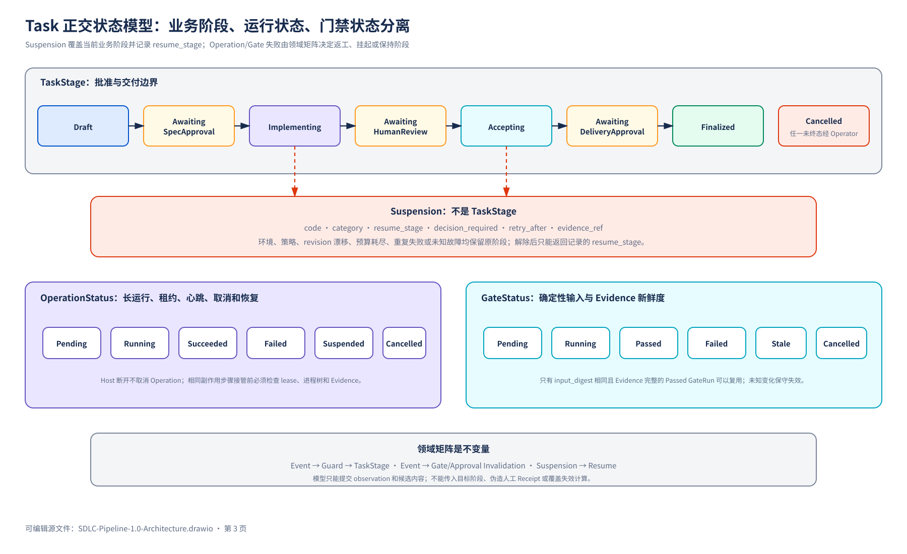
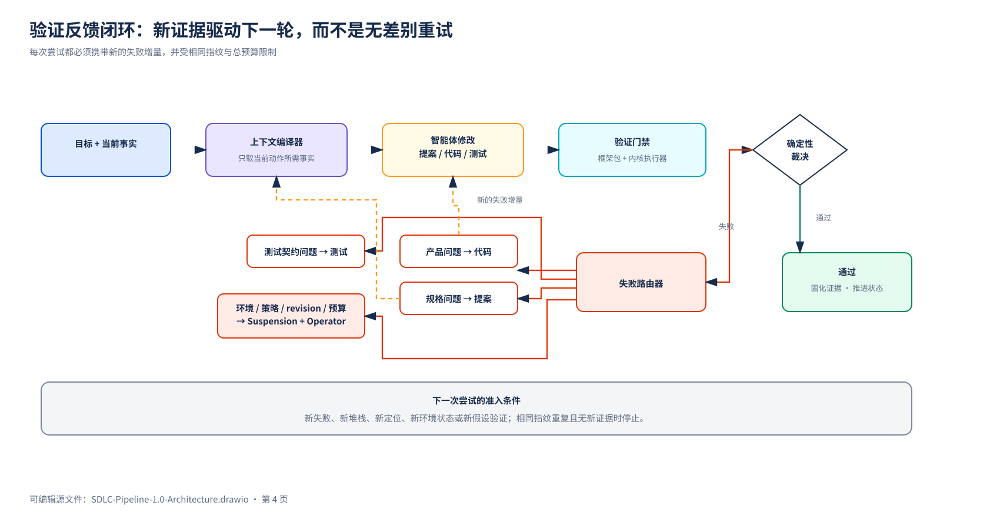

# 附录 A：领域与生命周期

本附录定义 1.0 的领域词汇、状态轴、Task 粒度、revision 协调和失败路由。主流程见 [1.0 主方案](../README.md)。

## A.1 领域词汇

| 概念 | 语义 |
|---|---|
| Project | 产品、仓库和权限作用域 |
| ProjectFacts | 已完成 Task 形成的当前有效需求、架构、接口和验证事实 |
| Feature | 稳定产品能力，用于组织 Requirement 和依赖 |
| Requirement / AC | 当前有效产品行为及验收条件 |
| Task | 一次可独立批准、交付和回滚的增量 |
| Execution Slice | Task 内按 Requirement/AC 划分的可恢复纵向结果 |
| Attempt | 某 Slice 某阶段的一次有预算执行 |
| Operation | 长运行的租约、心跳、取消和恢复记录 |
| GateRun | 一次确定性门禁运行 |
| Evidence | 日志、测试结果、截图、差异和运行收据的引用 |
| FactChangeSet | Proposal 对 ProjectFacts 的确定性补丁 |
| Revision Vector | Gate、Approval 和 Delivery 的完整输入版本 |
| Suspension | 阻塞原因、恢复阶段、所需决定和证据 |
| Delivery | Task 达到可交付状态的收据，不等于部署 |
| Session | Host 的临时交互入口，只作为 metadata |

1.0 不引入独立 `Change` 聚合。若未来需要把多个 Task 打包发布，新增 Release/Delivery Group，不复制 Task 生命周期。

## A.2 正交状态



### TaskStage

```text
Draft
AwaitingSpecApproval
Implementing
AwaitingHumanReview
Accepting
AwaitingDeliveryApproval
Finalized
Cancelled
```

### OperationStatus

```text
Pending
Running
Succeeded
Failed
Suspended
Cancelled
```

### GateStatus

```text
Pending
Running
Passed
Failed
Stale
Cancelled
```

`Skipped` 和 `Waived` 只为未来 Policy/Operator 能力预留，不进入 1.0 正常路径。

原来的 `Blocked` 不再是 TaskStage。阻塞使用 Suspension 覆盖当前阶段：

```json
{
  "code": "EXTERNAL_SSO_UNAVAILABLE",
  "category": "environment",
  "resume_stage": "Accepting",
  "decision_required": "provide_environment",
  "retry_after": null,
  "evidence_ref": "sdlc://evidence/..."
}
```

不变量：

- 模型不能传入目标 TaskStage；
- Operation 失败不自动等于 TaskStage 回退；
- Failure Router 生成领域事件，矩阵决定回退、挂起或保持；
- Suspension 解除后只能回到 `resume_stage`；
- Operator 可以取消任一非终态 Task；
- Finalized 和 Cancelled 不能互相转换；
- Finalized 后的新问题创建 `related_to` 原 Task 的新 Task；
- 历史 Evidence 不删除，只改变新鲜度。

Slice 0 必须把以下规则交付成可执行矩阵：

```text
Event → Guard → TaskStage
Event → Gate / Approval Invalidation
Suspension → Resume
```

## A.3 Task 粒度

Task 必须同时满足：

- 一个可清晰表达的业务交付目标；
- 一个闭合的 Requirement/AC 集合；
- 一个一致的审批范围、Delivery Preview 和回滚策略；
- 有限且可声明的影响范围；
- mandatory gates 可以枚举。

出现以下任一情况时拆成多个 Task：

- 多个结果可以独立批准、交付或回滚；
- Feature 之间没有必须同时成立的不变量；
- 需要不同环境、不同责任人或不同交付时间；
- 无法为整个变更给出有限、可复验的 Gate 集合。

跨 Feature 但必须原子交付时可以保留一个 Task，内部按 Requirement/AC 拆 Execution Slice。Slice 必须是端到端结果，不按“全部后端、全部前端”分层。

每个 Slice 完成后保存：

```text
slice_id
goal
covered_requirement_ids / ac_ids
base_revision_vector
changed_paths
handoff_ref
gate_delta
result_revision_vector
next_slice
```

Attempt 绑定 `slice_id + phase`。超过预算时缩小 Slice 或请求人工决定，不能只增加 Host timeout。

## A.4 Revision Vector

最小 Revision Vector：

```json
{
  "facts_revision": "sha256:...",
  "workspace_revision": "sha256:...",
  "framework_pack_digest": "sha256:...",
  "policy_digest": "sha256:...",
  "environment_binding_digest": "sha256:..."
}
```

`workspace_revision` 是受控路径 content manifest 的哈希，必须覆盖 tracked、staged、unstaged 和 untracked 文件，不能只使用 Git commit。

检查点：

```text
approve spec
acquire write lease
gate run
delivery prepare
delivery finalize
```

协调规则：

| 变化 | 处理 |
|---|---|
| Revision Vector 未变化 | 继续 |
| 变化与 Task scope、引用事实和 Gate 输入均不相交 | 生成 Reconciliation Receipt，更新基线并重算失效 |
| 相关事实、接口、环境或代码变化 | `RevisionDriftDetected` + Suspension；刷新 Proposal/FactChangeSet |
| 已批准 subject 受影响 | Approval stale，重新批准 |
| 文本或语义冲突 | 保持 Suspension，由 Operator 合并、拆分或取消 |

Core 不直接执行 Git rebase。Workspace Provider 只在隔离 worktree 中应用 Operator 选择，Core 随后重算 revision 和 Evidence。

M0 是单 Project、单活动可写 Task，但仍必须检测外部编辑导致的漂移。M1 才增加多 worktree Task 协调。

## A.5 Failure Router



Failure Router 不能只返回阶段，必须返回结构化 Failure Diagnostic：

```json
{
  "category": "test_contract",
  "fault_origin": "project_test",
  "repair_scope": ["tests/functional/**"],
  "responsible_actor": "agent",
  "retryability": "after_change",
  "resume_stage": "Implementing",
  "fingerprint": "sha256:...",
  "evidence_refs": ["sdlc://evidence/GATE-0007"]
}
```

字段语义：

| 字段 | 作用 |
|---|---|
| `category` | 决定领域路由，不得由 Agent 自报覆盖 |
| `fault_origin` | 标识故障来源，如 `product_code`、`project_test`、`pack`、`parser`、`runner`、`environment` |
| `repair_scope` | 限定下一轮允许修改的路径、Capability 或配置；未知时为空并挂起 |
| `responsible_actor` | `agent`、`operator`、`pack_maintainer` 或 `core_maintainer` |
| `retryability` | `after_change`、`transient` 或 `manual_only` |
| `resume_stage` | 修复或解除 Suspension 后唯一允许恢复的阶段 |
| `fingerprint` | 去重和预算判断的规范化失败指纹 |
| `evidence_refs` | 支撑分类的日志、测试、Parser 或环境证据 |

| Category | 默认处理 | 示例 |
|---|---|---|
| `product` | 回到 Implementing | 编译失败、业务测试失败、运行崩溃 |
| `spec` | 回到 Draft，Spec Approval stale | Requirement/AC/设计错误 |
| `test_contract` | `project_test` 回到 Implementing 且只开放测试 repair_scope；`pack/parser` Suspension 并路由对应维护者 | 测试脚本、fixture、Pack 或 parser 错误 |
| `environment` | Suspension，保留 resume_stage | 设备、端口、外部系统不可用 |
| `policy` | Suspension/Operator | Protected path、许可、安全策略 |
| `infrastructure` | 仅 `retryability=transient` 可在预算内重试，随后 Suspension | Runner、磁盘、网络临时失败 |
| `unknown` | 一次诊断 Attempt 后 Suspension | 无法稳定复现 |

`product` 与 `project_test` 都可能回到 Implementing，但 Context Compiler 必须根据 `repair_scope` 生成不同上下文和写路径。Pack/parser 问题不得通过修改业务代码重试；Runner/环境问题不得消耗产品修复 Attempt。

每次重试必须提供新的 failure delta：

- 新失败用例；
- 新堆栈；
- 新定位；
- 新环境状态；
- 新假设验证结果。

相同失败指纹连续出现两次且没有新的 failure delta，或超过 Attempt 预算时创建 Suspension，不继续无差别重试。
