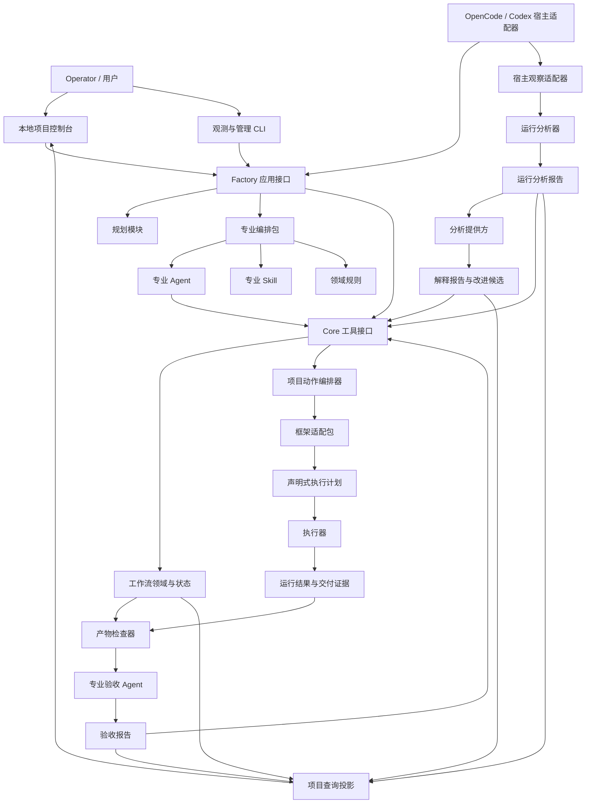
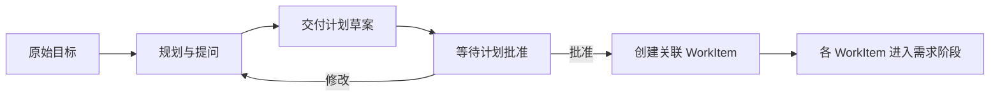

# SDLC Factory 1.1 主方案

状态：方案草案

日期：2026-07-31

## 1. 定位

SDLC Factory 1.1 是一个面向 AI 研发协作的本地软件交付体系。它在 1.0 的工作项、
测试批次、框架适配包和执行器基础上，补齐五类当前仍依赖 Codex 人工监督的能力：

1. 专业 Agent、Skills、Hooks、分层委派和领域规则；
2. OpenCode 运行过程的独立观察、工具调用审计、耗时与 Token/成本分析；
3. 最终产物与需求、设计、测试及运行证据的一致性检查。
4. 面向大需求的规划、提问、拆分和计划批准；
5. 项目级地图、观测 CLI、分析提供方和本地项目控制台。

1.1 的目标不是读取或保存模型私有思维链。系统只分析 OpenCode 和模型提供方明确暴露的
事件、时间戳、Token、工具调用、错误、文件访问和阶段结果，统一称为
**可观测推理行为分析**。

### 1.1 核心原则

- 专业 Agent 负责判断和协作，不能自证完成；
- Skill 保存可复用专业方法，不保存流程状态；
- Hook 只捕获宿主事件、关联身份和触发动作，不拥有生命周期真相；
- 领域规则区分可执行规则和指导规则，不把所有规则做成文件权限；
- Core 负责状态、不变量、人工决定绑定、权威门禁和正式发布；
- 框架适配包负责把技术栈差异编译成执行计划；
- 执行器负责命令、进程、超时、就绪检查、清理和脱敏；
- 运行分析不能替代产品验收，产品验收不能伪造运行事实；
- JSON 只保存状态、指标、哈希、ID 和引用，正文与报告使用 Markdown；
- 原始需求在进入模型前保存，模型只接收引用和经选择的上下文。

### 1.2 不进入 1.1

- 获取、展示或持久化模型私有思维链正文；
- 多项目远程控制面、云端调度和组织级权限；
- 第一方通用 Agent 运行时；
- 源码编辑器、通用 Jira 或云端项目协作平台；
- 面向恶意代码的强隔离沙箱；
- 向量数据库、会话记忆或自动知识库；
- 自动提交、推送、发布和部署；
- 根据固定 Token 或工具次数直接阻止正常研发；
- 让分析 Agent 代替 Operator 作出需求、审核或交付批准；
- 让观测器根据一次运行自动修改、提交或发布 Factory。

## 2. 1.0 到 1.1 的变化

1.0 继续提供以下基础能力：

- 工作项的需求、实现和人工审核状态；
- 多工作项聚合测试批次；
- 项目动作、框架能力、执行计划和运行结果；
- 状态索引、源码修订和运行证据。

1.1 新增：

| 新增模块 | 作用 |
|---|---|
| 专业编排包 | 管理 Agent、Skill、Hook、领域规则和分层委派 |
| 宿主观察适配器 | 捕获 OpenCode 会话、阶段、工具和 Token 事件 |
| 运行分析器 | 生成推理行为、工具调用、耗时、Token 和成本指标 |
| 产物检查器 | 检查需求覆盖、文件范围、测试绑定和证据新鲜度 |
| 专业验收 Agent | 对 UI、协议、架构和业务语义作独立审查 |
| 结构化交接工具 | 取代从聊天尾部提取 JSON 的脆弱协议 |
| 分析报告 | 区分实际总成本、成功路径成本和返工成本 |
| 交付计划 | 大需求先形成可批准的工作项拆分和依赖 |
| 观测 CLI | 脚本化启动、观察、导入、对账和生成报告 |
| 分析提供方 | 允许 Codex 等 Agent 通过稳定 Schema 分析运行 |
| 项目控制台 | 展示项目地图、工作项、时间线、成本和产物检查 |

1.1 不改变 1.0 的基本事实：Core 仍是状态和门禁的唯一裁决者，OpenCode 只是首个宿主。

### 2.1 本次升级的现实依据

当前 Pipeline 的 CHANGELOG 和完整流程测试共同暴露出一种反复：

- 外部资料摄取、目录复制和 `sources/SRC-*` 曾不断进入 Core，随后又因体积、格式和职责问题删除；
- 角色目录 ACL、写入检查和受限执行器曾被加入，后来发现它们混淆了角色职责和项目权限；
- Context Pack 多次缩减后仍造成大量注入，最终证明 Core 不适合替 Agent 决定全部阅读上下文；
- 候选产物、执行器、通用端到端测试和截止时间合同反复调整，说明宿主编排、框架执行和生命周期状态
  没有被稳定分层；
- 完整流程中又出现旧结果抢先复验、聊天 JSON 解析失败、必测项 `skip` 假通过、
  原始需求被模型改写等确定性问题。

因此 1.1 不是继续增加门禁，而是重新固定四条边界：

1. Core 只保留跨宿主、可确定性验证的工作流事实；
2. 专业编排包管理 Agent、Skill、Hook 和领域规则；
3. 宿主观察适配器独立采集 OpenCode 运行事实；
4. 产物检查器独立回答最终交付是否满足正式需求。

## 3. 总体架构



### 3.1 依赖方向

```text
OpenCode / CLI
  → Factory 应用接口
      → 规划模块
      → 专业编排包
      → Core 工具接口
      → 宿主观察适配器

Core
  → 工作流领域
  → 状态与证据
  → 项目动作编排器
      → 框架适配包
      → 执行器

运行分析器
  ← 宿主事件与模型用量
  → 分析报告

分析提供方
  ← 脱敏指标、报告和正式证据
  → 解释报告与改进候选

产物检查器
  ← 正式需求、源码修订、测试批次和交付证据
  → 验收检查结果

项目控制台 / CLI
  → Factory 应用接口
  ← 项目查询投影
```

宿主观察适配器、分析提供方、专业编排包和项目控制台不能直接修改工作流状态。它们通过
Factory 应用接口提交结构化动作或观察结论。Core 不解析 OpenCode/Codex 私有事件，也不理解
某个模型的聊天包装格式。

## 4. 职责边界

| 层次 | 应负责 | 不应负责 |
|---|---|---|
| Operator | 发布需求、审核实现、批准交付、取消和协调 | 伪造 Agent 或 Runner 证据 |
| 宿主适配器 | 原始输入捕获、会话关联、工具翻译、审批回执 | 工作项真相、门禁判定 |
| 规划模块 | 项目检查、问题收集、计划版本和 WorkItem 拆分 | 需求发布、代码修改、交付批准 |
| 专业编排包 | 角色选择、Skill 路由、分层委派、反馈分类建议 | 执行权威测试、直接发布状态 |
| Agent | 需求分析、设计、实现、测试设计、专业审查 | 批准需求、审核或交付 |
| Skill | 专业工作方法、步骤和检查表 | 状态机、审批和项目事实 |
| Hook | 捕获事件、记录关联、触发分析 | 长上下文注入、复杂路由、目录 ACL |
| 领域规则 | 编码、架构、UI、协议和测试约定 | 会话恢复、重试状态 |
| Core | 状态、不变量、人工决定绑定、门禁、失效和发布 | Prompt、模型选择、自然语言交接解析 |
| 框架适配包 | 能力描述、执行计划、结果解析 | 修改工作流状态 |
| 执行器 | 进程、超时、就绪、清理、日志和脱敏 | 判断需求是否合理 |
| 运行分析器 | 工具、Token、耗时、重试和异常模式分析 | 判断产品是否通过 |
| 产物检查器 | 覆盖关系、文件、哈希、证据和结构检查 | 代替人作业务决定 |
| 专业验收 Agent | UI、协议、架构和业务语义审查 | 直接将工作项标记完成 |
| 分析提供方 | 使用 Codex 等模型解释指标、归类问题和提出改进候选 | 修改状态、代码、Git 或审批 |
| 项目查询层 | 从 Core、报告和项目事实构建只读投影 | 保存第二份可写状态 |
| 项目控制台 | 展示项目、计划、运行、成本、产物和审批入口 | 解析状态文件、绕过应用接口 |

详细边界见[附录 A：专业协作与职责](appendices/A-professional-collaboration.md)。

## 5. 专业研发组织

1.1 使用“稳定负责人 + 按需专家”，不在每个工作项默认启动全部 Agent。

```text
交付负责人（sdlc-main）
├─ 需求负责人
│  ├─ 需求分析专家
│  └─ 方案架构专家
├─ 实现负责人
│  ├─ 前端专家
│  ├─ 后端专家
│  ├─ Electron 专家
│  └─ 设备集成专家
├─ 测试负责人
│  ├─ 单元测试专家
│  ├─ UI 功能测试专家
│  ├─ 真实设备测试专家
│  └─ 安全检查专家
├─ 运行审计员
└─ 产物验收员
```

约束：

- 每个阶段只有一个负责人；
- 专家由工作项范围、框架能力或失败诊断按需选择；
- 默认委派深度不超过两层；
- 小工作项由负责人直接完成；
- Agent 具有完整项目读取能力，角色范围是责任和审计范围，不是目录 ACL；
- 受保护路径是全局项目策略，不是某个角色的隐藏限制；
- 跨领域修改必须在结构化交接中声明并由负责人协调；
- Agent 最终聊天文本不是机器交付协议。

## 6. 大需求规划模式

复杂、模糊或跨多个独立验收结果的目标，先进入规划模式：



规划模式：

- 可以读取项目、协议、原型、历史工作项和项目地图；
- 可以提问、识别冲突、划分范围、依赖、风险和验收轮廓；
- 只生成交付计划，不修改产品源码；
- 不发布需求、不批准审核、不开始全部实现；
- 计划提交时由 Core 确认源码修订没有变化；
- 小而清晰的需求可以跳过规划，直接创建 WorkItem。

1.1 新增交付计划（`DeliveryPlan`），但不照搬每个产品的多文件 Spec：

```text
docs/sdlc/plans/<delivery-plan-id>/plan.md
```

批准后的 `plan.md` 保存目标、范围、待确认项、工作项拆分、依赖、风险和验收轮廓。每个
WorkItem 仍维护自己的 Requirement Version，避免计划、需求、设计和任务清单重复保存同一正文。

一次会话不等于一个工作项。一个交付计划可以关联多个 WorkItem，一个 WorkItem 可以关联多个
主会话、子代理和重试运行。最终交付后发现问题时创建 `follow_up_of` 工作项，不改写已完成历史。

详细设计见[附录 G：规划模式、观测 CLI 与项目控制台](appendices/G-planning-cli-and-console.md)。

## 7. 结构化交接

新增 `sdlc_handoff_submit`，用于替代 `<task_result>` 尾部 JSON：

```text
sdlc_handoff_submit
  work_item_id
  role
  run_id
  summary
  observations[]
  declared_changed_paths[]
  open_issues[]
  requested_follow_up?
```

Core 独立派生：

- 实际源码修订和 diff；
- 实际测试文件变更；
- 当前需求版本；
- 当前审核决定；
- 门禁输入；
- 证据新鲜度。

`requested_follow_up` 只是 Agent 建议，不能直接修改工作流状态。

## 8. OpenCode 运行观察与分析

### 8.1 分析对象

每次 OpenCode 主会话或子代理执行形成一个可关联的运行记录：

```text
工作项
  → 阶段
      → Agent 运行
          → 模型生成步骤
          → 工具调用
          → Core 调用
          → 子代理运行
```

运行分析器至少输出：

1. 可观测推理行为；
2. 工具调用行为；
3. 阶段与步骤耗时；
4. Token 与成本；
5. 重试和返工放大；
6. 插件/Agent/环境错误分类；
7. 与历史基线的变化。

### 8.2 可观测推理行为

允许分析：

- 每个生成步骤的 reasoning token；
- 单步生成耗时；
- 达到模型推理上限的次数；
- 推理后是否产生工具调用、文件修改或明确结论；
- 长时间生成但没有阶段进展的次数；
- 不同角色和阶段的推理分布。

禁止：

- 声称可以读取模型未公开的私有思维链；
- 保存隐藏推理正文；
- 根据推理文字判断用户或模型隐私；
- 仅因 Token 较高直接判定交付失败。

### 8.3 工具调用分析

至少分析：

- 调用次数、成功、失败和取消；
- 按工具、Agent、阶段和尝试次数聚合；
- 同一路径重复读取；
- 跨重试上下文重建读取；
- 相同输入和相同失败指纹的重复执行；
- 工具输出截断、格式错误和交接拒绝；
- Agent 错误、插件错误、框架适配包错误、执行器错误和环境错误；
- 只读、修改、命令和测试调用的比例；
- 第一次有效写入或第一次有效验证前的工具调用数。

“工具调用爆炸”不是固定次数，而是相对同类工作项基线出现显著放大，并且没有产生新的
进展或失败增量。

### 8.4 耗时分析

分别记录：

- 总墙钟时间；
- 模型生成时间；
- 工具执行时间；
- Core 门禁时间；
- 子代理运行时间；
- Operator 等待时间；
- 环境等待和重试时间；
- 可重叠时间。

禁止把子代理时间和父会话等待时间重复相加。报告同时给出：

- 实际总耗时；
- 成功路径耗时；
- 返工耗时；
- 人工等待耗时。

### 8.5 Token 与成本

记录：

```text
input_tokens
output_tokens
reasoning_tokens
cache_read_tokens
cache_write_tokens
sample_count
opencode_estimated_cost
factory_estimated_cost
provider_billed_cost
billing_status
cost_source
pricing_version
```

报告必须区分：

- 实际总用量：包含失败、取消和重试；
- 成功路径用量：最终有效交付链路；
- 返工开销：总量减去成功路径；
- 角色用量：主会话、需求、实现、测试、运行审计和产物验收；
- 阶段用量：需求、实现、人工审核、测试和交付准备。

OpenCode 记录 `cost=0` 时，应报告“OpenCode 估算为 0，实际结算未知”，不能把 0 写成真实
零成本。缺少价格或用量元数据时还要标明估算数据不完整。所有估算必须绑定价格来源和版本。

### 8.6 独立运行方式

运行分析不再由 Codex 手工读取日志：

1. 宿主适配器创建 `run_id` 并启动轻量观察；
2. 前台读取 OpenCode JSONL，直接等待进程或会话终态，不做固定 `sleep`；
3. 运行结束后递归导出根会话和子会话并对账；
4. 进程外分析器异步生成阶段报告；
5. 阶段报告按工作项、源码修订和运行 ID 保存；
6. 完整流程结束后自动生成全流程汇总；
7. Agent 和 Operator 通过 `sdlc_analysis_get` 查询，不需要 Codex 拼接日志。

OpenCode 插件 Hook 只镜像轻量事件和关联 ID。重型统计、模型审查和报告生成必须在关键 Hook
之外运行，避免分析器改变被分析流程的耗时。

详细设计见[附录 B：运行观察与成本分析](appendices/B-runtime-observability.md)和
[OpenCode 可观测性调研](../research/opencode-observability-2026-07-31.md)。

## 9. 最终产物分析

产物分析分为三层：

### 9.1 确定性检查

由产物检查器执行：

- 正式需求版本和内容哈希存在；
- 每个验收条件至少绑定一个设计、实现路径或测试；
- 实际 diff 与声明变更范围可追踪；
- 必测项状态为 `passed`；
- `skipped`、`blocked` 和 `failed` 不能满足必测项；
- 测试证据绑定当前源码修订；
- 构建、截图、测试报告和设备结果可读取且哈希匹配；
- Secret 没有进入源码、日志、状态或报告；
- 最终报告没有引用已失效证据。

### 9.2 专业语义审查

由专业验收 Agent 按需执行：

- UI 与高保真原型的一致性；
- API、协议字段、鉴权和错误码一致性；
- 架构方案与实现的一致性；
- 测试是否真正覆盖验收语义；
- 安全、隐私和凭据处理；
- 用户可见错误反馈和交互完整性。

专业验收 Agent 输出：

```text
满足
不满足
不确定
不适用
```

每个结论必须有证据引用。`不确定` 进入 Operator 审核，不能静默转换为通过。

### 9.3 Operator 决定

Operator 查看：

- 工作项需求；
- 人工审核结果；
- 权威门禁；
- 运行分析报告；
- 产物验收报告；
- 未解决问题。

运行成本异常默认是诊断信息，不自动阻止交付；需求覆盖缺失、必测门禁未通过或
证据失效必须阻止交付预览。

详细设计见[附录 C：最终产物与需求符合性](appendices/C-artifact-conformance.md)。

## 10. 两类证据

1.1 明确分离：

### 10.1 交付证据

用于证明产品是否满足当前需求：

- 编译和构建结果；
- 单元、集成和功能测试；
- UI 截图和对比结果；
- 真实设备响应；
- 人工审核决定；
- 需求覆盖关系；
- 交付清单。

交付证据可以参与权威门禁。

### 10.2 运行遥测

用于分析研发过程是否高效、稳定：

- OpenCode 原始事件；
- 会话和子代理关联；
- 工具调用；
- Token 和成本；
- 模型与工具耗时；
- 重试和错误分类；
- 基线对比。

运行遥测默认不参与产品门禁，只用于性能预算、插件回归和架构改进。

## 11. 数据布局

```text
project/
├─ docs/
│  └─ sdlc/
│     ├─ project.md
│     ├─ plans/
│     │  └─ <delivery-plan-id>/
│     │     └─ plan.md
│     ├─ requirements/
│     ├─ test-batches/
│     ├─ reports/
│     └─ deliveries/
│        └─ <delivery-id>/
│           ├─ summary.md
│           ├─ conformance.md
│           └─ runtime-analysis.md       # 经 Operator 选择后发布
├─ sdlc/
│  └─ project-profile.yaml
└─ .sdlc/
   ├─ index/
   │  └─ workflow.json
   ├─ evidence/
   │  └─ <operation-id>/
   ├─ telemetry/
   │  └─ <run-id>/
   │     ├─ events.jsonl
   │     ├─ trace.json
   │     ├─ metrics.json
   │     └─ analysis.md
   ├─ inspections/
   │  └─ <inspection-id>/
   │     ├─ index.json
   │     └─ report.md
   └─ analysis-jobs/
      └─ <analysis-job-id>/
         ├─ request.json
         ├─ result.json
         └─ report.md
```

规则：

- OpenCode 对话正文不进入工作流索引；
- 未批准计划草案属于短生命周期待批准文件，不进入项目文档；
- 项目地图由正式事实和状态投影，导出的 `project-map.md` 只是快照；
- 原始事件属于受限运行证据，默认不进入 Git；
- `trace.json` 和 `metrics.json` 只保存标准字段；
- Markdown 报告不得包含 Secret 或完整模型提示词；
- 发布目录只保存 Operator 决定保留的最终报告；
- 分析提供方请求和结果只保存 Schema 字段、哈希和引用；
- 运行遥测删除不能改变已经成立的交付状态，但会降低诊断完整度。

## 12. 对外工具与 CLI

Agent 可见工具建议收敛为：

| 工具 | 作用 |
|---|---|
| `sdlc_status` | 查询工作项、测试批次、运行操作和下一步 |
| `sdlc_transition` | 请求 Agent 权限域内的工作流动作 |
| `sdlc_execute` | 请求项目检查、构建、启动、测试和打包 |
| `sdlc_operation_get` | 查询运行操作和证据 |
| `sdlc_plan_submit` | 提交交付计划草案，不执行批准 |
| `sdlc_handoff_submit` | 提交结构化阶段交接 |
| `sdlc_analysis_get` | 查询运行和产物分析，不触发审批 |

内部模块可以使用：

```text
run_observation_ingest
run_analysis_build
artifact_inspection_build
delivery_preview_build
```

这些不是通用 Agent 工具，避免模型随意重复触发昂贵分析。

观测器同时提供 `sdlc-factory` CLI：

```powershell
sdlc-factory observe run --host opencode --work-item WI-001 --stage implementation -- <command>
sdlc-factory observe watch --run RUN-001
sdlc-factory analyze build --run RUN-001
sdlc-factory analyze review --provider codex --run RUN-001
sdlc-factory analyze compare --baseline RUN-BASE --candidate RUN-001
sdlc-factory report export --report RPT-001 --format markdown
```

CLI 直接等待进程、事件或会话终态，不使用固定 `sleep`。人类输出默认为中文；自动化使用
JSON/JSONL 和确定退出码。

## 13. 项目管理与控制台

1.1 的项目管理范围是软件交付事实，不建设通用 Jira：

- Project 保存项目范围、模块和项目级事实；
- DeliveryPlan 管理大目标拆分；
- WorkItem 管理独立需求、实现和人工审核；
- TestBatch 管理跨工作项验证；
- Operation 和 RunRecord 管理执行与观测；
- Report 管理运行分析和产物符合性；
- 工作项关系表达依赖、关联、后续和替代。

推荐提供仅监听本机的 Web 控制台：

```powershell
sdlc-factory console serve --listen 127.0.0.1:7331
```

控制台至少展示项目总览、项目地图、交付计划、工作项看板、运行时间线、Token/成本、工具错误、
产物符合性、基线对比和插件健康。控制台通过应用接口读写，不直接解析或修改
`.sdlc/index/workflow.json`。

Codex 后续可以作为独立分析提供方：

```text
确定性指标 → Codex 结构化分析 → 改进候选 → Operator 确认
→ Factory 维护 WorkItem → 回归和基线对比
```

Codex 只能提出改进候选，不能由观测器直接修改 Factory、提交、推送或发布。

详细接口和页面见
[附录 G：规划模式、观测 CLI 与项目控制台](appendices/G-planning-cli-and-console.md)。

## 14. 主流 Agent 产品借鉴

Factory 借鉴的是稳定模式，不复制某个产品的私有存储或界面：

- 复杂需求先规划、批准后实施；
- 需求、设计、任务、规则和运行记录各有明确用途；
- 项目级规则与会话上下文分离；
- Agent、Skill、Hook、MCP 等扩展按职责分层；
- CLI/Headless 输出机器可读事件；
- 项目、任务、运行、变更和报告可在界面中检查；
- 长任务使用可验证目标、暂停、恢复和明确预算；
- Agent 运行成功不等于产物符合需求。

产品事实、采用项和拒绝项见
[附录 F：主流 Agent 产品模式与借鉴](appendices/F-agent-product-patterns.md)。

## 15. 升级顺序

### 第 0 步：冻结边界

- 冻结本方案、中文词汇和英文编码名；
- 为职责矩阵增加架构测试；
- 明确 1.0 和 1.1 合同不兼容部分；
- 不在现有插件中继续增加特殊重试门禁。

### 第 1 步：修复当前插件已知问题

- 原始需求在模型前保存；
- 显式反馈优先于旧结果复验；
- `passed/failed/skipped/blocked` 原生区分；
- 结构化交接工具；
- 删除角色目录 ACL，保留全局保护策略和 diff 审计。

### 第 2 步：建立规划与项目地图

- DeliveryPlan 及批准合同；
- 小需求直达 WorkItem；
- 大需求提问、拆分和依赖；
- 工作项关系；
- 项目地图查询投影；
- 规划模式只读与源码修订检查。

### 第 3 步：建立观察链与 CLI

- OpenCode 事件采集；
- 会话、子代理、阶段和运行操作关联；
- 工具调用、Token 和耗时规范化；
- 脱敏和原始事件保留策略；
- fake event stream 测试。
- `sdlc-factory observe run/watch/import/reconcile`。

### 第 4 步：建立独立运行分析

- 阶段指标；
- 成功路径与返工成本；
- 重复读取和错误放大；
- 历史基线比较；
- 生成中文运行分析报告。
- Codex CLI 分析适配器；
- 分析结果 Schema 和改进候选。

### 第 5 步：建立产物检查

- 需求覆盖矩阵；
- diff、测试和证据绑定；
- 必测状态判定；
- 专业验收 Agent；
- 生成中文产物验收报告。

### 第 6 步：接入专业编排包

- Agent Registry；
- Skill Registry；
- Hook Registry；
- 领域规则包；
- 按需专家和两层委派；
- 失败诊断到责任角色的路由。

### 第 7 步：建立项目控制台

- Factory 应用接口；
- 项目和工作项查询投影；
- 计划、运行、成本和产物页面；
- 基线对比和插件健康；
- 本机监听、权限和脱敏；
- CLI 与控制台一致性测试。

### 第 8 步：真实项目验收

- 一个单模块项目；
- 一个多模块项目；
- 一个包含真实设备的项目；
- 连续两个工作项；
- 一次实现问题返工；
- 一次测试契约问题返工；
- 一次环境阻塞；
- 一次插件错误；
- 一个大需求拆分为多个关联工作项；
- 一次 Codex 独立分析和 Factory 改进候选；
- 运行分析和产物验收不依赖 Codex 人工拼接日志。

实施与退出条件见[附录 D：实施与验收](appendices/D-implementation-and-acceptance.md)。

## 16. 文档

- [附录 A：专业协作与职责](appendices/A-professional-collaboration.md)
- [附录 B：运行观察与成本分析](appendices/B-runtime-observability.md)
- [附录 C：最终产物与需求符合性](appendices/C-artifact-conformance.md)
- [附录 D：实施与验收](appendices/D-implementation-and-acceptance.md)
- [附录 E：中文词汇与英文编码名](appendices/E-terminology-for-code.md)
- [附录 F：主流 Agent 产品模式与借鉴](appendices/F-agent-product-patterns.md)
- [附录 G：规划模式、观测 CLI 与项目控制台](appendices/G-planning-cli-and-console.md)
- [OpenCode 可观测性调研](../research/opencode-observability-2026-07-31.md)
- [主流 Agent 产品模式调研](../research/agent-product-patterns-2026-07-31.md)
- [SDLC Pipeline 插件模式问题复盘](../research/sdlc-pipeline-plugin-mode-lessons-2026-08-03.md)
