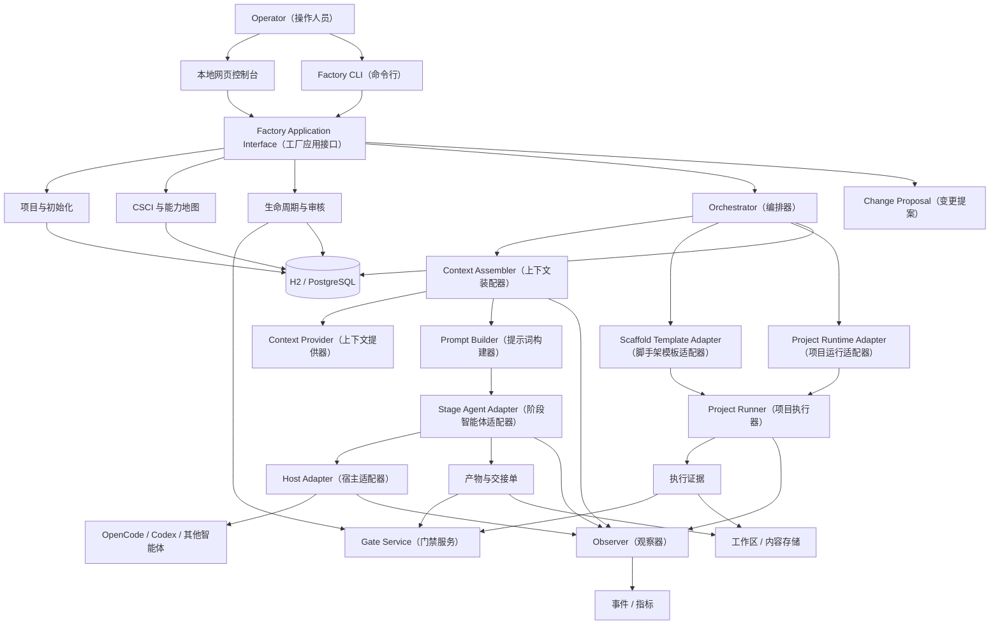
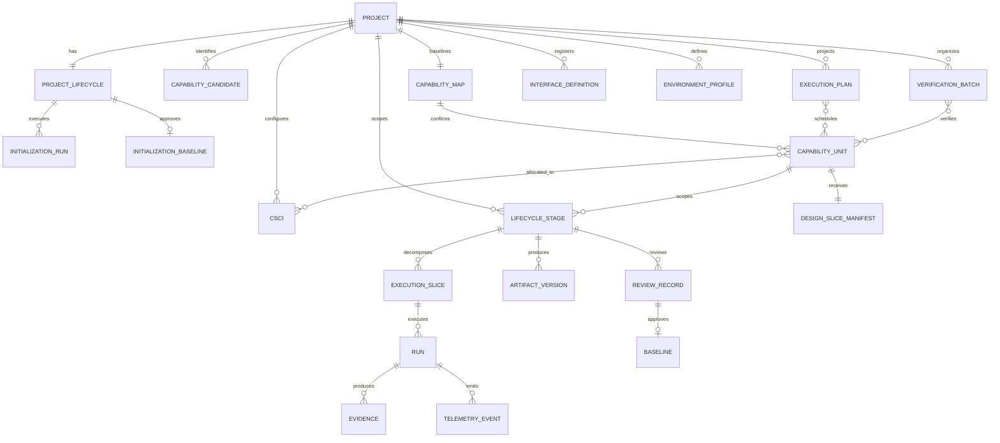
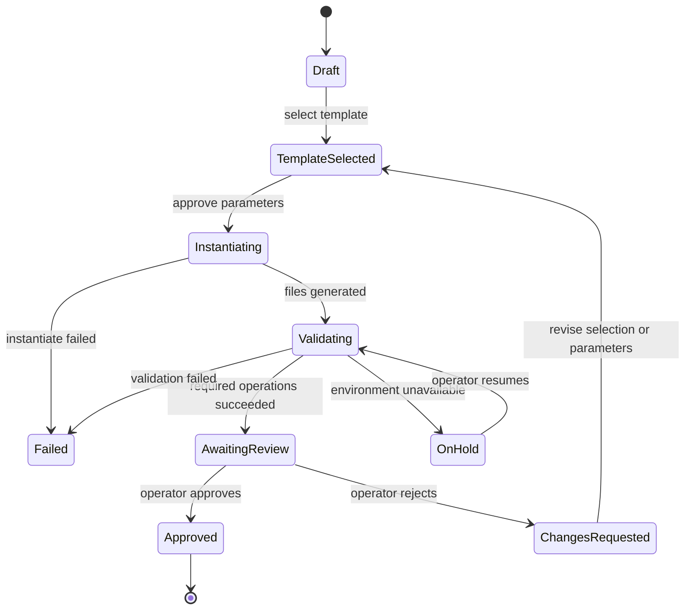

# AI 软件工厂系统设计方案 v1.1（最终版）

> 面向真实研发流程的 AI（人工智能）软件生产系统：项目级完成一次完整需求分析和总体设计，在设计基线中确认 CapabilityUnit（能力单元）；CU 随后独立编码、测试和交付。Spring Boot 控制平台管理状态、审核、调度、一致性和遥测，由可替换的 Agent Host（智能体宿主）与确定性 Runner（执行器）完成实际工作。

- 状态：v1.1 架构基线，实施合同待冻结
- 日期：2026-08-05
- 实测依据：[SDLC Pipeline 插件模式问题复盘](../research/sdlc-pipeline-plugin-mode-lessons-2026-08-03.md)
- 当前裁决：进入“领域与机器合同冻结 + 纵向原型”，v1.1 全程只采用串行执行

---

## 1. 目标、范围与实施边界

### 1.1 目标

软件工厂需要提供一条可审核、可恢复、可追溯的软件生产主线：

```text
项目初始化
→ 项目级需求分析 → Project RequirementBaseline
→ 项目级总体设计与 CU 最终拆分 → Project DesignBaseline
→ DesignSliceManifest + ExecutionPlan
→ CU 独立 Coding → CodeBaseline
→ CU 独立 Testing → TestBaseline
→ CU 独立交付
```

各阶段在用户视图中连续，但按事实作用域分层：

- 初始化是项目级生命周期，只执行一次或通过变更提案产生新基线；
- Requirement（需求）和 Design（设计）是项目级阶段，只各执行一次；
- Coding（编码）和 Testing（测试）是 CU 级阶段，各 CU 可以独立审核、挂起、返工和交付；
- VerificationBatch（验证批次）只组织共享测试执行，不成为生命周期或交付单元；
- 每个阶段都形成正式产物、确定性 Evidence（证据）和人工审核记录；
- Agent（智能体）提供专业判断，Runner（执行器）提供确定性执行，Operator（操作人员）承担最终审批责任。

### 1.2 MVP 边界

1. Factory（软件工厂）服务多个本地项目，但 v1.1 MVP（最小可用版本）选择**本机单用户模式**。
2. MVP 采用 Spring Boot 模块化单体、单实例部署和本地 Web Console（网页控制台）。
3. 首期支持纯 Node 与 Spring Boot + Vue 两类模板资产。
4. 首期接入一个真实智能体宿主；其他宿主通过合同测试和 Fake Adapter（模拟适配器）验证。
5. 正式正文使用 Markdown（标记文档）；Word/PDF 只按需导出，不维护第二份可写正文。
6. 不引入微服务、消息队列、通用工作流引擎、远程 Agent Runtime（智能体运行时）、自动发布和组织级协作。
7. 团队服务器模式需要另行补齐身份认证、项目授权、审核人身份、操作审计和 Secret（机密信息）隔离，不是本版默认能力。

### 1.3 核心不变量

1. CSCI（计算机软件配置项）是配置、版本、部署和验证对象，CapabilityUnit（能力单元，简称 CU）是用户可理解的最小业务交付单元，两者不能互相替代。
2. 用户只提交一次完整项目需求；需求阶段识别候选 CU，设计阶段依据全局数据模型、接口、事务和依赖确认正式 CU。
3. “卫星信息管理”是一个能力单元；查询、新增、修改、删除是 RequirementItem（需求项），不是四个业务 Task（任务）。
4. 数据模型、接口、页面和测试代码是内部 ExecutionSlice（执行切片），只在执行详情中展示。
5. 初始化通过人工审核并形成 InitializationBaseline（初始化基线）后，项目才能进入需求阶段。
6. 项目需求和总体设计各只有一个正式事实源；CU 通过 DesignSliceManifest（设计切片清单）引用所需章节，不复制需求或设计正文。
7. LifecycleStage（生命周期阶段）必须携带 `scope_type` 与 `scope_id`；Requirement/Design 作用于 Project，Coding/Testing 作用于 CU。
8. ExecutionPlan（执行计划）是可重建的调度投影，不保存需求正文、不决定 CU 边界、不形成额外人工 Gate（门禁）。
9. 智能体不拥有生命周期真相；Hook（钩子）、Observer（观察器）和插件也不能推进业务状态。
10. Handoff（交接单）必须通过版本化结构化协议提交，不能从聊天尾部解析。
11. 必测项只有 `PASSED`（通过）可以通过；`SKIPPED`（跳过）和 `BLOCKED`（阻塞）都不能假绿。
12. 业务状态、Git、文件证据和外部进程不能被描述成一个数据库事务；跨介质一致性使用内容寻址、事务引用、Outbox（事务发件箱）和 Reconciler（对账器）。
13. JSON（结构化数据）是索引和机器合同，不保存长篇正式正文；Markdown（标记文档）保存可读规格和报告。
14. 凭据只通过运行时 Secret（机密信息）通道注入，不进入需求、Prompt（提示词）、日志、交接单或 Git。
15. 初始上下文由 Context Assembler（上下文装配器）确定性生成；智能体不能自行扫描项目或决定权威资料，只能提交结构化追加上下文请求。
16. Stage Agent Adapter（阶段智能体适配器）只消费已经构造好的 AgentInvocation（智能体调用请求），不选择资料、不读取存储，也不拼接 Prompt。

---

## 2. 总体架构



所有 Console（控制台）、CLI（命令行）和 Agent Tool（智能体工具）都调用同一个 Factory Application Interface（工厂应用接口）。外部调用者只需要理解项目级动作，技术栈、宿主、命令和恢复细节隐藏在模块实现中。

### 2.1 模块职责

| 模块 | 负责 | 不负责 |
|---|---|---|
| Project & Initialization（项目与初始化） | 模板选择、参数、项目实例化、初始化审核和 ProjectBaseline（项目基线） | 能力单元阶段执行 |
| Configuration Model（配置模型） | CSCI、能力地图、能力单元分配和版本关系 | 智能体会话 |
| Lifecycle（生命周期） | 项目级与 CU 级阶段、作用域审核、基线、失效和完成判定 | 执行 Shell（命令行）命令 |
| Planning（规划） | 从设计基线派生 ExecutionPlan，计算依赖、优先级、就绪和挂起状态 | 保存需求正文、决定 CU 边界或建立额外 Gate |
| Orchestrator（编排器） | 执行切片、串行调度、单活动 Run、Retry（重试）、Stop（停止）和人工恢复 | 绕过门禁修改状态 |
| Host Adapter（宿主适配器） | 原始输入捕获、会话启动、事件转换、能力探测和取消 | 生命周期真相 |
| Context Assembler（上下文装配器） | 上下文选择、提供器调用、去重、预算、脱敏、顺序和上下文清单 | Agent Host 调用和生命周期迁移 |
| Prompt Builder（提示词构建器） | 用版本化模板把任务、角色和上下文包构造成 AgentInvocation（智能体调用请求） | 选择资料或访问存储 |
| Stage Agent Adapter（阶段智能体适配器） | 阶段角色映射、调用协议和结构化结果转换 | 选择上下文、读取资料或拼接 Prompt |
| Scaffold Template Adapter（脚手架模板适配器） | 模板描述、参数 Schema（模式）、实例化和生成结果校验 | 运行已生成项目 |
| Project Runtime Adapter（项目运行适配器） | 编译、构建、打包、测试、启动、停止和日志能力 | 感知能力单元审核状态 |
| Project Runner（项目执行器） | 命令、进程树、超时、输出、就绪、清理和证据 | 判断需求是否正确 |
| Gate Service（门禁服务） | 校验产物、证据和审核前置条件，提交领域事务 | 从聊天文本猜测结论 |
| Interface Registry（接口登记表） | 内外部接口、版本、兼容性、依赖和影响候选 | 自动批准接口变化 |
| Environment Registry（环境登记表） | 环境、外部系统、设备和 SecretRef（机密引用）绑定 | 保存凭据明文 |
| Observer（观察器） | Event（事件）、Span（跨度）、Token（令牌）、成本和诊断包 | 修改业务状态 |
| Artifact Inspector（产物检查器） | 结构、覆盖、Diff（差异）、Hash（哈希）和追溯检查 | 代替操作人员审批 |
| Reconciler（对账器） | 发现孤立文件、遗留进程、过期 RuntimeLease 和引用损坏 | 静默伪造成功结果 |

### 2.2 外部 Seam（接缝）与 Adapter（适配器）

v1.1 只冻结四类外部接口，各自独立版本化。以下英文名称是机器合同标识：

```text
HostAdapter
StageAgentAdapter
ScaffoldTemplateAdapter
ProjectRuntimeAdapter
```

上下文提供器属于 Context Assembler（上下文装配器）的内部接缝。v1.1 不把每种资料来源都暴露为顶层 Factory Plugin（工厂插件），而是由上下文装配器通过统一的小接口管理多个提供器。

不设计包含大量可选方法的万能 `FactoryPlugin`（工厂插件）。只有存在两个真实实现，或一个真实实现加一个合同模拟器时，才把可替换点提升为稳定接缝；实现内部的技术栈细节不进入工厂应用接口。

正确调用关系：

```text
Console / CLI / Agent Tool
→ Factory Application Interface（工厂应用接口）
→ Orchestrator（编排器）
→ Bound Adapter（已绑定适配器）
→ Project Runner（项目执行器）
```

插件不得直接定位模板脚本，否则插件会重新依赖 Maven、npm、Spring Boot、Vue 等实现细节。

---

## 3. 领域模型与唯一术语

### 3.1 实体关系



### 3.2 术语表

| 概念 | 唯一语义 |
|---|---|
| Project（项目） | 一个受软件工厂管理的软件项目 |
| CSCI（计算机软件配置项） | 受配置管理的软件项，是配置、版本、部署和验证对象 |
| CapabilityUnit（能力单元） | 用户可理解的完整业务能力，也是最小业务审核与交付单元 |
| CapabilityCandidate（能力候选） | 需求阶段识别的候选业务模块，尚未获得独立实现与交付资格 |
| RequirementItem（需求项） | 项目 SRS 内带稳定 ID（标识）的具体需求；设计确认后可关联一个或多个 CU |
| CapabilityAllocation（能力分配） | 能力单元与一个或多个 CSCI 的多对多分配关系 |
| LifecycleStage（生命周期阶段） | 带 `scope_type`/`scope_id` 的统一阶段；Requirement/Design 属于 Project，Coding/Testing 属于 CU |
| DesignSliceManifest（设计切片清单） | CU 对项目需求与总体设计章节、数据归属、接口、依赖、验收标准和集成场景的引用清单 |
| ExecutionPlan（执行计划） | 从 Project DesignBaseline 派生、可重建的运行时调度投影 |
| VerificationBatch（验证批次） | 让多个 CU 共享一次环境启动和测试运行的执行容器，不拥有审核或交付状态 |
| ExecutionSlice（执行切片） | 为智能体和执行器调度而拆分的内部技术切片 |
| Run（运行） | 执行切片或项目操作的一次实际执行 |
| Operation（操作） | 一次确定性项目动作及其结果，如 `compile`（编译）、`test`（测试）、`start`（启动） |
| Baseline（基线） | 经审核批准且不可原地修改的一组版本化产物引用 |
| Evidence（证据） | 支撑 Gate（门禁）判断的不可变执行事实 |

`Task`（任务）不作为领域实体。UI（用户界面）顶层只显示项目、能力地图、执行计划、能力单元和阶段；执行切片与验证批次只显示在执行详情中。

### 3.3 CSCI（计算机软件配置项）、CU（能力单元）与分配

```text
Project（项目）：卫星管理系统
├─ CSCI-WEB：Vue 前端
├─ CSCI-SERVICE：Spring Boot 后端
├─ CapabilityUnit（能力单元）：卫星信息管理
│  ├─ FR-001 查询卫星信息
│  ├─ FR-002 新增卫星信息
│  ├─ FR-003 修改卫星信息
│  └─ FR-004 删除卫星信息
└─ CapabilityAllocation（能力分配）
   └─ CU-SATELLITE-INFO → CSCI-WEB + CSCI-SERVICE
```

CU 必须满足：

1. 对用户提供一组内聚、完整的业务能力；
2. 可独立描述范围、规则、接口和验收目标；
3. 可从项目需求与总体设计中获得完整、无歧义的 DesignSliceManifest；
4. 可整体由操作人员审核与交付；
5. 可形成独立的 CodeBaseline 和 TestBaseline；
6. 内部执行切片严格顺序执行，不能脱离能力单元声明业务交付完成。

### 3.4 ExecutionPlan（执行计划）

需求阶段先从完整项目需求识别候选 CU；总体设计确认边界、数据归属、接口和依赖后，才生成正式 CU 与执行计划：

```text
Project DesignBaseline
├─ CU：用户管理（priority: 10）
├─ CU：角色权限（depends_on: 用户管理）
├─ CU：审计日志（depends_on: 用户管理）
└─ ExecutionPlan（derived_from: design-baseline-id）
```

ExecutionPlan 只保存 CU 依赖、同层优先级、就绪状态、执行顺序和挂起情况。CU 边界、数据归属、接口契约和依赖关系以 Project DesignBaseline 为权威事实源；这些内容变化必须走 ChangeProposal。操作人员可以直接调整同一依赖层内的优先级，因为这不改变设计事实。执行计划损坏或策略变化时可以从设计基线重新生成。

---

## 4. 分层生命周期与审核

### 4.1 用户流程与作用域

```mermaid
flowchart LR
    I["Initialization（初始化）"] --> IG["初始化人工审核"]
    IG --> R["Project Requirement（项目需求）"]
    R --> RG["需求人工审核 / Project RequirementBaseline"]
    RG --> D["Project Design（总体设计 + CU 最终拆分）"]
    D --> DG["设计人工审核 / Project DesignBaseline"]
    DG --> PLAN["DesignSliceManifest + ExecutionPlan"]
    PLAN --> C["CU Coding（编码）"]
    C --> CG["代码人工审核 / CU CodeBaseline"]
    CG --> T["CU Testing（测试）"]
    T --> TG["测试人工审核 / CU TestBaseline"]
    TG --> DONE["CU 独立交付"]
```



LifecycleStage（生命周期阶段）复用同一状态机、Gate 和 ReviewRecord，但必须显式声明作用域：

```text
scope_type: PROJECT | CAPABILITY_UNIT
scope_id
stage_type: REQUIREMENT | DESIGN | CODING | TESTING
```

合法组合只有 `PROJECT + REQUIREMENT`、`PROJECT + DESIGN`、`CAPABILITY_UNIT + CODING` 和 `CAPABILITY_UNIT + TESTING`。禁止为 CU 创建 Requirement/Design Stage，也禁止用项目级 Testing 替代 CU 测试审核。

### 4.2 Project Initialization（项目初始化）状态机



InitializationBaseline（初始化基线）至少绑定以下机器字段：

```text
selected_template_id
selected_template_version
template_digest
protocol_version
template_parameters_hash
project_manifest
module_topology
initial_git_revision
validate_evidence_ref
compile_evidence_ref
build_evidence_ref
test_evidence_ref
start_readiness_evidence_ref
stop_cleanup_evidence_ref
review_record_id
reference_bindings[]
```

初始化审核界面必须展示模板版本与 Hash（哈希）、参数摘要、生成模块、Git revision（源码修订）、`compile/build/test`（编译/构建/测试）结果、所有模块的 readiness（就绪状态）、`stop`（停止）清理结果、告警和未解决问题。只有进入 `Approved`（已批准）状态后才能启动项目级需求阶段；正式 Capability Map 必须等 Project DesignBaseline 批准后创建。

### 4.3 LifecycleStage（生命周期阶段）状态机


每个 `Approved`（已批准）状态都绑定明确的作用域、Artifact Version（产物版本）、内容哈希、源码修订、环境快照或测试证据。上游基线变化时，下游历史保留，但有效性变为 `STALE`（已过期）或 `IMPACT_REVIEW_REQUIRED`（需要影响复核）。

### 4.4 项目级 Requirement 与 Design

**Project Requirement（项目需求）**

1. Host Adapter（宿主适配器）在模型处理前保存原始输入或脱敏副本引用。
2. 输入是用户一次提交的完整需求原文、附件、参考资料与项目模板能力；AI 结果不能替代原始输入。
3. Requirement Agent 从系统整体识别项目目标、系统边界、功能组成、业务对象、业务规则、非功能约束、外部接口和跨功能场景。
4. 生成唯一的 Project SRS Artifact（项目软件需求规格产物）、稳定 RequirementItem、验收条件、候选 CU 及其初步关系。
5. 本阶段不锁定表结构、字段级接口、内部调用或最终 CU 边界。
6. 操作人员审核后形成唯一的 Project RequirementBaseline；此时不创建 CU Requirement Stage，也不复制 CU 需求文档。

**Project Design（项目总体设计）**

1. 只能读取已批准的 Project RequirementBaseline。
2. 在同一次总体设计中完成系统与技术架构、全局数据模型、外部接口、CU 间接口、数据归属、跨 CU 流程、事务边界、异常处理和安全设计。
3. 依据内聚性、独立编码、独立验证和独立交付能力确认最终 CU；菜单、按钮、单接口和单表不能成为 CU。
4. Interface Registry（接口登记表）校验接口所有权、覆盖、兼容性和候选影响范围。
5. 为每个正式 CU 生成 DesignSliceManifest，引用项目需求和总体设计章节，并记录数据归属、提供/消费接口、依赖、验收标准和集成场景。
6. 信息不足时创建 ClarificationRequest（澄清请求）并进入 `OnHold`（挂起）状态。
7. 操作人员审核总体设计、正式 CU 与依赖关系后形成唯一的 Project DesignBaseline；随后才能生成 ExecutionPlan 并启动 CU 生命周期。

### 4.5 CU 级 Coding 与 Testing

**Coding（编码）**

1. Implementation Planner（实现规划器）只根据当前 CU 的 DesignSliceManifest 把实现拆为可独立验证的执行切片。
2. 所有切片在项目唯一工作目录中严格顺序执行；后一个切片承接前一个切片的已验证修改。
3. 智能体只接收当前切片的目标、版本化提示词和已装配的上下文包。
4. 智能体通过 `handoff_submit`（提交交接单）报告变更、验证和问题。
5. 软件工厂独立计算当前切片及 CU 累计实际 Diff（差异）；执行器完成聚焦检查并记录 ChangeSet（变更集）。
6. 所有切片完成后，Project Runner 在同一工作目录执行权威的 `compile/build/lint/unit test`（编译/构建/静态检查/单元测试）。
7. 操作人员审核能力单元的累计差异后形成 CU CodeBaseline；它绑定 Project RequirementBaseline、Project DesignBaseline、DesignSliceManifest 和唯一 Git revision。

**Testing（测试）**

1. Test Agent（测试智能体）根据 Project RequirementBaseline、Project DesignBaseline、当前 DesignSliceManifest 和 CU CodeBaseline 生成 TestObligation（测试义务）与测试用例。
2. 执行器执行完整单元、集成、接口、E2E（端到端）、设备或其他必测项。
3. EnvironmentBindingSnapshot（环境绑定快照）固定代码、接口、环境、配置和设备资源。
4. Mock（模拟）、Simulator（仿真器）、Sandbox（沙箱）、真实外部系统和真实设备的证据必须区分。
5. Artifact Inspector（产物检查器）生成需求—设计—代码—测试追溯矩阵。
6. 操作人员审核范围、结果、阻塞项和证据后形成 TestBaseline（测试基线），能力单元才能进入 `Delivered`（已交付）状态。

跨 CU 业务场景可以放入 VerificationBatch，共享一次环境启动、接口联调、数据库测试、E2E 或设备测试。批次 Evidence 可以关联多个 CU 和场景，但每个 CU 仍分别进入 `AwaitingReview`、`OnHold`、`ChangesRequested` 或 `Approved`，并分别形成 TestBaseline。

### 4.6 缺陷返工与基线变更

- 实现缺陷从当前 CU 的 Testing 退回 Coding，创建新 Run 和新 CodeBaseline；旧 CodeBaseline 不原地修改，关联测试 Evidence 自动失效。
- 需求遗漏、数据归属错误、接口契约错误或 CU 拆分错误必须发起 ChangeProposal，不能伪装成代码修复。
- Project RequirementBaseline 变化后，Project DesignBaseline 标记 `STALE`。
- Project DesignBaseline 变化后，根据 DesignSliceManifest、Interface Registry 和 CU 依赖图计算影响，只使受影响 CU 的 CodeBaseline/TestBaseline 失效。

---

## 5. 正式规格、接口与环境模型

### 5.1 SRS Artifact（软件需求规格产物）

项目只维护一份正式 SRS，采用固定结构，并在其中用稳定 ID 标识候选/正式 CU 与需求项：

1. 项目目标与系统边界；
2. 功能组成与跨功能业务场景；
3. 业务对象、业务规则与数据需求；
4. 候选 CU 及初步关系；
5. CSCI 内部、CSCI 间与外部系统接口需求；
6. 性能、可靠性和安全要求；
7. 运行与测试环境要求；
8. 项目级及 CU 可切片的验收标准；
9. 验证方法；
10. 需求追溯关系。

每个需求项和验收条件都使用稳定标识，机器字段 `verification_method`（验证方法）只能是：

```text
INSPECTION | ANALYSIS | DEMONSTRATION | TEST
```

### 5.2 Interface Registry（接口登记表）

InterfaceDefinition（接口定义）至少包含以下机器字段：

```text
interface_id
classification: INTRA_CSCI | INTER_CSCI_INTERNAL | EXTERNAL_SYSTEM
provider
consumers[]
owning_csci_id
related_cu_ids[]
protocol
operations[]
request_schema_ref
response_schema_ref
authentication
error_model
timeout
availability_requirement
version
compatibility_policy
environment_bindings[]
baseline_status
```

接口变更通过依赖图定位受影响的能力单元、CSCI、需求项、测试义务和环境绑定。影响计算只生成候选集，是否失效或返工由确定性规则与操作人员决定。

### 5.3 Environment（环境）与 ExternalDependency（外部依赖）

EnvironmentProfile（环境配置）至少包含以下机器字段：

```text
environment_id
type: DEV | SIT | UAT | DEVICE_LAB
endpoints[]
databases[]
external_services[]
device_resources[]
network_constraints[]
secret_refs[]
health_checks[]
test_data_refs[]
owner
```

EnvironmentBindingSnapshot（环境绑定快照）固定以下内容：

```text
test_run_id
environment_id
interface_version_bindings[]
code_revision
configuration_hash
device_resource_ids[]
bound_at
binding_status
```

Evidence（证据）类型：

```text
MOCK | SIMULATOR | SANDBOX | REAL_EXTERNAL_SYSTEM | REAL_DEVICE
```

真实环境义务不能由 Mock（模拟）结果替代。缺少外部系统、设备或机密信息时，相关测试义务结果必须是 `BLOCKED`（阻塞）。

---

## 6. Baseline（基线）、变更与引用

### 6.1 Baseline（基线）

正式基线包括以下类型：

```text
InitializationBaseline
Project RequirementBaseline
Project DesignBaseline
CU CodeBaseline
CU TestBaseline
```

基线不是单文件指针，而是一组不可变条目：

```text
baseline_id
scope_type: PROJECT | CAPABILITY_UNIT
scope_id
baseline_type: INITIALIZATION | REQUIREMENT | DESIGN | CODE | TEST
artifact_version
content_hash
source_revision?
items[]
  artifact_type
  artifact_ref
  content_hash
review_record_id
reference_bindings[]
validity_status
created_at
```

合法作用域为：Initialization/Requirement/Design 使用 `PROJECT`，Code/Test 使用 `CAPABILITY_UNIT`。批准后不得原地修改；任何新内容都产生新的 Artifact Version（产物版本）和基线。ArtifactVersion、ReviewRecord 和 Gate 使用相同作用域字段，不能再把 `cu_id` 设为所有基线的必填字段。

### 6.2 ChangeProposal（变更提案）

```text
proposal_id
target_baseline_id
reason
delta_ref
affected_csci_ids[]
affected_cu_ids[]
affected_interface_ids[]
affected_environment_ids[]
impact_summary
decision
```

流程：

1. 创建增量提案；
2. 接口登记表、CapabilityAllocation（能力分配）和追溯图计算候选影响；
3. 操作人员审核；
4. 批准后形成新产物版本和基线；
5. Project RequirementBaseline 变化时，直接将 Project DesignBaseline 标记 `STALE`（已过期）；
6. Project DesignBaseline 变化时，通过 DesignSliceManifest、接口登记表和 CU 依赖图计算受影响 CU，只失效其 CodeBaseline/TestBaseline；
7. 跨能力单元影响标记 `IMPACT_REVIEW_REQUIRED`（需要影响复核）；
8. 系统可以建议执行切片并重建 ExecutionPlan，但不自动修改代码或启动智能体。

### 6.3 参考资料与 ReferenceBinding（引用绑定）

项目只有一个用户维护的 `references/`（参考资料）目录。软件工厂不递归复制整个外部目录，也不通用转换二进制文件。

每次 Run（运行）记录实际读取文件的路径、Hash（哈希）、大小和 MIME（媒体类型），并支持两种策略：

| 模式 | 行为 | 适用范围 |
|---|---|---|
| `detect-only`（仅检测） | 只保存路径、哈希、大小和媒体类型 | 默认本地开发 |
| `reproducible` | 只对实际读取文件做内容寻址、按 SHA-256 去重保存 | 审计和严格复现 |

Project RequirementBaseline 与 Project DesignBaseline 保存引用绑定。参考协议或原型变化时，系统能检测并提示相关基线复核；`detect-only`（仅检测）模式不承诺恢复被用户覆盖的旧字节。

---

## 7. 模板资产与版本化机器协议

### 7.1 两个模板接口

ScaffoldTemplateAdapter（脚手架模板适配器）：

```text
describe()
getParameterSchema()
instantiate()
bootstrap()
validateGeneratedProject()
```

ProjectRuntimeAdapter（项目运行适配器）：

```text
describeCapabilities()
compile()
build()
package()
test()
start()
stop()
status()
readiness()
logs()
clean()
cancel()
```

`instantiate`（实例化）只从模板生成文件，`bootstrap`（引导准备）负责依赖安装、Git 和环境准备，`validateGeneratedProject`（验证生成项目）负责确认生成结果满足合同。三者不再用含义模糊的 `init`（初始化）动词合并。

### 7.2 Template Descriptor（模板描述符）

```yaml
protocol_version: "1.1"

template:
  id: springboot-vue
  version: 1.0.0
  digest: sha256:...
  min_factory_version: 1.1.0

scaffold:
  parameters_schema: schemas/parameters.schema.json
  entrypoint: adapter/factory-template-adapter

modules:
  - id: backend
    type: springboot
    path: backend
    depends_on: []
  - id: frontend
    type: vue
    path: frontend
    depends_on: [backend]

operations:
  compile: { targets: [backend, frontend, all] }
  build:   { targets: [backend, frontend, all] }
  package: { targets: [backend, frontend, all] }
  start:   { returns_runtime_lease: true }
  stop:    { idempotent: true }

test_suites:
  - { id: unit, required: true }
  - { id: integration, required: true }
  - { id: api, required: false }
  - { id: e2e, required: false }
```

### 7.3 执行结果与运行租约

普通操作与测试结果分开，机器枚举值含义如下：

```text
operation_status: SUCCEEDED | FAILED | CANCELLED | TIMED_OUT | BLOCKED
test_outcome: PASSED | FAILED | SKIPPED | BLOCKED | null
```

`compile/build/start/stop`（编译/构建/启动/停止）只使用 `operation_status`（操作状态）；测试步骤同时返回 `test_outcome`（测试结果）。

`start()`（启动）必须返回 RuntimeLease（运行时租约）：

```text
runtime_id
process_handles[]
endpoints[]
allocated_ports[]
started_at
readiness_status
owner_run_id
lease_expires_at
cleanup_token
```

复合模板可以启动多个进程，readiness（就绪检查）必须聚合所有必需模块；`stop`（停止）和 `clean`（清理）必须幂等。

### 7.4 Schema（模式）与 TCK（合同测试套件）

编码前必须冻结以下机器合同。文件名保留英文，便于代码和自动化工具直接引用：

```text
project-bootstrap-request.schema.json
project-bootstrap-result.schema.json
template-descriptor.schema.json
template-parameters.schema.json
runtime-capabilities.schema.json
execution-plan.schema.json
execution-result.schema.json
runtime-lease.schema.json
run-request.schema.json
context-plan.schema.json
context-bundle.schema.json
context-request.schema.json
context-delta.schema.json
agent-invocation.schema.json
handoff.schema.json
evidence.schema.json
gate-command.schema.json
gate-result.schema.json
interface-definition.schema.json
environment-profile.schema.json
environment-binding.schema.json
test-obligation.schema.json
test-suite-result.schema.json
telemetry-event.schema.json
error-envelope.schema.json
```

每份模式必须具有有效、无效、缺字段、版本兼容和幂等重放样例。Template（模板）、Runner（执行器）、Host Adapter（宿主适配器）和 Context Provider（上下文提供器）共用各自的合同测试套件；合同模拟器与真实实现必须通过相同测试。

---

## 8. Agent Host（智能体宿主）、Run（运行）与 Handoff（交接单）

### 8.1 Host Adapter（宿主适配器）

宿主适配器负责：

- 模型处理前捕获原始输入；
- 能力探测、启动、等待、取消和关联会话；
- 把 OpenCode/Codex 事件转换为标准事件；
- 使用宿主结构化输出；
- 在运行时安全注入凭据；
- 处理宿主升级、重启和不可用。

宿主适配器不保存正式生命周期真相，也不让宿主聊天记录成为交付事实源。

### 8.2 RunRequest（运行请求）

```text
run_id
project_id
csci_ids[]
cu_id?
stage?
slice_id?
objective
baseline_refs[]
reference_bindings[]
environment_binding_ref?
rules_version
prompt_version
agent_version
budget
```

Context Selector（上下文选择器）只提供当前运行所需的基线、规则和引用，不重复注入全部历史聊天与整个资料库。

### 8.3 结构化 Handoff（交接单）

```text
handoff_submit
  protocol_version
  run_id
  slice_id?
  role
  summary
  observations[]
  declared_changed_paths[]
  validations[]
  open_issues[]
  requested_follow_up?
```

- 通过工具或 Host Output Schema（宿主输出模式）提交，不从自然语言提取；
- 实际差异、文件哈希和命令结果由软件工厂独立派生；
- 智能体可以提出建议，但不能修改审核或交付状态；
- 交接单丢失时运行失败，软件工厂不根据文件变化伪造“无问题”。

### 8.4 Hook（钩子）

钩子只允许捕获事件、建立关联、轻量安全保护和通知。钩子不执行长构建、完整测试、复杂智能体路由、门禁或状态迁移。

---

## 9. Runner（执行器）与串行调度

### 9.1 执行规则

| 控制项 | 规则 |
|---|---|
| 单次运行超时 | 终止完整进程树并记录 `TIMED_OUT`（已超时） |
| 自动重试 | 仅限瞬时 Host（宿主）、Tool（工具）或 Infrastructure（基础设施）错误 |
| 相同失败 | 错误指纹相同且无新证据时停止自动重试 |
| 新反馈 | 先失效旧执行计划和未开始的运行，再重新规划 |
| 上下文 | 使用正式基线、最新反馈和结构化交接单 |
| 大任务 | 拆分执行切片，禁止无限延长 Deadline（截止时间） |
| 计数限制 | 文件、Token（令牌）、工具次数默认用于观测和告警，不直接裁决业务失败 |
| 全局执行 | 同一 Factory 实例任一时刻只允许一个活动业务 Run |
| CU 调度 | 按依赖图拓扑排序，再按同层业务优先级排序；一次只执行一个 CU |
| CU 内切片 | 严格顺序执行；后一个切片承接前一个切片的已验证修改 |
| 挂起跳过 | CU 进入 OnHold 后重新计算其他 CU 就绪状态，不阻塞无依赖的 CU |

### 9.2 单工作目录与单活动 Run

```text
project_id
workspace_path
active_run_id
active_cu_id?
active_slice_id?
base_revision
working_revision?
status
```

不变量：

1. 所有修改只发生在项目唯一工作目录中。
2. 新 Run 启动前必须确认不存在其他活动业务 Run，并记录工作目录状态与 `base_revision`。
3. 每个切片完成确定性检查后，其修改留在同一工作目录，下一切片在此基础上继续。
4. 运行失败时保留当前目录、实际 Diff、Handoff 和 Evidence，等待操作人员决定继续、返工或放弃；不自动回滚。
5. 基线变为 `STALE`（已过期）后，未开始的切片失效，活动 Run 转为 `NEEDS_REVIEW`（需要复核）。
6. 软件工厂重启后由对账器检查数据库中的活动 Run、实际进程、工作目录 Git 状态和记录的修订是否一致。

### 9.3 环境阻塞

端口、数据库、测试环境、设备和外部 Sandbox 是当前 Run 的环境绑定。缺少必需条件时进入 `BLOCKED` 或 `OnHold`，释放活动执行权后由调度器选择下一个就绪 CU。

### 9.4 挂起与人工恢复

```text
OnHold:
  missing_device
  third_party_unavailable
  missing_reference
  awaiting_clarification
  awaiting_environment
  awaiting_human_decision

NeedsIntervention:
  retry_budget_exceeded
  repeated_error
  context_overflow
  host_failure
  plugin_failure
  orphaned_runtime
```

系统可以探测恢复条件，但只标记 `READY_TO_RESUME`（可以恢复）并通知操作人员。操作人员确认后重新检查基线、代码修订、模板、环境和引用哈希，再创建新运行；不自动恢复旧聊天。

---

## 10. Gate（门禁）、一致性与崩溃恢复

### 10.1 门禁的领域事务

```text
validate expected stage version
→ validate artifact/evidence bindings
→ save ReviewRecord
→ create immutable Baseline refs
→ advance lifecycle state
→ invalidate downstream refs
→ append Outbox/ReconciliationRecord
```

以上数据库记录在同一事务中提交，并使用 `expected_version`（预期版本）、`review_id`（审核标识）和幂等键防止重复提交与过期操作覆盖。Git、Markdown（标记文档）、证据文件和外部进程不属于该数据库事务。

### 10.2 文件 Evidence（证据）提交协议

1. 执行器写入受控临时目录；
2. 刷盘并计算内容 Hash；
3. 原子 rename 到内容寻址目录；
4. 开启数据库事务并校验 `expected_version`；
5. 保存 EvidenceRef（证据引用）、ReviewRecord（审核记录）、Baseline（基线）和状态；
6. 写入 Outbox（事务发件箱）/ReconciliationRecord（对账记录）；
7. 提交数据库事务；
8. 异步清理孤立临时文件和完成后续通知。

### 10.3 Reconciler（对账器）

启动时和定期执行：

```text
数据库有 EvidenceRef、文件不存在
→ EVIDENCE_CORRUPTED

文件存在、数据库无引用
→ ORPHAN_EVIDENCE，按保留策略清理

Run 为 RUNNING、进程不存在
→ ORPHANED / NEEDS_INTERVENTION

进程存在、RuntimeLease 已失效
→ 先隔离和提示，再按 cleanup policy 处理

数据库记录的工作修订与项目目录实际 Git 状态不一致
→ NEEDS_INTERVENTION，禁止继续启动下一个 Run
```

对账器只能恢复可证明的事实，不能把不完整执行修复为成功。

### 10.4 ReviewRecord（审核记录）

```text
review_id
scope_type: PROJECT | CAPABILITY_UNIT
scope_id
stage_type: REQUIREMENT | DESIGN | CODING | TESTING
baseline_candidate_ref
artifact_hashes[]
source_revision?
reviewer_identity
decision: APPROVED | CHANGES_REQUESTED
comments
reviewed_at
idempotency_key
```

审核界面同时展示正式产物、上一版本 Diff（差异）、Handoff（交接单）、确定性检查、环境绑定、未解决问题和 Evidence（证据），不能只展示智能体总结。

---

## 11. 可观测性、诊断与 Secret（机密信息）

### 11.1 四类事实

| 类型 | 行为 |
|---|---|
| Audit Event（审计事件） | 审核、状态、基线、变更提案；不可关闭 |
| Operational Log（运行日志） | 运行诊断；可调整级别和保留期 |
| Telemetry（遥测） | 耗时、令牌、成本和 Span（跨度）；可异步聚合 |
| Evidence（证据） | 支撑门禁的正式证据；不受日志级别影响 |

### 11.2 诊断 Profile（配置档）

```yaml
factory:
  observability:
    profile: normal # normal | diagnostic | e2e
    structured-json: true
    hot-reload: true
    max-payload-bytes: 65536
    retain-days: 30
    levels:
      lifecycle: INFO
      orchestration: INFO
      host-adapter: INFO
      agent-adapter: INFO
      template-adapter: INFO
      runner: INFO
      gate: INFO
      artifact-inspector: INFO
    redaction:
      enabled: true
      mask-headers: [Authorization, Cookie]
      mask-env-patterns: ["*TOKEN*", "*PASSWORD*", "*SECRET*"]
```

| Profile | 内容 |
|---|---|
| `normal`（常规） | 状态变化、命令摘要、错误和门禁结论 |
| `diagnostic`（诊断） | 增加适配器请求、执行计划、进程、重试、哈希和时间线 |
| `e2e`（端到端） | 增加全链路关联、环境绑定、测试步骤、证据引用和诊断包 |

所有记录按适用范围携带 `project_id / csci_id / cu_id / stage_id / slice_id / run_id / operation_id / session_id / trace_id`。这些英文名称是机器字段，分别表示项目、配置项、能力单元、阶段、切片、运行、操作、会话和追踪标识。

### 11.3 Span（跨度）与成本

观测层级：

```text
Project
└─ CapabilityUnit
   └─ ExecutionSlice
      └─ Run
         └─ Session
            ├─ Model Step
            ├─ Tool Span
            └─ Child Session
```

父会话等待子智能体的时间和子智能体执行时间存在包含关系，不能相加为墙钟时间。报告分别提供实际总量、成功路径、失败/取消/返工开销，并记录 Provider（模型提供方）成本、软件工厂估算成本、来源和可信度。提供方未返回成本时写 `unavailable`（不可用），不能写成确定的零。

### 11.4 诊断包

```text
factory diagnostics collect --run RUN-001
```

输出：

```text
run-summary.json
events.jsonl
effective-config.yaml
execution-plan.json
handoff.json
evidence-index.json
process-tree.json
redaction-report.json
```

诊断包仍执行脱敏和体积限制。Secret Provider（机密信息提供器）在运行时注入凭据；执行器在 `stdout/stderr`（标准输出/标准错误）持久化前脱敏，原始凭据不作为普通命令参数记录。

---

## 12. 存储与目录

### 12.1 事实分层

| 数据 | 权威存储 | 用途 |
|---|---|---|
| 生命周期、审核、调度、活动 Run 和 RuntimeLease | 关系数据库 | 控制与查询 |
| Requirement/Design/Test Report（需求/设计/测试报告） | Markdown（标记文档） | 正式可读产物 |
| 源码 | Git | 代码历史与基线修订绑定 |
| 命令和测试 Evidence（证据） | 内容寻址 Evidence Store（证据存储） | 门禁证据 |
| Runtime Event（运行事件） | JSONL（逐行结构化数据） | 过程分析 |
| 聚合指标 | 数据库或 metrics.json | 查询与基线比较 |
| Reference Snapshot（参考快照） | 可选内容寻址存储 | `reproducible`（可复现）模式复现 |

### 12.2 推荐目录

```text
ai-software-factory/
├─ control-plane/
│  ├─ project-initialization/
│  ├─ configuration-model/
│  ├─ capability/
│  ├─ lifecycle/
│  ├─ planning/
│  ├─ orchestration/
│  ├─ review/
│  ├─ interface-registry/
│  ├─ environment-registry/
│  ├─ change-proposal/
│  ├─ host-adapter/
│  ├─ template-adapter/
│  ├─ runner/
│  ├─ gate/
│  ├─ observer/
│  └─ reconciler/
├─ agent-adapters/
│  ├─ opencode/
│  └─ codex/
├─ templates/
│  ├─ node-service/
│  └─ springboot-vue/
├─ contracts/
│  ├─ schemas/
│  ├─ examples/
│  └─ tck/
└─ projects/<project-id>/
   ├─ references/
   ├─ docs/
   │  └─ capabilities/<cu-id>/
   ├─ workspace/
   └─ .factory/
      ├─ inputs/
      ├─ index/
      ├─ content/
      ├─ evidence/
      ├─ telemetry/
      ├─ handoffs/
      └─ exports/
```

`references/`、正式文档和源码是用户项目资产；遥测和运行缓存默认不进入 Git。

---

## 13. 实施顺序与退出标准

### M0：领域与合同冻结

- 冻结 Project（项目）、CSCI、CapabilityCandidate（能力候选）、CU（能力单元）、RequirementItem（需求项）、DesignSliceManifest、ExecutionPlan、VerificationBatch、ExecutionSlice（执行切片）和 Run（运行）的唯一语义；
- 冻结初始化状态机、带作用域的 LifecycleStage、Guard（守卫条件）、Baseline（基线）和失效规则；
- 交付全部 P0（最高优先级）Schema（模式）、正反样例和 TCK（合同测试套件）；
- 提供 Fake Host（模拟宿主）、Template（模板）和 Runner（执行器）；
- 从第一天提供关联标识、Audit Event（审计事件）、最小诊断日志、脱敏和恢复元数据。

退出标准：文档、数据库、Application Interface（应用接口）、Schema（模式）、Prompt（提示词）和 UI（用户界面）无第二套术语；所有合同测试通过。

### M1：纯 Node 初始化闭环

- Template Catalog（模板目录）、参数模式、实例化、bootstrap（引导准备）和校验；
- `compile/test/start/readiness/stop`（编译/测试/启动/就绪检查/停止）；
- RuntimeLease（运行时租约）、Evidence（证据）和初始化人工审核；
- 形成 InitializationBaseline（初始化基线）与初始 Git revision（源码修订）。

退出标准：一次 Node 项目初始化可完整追溯，失败或重启后不产生假成功。

### M2：Spring Boot + Vue 复合模板

- 多模块 ExecutionPlan（执行计划）；
- 前后端 `compile/build/package`（编译/构建/打包）；
- 复合进程运行时租约、聚合就绪检查、日志和幂等停止；
- Factory Core（工厂核心）不出现 Maven、npm、Spring 或 Vue 专属判断。

退出标准：两类模板通过同一 Runtime TCK（运行时合同测试套件）。

### M3：需求与设计闭环

- 用户一次提交包含用户管理、角色权限和审计日志的完整项目需求；
- 项目级 SRS（软件需求规格）、RequirementItem（需求项）、候选 CU 和验证方法；
- 项目级总体设计、最终 CU、CapabilityAllocation（能力分配）和 Capability Map（能力地图）；
- Interface Registry（接口登记表）、EnvironmentProfile（环境配置）与 ExternalDependency（外部依赖）；
- Project RequirementBaseline、Project DesignBaseline、DesignSliceManifest 和可重建 ExecutionPlan。

退出标准：一次完整需求输入形成唯一的项目需求与设计基线，至少确认三个相关 CU，并可从任一 DesignSliceManifest 追溯跨 CU 接口、依赖和验收场景。

### M4：编码闭环

- 一个真实 Host Adapter（宿主适配器）；
- 结构化 Handoff（交接单）；
- ExecutionSlice（执行切片）、单活动 Run、累计 ChangeSet（变更集）和单工作目录执行；
- Gate（门禁）、EvidenceRef（证据引用）、状态事务与 Reconciler（对账器）。
- 依赖拓扑排序、同层优先级和 CU/切片严格顺序执行。

退出标准：多个执行切片在同一工作目录中依次完成，最终累计 Diff 通过权威检查并绑定精确 Git revision（源码修订）。

### M5：测试闭环

- TestObligation（测试义务）、EnvironmentBindingSnapshot（环境绑定快照）和追溯矩阵；
- 测试四态与 Evidence（证据）类型；
- VerificationBatch（验证批次）共享环境和跨 CU 场景证据；
- 真实/Mock 证据分离；
- 测试人工审核与 TestBaseline（测试基线）。

退出标准：至少一个 CU 独立形成 TestBaseline 并交付；缺设备或外部系统的 CU 为 `BLOCKED`，批次运行不改变 CU 独立审核语义。

### M6：调度、变更与恢复

- CU 挂起跳过、就绪重算、单活动 Run 和人工恢复；
- ChangeProposal（变更提案）和跨能力单元影响；
- 软件工厂异常退出、孤立进程、工作目录、证据和 RuntimeLease 对账；
- 工作目录脏状态与修订漂移的人工处置流程。

退出标准：重启和工作目录漂移均有确定结果，一个 CU 挂起不阻塞无关 CU，设计变化只失效受影响 CU。

### M7：控制台与分析

- 初始化、项目级需求/设计审核与 CU 级编码/测试审核 UI；
- Capability Map、接口/环境/追溯视图；
- 诊断包、成本和版本基线比较；
- Markdown/Word/PDF 只读装配导出。

退出标准：Operator（操作人员）能在同一控制台完成分层生命周期检查、人工恢复和能力单元交付。

---

## 14. 验证与验收场景

### 14.1 四层验证

1. **领域单元测试**：初始化与带作用域 LifecycleStage 状态机、Baseline（基线）、ChangeProposal（变更提案）、影响失效、幂等和预期版本校验。
2. **Adapter TCK（适配器合同测试套件）**：Host（宿主）、Scaffold（脚手架）、Runtime（运行时）、Handoff（交接单）、Secret（机密信息）脱敏和错误信封。
3. **Trace/Recovery Replay（追踪/恢复重放）**：父子会话、取消、重试、成本缺失、孤立进程、孤立文件、RuntimeLease 到期和工作目录修订漂移。
4. **真实纵向流程**：Node 与 Spring Boot + Vue 初始化、一次完整项目需求与总体设计、一个真实宿主、至少一个完整 CU 和外部环境阻塞。

### 14.2 首版验收场景

1. 纯 Node 项目完成 `instantiate/compile/test/start/readiness/stop`（实例化/编译/测试/启动/就绪检查/停止）和初始化审核。
2. Spring Boot + Vue 通过同一 Factory Interface（工厂接口）操作两个模块。
3. 用户一次提交包含用户管理、角色权限和审计日志的完整需求，只形成一个 Project RequirementBaseline 和一个 Project DesignBaseline。
4. 需求阶段只产生候选 CU；设计阶段依据数据归属、接口、事务和依赖确认最终 CU，并为每个 CU 生成 DesignSliceManifest。
5. 查询、新增、修改、删除属于同一“卫星信息管理”能力单元，且该 CU 同时分配给 Vue CSCI 和 Spring Boot CSCI。
6. Web—后端是内部接口，SSO（单点登录）是外部接口，并绑定 SIT（系统集成测试）地址和 SecretRef（机密引用）。
7. ExecutionPlan 按依赖拓扑和同层优先级顺序调度；当前 CU 挂起后跳过它，继续无依赖阻塞的 CU。
8. 同一能力单元的多个执行切片在唯一工作目录中严格顺序执行，后一切片能够直接读取前一切片的已验证修改。
9. 多个 CU 可通过 VerificationBatch 共享跨 CU 测试执行和 Evidence，但分别形成 TestBaseline。
10. 单点登录或真实设备不可用时相关 CU 测试为 `BLOCKED`（阻塞），恢复后由操作人员创建新运行。
11. 执行器运行中强制终止软件工厂，重启后识别遗留进程、活动 Run、工作目录 Git 状态和证据。
12. Project RequirementBaseline 变化使总体设计过期；Project DesignBaseline 或接口版本变化只使受影响 CU 的代码和测试基线失效。
13. `detect-only` 检测参考 Hash 变化，`reproducible` 恢复实际读取过的旧内容。
14. `e2e` 诊断级别仍不输出密码、Token、Authorization Header 或完整凭据命令。

任何“完整通过”声明必须同时具备：

- InitializationBaseline（初始化基线）和项目初始化审核；
- 项目级需求/设计与 CU 级编码/测试的人工审核；
- 当前源码、接口、环境和测试证据的精确绑定；
- 最终产物符合性与未解决问题披露；
- CU 交付决定。

业务代码能运行不能替代 Factory Gate（工厂门禁）；所有单元测试通过也不能替代真实 Host（宿主）、Git、模板、环境和业务验收集成。

---

## 15. 主要风险与取舍

| 风险 | 应对 |
|---|---|
| 能力单元范围较大 | 阶段内部拆执行切片，由阶段统一执行权威检查和审核 |
| 需求过早按 CU 局部化 | 项目级分析一次完整需求，总体设计后再确认 CU 与切片清单 |
| CSCI 与能力单元关系复杂 | 使用 CapabilityAllocation（能力分配），不建立双生命周期 |
| 模板协议演变 | 独立版本、能力探测、Schema（模式）样例和 TCK（合同测试套件） |
| 串行 Run 中途失败留下脏目录 | 保存 base revision、累计 Diff、Handoff 和 Evidence，人工确认后继续或放弃 |
| 环境或设备不可用 | 当前 Run 明确进入 `BLOCKED`/`OnHold`，释放执行权并调度下一个就绪 CU |
| 文件、Git、数据库无法原子提交 | 内容寻址、数据库事务引用、Outbox（事务发件箱）和 Reconciler（对账器） |
| 参考资料复现成本 | 默认 `detect-only`（仅检测），正式项目按实际读取内容去重快照 |
| 智能体长推理和重复调用 | 运行预算、错误指纹、进展检测和执行切片拆分 |
| 自动重试污染上下文 | 新运行只使用正式基线、最新反馈和交接单 |
| 日志不足导致无法定位早期 MVP 问题 | M0 即提供关联标识、诊断配置档和脱敏 |
| 诊断日志泄密 | 机密信息提供器、写入前脱敏和诊断包脱敏报告 |
| 单体膨胀 | 保持模块依赖约束和统一 Application Interface（应用接口），本版不提前拆服务 |

---

## 16. 最终结论

AI（人工智能）软件工厂 v1.1 的最终主线是：

```text
Project Initialization（项目初始化）
→ InitializationBaseline（初始化基线）
→ Project RequirementBaseline（项目需求基线）
→ Project DesignBaseline（项目总体设计基线）
→ Capability Map + DesignSliceManifest（能力地图与设计切片清单）
→ ExecutionPlan（执行计划）
→ CU Coding / CodeBaseline（能力单元编码/代码基线）
→ CU Testing / TestBaseline（能力单元测试/测试基线）
→ CU Delivered（能力单元已交付）
```

项目需求和总体设计各执行一次，先建立全局业务规则、数据、接口与跨 CU 流程，再确认能够独立编码、验证和交付的 CU。CU 不再重复需求和设计阶段，而是通过 DesignSliceManifest 获取总体事实源中的必要上下文，并独立完成编码、测试、挂起、返工和交付。VerificationBatch 只复用测试环境与执行证据，不能取代 CU TestBaseline。

CSCI 管理配置、版本、部署和验证对象，CapabilityUnit（能力单元）管理业务交付，RequirementItem（需求项）表达具体需求，ExecutionSlice（执行切片）只承担内部调度。ExecutionPlan 由设计基线派生且可重建，v1.1 只按依赖和优先级串行执行；任一时刻只有一个活动业务 Run，所有切片共享项目唯一工作目录并依次承接修改。

Factory（软件工厂）对外提供小而稳定的 Application Interface（应用接口），内部通过 Host（宿主）、Stage Agent（阶段智能体）、Scaffold Template（脚手架模板）和 Project Runtime（项目运行时）四类版本化 Adapter（适配器）隔离宿主与技术栈差异。Runner（执行器）、Gate（门禁）、Observer（观察器）、Interface Registry（接口登记表）、Environment Registry（环境登记表）和 Reconciler（对账器）分别拥有明确职责；跨数据库、Git、文件和进程的一致性由可对账协议保证，不声称拥有并不存在的全局事务。

本文件是唯一保留的 v1.1 最终方案，但其定位是**架构基线**，不是已经完成的工程实施基线。下一步只进入 M0 合同冻结与纵向原型；Schema（模式）、样例、TCK（合同测试套件）和 Fake Adapter（模拟适配器）通过验证后，再按实施顺序逐项开发 Core（核心模块）、模板、Runner（执行器）、Host Adapter（宿主适配器）和控制台。
