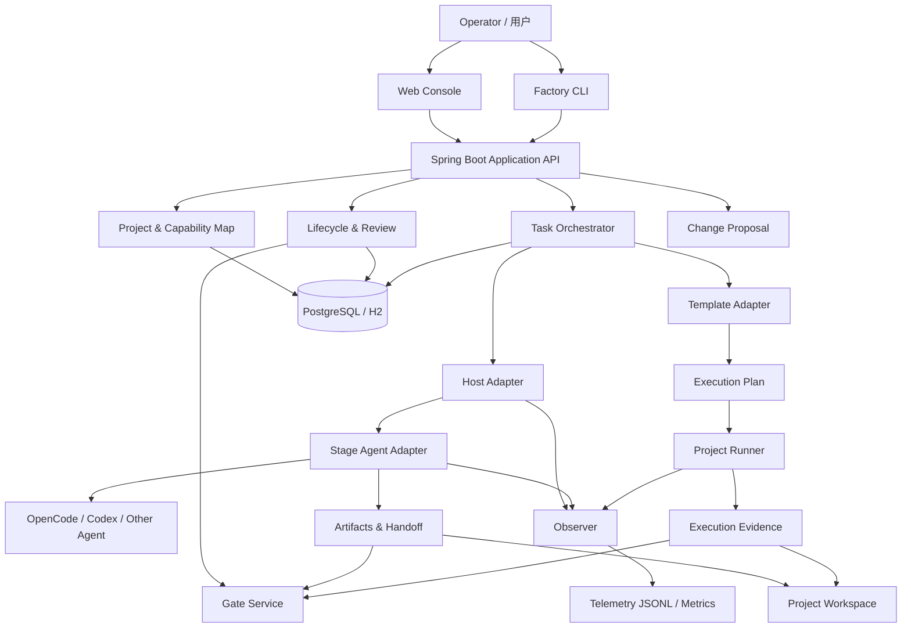
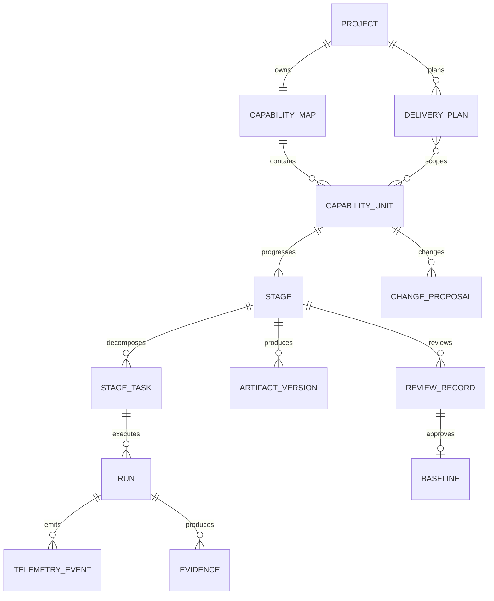
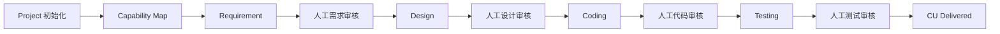
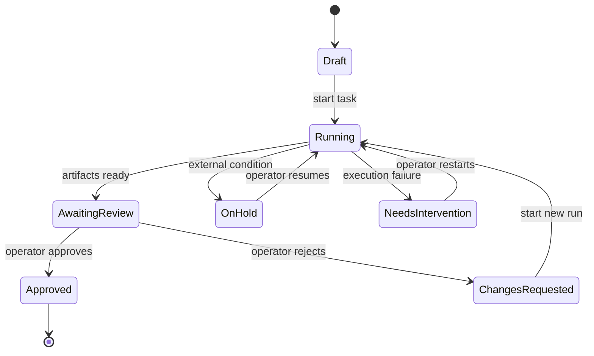

# AI 软件工厂系统设计方案 v1.1（最终版）

> 面向真实研发流程的 AI 软件生产系统：以 CapabilityUnit 为最小业务模块和交付单元，贯穿需求、设计、编码和测试；由 Spring Boot 控制平台管理状态、审核、调度、执行边界和遥测，由可替换的 Headless Agent 与确定性 Runner 完成实际工作。

- 状态：最终设计基线
- 日期：2026-08-03
- 基准方案：`ai-software-factory-design-v1.1.md`
- 实测依据：[SDLC Pipeline 插件模式问题复盘](../research/sdlc-pipeline-plugin-mode-lessons-2026-08-03.md)

---

## 0. 采纳分析与最终裁决

本方案以 Claude 生成稿为主基准重新设计，不继承仓库既有 `Core / WorkItem / TestBatch / Operation` 领域模型。参考方案只提供可借鉴的职责边界，插件复盘只提供已经发生过的失败证据。

### 0.1 保留

| 基准设计 | 裁决 | 理由 |
|---|---|---|
| Spring Boot 控制平台 + 可插拔 Runner | 保留 | 状态、调度、审核和查询是长期资产，Agent 与模型是可替换资产 |
| Capability Map 与 CapabilityUnit | 保留并调整粒度 | 能力必须贯穿需求、设计、编码、测试和交付，但 CU 应是用户管理这类完整模块，不是注册按钮或单个接口 |
| 需求、设计、代码、测试四个审核门禁 | 保留 | 四类正式产物均需要明确的人类责任边界，Agent 不得自证通过 |
| 不可原地修改的 Baseline 与 ChangeProposal | 保留 | 并行模块和公共接口变更需要显式影响分析、审批和版本递增 |
| Template Adapter 统一工程动词 | 保留 | 控制平台不应感知 Node、Spring Boot、Electron 等技术栈差异 |
| Run 超时、有限重试和失败分类 | 保留并修订 | 可限制单次执行损失，但不能代替任务切片和进展判断 |
| 挂起与恢复 | 保留并改为人工恢复 | 系统可判断恢复条件，但不得在用户不知情时自动重新启动 Agent |
| 遥测、Token、成本与插件版本分析 | 保留并加强 | 插件实测证明必须区分父子运行、失败重试、成本可信度和实际墙钟 |
| Markdown 装配大文档 | 保留 | 正式正文只维护一份，Word/PDF 是导出视图 |

### 0.2 修订

| 基准设计 | 最终设计 | 修订原因 |
|---|---|---|
| Module/CSCI 下继续拆多个 CU | CU 本身就是用户管理、订单管理等最小业务模块 | 避免把一个完整模块拆成多个互相依赖的小生命周期，破坏端到端需求与交付一致性 |
| 一个阶段 Runner 同时负责 Agent、命令、Gate 和状态 | 拆成 Stage Agent Adapter、Project Runner、Gate Service 和 Orchestrator | 插件实测中 Hook 长编排导致 Agent、Hook、命令和状态失败难以区分 |
| Handoff 通过最终聊天文本返回 | 使用结构化 `handoff_submit` 协议 | 聊天包装、围栏和解释文字曾导致 JSON 解析失败 |
| Gate 通过后再单独推进状态 | Gate、Evidence 和状态迁移同一事务完成 | 避免出现证据通过但状态未推进的半完成现场 |
| 外部资料挂路径 | 用户上传到项目唯一 `references/`，Factory 不再二次复制 | 外部目录自动摄取、快照复制和格式转换已经造成复杂度与格式破坏 |
| 每次 Run 一条 JSONL 是唯一事实来源 | 数据库保存控制状态，文件保存正式产物，JSONL 只保存运行事件 | 审核状态、正式正文、交付证据和遥测不能共用一个事实源 |
| 固定重试次数和上下文边界解决长任务 | 单次 Run 受预算约束，过大工作必须拆 StageTask | 实测证明延长 300/600/900 秒 Deadline 不能解决过大的 Coder 任务 |
| Tester 与控制面都运行完整测试 | Test Agent 做设计与聚焦检查，Project Runner 做权威全量测试 | 避免重复验证、耗时翻倍和结果责任不清 |
| 自动周期探测后恢复 | 系统只提示可恢复，由 Operator 手动启动新 Run | 会话和外部条件可能已变化，自动恢复可能使用过期上下文 |

### 0.3 不采纳

| 候选设计 | 不采纳原因 |
|---|---|
| `WorkItem` 作为正式领域实体 | 与 CapabilityUnit 的需求、设计、编码、测试和交付职责重叠，会形成双生命周期和双状态源 |
| 继承现有 1.1 Core 领域模型 | 本方案是整体重设计，参考方案不是兼容性约束 |
| Factory 自动递归摄取或复制外部参考目录 | 原 SDLC Pipeline 已出现目录膨胀、二进制转换、重复存储和职责失控 |
| 为每次 Run 创建参考资料快照 | 大目录代价高、产生第二份资料事实源，也无法自然表达用户持续维护的项目资料目录 |
| 角色目录 ACL | Agent 角色代表职责而不是文件权限；权限由项目统一安全策略控制，实际 Diff 独立审计 |
| Hook 承担长任务、权威测试和状态迁移 | 宿主 Hook 是不稳定接入点，不适合作为业务事务边界 |
| `SKIP + exit 0` 视为测试成功 | 必测项只有 `passed` 可以通过，`skipped` 和 `blocked` 必须阻断 |
| Core 保存或恢复 Agent 会话 | 会话属于 Host Adapter；控制平台只保存正式输入、Handoff、版本和证据引用 |
| 自动 Git 回滚 | 工作流返工、证据失效与源码回退是三个不同动作，源码处理必须显式决定 |

---

## 1. 关键假设与范围

1. Factory 服务多个项目；MVP 采用 Spring Boot 模块化单体和单实例部署，可运行在开发者本机或团队服务器。
2. 一个项目包含多个 CapabilityUnit。CU 是用户管理、订单管理、设备管理等最小业务模块，也是最小审核、基线和交付单元。
3. CU 内部可以包含注册、登录、角色分配等功能项，并拆成多个 StageTask，但这些 Task 不拥有独立业务生命周期。
4. 每个 CU 固定经过需求、设计、编码、测试四个阶段，每阶段完成后都必须由 Operator 人工审核。
5. 控制平台不直接依赖某个模型 SDK，通过 Stage Agent Adapter 调用 OpenCode、Codex 或其他 Headless Agent。
6. 每个编码 StageTask 默认使用独立 Git worktree 和 branch；CU 通过集成任务汇总多个 ChangeSet。
7. 每个项目只有一个用户维护的 `references/` 目录。Factory 不从任意外部路径递归摄取或建立快照。
8. Factory 在模型处理前按原始字节保存用户输入；Secret 通过独立运行时通道注入。
9. 日常正式文档使用 Markdown，Word/PDF 只按需导出，不维护双份正文。
10. 1.1 不引入微服务、消息队列、通用工作流引擎、远程 Agent Runtime 或自动发布系统。

---

## 2. 总体架构



### 2.1 模块化单体边界

| 模块 | 负责 | 不负责 |
|---|---|---|
| Project | 项目、Capability Map、CU 关系和项目配置 | Agent 会话 |
| Lifecycle | CU 阶段、审核、Baseline、失效和完成判定 | 执行 Shell 命令 |
| Planning | 大目标拆分、依赖、风险和 CU 计划 | 复制每个 CU 的正式需求正文 |
| Orchestrator | StageTask 拆分、调度、Retry、Stop、人工恢复 | 绕过 Gate 修改状态 |
| Host Adapter | 原始输入捕获、会话启动、事件转换、结构化输出 | 生命周期真相 |
| Stage Agent Adapter | Prompt、模型、Agent 角色和阶段生成协议 | 权威构建、测试和审批 |
| Template Adapter | 技术栈能力声明和 Execution Plan 编译 | CU 状态迁移 |
| Project Runner | 命令、进程树、超时、日志、就绪、清理和证据 | 判断业务是否正确 |
| Gate Service | 校验产物、证据、审核前置条件并原子推进 | 从聊天文本猜测结论 |
| Observer | Run、Session、Model Step、Tool Span、Token 和成本 | 修改业务状态 |
| Artifact Inspector | 覆盖、Diff、Hash、测试绑定和语义检查 | 代替 Operator 审批 |

### 2.2 部署形态

MVP 使用一个 Spring Boot 进程：

```text
Spring Boot modular monolith
├─ REST API
├─ Scheduler
├─ Lifecycle transaction boundary
├─ Host adapters
├─ Runner process manager
├─ Observer
└─ Local Web Console
```

状态存储可先使用 H2/PostgreSQL；项目文件、Git 仓库、参考资料和正式产物保存在项目工作区。未来拆分服务时保持 Application API 和 Runner Protocol 不变。

---

## 3. 核心领域模型

### 3.1 实体关系



### 3.2 CapabilityUnit

CU 是最小业务模块、生命周期单元和交付单元。例如：

```text
CU-USER-MANAGEMENT：用户管理模块
├─ 功能范围：注册、登录、角色分配、用户禁用
├─ Requirement Stage
├─ Design Stage
├─ Coding Stage
├─ Testing Stage
└─ Delivery
```

CU 必须满足：

1. 对外提供一组内聚的完整业务能力；
2. 可以独立描述范围、接口、规则和验收目标；
3. 可以形成独立需求、设计、代码和测试基线；
4. 可以作为一个整体由 Operator 审核与交付；
5. 内部任务可以并行，但不能脱离 CU 单独声明业务交付完成。

注册、登录等是 `Feature` 或 `RequirementItem`，不是新的 CU。数据库、API、页面、测试等是 StageTask，也不是新的生命周期实体。

### 3.3 Stage、StageTask 与 Run

```text
CapabilityUnit
└─ Stage：coding
   ├─ Task：用户数据模型
   │  ├─ Run 1：失败
   │  └─ Run 2：成功
   ├─ Task：注册登录 API
   ├─ Task：权限服务
   └─ Task：管理页面
```

- Stage 是 CU 的正式阶段；
- StageTask 是阶段内部的可调度执行切片；
- Run 是 Task 的一次 Agent 或 Runner 执行；
- 只有 Stage 具有审核和 Baseline；
- Task 完成不等于 Stage 通过；
- Run 成功不等于 Task、Stage 或 CU 完成。

### 3.4 DeliveryPlan

跨多个业务模块的大目标先形成 DeliveryPlan：

```text
建设后台管理系统
├─ CU：用户管理
├─ CU：角色权限
├─ CU：审计日志
└─ CU：系统配置
```

Plan 只保存目标、范围、CU 拆分、依赖、风险、里程碑和验收轮廓。每个 CU 的正式需求仍保存在自己的 Requirement Artifact 中。

---

## 4. 生命周期与四阶段审核

### 4.1 总流程



### 4.2 通用 Stage 状态机



每个阶段的 `Approved` 都绑定确定的 Artifact Version、内容 Hash、代码修订或测试 Evidence。上游 Baseline 变化时，下游 Baseline 保留历史但标记为 `stale`。

### 4.3 需求阶段

1. Host Adapter 在模型处理前保存原始用户输入。
2. Requirement Agent 按需读取项目 `references/`。
3. 维护 CU 的功能项、输入输出、接口需求、业务规则、约束和验收标准。
4. 验收标准使用带 ID 的 `given / when / then` 结构。
5. 生成 Requirement Artifact 和引用清单。
6. Operator 审核通过后形成 Requirement Baseline。

### 4.4 设计阶段

1. 只能读取已批准 Requirement Baseline。
2. 生成架构、数据模型、接口、关键流程、异常处理和安全设计。
3. Interface Registry 判断已有接口的覆盖、冲突和影响范围。
4. 信息不足时生成结构化 ClarificationRequest，Stage 进入 `OnHold`。
5. Artifact Inspector 先执行结构、引用和覆盖检查。
6. Operator 审核通过后形成 Design Baseline。

### 4.5 编码阶段

1. Implementation Planner 把模块编码拆成可独立验证的 StageTask。
2. 每个 Task 创建独立 worktree 和 `factory/<cu-id>/<task-id>` branch。
3. Agent 只接收当前 Task 的目标、相关 Baseline 引用、选定参考文件和项目规则。
4. Agent 使用 `handoff_submit` 报告变更、验证、问题和后续建议。
5. 控制平台独立计算实际 Diff，不能信任声明的文件列表。
6. Project Runner 执行聚焦检查；Task 成功后形成 ChangeSet。
7. Integration Task 将多个 ChangeSet 合并到 CU 集成分支并执行完整 build/lint/unit test。
8. Operator 审核整个 CU 的集成 Diff，通过后形成 Code Baseline。

### 4.6 测试阶段

1. Test Agent 根据 Requirement、Design、Code Baseline 生成测试计划和用例。
2. Test Agent 可运行新增 Selector 的聚焦检查，但不产生权威通过结论。
3. Project Runner 执行完整单元、集成、接口、E2E、设备或其他必测项。
4. 结果原生区分 `passed / failed / skipped / blocked`。
5. 必测项只有 `passed` 可以通过；缺少设备时记录 `blocked`，不能用 Mock 结果冒充真实设备通过。
6. Artifact Inspector 生成需求—设计—代码—测试追溯矩阵。
7. Operator 审核测试范围、结果、阻塞项和 Evidence，通过后形成 Test Baseline，CU 标记为 Delivered。

---

## 5. Baseline 与 ChangeProposal

### 5.1 Baseline

四阶段分别形成不可变 Baseline：

```text
RequirementBaseline
DesignBaseline
CodeBaseline
TestBaseline
```

每个 Baseline 至少绑定：

```text
baseline_id
cu_id
stage
artifact_version
content_hash
source_revision?
review_record_id
created_at
```

已批准 Baseline 不允许原地修改。

### 5.2 ChangeProposal

任何已批准内容的变化都创建 ChangeProposal：

```text
proposal_id
target_baseline_id
reason
delta_ref
affected_cu_ids[]
affected_interface_ids[]
impact_summary
decision
```

流程：

1. 创建增量提案；
2. Interface Registry 和依赖图计算候选影响范围；
3. Operator 审核影响是否可接受；
4. 批准后目标阶段产生新 Artifact Version 和 Baseline；
5. 当前 CU 的所有下游 Baseline 标记 `stale`；
6. 其他受影响 CU 标记 `impact_review_required`；
7. 系统生成建议任务，但不自动修改代码或启动 Agent。

---

## 6. 项目参考资料与原始输入

### 6.1 唯一参考目录

```text
project/
└─ references/
   ├─ requirements/
   ├─ prototypes/
   ├─ protocols/
   ├─ screenshots/
   └─ legacy-system/
```

规则：

1. 一个 Project 只有一个 `references/`。
2. 用户可以上传单文件或整个目录，保持原始目录层次、文件名、格式和字节内容。
3. `references/` 本身就是项目参考资料的唯一事实源。
4. Factory 不再复制、快照、转换或建立第二份参考资料库。
5. Factory 不从任意外部路径自动递归导入。
6. Agent 只能读取本次 Run 明确选择的文件，不默认注入整个目录。
7. 二进制文件由对应工具按原格式读取，不能通用转换成 Markdown 后冒充原文。

### 6.2 原始输入

用户在 Console、CLI 或 Host 中提交的文字和附件清单，在进入模型前保存：

```text
input_id
project_id
raw_content_ref
content_hash
content_type
captured_at
redaction_status
```

`raw_content_ref` 指向不可改写的原始输入文件。Factory 不对输入执行 `trim`、转义、格式化或模型总结后再保存。

### 6.3 Run Reference Manifest

Factory 不快照参考文件，但每次 Run 记录实际读取内容：

```json
{
  "run_id": "RUN-001",
  "references": [
    {
      "path": "references/protocols/user-api.pdf",
      "sha256": "..."
    },
    {
      "path": "references/prototypes/user-management/index.html",
      "sha256": "..."
    }
  ]
}
```

如果 Agent 选择一个目录，Manifest 最终记录实际读取的文件，而不是为整个目录创建复制快照。文件内容变化后，新 Run 计算新 Hash；旧 Run 仍可证明当时使用的路径与内容版本，但不承诺恢复已经被用户覆盖的旧文件。

### 6.4 Secret

密码、Token、证书和验证码通过 Secret Provider 在运行时注入：

- 不进入原始需求正文；
- 不进入 `references/`；
- 不作为普通命令参数记录；
- 不进入 Handoff、Telemetry、日志或 Git；
- Runner 在 stdout/stderr 入库前执行脱敏。

---

## 7. 模板与执行协议

每个项目模板提供 `factory.manifest.yaml`：

```yaml
template_id: springboot-vue
version: 1.0.0
stack_tags: [java, spring, vue, maven, npm]
commands:
  validate:  { entry: scripts/validate,  timeout_s: 60 }
  init:      { entry: scripts/init,      timeout_s: 300 }
  build:     { entry: scripts/build,     timeout_s: 600 }
  package:   { entry: scripts/package,   timeout_s: 300 }
  test:      { entry: scripts/test,      timeout_s: 900 }
  start:     { entry: scripts/start,     timeout_s: 120 }
  stop:      { entry: scripts/stop,      timeout_s: 60 }
  status:    { entry: scripts/status,    timeout_s: 30 }
  readiness: { entry: scripts/readiness, timeout_s: 30 }
  logs:      { entry: scripts/logs,      timeout_s: 30 }
  clean:     { entry: scripts/clean,     timeout_s: 120 }
```

统一 ExecutionResult：

```json
{
  "operation_id": "OP-001",
  "status": "passed",
  "started_at": "...",
  "ended_at": "...",
  "exit_code": 0,
  "logs_ref": ".factory/evidence/OP-001/output.log",
  "artifacts": ["target/app.jar"],
  "error_type": null,
  "cleanup_status": "passed"
}
```

测试步骤的 `status` 必须使用 `passed / failed / skipped / blocked`。`stop`、`clean` 和状态查询必须幂等。Runner 在 Windows 上还必须管理子进程树、PID 身份、编码和受控清理。

---

## 8. Stage Agent 与结构化 Handoff

### 8.1 RunRequest

```text
run_id
project_id
cu_id
stage
task_id
objective
baseline_refs[]
reference_paths[]
rules_version
prompt_version
agent_version
worktree_ref?
budget
```

Context Selector 只提供当前任务所需的 Baseline、规则和参考路径。控制平台不把整个项目清单、全部历史失败和所有参考资料重复注入 Prompt。

### 8.2 Handoff

```text
handoff_submit
  run_id
  task_id
  role
  summary
  observations[]
  declared_changed_paths[]
  validations[]
  open_issues[]
  requested_follow_up?
```

约束：

- Handoff 通过工具或 Host Output Schema 提交，不从聊天尾部提取；
- 实际 Diff、文件 Hash 和命令结果由控制平台独立派生；
- Agent 可以提出建议，不能修改审核或交付状态；
- Handoff 丢失时 Run 失败，不能根据文件变化猜测“没有问题”。

### 8.3 Hook

Hook 仅允许：

- 捕获会话与工具事件；
- 关联 project/cu/task/run/session ID；
- 执行轻量 Secret 与危险操作保护；
- 发送状态通知。

Hook 不允许执行长构建、完整测试、复杂 Agent 路由、Gate 或状态迁移。

---

## 9. Run 执行边界、挂起与恢复

### 9.1 执行边界

| 控制项 | 规则 |
|---|---|
| 单 Run 超时 | 控制平台终止完整进程树，记录 `timeout` |
| 自动重试 | 仅限瞬时 host/tool/infrastructure 错误，次数由任务策略配置 |
| 相同失败 | 错误指纹相同且无新 Evidence 时停止自动重试 |
| 上下文 | 新 Run 使用正式 Baseline、最新反馈和上次结构化 Handoff，不携带完整失败聊天 |
| 大任务 | 拆 StageTask；禁止通过无限延长 Deadline 保持一个长会话 |
| 文件/Token/工具次数 | 用于观测和告警，不作为业务通过或失败的固定门禁 |

### 9.2 失败分类

```text
requirement_error
design_error
implementation_error
test_contract_error
infrastructure_error
host_error
plugin_error
tool_error
timeout
cancelled
unknown
```

新用户反馈到达后，必须先使旧执行计划、待复验决定和未开始 Run 失效，再选择重新规划、Retry、Reverify 或 Stop。

### 9.3 挂起类型

```text
OnHold
  missing_device
  third_party_unavailable
  missing_reference
  awaiting_clarification
  awaiting_environment
  awaiting_human_decision

NeedsIntervention
  retry_budget_exceeded
  repeated_error
  context_overflow
  host_failure
  plugin_failure
```

### 9.4 人工恢复

1. 系统可以探测设备、接口、文件或环境是否已经可用；
2. 条件满足后只标记 `ready_to_resume` 并通知 Operator；
3. Operator 手动确认恢复；
4. 恢复前重新检查 Baseline、规则、Prompt、模板、代码修订和参考文件 Hash；
5. 创建新的 Run，不要求恢复旧聊天；
6. 一个 CU 挂起不占用其他 CU 的并发配额。

---

## 10. Gate、审核与原子迁移

四阶段 Gate 的共同事务为：

```text
validate expected stage version
→ validate artifact/evidence bindings
→ save ReviewRecord
→ create immutable Baseline
→ advance Stage/CU state
→ invalidate affected downstream data
```

以上步骤必须在同一数据库事务中完成，并使用 `expected_version` 防止并发覆盖。相同 `review_id` 或幂等键重复提交时返回原结果。

ReviewRecord：

```text
review_id
cu_id
stage
artifact_version
artifact_hash
source_revision?
reviewer
decision: approved | changes_requested
comments
reviewed_at
idempotency_key
```

人工审核 UI 必须同时展示正式产物、与上一版本 Diff、Agent Handoff、确定性检查、未解决问题和 Evidence，不能只展示 Agent 总结。

---

## 11. 遥测与分析

### 11.1 观测层级

```text
Project
└─ CapabilityUnit
   └─ StageTask
      └─ Run
         └─ Session
            ├─ Model Step
            ├─ Tool Span
            └─ Child Session
```

父会话等待子 Agent 的时间与子 Agent 执行时间存在包含关系，不能简单相加。

### 11.2 指标

```text
wall_clock_ms
model_ms
tool_ms
runner_ms
gate_ms
operator_wait_ms
environment_wait_ms
input_tokens
output_tokens
reasoning_tokens
cache_read_tokens
cache_write_tokens
provider_billed_cost
factory_estimated_cost
billing_status
cost_source
pricing_version
```

报告分别给出：

- 实际总耗时与总用量；
- 最终成功路径；
- 失败、取消和返工开销；
- 按 CU、阶段、Agent、模型、Prompt 和版本的分布；
- 工具错误、无进展重试、重复读取和输出截断；
- 数据缺失和成本可信度。

Provider 未返回成本时记录 `unavailable`，不能将 `0` 解释为真实零成本。

### 11.3 事实分层

| 数据 | 权威存储 | 用途 |
|---|---|---|
| 生命周期、审核、调度 | 关系数据库 | 控制与查询 |
| Requirement/Design/Test Report | Markdown | 正式可读产物 |
| 源码 | Git | 代码历史与集成 |
| 命令和测试 Evidence | `.factory/evidence/` | 权威执行证据 |
| Runtime Event | `.factory/telemetry/<run-id>/events.jsonl` | 过程分析 |
| 聚合指标 | 数据库或 metrics.json | 查询与基线比较 |

遥测默认不参与产品 Gate。只有正式产物缺失、必测项未通过、Evidence 失效或 Secret 泄漏等确定性问题阻止审核通过。

---

## 12. 大文档与接口文档生成

Capability Map 和四阶段已批准产物是装配来源：

1. 按 CU 顺序生成项目目录；
2. 只装配已批准 Baseline；
3. Requirement、Design、Interface 和 Test Report 使用固定模板渲染；
4. Markdown 是内部正式版本；
5. Word/PDF 使用导出工具生成，不允许手工形成第二份可写正文；
6. 导出物记录来源 Baseline ID 和 Hash，源内容变化后旧导出标记过期。

---

## 13. 推荐目录结构

```text
ai-software-factory/
├─ control-plane/                         # Spring Boot 模块化单体
│  ├─ project/
│  ├─ capability/
│  ├─ lifecycle/
│  ├─ planning/
│  ├─ orchestration/
│  ├─ review/
│  ├─ change-proposal/
│  ├─ host-adapter/
│  ├─ template-adapter/
│  ├─ runner/
│  ├─ observer/
│  └─ artifact-inspector/
├─ agent-adapters/
│  ├─ opencode/
│  └─ codex/
├─ templates/
│  ├─ node-service/
│  └─ springboot-vue/
└─ projects/
   └─ <project-id>/
      ├─ references/                      # 项目唯一参考目录
      ├─ docs/
      │  └─ capabilities/<cu-id>/
      │     ├─ requirement/
      │     ├─ design/
      │     └─ test/
      ├─ workspace/                       # 主 Git 工作区
      └─ .factory/
         ├─ inputs/                       # 模型前原始输入
         ├─ index/                        # 轻量引用和导出索引
         ├─ worktrees/<task-id>/
         ├─ evidence/<operation-id>/
         ├─ telemetry/<run-id>/
         ├─ handoffs/<run-id>.json
         └─ exports/
```

`references/`、正式文档和源码是用户项目资产；`.factory/telemetry`、临时 worktree 和运行缓存默认不进入 Git。具体 Git 策略由项目配置声明。

---

## 14. MVP 实施计划

### MVP-0：冻结领域和合同

- 固定 `Project → CapabilityUnit → StageTask → Run`；
- 删除 WorkItem；
- 固定四阶段和四个人工审核门禁；
- 固定参考目录、原始输入和 Secret 边界；
- 定义 Stage Agent、Handoff、Template、Runner 和 Gate Schema。

完成标准：文档、数据库、API、Schema 和 Agent Prompt 使用同一词汇，不存在第二套生命周期。

### MVP-1：单 CU 闭环

- 创建真实项目和一个“用户管理”CU；
- 完成需求、设计、编码、测试四阶段；
- 每阶段产生 Artifact、ReviewRecord 和 Baseline；
- 编码至少拆成两个 worktree Task；
- 合并后执行权威构建和测试。

完成标准：CU Delivered，且所有阶段、Hash、Git revision、Handoff 和 Evidence 可追溯。

### MVP-2：修复插件实测缺口

- 模型前原始输入捕获；
- 结构化 Handoff；
- 薄 Hook；
- Gate + Evidence + Transition 原子事务；
- 测试四态；
- 新反馈先失效旧计划；
- Secret Provider。

完成标准：每个历史失败都有 Adapter/Core/Runner 合同测试，无法再通过聊天包装、`skip + exit 0` 或半状态提交复现。

### MVP-3：挂起、变更与并行

- 模拟外部设备缺失并人工恢复；
- 一个 ChangeProposal 使下游 Baseline 失效；
- 三个 CU 并行推进；
- 同一 CU 多个编码 Task 独立 worktree 后集成；
- 一次合并冲突有明确人工处理流程。

完成标准：挂起不阻塞其他 CU，变化不静默覆盖历史，并行任务不共享未受控工作区。

### MVP-4：Observer 与分析闭环

- Run/Session/Model Step/Tool Span；
- 父子会话对账；
- 总量、成功路径和返工成本；
- Trace Replay；
- 插件、Prompt 和模型版本基线比较。

完成标准：无需人工拼接日志即可解释慢点、失败层次、真实墙钟和成本可信度。

### MVP-5：项目控制台与最终产物

- Capability Map、CU 看板和四阶段审核；
- ChangeProposal 影响图；
- worktree/branch/ChangeSet 视图；
- 遥测、成本和插件健康；
- 需求—设计—代码—测试追溯；
- Markdown/Word/PDF 装配导出。

完成标准：Operator 可以在同一控制台完成项目检查、阶段审核、人工恢复和 CU 交付。

---

## 15. 验证策略

1. **领域单元测试**：CU 状态、四门禁、Baseline、ChangeProposal、失效、幂等和并发版本。
2. **Host Adapter 合同测试**：原始输入、结构化 Handoff、事件关联和 Secret 脱敏。
3. **Template/Runner 合同测试**：命令、退出码、四态结果、超时、进程树、就绪和清理。
4. **Git 隔离测试**：worktree 创建、任务分支、ChangeSet、集成、冲突和受控清理。
5. **Trace Replay**：父子会话、取消、重试、输出丢失、成本缺失和固定错误指纹。
6. **真实全流程**：真实项目的 init、四阶段审核、环境挂起、变更返工和最终交付。

完整通过必须同时具备：

- 生命周期证据；
- 四阶段人工审核记录；
- 当前 Baseline 对应的功能测试 Evidence；
- 最终产物符合性；
- 未解决问题披露；
- CU 交付决定。

业务代码能运行不能替代 Factory Gate，所有单元测试通过也不能替代真实 Agent、Git、模板和业务验收集成。

---

## 16. 风险与取舍

| 风险 | 应对 |
|---|---|
| CU 作为模块级单元后范围较大 | 阶段内部强制拆 StageTask，编码 Task 独立 worktree，Stage 统一集成审核 |
| 多 worktree 合并冲突 | 每个 Task 固定 base revision，集成前 rebase/merge 检查，冲突转人工处理 |
| 四个人工门禁降低速度 | StageTask 可并行，审核面向 CU 聚合产物，不对每个 Task 重复审批 |
| 参考目录持续变化导致旧运行不可恢复 | Run 保存实际读取文件路径与 Hash，明确只保证可检测变化，不承诺自动恢复旧字节 |
| 单参考目录体积过大 | Agent 按需选择，记录实际读取 Manifest，不通过固定文件数阻断 |
| Agent 陷入长推理或重复工具调用 | 单 Run 安全预算、错误指纹和进展检测；真正解决方式是任务切片 |
| 自动重试污染上下文 | 新 Run 只读取正式 Baseline、最新反馈和结构化 Handoff |
| Gate 与状态出现半提交 | 关系数据库事务、expected version 和幂等键 |
| 测试 `skipped` 假绿 | 测试原生四态，必测项只有 `passed` |
| 遥测影响被观测流程 | Observer 异步聚合，Hook 只做轻量事件镜像 |
| 父子时间和成本重复 | Span 包含关系、墙钟单独计算、成本标注来源与可信度 |
| Spring Boot 单体后续膨胀 | 按模块保持禁止依赖和 Application API，MVP 不提前拆微服务 |

---

## 17. 最终结论

AI 软件工厂 v1.1 采用如下主线：

```text
Project
→ Capability Map
→ CapabilityUnit（模块级最小交付单元）
→ Requirement / Design / Coding / Testing
→ 四阶段人工审核与不可变 Baseline
→ Delivered
```

CU 内部通过 StageTask 和 Run 控制执行粒度，通过独立 worktree 和 branch 隔离并行编码；项目参考资料由用户统一维护在唯一 `references/` 目录，Factory 只保存模型前原始输入以及每次 Run 实际读取文件的路径与 Hash。

Spring Boot 控制平台负责状态、审核、调度、变更、人工恢复和遥测关联，但不直接承担 Agent 专业判断、技术栈命令或宿主会话。Stage Agent、Template Adapter、Project Runner、Observer 和 Gate Service 各自拥有清晰边界。插件真实测试暴露的 Handoff、Hook、原子迁移、测试假绿、输入改写、成本歧义和任务过大问题，均被落实为接口合同、领域不变量和 MVP 验收项，而不是继续向单一插件堆叠补丁。
