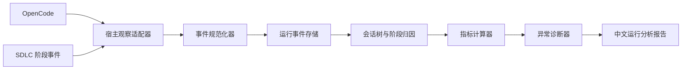

# 附录 B：运行观察与成本分析

## 1. 目标和边界

本模块把当前由 Codex 手工完成的 OpenCode 日志检查、工具错误分析、阶段耗时统计、
Token/成本汇总和异常调用判断独立出来。

它观察公开运行事实，不读取模型私有思维链。推荐名称是“可观测推理行为分析”，核心审计对象是：

```text
阶段 → Agent 运行 → 模型步骤 → 工具 → 证据 → 结果
```

当前适配基线锁定 OpenCode `1.18.10`。OpenCode V2 插件和 SDK 仍在变化，只作为未来适配目标，
不能进入 Core 合同。详细官方证据见
[OpenCode 可观测性调研](../../research/opencode-observability-2026-07-31.md)。

## 2. OpenCode 能力边界

### 2.1 实时 JSONL 不是完整审计流

`opencode run --format json` 当前输出经过 CLI 筛选和重新包装的 JSONL，主要包含：

- `step_start`；
- `step_finish`；
- 终态 `tool_use`；
- 完成后的 `text`；
- 启用 `--thinking` 后完成的 `reasoning`；
- `error`。

边界：

- CLI 输出的时间戳是写出事件时的时间，不等于底层事件最初发生时间；
- 工具的 `pending` 和 `running` 不进入该 JSONL，只输出 `completed` 或 `error`；
- 文本和 reasoning 是完成块，不是 Token 增量流；
- 根会话 JSONL 会过滤子代理内部事件；
- `--thinking` 不代表能够获得完整私有思维链；
- CLI 会等待根会话进入空闲状态后退出，不需要固定 `sleep` 轮询。

因此 `--format json` 适合实时观察根会话，不足以单独承担完整分析。

### 2.2 完整观察组合

OpenCode 首个观察适配器使用四类输入：

```text
根会话实时 JSONL 或公共事件订阅
  + 根会话结束后的 Session Export
  + 递归子会话 Export
  + SDLC 自己发出的阶段和操作边界
```

父会话中的 `<task_result>` 只是子代理最终文本的包装，不包含其内部工具、步骤成本和错误恢复。
观察适配器必须通过子会话接口递归建立会话树，不能把父会话摘要当成子代理完整过程。

Session Export 只导出指定会话，不自动包含子会话。运行结束后应：

1. 导出根会话；
2. 查询直接子会话；
3. 递归导出全部子会话；
4. 记录导出内容哈希和受控载荷引用；
5. 只将脱敏摘要和必要切片交给分析器。

## 3. 组件



| 组件 | 职责 |
|---|---|
| 宿主观察适配器 | 连接 CLI、公共事件、导出和子会话接口 |
| 事件规范化器 | 把宿主字段转换成 1.1 标准事件 |
| 运行事件存储 | 保存事件索引、内容哈希和受控载荷引用 |
| 会话树与阶段归因 | 关联父子会话、Agent、工作项、阶段和操作 |
| 指标计算器 | 计算时间、Token、成本、调用量和体积 |
| 异常诊断器 | 识别重复失败、无进展调用、重试放大和数据缺口 |
| 报告器 | 生成中文报告及轻量 JSON 指标 |

这些组件通过端口连接 Core。Core 只认识标准的运行引用和分析结论，不认识 OpenCode 的
`sessionID`、`part` 或插件 Hook 类型。

## 4. 阶段边界

OpenCode 不知道需求、实现、测试等 SDLC 阶段。Pipeline 必须自己发出：

```text
stage.started
stage.completed
role.started
role.completed
slice.started
slice.completed
gate.started
gate.completed
operator_wait.started
operator_wait.completed
```

每个事件至少包含：

```json
{
  "event_id": "EVT-...",
  "timestamp": "...",
  "work_item_id": "WI-...",
  "stage": "implementation",
  "operation_id": "OP-...",
  "run_id": "RUN-...",
  "session_id": "ses_...",
  "parent_session_id": null,
  "agent_id": "sdlc-implementation",
  "attempt": 1
}
```

阶段归因以这些确定性边界为准，不根据 Agent 的自然语言推测。

## 5. 标准运行记录

### 5.1 运行身份

```text
RunRecord
├─ run_id
├─ host_type / host_version
├─ adapter_version
├─ work_item_id / test_batch_id
├─ stage / role / attempt
├─ root_session_id
├─ started_at / ended_at / status
├─ source_revision_id
└─ raw_event_set_hash
```

状态至少为：

```text
running
completed
failed
cancelled
interrupted
```

取消和中断运行不能进入成功路径，但必须进入实际总量。

### 5.2 标准事件

事件索引只保存：

```text
event_id
event_type
occurred_at
observed_at
session_id / parent_session_id
message_id / call_id
stage / role / attempt
status
input_bytes / output_bytes
payload_hash / payload_ref
redaction_state
```

同一正文以内容哈希去重，只保存一份受控载荷。不能在 Hook、JSONL、Export 和报告中重复复制。

## 6. 时间分析

OpenCode 持久化消息、文本、reasoning 和工具的开始或结束时间，精确分析优先使用这些原始时间，
CLI 外层时间戳只作为观察时间。

至少计算：

| 指标 | 定义 |
|---|---|
| 总墙钟时间 | 当前运行从开始到终态 |
| 模型步骤时间 | 助手消息或 step 的生成时间 |
| 可见推理块时间 | OpenCode 提供的 reasoning part 时间 |
| 工具运行时间 | 工具终态的 `start` 到 `end` |
| Core 门禁时间 | Pipeline 自己记录的门禁执行区间 |
| 子代理时间 | 每个子会话自身的墙钟时间 |
| 人工等待时间 | 明确的 Operator 等待区间 |
| 无事件静默时间 | 已运行但没有可观测事件的区间 |
| 重试时间 | 被判定为失败尝试或返工的区间 |

### 6.1 防止重复相加

- 父会话等待前台子代理的区间和子代理墙钟时间有包含关系；
- 阶段墙钟时间使用时间区间并集；
- 按组件分解的模型和工具时间可以重叠，不能宣称它们之和等于墙钟时间；
- 子代理成本按各自 step 计数，父会话中的 `task_result` 不再产生一次子会话成本；
- 报告同时显示墙钟视图和工作量视图，不把两者混成一个总时长。

## 7. Token 与成本账本

OpenCode 的 `step_finish` 可提供：

```text
tokens.input
tokens.output
tokens.reasoning
tokens.cache.read
tokens.cache.write
cost
```

当前 OpenCode 会对供应商用量归一化：输入不含缓存读写，输出不含 reasoning，缓存和 reasoning
独立记录。成本通常来自模型价格表估算，不能直接称为供应商账单。

标准成本记录：

```json
{
  "usage_source": "opencode.step_finish",
  "input_tokens": 0,
  "output_tokens": 0,
  "reasoning_tokens": 0,
  "cache_read_tokens": 0,
  "cache_write_tokens": 0,
  "opencode_estimated_cost": 0,
  "factory_estimated_cost": null,
  "provider_billed_cost": null,
  "currency": "USD",
  "billing_status": "unknown",
  "pricing_source": null,
  "pricing_version": null
}
```

成本来源：

| 状态 | 含义 |
|---|---|
| `provider_billed_cost` | 来自提供方明确账单或结算字段 |
| `opencode_estimated_cost` | OpenCode 使用模型价格估算 |
| `factory_estimated_cost` | Factory 使用有版本的价格表估算 |
| `billing_status=unknown` | 无法确定实际结算成本 |

如果 `cost=0` 但不能确认真实免费，应保留 `opencode_estimated_cost=0`，同时写明
`provider_billed_cost=null` 和 `billing_status=unknown`。报告显示“OpenCode 估算为 0，
实际结算未知”，不能显示“本次免费”。

### 7.1 三套汇总

| 汇总 | 包含 |
|---|---|
| 实际总量 | 成功、失败、取消、中断和重试的全部已发生用量 |
| 成功路径 | 最终形成当前有效产物的运行链路 |
| 返工开销 | 未进入当前有效交付链路的已发生用量 |

此外按阶段、角色、模型、会话、尝试和工作项展开。不能将隔离项目中被取消的旧运行混入
“一次干净成功流程”的成本。

## 8. 工具调用和结果体积

当前 OpenCode 对通用工具输出默认有行数和字节数截断，但整个运行仍可能因为大量调用、
多通道复制和重试而放大。

至少记录：

```text
tool_call_count
tool_success_count
tool_error_count
tool_cancelled_count
tool_input_bytes
tool_output_bytes
tool_output_original_bytes
tool_output_truncated_count
tool_retry_count
duplicate_payload_hash_count
first_effective_write_call_index
first_effective_validation_call_index
```

按工具、阶段、角色、会话和尝试聚合，并提供最大值、中位数、P95 和 P99。

### 8.1 重复读取分类

| 分类 | 含义 | 默认判断 |
|---|---|---|
| 同上下文重复 | 同一会话、同一版本、同一路径重复读取 | 可能浪费 |
| 跨角色首次读取 | 隔离 Agent 第一次读取相同路径 | 正常成本 |
| 跨重试重建 | 失败后新尝试重新读取 | 返工成本 |
| 输入已变化重读 | 文件或正式输入哈希变化 | 正常 |
| 局部切片读取 | 大文件不同范围 | 不算重复 |

不能因为多个隔离 Agent 读取同一资料就直接判定插件错误。报告应说明这是上下文隔离成本，
再由基线判断是否值得复用摘要或减少角色。

## 9. 异常和“爆炸”判断

不设置“读取超过 6 次即拒绝”之类固定门禁。异常诊断使用同类工作项的历史分布、当前进展和
失败增量。

候选信号：

- 工具调用量或输出体积显著高于同类基线；
- 单步 reasoning token 多次触达配置上限；
- 长模型步骤后没有新工具、新修改、新证据或明确决定；
- 相同输入指纹和失败指纹连续出现；
- 同一文件版本在同一会话无理由重复读取；
- 为解析聊天交接反复重试；
- Agent 执行完整验证后 Core 立即重复执行相同完整验证；
- 子代理不断创建新会话而没有复用有效结果；
- 报告或 Hook 重复保存相同正文。

分析结论建议为：

```text
normal
elevated
explosive
insufficient_baseline
```

每个异常必须给出：

- 对比基线；
- 触发指标；
- 是否产生有效进展；
- 浪费的时间和 Token；
- 可能责任层；
- 优化建议。

它默认是诊断结论，不是产品交付门禁。只有重复失败达到项目停止策略时，Core 才暂停自动继续。

## 10. 错误分类

| 类型 | 示例 | 责任层 |
|---|---|---|
| Agent 契约错误 | 未调用结构化交接、修改无关范围 | 专业编排包 |
| 插件适配错误 | 事件漏记、字段解析错误、Hook 抛错 | 宿主适配器 |
| Core 错误 | 状态不变量或失效计算错误 | Core |
| 框架适配错误 | 错误命令、错误结果解析 | 框架适配包 |
| 执行器错误 | 进程、超时、就绪、清理异常 | 执行器 |
| 测试实现错误 | 必测项被脚本错误标记为 skip | 测试产物 |
| 项目实现错误 | 编译失败、业务行为不符 | 当前源码 |
| 环境错误 | 网络、证书、设备或工具缺失 | 运行环境 |
| 提供方错误 | 限流、模型不可用、用量字段缺失 | 模型提供方 |

相同错误指纹连续出现且没有新增信息时，停止条件优先于继续延长超时。

## 11. Hook 性能和可靠性

OpenCode 当前插件事件回调不适合执行重型分析；工具后置 Hook 虽可获得终态输出，但重型工作会
直接延长工具完成。

原则：

- Hook 只构造小事件并投递；
- 原始事件先落受控队列或本地日志；
- 指标汇总和模型分析异步执行；
- Hook 失败不能静默丢失，应留下适配器健康状态；
- 分析器不可阻塞正常工具调用；
- 分析模型失败不会修改工作流状态；
- 运行结束以根会话空闲或进程终态判断，不使用固定 sleep。

## 12. 数据保留与隐私

- 默认不保存完整 reasoning 正文；
- 不保存完整系统提示词和会话正文；
- 工具输入中的密码、Token、认证头和已配置 Secret 必须脱敏；
- 原始事件默认不进入 Git；
- 大载荷按哈希只存一次；
- 事件索引保存大小、哈希和引用；
- 可配置短期保留原始载荷，指标和最终报告可保留更久；
- 删除原始遥测不会改变既有交付状态，但报告应标明诊断证据已过期。

## 13. 报告

`analysis.md` 固定包含：

1. 运行范围、宿主版本和数据完整度；
2. 流程总墙钟时间和阶段分解；
3. 模型、工具、Core、人工等待和静默时间；
4. Token 与成本可用性；
5. 实际总量、成功路径和返工开销；
6. 各 Agent 和阶段对比；
7. 工具调用、失败、重试和输出体积；
8. 重复读取与上下文重建；
9. 异常调用和推理行为；
10. 错误责任分类；
11. 与历史基线比较；
12. 可执行优化建议和数据限制。

`metrics.json` 只保存标准指标、状态、版本、哈希和报告引用。

## 14. 适配器验收

必须使用录制或伪造事件流覆盖：

- 根会话成功；
- 前台子代理；
- 多层子会话；
- 工具错误和取消；
- 输出截断；
- 无 reasoning 正文但有 reasoning token；
- `cost=0` 且价格未知；
- 会话取消后重试；
- 父等待与子运行重叠；
- Hook 投递失败；
- Session Export 缺失；
- Secret 脱敏；
- CLI 空闲退出而非固定 sleep。

OpenCode 升级时先跑适配器合同测试。官方字段变化只影响适配器，不得迫使 Core 领域模型同步
修改。

观测 CLI、Codex 分析提供方和项目控制台接口见
[附录 G：规划模式、观测 CLI 与项目控制台](G-planning-cli-and-console.md)。
