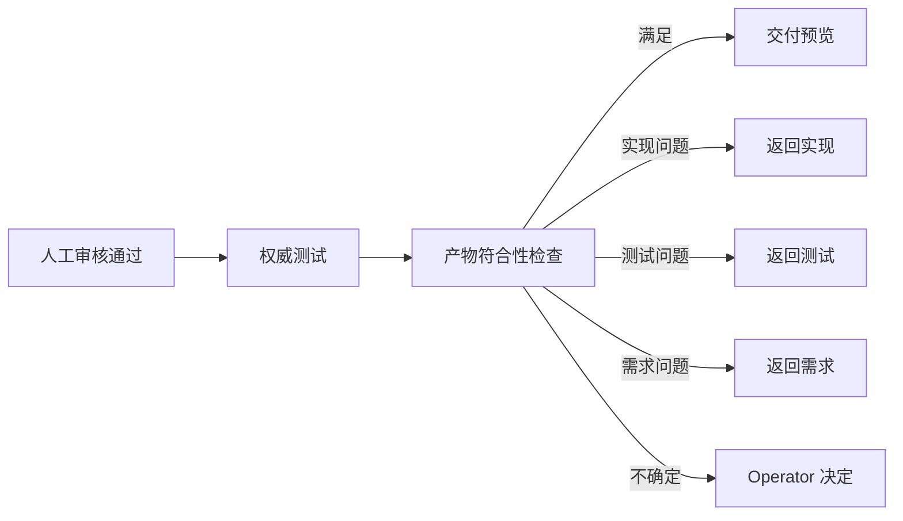

# 附录 C：最终产物与需求符合性

## 1. 目标

产物符合性检查回答的是：“当前正式产物是否满足当前已批准需求，并且证据是否真实、新鲜、
可追踪？”它不评价 OpenCode 是否省 Token，也不允许实现 Agent 自己证明自己已经通过。

## 2. 检查输入

每次检查固定绑定：

```text
inspection_id
delivery_plan_ids[]
work_item_ids[]
requirement_version_ids[]
source_revision_id
review_decision_ids[]
test_batch_id
operation_ids[]
evidence_refs[]
project_profile_hash
rule_pack_hash
```

任一正式输入变化，旧检查结果即失效。检查器不从聊天历史猜测“用户大概同意了什么”。

交付计划存在时，检查器还要确认：

- 当前 WorkItem 确实来自计划或有明确的独立创建原因；
- 计划中的必需工作项没有被静默遗漏；
- WorkItem 的正式需求没有超出已批准计划且未说明；
- 计划变更后受影响需求、审核和测试已按版本规则失效。

## 3. 需求覆盖矩阵

每条需求和验收条件形成一行：

| 字段 | 含义 |
|---|---|
| `requirement_ref` | 正式需求段落或验收条件引用 |
| `design_refs` | 对应设计决定 |
| `implementation_paths` | 实际实现路径 |
| `test_refs` | 验证该语义的测试 |
| `evidence_refs` | 截图、日志、设备结果或报告 |
| `status` | `satisfied`、`unsatisfied`、`uncertain`、`not_applicable` |
| `rationale` | 简短中文结论 |

“有测试文件”不等于“覆盖需求”。检查器先验证引用、哈希和状态，专业验收 Agent 再判断测试
是否覆盖了业务语义。

### 3.1 正式产物和运行记录

Factory 只把以下内容视为可发布的正式产物：

- 项目事实；
- 已批准交付计划；
- 已发布 Requirement Version；
- 必要的技术设计；
- 人工审核决定；
- 测试批次报告；
- 产物符合性报告；
- 经 Operator 选择保留的运行分析报告；
- 交付摘要和清单。

会话正文、推理正文、工具原始输出、临时计划草案、Context Pack 和自动记忆不是正式产物。它们
最多是短期运行遥测或宿主上下文，不能用来替代正式 Markdown 和证据。

## 4. 确定性检查

### 4.1 需求和源码

- 原始需求、正式需求版本和内容哈希存在；
- 当前源码修订可以由 Git 或等价源码提供方确定；
- 实际 diff 由系统计算，不以 Agent 声明为准；
- 交付目标与实际 diff 的差异被记录；
- 受保护路径变更有明确授权或阻止结果。

### 4.2 测试和证据

测试结果使用原生四态：

```text
passed
failed
skipped
blocked
```

规则：

- 必测项只有 `passed` 才满足门禁；
- `skipped` 表示测试没有执行，不是成功；
- `blocked` 表示缺少环境、凭据、设备或前置条件；
- `failed` 表示已执行但不满足预期；
- 进程 `exit 0` 不能覆盖测试项自身的 `skipped` 或 `blocked`；
- 聚合测试批次必须保留每个测试项的原始状态；
- 测试证据必须绑定当前源码修订、执行计划和运行操作；
- 重跑后旧证据保留历史身份，但不能继续满足当前门禁。

### 4.3 Secret 与敏感信息

至少扫描：

- 源码和配置；
- 运行日志和错误堆栈；
- JSON 状态和事件；
- Markdown 报告；
- 截图可提取文本；
- 测试夹具和命令行参数。

凭据只可用受控运行时引用表示。报告只能说明“凭据已注入”或“凭据缺失”，不能保存明文。

## 5. 专业语义检查

专业验收 Agent 只接收检查所需的正式产物和证据，不接收整个会话。

### 5.1 UI 一致性

检查：

- 页面尺寸、布局、间距、颜色、字体、图标和静态资源；
- 关键交互状态和页面跳转；
- 高保真原型与实际运行截图；
- 视口、缩放、操作系统和字体等对比环境；
- 占位功能和本次正式范围的边界。

输出必须引用原型文件、实际截图和差异位置。没有可比截图时应为 `uncertain`，不能依据代码结构
判定 UI 一比一还原。

### 5.2 API 与协议

检查：

- 请求方法、路径、请求体和响应包络；
- 鉴权顺序、Token 生命周期和请求头；
- 错误码、重试次数和用户反馈；
- TLS 或设备信任策略；
- 协议字段与界面展示字段；
- 测试是否连接了需求指定的真实设备或明确的替代环境。

协议没有规定的行为不能由 Agent 静默猜测。阻塞实现的未知项必须回到需求阶段。

### 5.3 架构和安全

检查：

- 正式设计与模块边界是否一致；
- 主进程、渲染进程和预加载边界；
- 凭据是否只存在于运行时受控位置；
- 是否全局关闭安全检查；
- 错误是否被吞掉或伪装成成功；
- 新增依赖和运行方式是否在正式范围内。

## 6. 检查结果

每一项只能是：

| 状态 | 含义 | 是否可满足门禁 |
|---|---|---|
| `satisfied` | 有充分且新鲜的证据证明满足 | 是 |
| `unsatisfied` | 有证据证明不满足 | 否 |
| `uncertain` | 证据不足、冲突或无法比较 | 否，需 Operator 处理 |
| `not_applicable` | 正式范围明确不适用 | 是，但必须有理由 |

专业 Agent 的置信度可以作为诊断字段，但不能把低证据结论转成通过。

## 7. 报告结构

`report.md` 使用中文，固定包含：

1. 检查范围和正式输入；
2. 总体结论；
3. 需求覆盖矩阵；
4. 必测项状态；
5. UI、协议、架构和安全检查；
6. Secret 检查；
7. 不满足和不确定项；
8. 证据索引；
9. 建议流转方向。

`index.json` 只保存 ID、哈希、状态、计数和报告引用，不保存大段分析正文。

## 8. 与生命周期的关系



运行成本高、工具调用多或推理耗时长默认不阻止交付。需求覆盖缺失、必测项未通过、Secret
泄漏或证据失效必须阻止交付预览。

## 9. 防止自证

- 实现 Agent 不能签发产物符合性结论；
- 测试 Agent 不能把自己产生的 `skip` 改写为通过；
- 专业验收 Agent 不执行发布；
- Core 不根据自然语言“看起来通过”推进状态；
- Operator 批准不能补造缺失的运行证据；
- 同一模型可以承担不同角色，但运行身份、输入范围和报告必须隔离。
