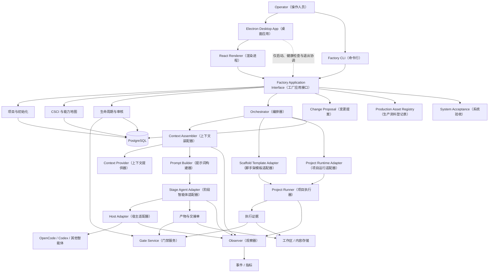
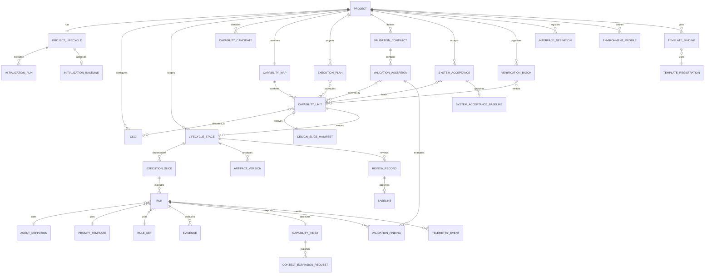
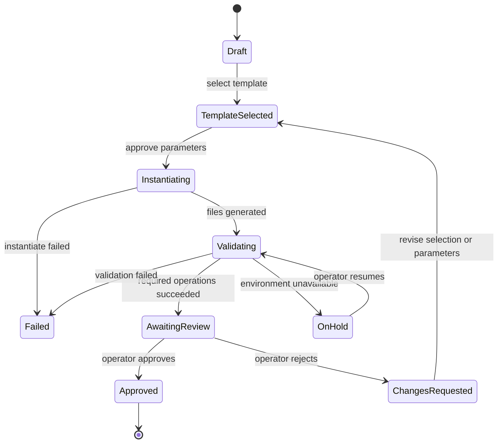
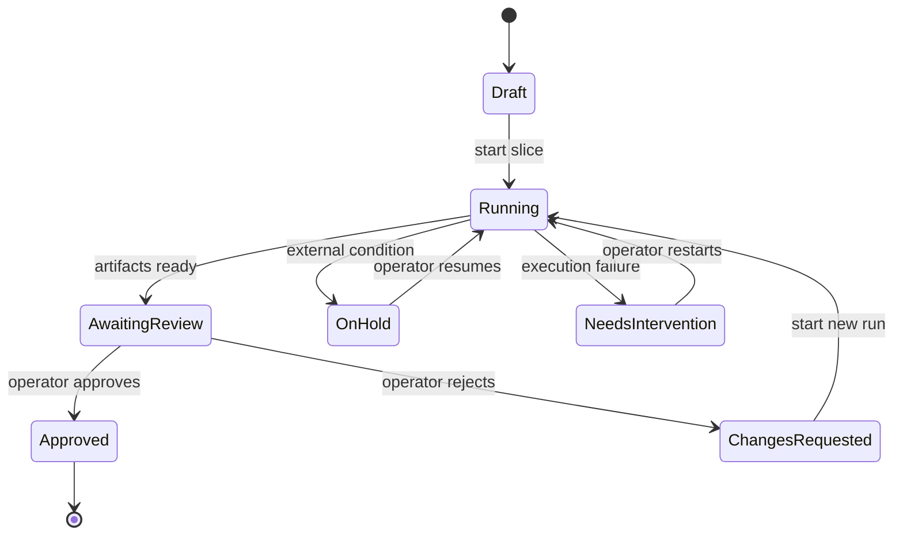

# AI 软件工厂系统设计方案 v1.2（最终版）

> 面向真实研发流程的 AI（人工智能）软件生产系统：项目级完成一次完整需求分析和总体设计，在设计基线中确认 CapabilityUnit（能力单元）；CU 随后独立编码、测试和交付。Spring Boot 控制平台管理状态、审核、调度、一致性和遥测，由可替换的 Agent Host（智能体宿主）与确定性 Runner（执行器）完成实际工作。

- 状态：v1.2 架构基线，实施合同待冻结
- 日期：2026-08-05
- 最终事实源：本文件与 `contracts/` 下的版本化机器合同；仓库不保留评审稿、调研稿或旧方案
- 当前裁决：进入“领域与机器合同冻结 + 两级纵向验证”，v1.2 全程只采用串行执行

---

## 1. 目标、范围与实施边界

### 1.1 目标

软件工厂需要提供一条可审核、可恢复、可追溯的软件生产主线：

```text
项目初始化
→ 项目级需求分析 → Project RequirementBaseline
→ ValidationContract（验证合同）草案
→ 项目级总体设计、CU 最终拆分与验证覆盖分配 → Project DesignBaseline + Frozen ValidationContract
→ DesignSliceManifest + ExecutionPlan
→ CU 独立 Coding → CodeBaseline
→ CU 独立 Testing → TestBaseline
→ CU 独立交付
```

各阶段在用户视图中连续，但按事实作用域分层：

- 初始化是项目级生命周期，只执行一次或通过变更提案产生新基线；
- Requirement（需求）和 Design（设计）是项目级阶段，只各执行一次；
- Coding（编码）和 Testing（测试）是 CU 级阶段，各 CU 可以独立审核、挂起、返工和交付；
- VerificationBatch（验证批次）只组织共享测试执行，不成为生命周期或交付单元；
- 每个阶段都形成正式产物、确定性 Evidence（证据）和人工审核记录；
- Agent（智能体）提供专业判断，Runner（执行器）提供确定性执行，Operator（操作人员）承担最终审批责任。

### 1.2 MVP 边界

1. Factory（软件工厂）服务多个本地项目，但 v1.2 MVP（最小可用版本）选择**本机单用户模式**。
2. MVP 采用 Spring Boot 模块化单体、单实例部署和 Electron Desktop Console（桌面控制台）；Renderer（渲染进程）使用 React，开发期直接通过 `pnpm start` 启动真实 Electron 窗口，正式安装包在核心闭环稳定后提供。
3. MVP 分为两级：MVP-A 先以纯 Node 模板和单个 CU 验证基础闭环；MVP-B 再以 Spring Boot + React 复合模板和至少三个相关 CU 验证系统交付闭环。
4. 首期只接入 OpenCode 一个真实智能体宿主；其他宿主通过合同测试和 Fake Adapter（模拟适配器）验证。
5. MVP Runner 使用 Windows 原生受控子进程；容器 Runner 和 Dagger Adapter 只保留后续扩展边界，不与 MVP 同期实现。
6. 权威关系数据库只采用 PostgreSQL；不维护 H2 与 PostgreSQL 双数据库兼容路径。
7. 正式正文使用 Markdown（标记文档）；Word/PDF 只按需导出，不维护第二份可写正文。
8. 不引入微服务、消息队列、通用工作流引擎、向量数据库、远程 Agent Runtime（智能体运行时）、自动发布和组织级协作。
9. 团队服务器模式需要另行补齐身份认证、项目授权、审核人身份、操作审计和 Secret（机密信息）隔离，不是本版默认能力。

### 1.3 核心不变量

1. CSCI（计算机软件配置项）是配置、版本、部署和验证对象，CapabilityUnit（能力单元，简称 CU）是用户可理解的最小业务交付单元，两者不能互相替代。
2. 用户只提交一次完整项目需求；需求阶段识别候选 CU，设计阶段依据全局数据模型、接口、事务和依赖确认正式 CU。
3. “卫星信息管理”是一个能力单元；查询、新增、修改、删除是 RequirementItem（需求项），不是四个业务 Task（任务）。
4. 数据模型、接口、页面和测试代码是内部 ExecutionSlice（执行切片），只在执行详情中展示。
5. 初始化通过人工审核并形成 InitializationBaseline（初始化基线）后，项目才能进入需求阶段。
6. 项目需求和总体设计各只有一个正式事实源；CU 通过 DesignSliceManifest（设计切片清单）引用所需章节，不复制需求或设计正文。
7. LifecycleStage（生命周期阶段）必须携带 `scope_type` 与 `scope_id`；Requirement/Design 作用于 Project，Coding/Testing 作用于 CU。
8. ExecutionPlan（执行计划）是可重建的调度投影，不保存需求正文、不决定 CU 边界、不形成额外人工 Gate（门禁）。
9. 智能体不拥有生命周期真相；Hook（钩子）、Observer（观察器）和插件也不能推进业务状态。
10. Handoff（交接单）必须通过版本化结构化协议提交，不能从聊天尾部解析。
11. 必测项只有 `PASSED`（通过）可以通过；`SKIPPED`（跳过）和 `BLOCKED`（阻塞）都不能假绿。
12. 业务状态、Git、文件证据和外部进程不能被描述成一个数据库事务；跨介质一致性使用内容寻址、事务引用、Outbox（事务发件箱）和 Reconciler（对账器）。
13. JSON（结构化数据）是索引和机器合同，不保存长篇正式正文；Markdown（标记文档）保存可读规格和报告。
14. 凭据只通过运行时 Secret（机密信息）通道注入，不进入需求、Prompt（提示词）、日志、交接单或 Git。
15. 初始上下文由 Context Assembler（上下文装配器）确定性生成；智能体不能自行扫描项目或决定权威资料，只能提交结构化追加上下文请求。
16. Stage Agent Adapter（阶段智能体适配器）只消费已经构造好的 AgentInvocation（智能体调用请求），不选择资料、不读取存储，也不拼接 Prompt。
17. InterfaceDefinition（接口定义）、AgentDefinition（智能体定义）、PromptTemplate（提示词模板）、RuleSet（规则集）与 TemplateRegistration（模板注册）都是版本化生产资料；已发布版本不可原地修改，历史 Run 必须能按引用和内容 Hash 反查确切内容。
18. CU 独立交付不等于系统交付；一个系统发布范围内的全部 CU 具有当前有效 TestBaseline 后，还必须完成跨 CU 系统集成运行和人工系统验收，形成 SystemAcceptanceBaseline（系统验收基线）。
19. ExecutionPlan 仍是可重建调度投影，不承担系统发布或验收事实；SystemAcceptance（系统验收）绑定其版本和参与 CU 基线，但不把 ExecutionPlan 改造成新的生命周期实体。
20. 单实例默认 `max_concurrent_runs = 1`；容量不足的请求进入 `QUEUED_FOR_CAPACITY`（等待容量），不记为失败，也不消耗重试预算。
21. 执行人与审核人使用稳定身份标识。默认禁止同一人在同一作用域阶段同时担任主要执行人和审核人；本机单用户项目必须显式启用可审计的 `single_operator`（单操作员）豁免。
22. FactoryTrajectoryEvent（工厂轨迹事件）只追加、只读且异步派生；它可以支持诊断和未来评估，但不能修改 Gate、Baseline、Run 或生命周期状态。
23. ValidationContract 在正式 CU 拆分前先定义项目行为断言，完成 CU 覆盖分配后随 Project DesignBaseline 一起冻结；它是设计基线产物，不新增 LifecycleStage 或人工 Gate。
24. MVP-A 使用 CapabilityIndex（能力索引）暴露紧凑发现元数据；Agent 只能提交 ContextExpansionRequest（上下文扩展请求），由 Context Assembler 决定是否加载完整 Schema、技能或资料并更新 ContextManifest。
25. MVP-B 的 Validator Agent（验证智能体）必须使用独立新会话，只产生 ValidationFinding（验证发现），不得修改代码、批准 Gate、创建 Baseline 或直接启动修复。
26. ValidationFinding 的修复由 Orchestrator 创建新 ExecutionSlice 并交给后续实现 Run；达到验证轮次、预算或重复错误阈值时停止并交还操作人员。

---

## 2. 总体架构



所有 Console（控制台）、CLI（命令行）和 Agent Tool（智能体工具）都调用同一个 Factory Application Interface（工厂应用接口）。外部调用者只需要理解项目级动作，技术栈、宿主、命令和恢复细节隐藏在模块实现中。

### 2.1 模块职责

| 模块 | 负责 | 不负责 |
|---|---|---|
| Project & Initialization（项目与初始化） | 模板选择、参数、项目实例化、初始化审核和 ProjectBaseline（项目基线） | 能力单元阶段执行 |
| Configuration Model（配置模型） | CSCI、能力地图、能力单元分配和版本关系 | 智能体会话 |
| Lifecycle（生命周期） | 项目级与 CU 级阶段、作用域审核、基线、失效和完成判定 | 执行 Shell（命令行）命令 |
| Planning（规划） | 从设计基线派生 ExecutionPlan，计算依赖、优先级、就绪和挂起状态 | 保存需求正文、决定 CU 边界或建立额外 Gate |
| Orchestrator（编排器） | 执行切片、串行调度、单活动 Run、Retry（重试）、Stop（停止）和人工恢复 | 绕过门禁修改状态 |
| Capacity Scheduler（容量调度器） | 单实例和项目配额、容量队列、公平选择与释放 | 把等待容量记成失败或隐式启用并行 |
| Host Adapter（宿主适配器） | 原始输入捕获、会话启动、事件转换、能力探测和取消 | 生命周期真相 |
| Context Assembler（上下文装配器） | 上下文选择、提供器调用、去重、预算、脱敏、顺序和上下文清单 | Agent Host 调用和生命周期迁移 |
| Prompt Builder（提示词构建器） | 用版本化模板把任务、角色和上下文包构造成 AgentInvocation（智能体调用请求） | 选择资料或访问存储 |
| Stage Agent Adapter（阶段智能体适配器） | 阶段角色映射、调用协议和结构化结果转换 | 选择上下文、读取资料或拼接 Prompt |
| Scaffold Template Adapter（脚手架模板适配器） | 模板描述、参数 Schema（模式）、实例化和生成结果校验 | 运行已生成项目 |
| Project Runtime Adapter（项目运行适配器） | 编译、构建、打包、测试、启动、停止和日志能力 | 感知能力单元审核状态 |
| Project Runner（项目执行器） | 命令、进程树、超时、输出、就绪、清理和证据 | 判断需求是否正确 |
| Gate Service（门禁服务） | 校验产物、证据和审核前置条件，提交领域事务 | 从聊天文本猜测结论 |
| Interface Registry（接口登记表） | 内外部接口、版本、兼容性、依赖和影响候选 | 自动批准接口变化 |
| Validation Contract（验证合同） | 需求行为断言、验证方法、所需证据、环境义务和 CU 覆盖关系；随设计基线冻结 | 建立新生命周期或自行批准 Gate |
| Production Asset Registry（生产资料登记表） | Agent、Prompt、Rule 与 Template 的不可变版本、发布状态、内容 Hash 和历史反查 | 在 Run 中解析可变的 `latest` |
| Environment Registry（环境登记表） | 环境、外部系统、设备和 SecretRef（机密引用）绑定 | 保存凭据明文 |
| System Acceptance（系统验收） | 跨 CU 场景、系统集成运行、人工审核和系统验收基线 | 取代 CU 自身 Code/Test Gate |
| Observer（观察器） | Event（事件）、Span（跨度）、Token（令牌）、成本和诊断包 | 修改业务状态 |
| Validator Agent（验证智能体） | 在独立新会话中执行 Scrutiny（审查）或 User-testing（用户测试），提交 ValidationFinding | 修改代码、批准 Gate、创建 Baseline 或直接返工 |
| Artifact Inspector（产物检查器） | 结构、覆盖、Diff（差异）、Hash（哈希）和追溯检查 | 代替操作人员审批 |
| Reconciler（对账器） | 发现孤立文件、遗留进程、过期 RuntimeLease 和引用损坏 | 静默伪造成功结果 |

### 2.2 外部 Seam（接缝）与 Adapter（适配器）

v1.2 只冻结四类外部接口，各自独立版本化。以下英文名称是机器合同标识：

```text
HostAdapter
StageAgentAdapter
ScaffoldTemplateAdapter
ProjectRuntimeAdapter
```

上下文提供器属于 Context Assembler（上下文装配器）的内部接缝。v1.2 不把每种资料来源都暴露为顶层 Factory Plugin（工厂插件），而是由上下文装配器通过统一的小接口管理多个提供器。

不设计包含大量可选方法的万能 `FactoryPlugin`（工厂插件）。只有存在两个真实实现，或一个真实实现加一个合同模拟器时，才把可替换点提升为稳定接缝；实现内部的技术栈细节不进入工厂应用接口。

正确调用关系：

```text
Console / CLI / Agent Tool
→ Factory Application Interface（工厂应用接口）
→ Orchestrator（编排器）
→ Bound Adapter（已绑定适配器）
→ Project Runner（项目执行器）
```

插件不得直接定位模板脚本，否则插件会重新依赖 Maven、pnpm、Spring Boot、React 等实现细节。

### 2.3 技术选型与采用边界

| 层次 | 最终选型 | 采用理由与边界 |
|---|---|---|
| 控制平面 | Java 21、Spring Boot 3 模块化单体 | Core（核心模块）拥有状态机、门禁、基线、证据引用和恢复规则；本版不拆微服务 |
| 权威数据库 | PostgreSQL 16+、Flyway、显式 SQL/Spring JDBC | 只维护一套数据库语义；状态迁移、Outbox 和审计查询保持显式，不以 ORM 回调隐式推进生命周期 |
| Desktop Shell（桌面外壳） | Electron Forge、现有 `sdlc-electron-scaffold`、pnpm | 开发期以 `pnpm start` 启动 Vite、main/preload 和真实 Electron 窗口；Electron 只负责窗口、应用生命周期、通知及 Spring Boot 进程的启动、健康检查和退出协调，不拥有领域状态 |
| Desktop Console（桌面控制台） | React、TypeScript、Vite、REST + SSE | Renderer 通过 REST 执行命令与查询，通过 SSE 接收运行事件；同一 React 应用允许浏览器独立预览，但浏览器不是 MVP 的主要交付形态 |
| UI Design System（界面设计系统） | Tailwind CSS、Radix UI、CVA、Lucide、TanStack Query/Table/Virtual、React Hook Form、Zod、Sonner、Recharts、CodeMirror | 采用 Codex/Claude Code 式连续 Agent 工作区和定制 shadcn/ui 风格，不引入 Ant Design 或 Material UI 作为全局视觉基础；复杂表格使用无样式 Headless（无头）组件保持一致视觉语言 |
| 机器合同 | JSON Schema Draft 2020-12、正反样例、TCK | 命令、事件、Handoff、Evidence、生产资料和 Baseline 使用版本化合同；Markdown 仍是长篇正式正文 |
| 首个 Agent Host | Node.js/TypeScript OpenCode Host Adapter | Adapter 固定 `@opencode-ai/sdk` 与 OpenCode 版本，负责本地 Server 生命周期、REST/SSE、取消、结构化输出和错误转换；Spring Boot Core 只依赖自有 P0 合同，不接触 OpenCode SDK 类型 |
| 上下文 | 确定性 Context Assembler、Git、文件清单、文本/符号索引 | 先按固定来源、版本、Hash、预算和顺序装配；本版不引入向量数据库，未来检索结果也不能覆盖正式基线 |
| 首个 Runner | Windows 原生受控子进程 | 统一工作目录、环境、超时、取消、进程树终止、输出脱敏和 Evidence；不要求用户安装 Docker Desktop |
| 可观测性 | OpenTelemetry + 本地 JSONL | OTel Span 和 FactoryTrajectoryEvent 只读追加；观测失败不得改变 Run、Gate 或 Baseline |

以下项目只吸收设计原则，不作为 MVP 依赖：

- Factory.ai：采用“先验证合同、后任务拆分”、实现与验证新会话隔离、外部化共享状态和 Deferred Context（延迟上下文）；不采用其大规模并行 Missions、持久云机器或 Agent 自主 Gate 作为 MVP 基础。
- OpenHands：采用控制台、Agent Server 和执行环境分离的思路；不采用其 Beta 平台作为 Factory Core，也不允许无提示的宿主文件系统全权限运行。
- mini-SWE-agent 与 Aider：采用最小 Agent Loop（智能体循环）、有预算的失败反馈、Repo Map（仓库映射）和修改后确定性验证；不采用 Agent 自评成功或自动 Git 提交作为业务 Gate。
- Backstage：采用版本化模板描述、参数 Schema、顺序 Action 和资产 Owner；不引入完整开发者门户，也不直接引用可变的上游示例模板。
- Temporal：采用确定性编排与副作用执行分离、追加式历史、幂等和可恢复任务的原则；MVP 不部署 Temporal，避免产生第二套工作流事实源和额外运维面。
- Dagger：把 Typed Operation（类型化操作）、内容寻址缓存和统一 OTel 作为未来容器 Runner 的候选；MVP 不强制 Docker Desktop。
- LangGraph、MetaGPT 与 ChatDev：可用于 Agent 内部实验、角色分工或工作流原型；不得承载 Factory 生命周期、人工审核、Baseline 或系统验收。

### 2.4 Desktop Console（桌面控制台）与交互架构

Factory 的主要用户界面是桌面 Agent Workspace（智能体工作区），不是传统 CRUD（增删改查）后台。现有 `sdlc-electron-scaffold` 作为桌面基线，保留 Electron Forge、React、Vite、TypeScript、typed IPC（类型化进程间通信）、sandbox（沙箱）、CSP（内容安全策略）和 IPC sender validation（IPC 发送方校验）。开发期直接运行 Electron，不把“先实现浏览器版、以后重写桌面版”作为实施路径；React Renderer 可由 Vite 单独预览，但生产代码保持同一份。

进程职责如下：

```text
Electron Main（主进程）
├─ 创建窗口、托盘和系统通知
├─ 启动并监测 Spring Boot 本地进程
├─ 等待 readiness（就绪检查）并协调退出
└─ 通过 preload 只暴露最小业务语义 IPC

React Renderer（渲染进程）
├─ Projects（项目）
├─ Attention（待处理事项）
├─ Operations（运行与容量看板）
└─ Project Agent Workspace（项目智能体工作区）

Spring Boot Control Plane（控制平面）
└─ Application Interface、状态机、Gate、Evidence、审计与 Adapter 编排
```

Electron Main 不直接读写 PostgreSQL，不执行 Factory 领域迁移，不判断 Gate，也不把通用 `ipcRenderer`、文件系统或 Shell 能力暴露给 Renderer。Spring Boot 只绑定 loopback（本机回环）地址；开发期和打包后均需使用受保护的本地会话，不能因为监听本机端口而把 Application Interface 视为可信调用。

项目内工作区采用三栏连续结构：左侧展示项目生命周期与阶段状态，中间以 Codex/Claude Code 式会话流交错呈现 Agent 消息、执行步骤、Artifact（产物）、Diff、测试结果和正式人工 Gate，右侧按当前阶段展示 Evidence、Baseline、文件和运行动态；底部输入框只用于提问、补充上下文和要求修订，不能代替批准、退回或接管等正式命令。

跨项目管理只设置三个顶层入口：

1. `Projects`：项目、最近活动和进入项目工作区的入口；
2. `Attention`：等待人工裁决、阻塞、失败、超时和恢复请求；
3. `Operations`：按 `READY → RUNNING → WAITING_FOR_HUMAN → BLOCKED → COMPLETED` 展示运行队列、容量和执行看板。

Operations 看板是只读 Projection（投影）。卡片可以打开权威 Run 或阶段上下文，但不能通过拖拽修改生命周期、越过 Gate 或创建 Baseline；所有状态迁移仍必须提交明确命令并由 Spring Boot Guard（守卫条件）校验。界面的视觉基线沿用现有原型的深色石墨 Surface（表面）、低对比边框、蓝色活动态、绿色通过态、琥珀等待态和红色阻塞态；最具辨识度的元素是同时表达阶段、Agent 活动、Evidence 完整度和人工 Gate 的可执行生命周期轨，而不是通用统计卡片。

---

## 3. 领域模型与唯一术语

### 3.1 实体关系



### 3.2 术语表

| 概念 | 唯一语义 |
|---|---|
| Project（项目） | 一个受软件工厂管理的软件项目 |
| CSCI（计算机软件配置项） | 受配置管理的软件项，是配置、版本、部署和验证对象 |
| CapabilityUnit（能力单元） | 用户可理解的完整业务能力，也是最小业务审核与交付单元 |
| CapabilityCandidate（能力候选） | 需求阶段识别的候选业务模块，尚未获得独立实现与交付资格 |
| RequirementItem（需求项） | 项目 SRS 内带稳定 ID（标识）的具体需求；设计确认后可关联一个或多个 CU |
| ValidationContract（验证合同） | 在 CU 拆分前形成、在设计基线中冻结的有限行为断言集合；固定验证方法、所需 Evidence、环境义务和 CU 覆盖关系 |
| ValidationFinding（验证发现） | 独立 Validator 针对固定断言产生的结构化问题；不拥有代码修改权或 Gate 权威 |
| CapabilityIndex（能力索引） | 当前 Run 可发现的工具、技能、插件与资料的紧凑元数据，不等于完整 Prompt 内容 |
| ContextExpansionRequest（上下文扩展请求） | Agent 对索引条目提出的按需加载申请；解析、授权和 ContextManifest 更新由 Context Assembler 执行 |
| CapabilityAllocation（能力分配） | 能力单元与一个或多个 CSCI 的多对多分配关系 |
| LifecycleStage（生命周期阶段） | 带 `scope_type`/`scope_id` 的统一阶段；Requirement/Design 属于 Project，Coding/Testing 属于 CU |
| DesignSliceManifest（设计切片清单） | CU 对项目需求与总体设计章节、数据归属、接口、依赖、验收标准和集成场景的引用清单 |
| ExecutionPlan（执行计划） | 从 Project DesignBaseline 派生、可重建的运行时调度投影 |
| VerificationBatch（验证批次） | 让多个 CU 共享一次环境启动和测试运行的执行容器，不拥有审核或交付状态 |
| SystemAcceptance（系统验收） | 对一个系统发布范围执行跨 CU 真实场景并形成项目级验收结论；不替代各 CU 的 TestBaseline |
| ProductionAssetVersion（生产资料版本） | Agent、Prompt、Rule 或 Template 的不可变已发布版本，以稳定 ID、版本和内容 Hash 标识 |
| ExecutionSlice（执行切片） | 为智能体和执行器调度而拆分的内部技术切片 |
| Run（运行） | 执行切片或项目操作的一次实际执行 |
| Operation（操作） | 一次确定性项目动作及其结果，如 `compile`（编译）、`test`（测试）、`start`（启动） |
| Baseline（基线） | 经审核批准且不可原地修改的一组版本化产物引用 |
| Evidence（证据） | 支撑 Gate（门禁）判断的不可变执行事实 |

`Task`（任务）不作为领域实体。UI（用户界面）顶层只提供 Projects、Attention 和 Operations 三个入口；项目内显示能力地图、执行计划、能力单元和阶段，执行切片与验证批次只显示在执行详情中。看板卡片是查询投影，不成为新的领域实体。

### 3.3 CSCI（计算机软件配置项）、CU（能力单元）与分配

```text
Project（项目）：卫星管理系统
├─ CSCI-WEB：React 前端
├─ CSCI-SERVICE：Spring Boot 后端
├─ CapabilityUnit（能力单元）：卫星信息管理
│  ├─ FR-001 查询卫星信息
│  ├─ FR-002 新增卫星信息
│  ├─ FR-003 修改卫星信息
│  └─ FR-004 删除卫星信息
└─ CapabilityAllocation（能力分配）
   └─ CU-SATELLITE-INFO → CSCI-WEB + CSCI-SERVICE
```

CU 必须满足：

1. 对用户提供一组内聚、完整的业务能力；
2. 可独立描述范围、规则、接口和验收目标；
3. 可从项目需求与总体设计中获得完整、无歧义的 DesignSliceManifest；
4. 可整体由操作人员审核与交付；
5. 可形成独立的 CodeBaseline 和 TestBaseline；
6. 内部执行切片严格顺序执行，不能脱离能力单元声明业务交付完成。

### 3.4 ExecutionPlan（执行计划）

需求阶段先从完整项目需求识别候选 CU；总体设计确认边界、数据归属、接口和依赖后，才生成正式 CU 与执行计划：

```text
Project DesignBaseline
├─ CU：用户管理（priority: 10）
├─ CU：角色权限（depends_on: 用户管理）
├─ CU：审计日志（depends_on: 用户管理）
└─ ExecutionPlan（derived_from: design-baseline-id）
```

ExecutionPlan 只保存 CU 依赖、同层优先级、就绪状态、执行顺序和挂起情况。CU 边界、数据归属、接口契约和依赖关系以 Project DesignBaseline 为权威事实源；这些内容变化必须走 ChangeProposal。操作人员可以直接调整同一依赖层内的优先级，因为这不改变设计事实。执行计划损坏或策略变化时可以从设计基线重新生成。

### 3.5 SystemAcceptance（系统验收）

SystemAcceptance 是项目级系统发布事实，不是 ExecutionPlan 的附属状态。它至少固定：

```text
system_acceptance_id
project_id
release_scope_id
execution_plan_version
validation_contract_ref: { id, version, content_hash }
participating_cu_baselines[]
  cu_id
  code_baseline_id
  test_baseline_id
validation_assertion_refs[]
system_integration_run_id?
environment_binding_ref?
review_record_id?
status: DRAFT | RUNNING | AWAITING_REVIEW | APPROVED | CHANGES_REQUESTED | STALE
```

`release_scope_id` 标识一次待交付的系统范围；首版默认包含当前 ExecutionPlan 的全部 CU。后续若支持分批发布，必须显式版本化发布范围，不能靠临时筛选条件改变既有验收语义。

---

## 4. 分层生命周期与审核

### 4.1 用户流程与作用域

```mermaid
flowchart LR
    I["Initialization（初始化）"] --> IG["初始化人工审核"]
    IG --> R["Project Requirement（项目需求）"]
    R --> RG["需求人工审核 / Project RequirementBaseline"]
    RG --> VC["ValidationContract 草案（先定义行为正确性）"]
    VC --> D["Project Design（总体设计 + CU 最终拆分 + 断言覆盖分配）"]
    D --> DG["设计人工审核 / Project DesignBaseline + Frozen ValidationContract"]
    DG --> PLAN["DesignSliceManifest + ExecutionPlan"]
    PLAN --> C["CU Coding（编码）"]
    C --> CG["代码人工审核 / CU CodeBaseline"]
    CG --> T["CU Testing（测试）"]
    T --> TG["测试人工审核 / CU TestBaseline"]
    TG --> DONE["CU 独立交付"]
    DONE --> ALL{"发布范围内全部 CU\n具有当前有效 TestBaseline？"}
    ALL -->|是| SI["System Integration Run（系统集成运行）"]
    SI --> SA["系统级人工验收 / SystemAcceptanceBaseline"]
    SA --> PD["Project Release Accepted（系统发布已验收）"]
```



LifecycleStage（生命周期阶段）复用同一状态机、Gate 和 ReviewRecord，但必须显式声明作用域：

```text
scope_type: PROJECT | CAPABILITY_UNIT
scope_id
stage_type: REQUIREMENT | DESIGN | CODING | TESTING | SYSTEM_ACCEPTANCE
```

合法组合只有 `PROJECT + REQUIREMENT`、`PROJECT + DESIGN`、`CAPABILITY_UNIT + CODING`、`CAPABILITY_UNIT + TESTING` 和 `PROJECT + SYSTEM_ACCEPTANCE`。禁止为 CU 创建 Requirement/Design Stage，也禁止用项目级 Testing 或 SystemAcceptance 替代 CU 测试审核。

### 4.2 Project Initialization（项目初始化）状态机



InitializationBaseline（初始化基线）至少绑定以下机器字段：

```text
selected_template_id
selected_template_version
template_digest
protocol_version
template_parameters_hash
project_manifest
module_topology
initial_git_revision
validate_evidence_ref
compile_evidence_ref
build_evidence_ref
test_evidence_ref
start_readiness_evidence_ref
stop_cleanup_evidence_ref
review_record_id
reference_bindings[]
```

初始化审核界面必须展示模板版本与 Hash（哈希）、参数摘要、生成模块、Git revision（源码修订）、`compile/build/test`（编译/构建/测试）结果、所有模块的 readiness（就绪状态）、`stop`（停止）清理结果、告警和未解决问题。只有进入 `Approved`（已批准）状态后才能启动项目级需求阶段；正式 Capability Map 必须等 Project DesignBaseline 批准后创建。

### 4.3 LifecycleStage（生命周期阶段）状态机



每个 `Approved`（已批准）状态都绑定明确的作用域、Artifact Version（产物版本）、内容哈希、源码修订、环境快照或测试证据。上游基线变化时，下游历史保留，但有效性变为 `STALE`（已过期）或 `IMPACT_REVIEW_REQUIRED`（需要影响复核）。

### 4.4 项目级 Requirement 与 Design

**Project Requirement（项目需求）**

1. Host Adapter（宿主适配器）在模型处理前保存原始输入或脱敏副本引用。
2. 输入是用户一次提交的完整需求原文、附件、参考资料与项目模板能力；AI 结果不能替代原始输入。
3. Requirement Agent 从系统整体识别项目目标、系统边界、功能组成、业务对象、业务规则、非功能约束、外部接口和跨功能场景。
4. 生成唯一的 Project SRS Artifact（项目软件需求规格产物）、稳定 RequirementItem、验收条件、候选 CU 及其初步关系。
5. 本阶段不锁定表结构、字段级接口、内部调用或最终 CU 边界。
6. 操作人员审核后形成唯一的 Project RequirementBaseline；此时不创建 CU Requirement Stage，也不复制 CU 需求文档。

**Project Design（项目总体设计）**

1. 只能读取已批准的 Project RequirementBaseline。
2. 在正式拆分 CU 前，根据 RequirementItem 建立 ValidationContract 草案，以有限行为断言明确 Given/When/Then、验证方法、验证能力、所需 Evidence、环境义务和阻塞级别。
3. 在同一次总体设计中完成系统与技术架构、全局数据模型、外部接口、CU 间接口、数据归属、跨 CU 流程、事务边界、异常处理和安全设计。
4. 依据内聚性、独立编码、独立验证和独立交付能力确认最终 CU；菜单、按钮、单接口和单表不能成为 CU。
5. 将每条 Validation Assertion（验证断言）分配给一个或多个正式 CU；跨 CU 断言必须声明 `CROSS_CU`，不能降级为单 CU 自测。
6. Interface Registry（接口登记表）校验接口所有权、覆盖、兼容性和候选影响范围。
7. 为每个正式 CU 生成 DesignSliceManifest，引用项目需求、总体设计和 Validation Assertion，并记录数据归属、提供/消费接口、依赖和集成场景。
8. 信息不足时创建 ClarificationRequest（澄清请求）并进入 `OnHold`（挂起）状态。
9. 操作人员同时审核总体设计、正式 CU、依赖、ValidationContract 和断言覆盖关系；批准后形成唯一 Project DesignBaseline，并把对应 ValidationContract 版本冻结为该基线的不可变条目。随后才能生成 ExecutionPlan 并启动 CU 生命周期。

### 4.5 CU 级 Coding 与 Testing

**Coding（编码）**

1. Implementation Planner（实现规划器）只根据当前 CU 的 DesignSliceManifest 及其覆盖的 Validation Assertion，把实现拆为可独立验证的执行切片；每个切片声明它支持哪些断言，但不能修改断言内容。
2. 所有切片在项目唯一工作目录中严格顺序执行；后一个切片承接前一个切片的已验证修改。
3. 智能体只接收当前切片的目标、版本化提示词和已装配的上下文包。
4. 智能体通过 `handoff_submit`（提交交接单）报告变更、验证和问题。
5. 软件工厂独立计算当前切片及 CU 累计实际 Diff（差异）；执行器完成聚焦检查并记录 ChangeSet（变更集）。
6. 所有切片完成后，Project Runner 在同一工作目录执行权威的 `compile/build/lint/unit test`（编译/构建/静态检查/单元测试）。
7. 操作人员审核能力单元的累计差异后形成 CU CodeBaseline；它绑定 Project RequirementBaseline、Project DesignBaseline、DesignSliceManifest 和唯一 Git revision。

**Testing（测试）**

1. Test Agent（测试智能体）根据冻结的 ValidationContract、当前 DesignSliceManifest 和 CU CodeBaseline 生成 TestObligation（测试义务）与测试用例；TestObligation 必须引用稳定 assertion ID，不能在实现后重写成功标准。
2. 执行器执行完整单元、集成、接口、E2E（端到端）、设备或其他必测项。
3. EnvironmentBindingSnapshot（环境绑定快照）固定代码、接口、环境、配置和设备资源。
4. Mock（模拟）、Simulator（仿真器）、Sandbox（沙箱）、真实外部系统和真实设备的证据必须区分。
5. Artifact Inspector（产物检查器）生成需求—设计—代码—测试追溯矩阵。
6. 操作人员审核范围、结果、阻塞项和证据后形成 TestBaseline（测试基线），能力单元才能进入 `Delivered`（已交付）状态。

跨 CU 业务场景可以放入 VerificationBatch，共享一次环境启动、接口联调、数据库测试、E2E 或设备测试。批次 Evidence 可以关联多个 CU 和场景，但每个 CU 仍分别进入 `AwaitingReview`、`OnHold`、`ChangesRequested` 或 `Approved`，并分别形成 TestBaseline。

MVP-B 在 CU 累计实现完成和系统集成运行后增加独立 Validator Run。Scrutiny Validator 只审查固定基线、实际 Diff、实现轨迹和 Evidence；User-testing Validator 只依据 ValidationContract 从外部执行黑盒场景。两者必须使用 `FRESH_SESSION`（全新会话），只提交 ValidationFinding，不修改工作目录，也不拥有 Gate 权威。Orchestrator 把阻塞 Finding 转成新的修复 ExecutionSlice，由后续实现 Run 处理；每轮修复后必须重新执行确定性检查和独立验证。达到最大验证轮次、预算或重复 Finding 指纹时进入 `NeedsIntervention`。

### 4.6 系统集成与验收

1. 只有发布范围内全部 CU 都具有当前有效的 CodeBaseline 与 TestBaseline，才能创建 System Integration Run；
2. 系统集成运行执行冻结 ValidationContract 中 `CROSS_CU` 和 Project 级真实业务断言；架构只冻结断言、执行能力、证据和结果合同，由 Project Runtime Adapter 负责实际启动、就绪和清理。Playwright 可作为首个用户可见 E2E（端到端）实现候选，但不是系统验收的强制依赖；
3. 确定性运行通过且独立 User-testing Validator 没有未处置的阻塞 Finding 后，才能进入项目级 `SYSTEM_ACCEPTANCE` 审核。操作人员必须同时看到 ValidationContract、参与 CU 基线、接口版本、环境快照、断言结果、ValidationFinding、未解决问题和完整 Evidence；
4. 审核批准后形成 SystemAcceptanceBaseline，精确绑定参与 CU 的 Code/Test Baseline ID、接口版本、环境快照和系统集成 Evidence；
5. 任一绑定的 CU 基线、接口版本或系统场景变更时，SystemAcceptanceBaseline 自动标记 `STALE`，系统发布验收随之失效；
6. 验收失败只对有证据关联的 CU 创建返工或 ChangeProposal；其他 CU 的已批准基线继续有效，但系统必须重新完成受影响范围的集成运行与项目级验收。

### 4.7 缺陷返工与基线变更

- 实现缺陷从当前 CU 的 Testing 退回 Coding，创建新 Run 和新 CodeBaseline；旧 CodeBaseline 不原地修改，关联测试 Evidence 自动失效。
- 需求遗漏、数据归属错误、接口契约错误或 CU 拆分错误必须发起 ChangeProposal，不能伪装成代码修复。
- Project RequirementBaseline 变化后，Project DesignBaseline 标记 `STALE`。
- Project DesignBaseline 变化后，根据 DesignSliceManifest、Interface Registry 和 CU 依赖图计算影响，只使受影响 CU 的 CodeBaseline/TestBaseline 失效。
- 冻结 ValidationContract 的断言、覆盖 CU、验证方法、证据类型或环境义务变化时，必须创建新版本并按需求、CU、接口和系统场景计算影响；不得原地修改旧合同。
- 任一 SystemAcceptanceBaseline 所绑定的 CU Code/Test Baseline、接口版本或系统验收场景发生变化后，该系统验收基线标记 `STALE`；未受影响 CU 的自身基线不因此失效。

---

## 5. 正式规格、接口与环境模型

### 5.1 SRS Artifact（软件需求规格产物）

项目只维护一份正式 SRS，采用固定结构，并在其中用稳定 ID 标识候选/正式 CU 与需求项：

1. 项目目标与系统边界；
2. 功能组成与跨功能业务场景；
3. 业务对象、业务规则与数据需求；
4. 候选 CU 及初步关系；
5. CSCI 内部、CSCI 间与外部系统接口需求；
6. 性能、可靠性和安全要求；
7. 运行与测试环境要求；
8. 项目级及 CU 可切片的验收标准；
9. 验证方法；
10. 需求追溯关系。

每个需求项和验收条件都使用稳定标识，机器字段 `verification_method`（验证方法）只能是：

```text
INSPECTION | ANALYSIS | DEMONSTRATION | TEST
```

### 5.2 ValidationContract（验证合同）

ValidationContract 是 Project DesignBaseline 的不可变组成产物，不是新的生命周期阶段。它在正式拆分 CU 前先形成行为断言草案，在总体设计完成 CU 边界和覆盖分配后冻结：

```text
validation_contract_id
project_id
version
derived_from_requirement_baseline_id
content_hash
status: DRAFT | FROZEN | STALE
assertions[]
  assertion_id
  scope_type: PROJECT | CAPABILITY_UNIT | CROSS_CU
  scope_ref
  requirement_refs[]
  given
  when
  then
  verification_method
  verifier_capability_ref
  required_evidence_types[]
  environment_requirement_refs[]
  covered_by_cu_ids[]
  severity: BLOCKING | NON_BLOCKING
frozen_by?
frozen_at?
invalidation?
```

规则：

1. `FROZEN` 版本必须绑定具名冻结人和时间，并作为 Project DesignBaseline 的 `VALIDATION_CONTRACT` 条目保存内容 Hash；
2. 每条断言至少引用一个 RequirementItem、一个验证能力、一类 Evidence 和一个覆盖 CU；
3. `CROSS_CU` 断言至少由两个 CU 共同覆盖，并只能在系统集成或显式跨 CU VerificationBatch 中声明通过；
4. 实现计划、测试义务和系统验收只能引用断言，不得为适配已有实现而重写断言；
5. 断言变化创建新合同版本并触发影响分析，旧版本继续支持历史 Run 和审计回放。

### 5.3 Interface Registry（接口登记表）

InterfaceDefinition（接口定义）至少包含以下机器字段：

```text
interface_id
classification: INTRA_CSCI | INTER_CSCI_INTERNAL | EXTERNAL_SYSTEM
provider
consumers[]
owning_csci_id
related_cu_ids[]
protocol
operations[]
request_schema_ref
response_schema_ref
authentication
error_model
timeout
availability_requirement
version
compatibility_policy
environment_bindings[]
baseline_status
status: DRAFT | PUBLISHED | DEPRECATED
published_from_design_baseline_id?
superseded_by?
```

生命周期规则：

1. 设计阶段先创建 `DRAFT`（草稿）接口；
2. Project DesignBaseline 审核通过后，与该基线绑定的接口版本原子转为 `PUBLISHED`（已发布）；
3. 已发布版本不可原地修改。ChangeProposal 批准后创建新版本，旧版本设置 `superseded_by`，并在无当前消费者后才允许进入 `DEPRECATED`（已弃用）；
4. 接口变更通过提供者、消费者、CapabilityAllocation 和追溯图自动计算 `affected_cu_ids[]` 候选集，定位受影响的能力单元、CSCI、需求项、测试义务和环境绑定；
5. 候选影响集不能被调用者静默缩小。确定性规则给出应失效范围，操作人员只能批准、扩大范围，或带理由 Override（覆盖）并留下审计记录。

### 5.4 Environment（环境）与 ExternalDependency（外部依赖）

EnvironmentProfile（环境配置）至少包含以下机器字段：

```text
environment_id
type: DEV | SIT | UAT | DEVICE_LAB
endpoints[]
databases[]
external_services[]
device_resources[]
network_constraints[]
secret_refs[]
health_checks[]
preflight_probes[]
test_data_refs[]
owner
```

每个 `preflight_probe` 至少包含稳定 ID、探测类型、无机密命令模板或受限探针引用、适用阶段、超时和期望结果。需求阶段声明环境义务，设计阶段把义务绑定到 EnvironmentProfile；Orchestrator 在进入依赖该环境的 Run 前执行探测。缺少设备、外部系统、测试数据或 SecretRef 时，直接进入 `OnHold`，记录明确原因并释放活动执行权，不等待测试过程偶然失败。

EnvironmentBindingSnapshot（环境绑定快照）固定以下内容：

```text
test_run_id
environment_id
interface_version_bindings[]
code_revision
configuration_hash
device_resource_ids[]
bound_at
binding_status
```

Evidence（证据）类型：

```text
MOCK | SIMULATOR | SANDBOX | REAL_EXTERNAL_SYSTEM | REAL_DEVICE
```

真实环境义务不能由 Mock（模拟）结果替代。缺少外部系统、设备或机密信息时，相关测试义务结果必须是 `BLOCKED`（阻塞）。

---

## 6. Baseline（基线）、变更与引用

### 6.1 Baseline（基线）

正式基线包括以下类型：

```text
InitializationBaseline
Project RequirementBaseline
Project DesignBaseline
CU CodeBaseline
CU TestBaseline
SystemAcceptanceBaseline
```

基线不是单文件指针，而是一组不可变条目：

```text
baseline_id
scope_type: PROJECT | CAPABILITY_UNIT
scope_id
baseline_type: INITIALIZATION | REQUIREMENT | DESIGN | CODE | TEST | SYSTEM_ACCEPTANCE
artifact_version
content_hash
source_revision?
items[]
  artifact_type
  artifact_ref
  content_hash
review_record_id
signature_ref?
reference_bindings[]
validity_status
created_at
```

合法作用域为：Initialization/Requirement/Design/SystemAcceptance 使用 `PROJECT`，Code/Test 使用 `CAPABILITY_UNIT`。批准后不得原地修改；任何新内容都产生新的 Artifact Version（产物版本）和基线。ArtifactVersion、ReviewRecord 和 Gate 使用相同作用域字段，不能再把 `cu_id` 设为所有基线的必填字段。`signature_ref` 只预留不可变签名或外部存证引用，本版不冻结签名算法，也不把它作为通过前置条件。

Project DesignBaseline 必须包含唯一冻结的 ValidationContract 版本及内容 Hash。ValidationContract 不单独产生 Baseline；它与总体设计、Capability Map、DesignSliceManifest 和接口版本共同接受同一次设计审核。

### 6.2 ChangeProposal（变更提案）

```text
proposal_id
target_baseline_id
reason
delta_ref
affected_csci_ids[]
affected_cu_ids[]
affected_interface_ids[]
affected_environment_ids[]
impact_summary
decision
```

流程：

1. 创建增量提案；
2. 接口登记表、CapabilityAllocation（能力分配）和追溯图计算候选影响；
3. 操作人员审核；
4. 批准后形成新产物版本和基线；
5. Project RequirementBaseline 变化时，直接将 Project DesignBaseline 标记 `STALE`（已过期）；
6. Project DesignBaseline 或其 ValidationContract 变化时，通过断言覆盖关系、DesignSliceManifest、接口登记表和 CU 依赖图计算受影响 CU，只失效其 CodeBaseline/TestBaseline；
7. 跨能力单元影响标记 `IMPACT_REVIEW_REQUIRED`（需要影响复核）；
8. 任一已批准系统验收所绑定的基线、接口版本或验收场景被影响时，将对应 SystemAcceptanceBaseline 标记 `STALE`；
9. 系统可以建议执行切片并重建 ExecutionPlan，但不自动修改代码或启动智能体。

### 6.3 参考资料与 ReferenceBinding（引用绑定）

项目只有一个用户维护的 `references/`（参考资料）目录。软件工厂不递归复制整个外部目录，也不通用转换二进制文件。

每次 Run（运行）记录实际读取文件的路径、Hash（哈希）、大小和 MIME（媒体类型），并支持两种策略：

| 模式 | 行为 | 适用范围 |
|---|---|---|
| `detect-only`（仅检测） | 只保存路径、哈希、大小和媒体类型 | 默认本地开发 |
| `reproducible` | 只对实际读取文件做内容寻址、按 SHA-256 去重保存 | 审计和严格复现 |

Project RequirementBaseline 与 Project DesignBaseline 保存引用绑定。参考协议或原型变化时，系统能检测并提示相关基线复核；`detect-only`（仅检测）模式不承诺恢复被用户覆盖的旧字节。

---

## 7. 模板资产与版本化机器协议

### 7.1 两个模板接口

ScaffoldTemplateAdapter（脚手架模板适配器）：

```text
describe()
getParameterSchema()
instantiate()
bootstrap()
validateGeneratedProject()
```

ProjectRuntimeAdapter（项目运行适配器）：

```text
describeCapabilities()
compile()
build()
package()
test()
start()
stop()
status()
readiness()
logs()
clean()
cancel()
```

`instantiate`（实例化）只从模板生成文件，`bootstrap`（引导准备）负责依赖安装、Git 和环境准备，`validateGeneratedProject`（验证生成项目）负责确认生成结果满足合同。三者不再用含义模糊的 `init`（初始化）动词合并。

### 7.2 Template Descriptor（模板描述符）

```yaml
protocol_version: "1.1"

template:
  id: springboot-react
  version: 1.0.0
  digest: sha256:...
  min_factory_version: 1.1.0

scaffold:
  parameters_schema: schemas/parameters.schema.json
  entrypoint: adapter/factory-template-adapter

modules:
  - id: backend
    type: springboot
    path: backend
    depends_on: []
  - id: frontend
    type: react
    path: frontend
    depends_on: [backend]

operations:
  compile: { targets: [backend, frontend, all] }
  build:   { targets: [backend, frontend, all] }
  package: { targets: [backend, frontend, all] }
  start:   { returns_runtime_lease: true }
  stop:    { idempotent: true }

test_suites:
  - { id: unit, required: true }
  - { id: integration, required: true }
  - { id: api, required: false }
  - { id: e2e, required: false }
```

### 7.3 执行结果与运行租约

普通操作与测试结果分开，机器枚举值含义如下：

```text
operation_status: SUCCEEDED | FAILED | CANCELLED | TIMED_OUT | BLOCKED
test_outcome: PASSED | FAILED | SKIPPED | BLOCKED | null
```

`compile/build/start/stop`（编译/构建/启动/停止）只使用 `operation_status`（操作状态）；测试步骤同时返回 `test_outcome`（测试结果）。

`start()`（启动）必须返回 RuntimeLease（运行时租约）：

```text
runtime_id
process_handles[]
endpoints[]
allocated_ports[]
started_at
readiness_status
owner_run_id
lease_expires_at
cleanup_token
```

复合模板可以启动多个进程，readiness（就绪检查）必须聚合所有必需模块；`stop`（停止）和 `clean`（清理）必须幂等。

### 7.4 Schema（模式）与 TCK（合同测试套件）

机器合同按首次消费者分批冻结，不以文件数量作为完成指标。开始 M1 前必须冻结下列 P0 跨模块合同，并由 Fake Host、Fake Runner 与真实 Adapter 共用 TCK：

```text
run-request.schema.json
agent-invocation.schema.json
context-manifest.schema.json
handoff.schema.json
evidence.schema.json
gate-command.schema.json
gate-result.schema.json
host-run-event.schema.json
host-run-result.schema.json
execution-result.schema.json
runtime-lease.schema.json
error-envelope.schema.json
```

其余合同在对应里程碑首次实现前冻结；完整目标集合如下。文件名保留英文，便于代码和自动化工具直接引用：

```text
project-bootstrap-request.schema.json
project-bootstrap-result.schema.json
template-descriptor.schema.json
template-parameters.schema.json
runtime-capabilities.schema.json
execution-plan.schema.json
execution-result.schema.json
runtime-lease.schema.json
run-request.schema.json
context-plan.schema.json
context-bundle.schema.json
context-request.schema.json
context-delta.schema.json
capability-index.schema.json
context-expansion-request.schema.json
agent-invocation.schema.json
handoff.schema.json
evidence.schema.json
validation-contract.schema.json
validation-finding.schema.json
gate-command.schema.json
gate-result.schema.json
interface-definition.schema.json
environment-profile.schema.json
environment-binding.schema.json
environment-requirement.schema.json
test-obligation.schema.json
test-suite-result.schema.json
telemetry-event.schema.json
factory-trajectory-event.schema.json
factory-run-budget.schema.json
agent-definition.schema.json
prompt-template.schema.json
rule-set.schema.json
template-registration.schema.json
template-binding.schema.json
system-acceptance.schema.json
system-acceptance-baseline.schema.json
review-record.schema.json
baseline.schema.json
error-envelope.schema.json
```

每份模式必须具有有效和无效样例；P0 TCK 还必须覆盖缺字段、版本不匹配、幂等重放、取消、超时和结构化输出无效。Template（模板）、Runner（执行器）、Host Adapter（宿主适配器）和 Context Provider（上下文提供器）共用各自的合同测试套件；合同模拟器与真实实现必须通过相同测试。不得为了达到“40+”数量而在没有真实消费者时提前冻结浅合同。

### 7.5 Production Asset Registry（生产资料登记表）

Factory 统一登记以下四类生产资料：

```text
AgentDefinition
  agent_id
  version
  role
  model_binding_ref
  prompt_template_ref
  capability_tags[]
  content_hash
  status: DRAFT | ACTIVE | DEPRECATED

PromptTemplate
  prompt_id
  version
  applicable_stage
  content_ref
  content_hash
  status: DRAFT | ACTIVE | DEPRECATED

RuleSet
  ruleset_id
  version
  applicable_stage
  stack_tags[]
  content_ref
  content_hash
  status: DRAFT | ACTIVE | DEPRECATED

TemplateRegistration
  template_id
  version
  descriptor_ref
  digest
  status: DRAFT | ACTIVE | DEPRECATED
```

`role` 可取 `REQUIREMENT`、`DESIGN`、`CODER`、`TESTER`、`REVIEWER_ASSISTANT`、`SCRUTINY_VALIDATOR` 或 `USER_TESTING_VALIDATOR`。两个 Validator role 只能绑定只读检查能力和独立新会话策略；其输出合同固定为 ValidationFinding。

通用治理规则：

1. 生产资料发布前处于 `DRAFT`，通过一次具名发布确认后进入 `ACTIVE`；该确认不是交付物四阶段 Gate，但必须记录发布人、内容 Hash、理由和时间；
2. `ACTIVE` 版本不可原地修改，也不能让 `latest` 成为 Run 的持久化引用；更新必须创建新版本；
3. Project 通过 TemplateBinding 固定模板版本。模板升级不强制迁移在研项目；显式升级前必须根据描述符和协议差异生成影响报告，必要时走 ChangeProposal；
4. `DEPRECATED` 只阻止新绑定，不破坏历史 Run、InitializationBaseline 或可复现回放；
5. AgentDefinition、PromptTemplate 与 RuleSet 分别版本化，Run 同时绑定三者，避免只更新 Prompt 却伪装成同一 Agent 版本。

```text
TemplateBinding
  project_id
  template_id
  template_version
  template_digest
  bound_at
  binding_reason
```

---

## 8. Agent Host（智能体宿主）、Run（运行）与 Handoff（交接单）

### 8.1 Host Adapter（宿主适配器）

首个实现是独立 Node.js/TypeScript 进程。它使用固定版本的 `@opencode-ai/sdk` 启动或连接本地 OpenCode Server，再通过 Factory 自有的 RunRequest、AgentInvocation、HostRunEvent、HostRunResult、Handoff 和 ErrorEnvelope 与 Spring Boot Core 通信。Java Core 不直接依赖 OpenCode 的 `Session`、`Message`、`Part` 或其他生成类型；SDK/API 变化只能在 Adapter 内部吸收。

宿主适配器负责：

- 模型处理前捕获原始输入；
- 能力探测、启动、等待、取消和关联会话；
- 把 OpenCode/Codex 事件转换为标准事件；
- 使用宿主结构化输出；
- 在运行时安全注入凭据；
- 处理宿主升级、重启和不可用。

启动握手必须记录 Adapter、SDK 和 Host 的精确语义版本，并以 `/global/health` 返回的 Host 版本为准；任一版本不满足已验证兼容矩阵时拒绝创建 Run。Adapter 允许使用宿主 JSON Schema 模式，但仍必须在本地以固定 Schema 二次校验返回对象。宿主报告 `finish=tool-calls`、却没有有效结构化对象，或字段在版本间由 `structured_output` 漂移为 `structured` 时，Adapter 必须转换为 `STRUCTURED_OUTPUT_INVALID` 或显式兼容映射，不得报告成功。

宿主适配器不保存正式生命周期真相，也不让宿主聊天记录成为交付事实源。Adapter 的自动重试必须关闭或纳入 Factory 的统一重试预算，避免 SDK 内部重试与 Orchestrator 重试叠加。

### 8.2 RunRequest（运行请求）

```text
run_id
project_id
csci_ids[]
cu_id?
stage?
slice_id?
objective
baseline_refs[]
reference_bindings[]
environment_binding_ref?
agent_definition_ref: { id, version, content_hash }
prompt_template_ref: { id, version, content_hash }
rule_set_ref: { id, version, content_hash }
template_binding_ref?
budget
```

Context Assembler 只提供当前运行所需的基线、规则、引用和紧凑 CapabilityIndex，不重复注入全部历史聊天、完整工具 Schema 与整个资料库。Orchestrator 在创建 Run 时解析并固定生产资料引用；Stage Agent Adapter 只消费已完成版本绑定和 Prompt 构造的 AgentInvocation，不能把可变别名重新解析为其他内容。

### 8.3 Deferred Context（延迟上下文）

MVP-A 使用 Discover → Promote → Reuse（发现—提升—复用）协议：

1. **Discover**：Run 启动时生成 CapabilityIndex，每个条目只包含类型、名称、短描述、来源、版本、输入提示、权威等级、加载策略和内容 Hash；
2. **Promote**：Agent 需要完整工具 Schema、技能、插件说明或资料时提交 ContextExpansionRequest；请求必须引用索引条目并说明与当前目标的关系；
3. **Authorize**：Context Assembler 检查阶段、Agent role、RuleSet、来源权威、固定版本、Secret、预算和去重，不允许 Host 或 Agent 自行加载；
4. **Load**：批准后由对应 Context Provider 读取内容，执行脱敏和 Hash 校验，更新 ContextManifest 后构造新的 AgentInvocation 增量；
5. **Reuse**：已加载条目只在当前 Run 的上下文边界内复用。后续 Run 重新依据正式基线和索引计算，不能继承未经批准的聊天记忆。

`APPROVED_BASELINE` 内容可以进入权威上下文；`REFERENCE` 只能作为带来源的参考；`EXECUTION_CAPABILITY` 只描述可调用能力。检索、AutoWiki、Memory、MCP、Skill 或 Plugin 的动态结果均不能覆盖正式基线。请求被拒绝或超预算时返回结构化原因；Agent 不得绕过 Context Assembler 直接扫描项目。

### 8.4 结构化 Handoff（交接单）

```text
handoff_submit
  protocol_version
  run_id
  slice_id?
  role
  summary
  observations[]
  declared_changed_paths[]
  validations[]
  open_issues[]
  requested_follow_up?
```

- 通过工具或 Host Output Schema（宿主输出模式）提交，不从自然语言提取；
- 实际差异、文件哈希和命令结果由软件工厂独立派生；
- 智能体可以提出建议，但不能修改审核或交付状态；
- 交接单丢失时运行失败，软件工厂不根据文件变化伪造“无问题”。

### 8.5 Hook（钩子）

钩子只允许捕获事件、建立关联、轻量安全保护和通知。钩子不执行长构建、完整测试、复杂智能体路由、门禁或状态迁移。

---

## 9. Runner（执行器）与串行调度

### 9.1 执行规则

MVP Runner 通过 Windows 原生受控子进程执行模板和项目命令。所有命令必须来自已发布的 TemplateRegistration 或 Project Runtime Adapter，不接受 Agent 直接提交任意 Shell。Runner 负责规范化工作目录、环境变量、超时、取消、完整进程树终止、输出脱敏、退出码和 Evidence；Dagger、Docker 或远程执行器只能在通过同一 Runner TCK 后作为后续 Adapter 加入。

| 控制项 | 规则 |
|---|---|
| 单次运行超时 | 终止完整进程树并记录 `TIMED_OUT`（已超时） |
| 自动重试 | 仅限瞬时 Host（宿主）、Tool（工具）或 Infrastructure（基础设施）错误 |
| 相同失败 | 错误指纹相同且无新证据时停止自动重试 |
| 新反馈 | 先失效旧执行计划和未开始的运行，再重新规划 |
| 上下文 | 使用正式基线、最新反馈和结构化交接单 |
| 大任务 | 拆分执行切片，禁止无限延长 Deadline（截止时间） |
| 计数限制 | 文件、Token（令牌）、工具次数默认用于观测和告警，不直接裁决业务失败 |
| 全局执行 | 同一 Factory 实例任一时刻只允许一个活动业务 Run |
| 容量等待 | 无活动执行权的请求进入 `QUEUED_FOR_CAPACITY`，不计入失败或重试预算 |
| CU 调度 | 按依赖图拓扑排序，再按同层业务优先级排序；一次只执行一个 CU |
| CU 内切片 | 严格顺序执行；后一个切片承接前一个切片的已验证修改 |
| 挂起跳过 | CU 进入 OnHold 后重新计算其他 CU 就绪状态，不阻塞无依赖的 CU |

### 9.2 单工作目录与单活动 Run

首版容量合同显式定义为：

```text
FactoryRunBudget
  max_concurrent_runs: 1
  per_project_quota: 1
  priority_policy: DEPENDENCY_THEN_BUSINESS_PRIORITY_THEN_FIFO
```

这不是并行执行开关。它把“等待唯一活动执行权”从隐式实现细节提升为可观测、可恢复的正常队列状态。未来若提高并发数，必须先引入工作目录隔离、锁与恢复合同，并发布新的架构基线。

```text
project_id
workspace_path
active_run_id
active_cu_id?
active_slice_id?
base_revision
working_revision?
status
```

不变量：

1. 所有修改只发生在项目唯一工作目录中。
2. 新 Run 启动前必须确认不存在其他活动业务 Run，并记录工作目录状态与 `base_revision`。
3. 每个切片完成确定性检查后，其修改留在同一工作目录，下一切片在此基础上继续。
4. 运行失败时保留当前目录、实际 Diff、Handoff 和 Evidence，等待操作人员决定继续、返工或放弃；不自动回滚。
5. 基线变为 `STALE`（已过期）后，未开始的切片失效，活动 Run 转为 `NEEDS_REVIEW`（需要复核）。
6. 软件工厂重启后由对账器检查数据库中的活动 Run、实际进程、工作目录 Git 状态和记录的修订是否一致。

### 9.3 环境阻塞

端口、数据库、测试环境、设备和外部 Sandbox 是当前 Run 的环境绑定。缺少必需条件时进入 `BLOCKED` 或 `OnHold`，释放活动执行权后由调度器选择下一个就绪 CU。

### 9.4 挂起与人工恢复

```text
OnHold:
  missing_device
  third_party_unavailable
  missing_reference
  awaiting_clarification
  awaiting_environment
  awaiting_human_decision

NeedsIntervention:
  retry_budget_exceeded
  repeated_error
  context_overflow
  host_failure
  plugin_failure
  orphaned_runtime
```

系统可以探测恢复条件，但只标记 `READY_TO_RESUME`（可以恢复）并通知操作人员。操作人员确认后重新检查基线、代码修订、模板、环境和引用哈希，再创建新运行；不自动恢复旧聊天。

---

## 10. Gate（门禁）、一致性与崩溃恢复

### 10.1 门禁的领域事务

```text
validate expected stage version
→ validate artifact/evidence bindings
→ save ReviewRecord
→ create immutable Baseline refs
→ advance lifecycle state
→ invalidate downstream refs
→ append Outbox/ReconciliationRecord
```

以上数据库记录在同一事务中提交，并使用 `expected_version`（预期版本）、`review_id`（审核标识）和幂等键防止重复提交与过期操作覆盖。Git、Markdown（标记文档）、证据文件和外部进程不属于该数据库事务。

### 10.2 文件 Evidence（证据）提交协议

1. 执行器写入受控临时目录；
2. 刷盘并计算内容 Hash；
3. 原子 rename 到内容寻址目录；
4. 开启数据库事务并校验 `expected_version`；
5. 保存 EvidenceRef（证据引用）、ReviewRecord（审核记录）、Baseline（基线）和状态；
6. 写入 Outbox（事务发件箱）/ReconciliationRecord（对账记录）；
7. 提交数据库事务；
8. 异步清理孤立临时文件和完成后续通知。

### 10.3 Reconciler（对账器）

启动时和定期执行：

```text
数据库有 EvidenceRef、文件不存在
→ EVIDENCE_CORRUPTED

文件存在、数据库无引用
→ ORPHAN_EVIDENCE，按保留策略清理

Run 为 RUNNING、进程不存在
→ ORPHANED / NEEDS_INTERVENTION

进程存在、RuntimeLease 已失效
→ 先隔离和提示，再按 cleanup policy 处理

数据库记录的工作修订与项目目录实际 Git 状态不一致
→ NEEDS_INTERVENTION，禁止继续启动下一个 Run
```

对账器只能恢复可证明的事实，不能把不完整执行修复为成功。

### 10.4 ReviewRecord（审核记录）

```text
review_id
scope_type: PROJECT | CAPABILITY_UNIT
scope_id
stage_type: REQUIREMENT | DESIGN | CODING | TESTING | SYSTEM_ACCEPTANCE
baseline_candidate_ref
artifact_hashes[]
source_revision?
reviewer_identity
reviewer_role: DEVELOPER | REVIEWER | RELEASE_MANAGER
primary_executor_id?
separation_policy: ENFORCED | SINGLE_OPERATOR_EXCEPTION
exception_reason?
decision: APPROVED | CHANGES_REQUESTED
comments
reviewed_at
idempotency_key
```

审核界面同时展示正式产物、上一版本 Diff（差异）、Handoff（交接单）、确定性检查、环境绑定、未解决问题和 Evidence（证据），不能只展示智能体总结。

默认情况下，`reviewer_identity` 不能等于同一阶段的 `primary_executor_id`。本机单用户模式只能在 Project 配置中预先启用 `single_operator` 豁免；每次使用豁免仍必须记录审核人看到的证据、决定和理由，不能由系统静默自批。后续团队服务器模式必须关闭该豁免并接入认证、授权与不可抵赖审计。

### 10.5 ValidationFinding（验证发现）与修复循环

MVP-B 的独立 Validator 只输出以下结构化事实：

```text
finding_id
project_id
cu_id?
implementation_run_id
validator_run_id
validation_type: SCRUTINY | USER_TESTING
assertion_ref
validator_agent_ref
context_isolation: FRESH_SESSION
severity: BLOCKING | NON_BLOCKING | SUGGESTION
summary
evidence_refs[]
status: OPEN | ACKNOWLEDGED | RESOLVED | DISMISSED
resolved_by_run_id?
disposition_reason?
code_mutation_allowed: false
gate_authority: false
created_at
```

实现 Run 与 Validator Run 必须不同；Validator Run 不挂载工作区写能力。阻塞 Finding 只能通过新实现 Run 的 Evidence 标记 `RESOLVED`，或由操作人员具名说明后标记 `DISMISSED`。Validator 不得自行重试至无限收敛：RunRequest 必须设置最大验证轮次、Validator 调用次数和 Token/成本预算；预算耗尽或相同 Finding 指纹重复出现时进入 `NeedsIntervention`。

---

## 11. 可观测性、诊断与 Secret（机密信息）

### 11.1 四类事实

| 类型 | 行为 |
|---|---|
| Audit Event（审计事件） | 审核、状态、基线、变更提案；不可关闭 |
| Operational Log（运行日志） | 运行诊断；可调整级别和保留期 |
| Telemetry（遥测） | 耗时、令牌、成本和 Span（跨度）；可异步聚合 |
| Evidence（证据） | 支撑门禁的正式证据；不受日志级别影响 |
| FactoryTrajectoryEvent（工厂轨迹事件） | 公开输出、工具轨迹、版本绑定、运行结果和人工反馈的只追加分析信号；不拥有业务状态 |

最小 FactoryTrajectoryEvent 至少包含：

```text
event_id
occurred_at
project_id
cu_id?
slice_id?
run_id
attempt_id
trace_id
authority_refs[]
variant_binding
  agent_definition_ref
  prompt_template_ref
  rule_set_ref
  model_ref
  tool_schema_version
  context_bundle_hash
outcome: PASSED | FAILED | BLOCKED | CANCELLED
event_type
payload_ref?
```

首版写入本地 JSONL，并固定 Schema 与 `factory.*` 语义版本。它由业务事实异步派生，写入失败不能回滚 Gate 或伪造 Run 失败；同样，轨迹分析、自动评分或外部观测后端也不能反向推进生命周期。原始私有思维链不属于必须采集的数据，只保留供应商公开摘要和可验证的外显轨迹。

### 11.2 诊断 Profile（配置档）

```yaml
factory:
  observability:
    profile: normal # normal | diagnostic | e2e
    structured-json: true
    hot-reload: true
    max-payload-bytes: 65536
    retain-days: 30
    levels:
      lifecycle: INFO
      orchestration: INFO
      host-adapter: INFO
      agent-adapter: INFO
      template-adapter: INFO
      runner: INFO
      gate: INFO
      artifact-inspector: INFO
    redaction:
      enabled: true
      mask-headers: [Authorization, Cookie]
      mask-env-patterns: ["*TOKEN*", "*PASSWORD*", "*SECRET*"]
```

| Profile | 内容 |
|---|---|
| `normal`（常规） | 状态变化、命令摘要、错误和门禁结论 |
| `diagnostic`（诊断） | 增加适配器请求、执行计划、进程、重试、哈希和时间线 |
| `e2e`（端到端） | 增加全链路关联、环境绑定、测试步骤、证据引用和诊断包 |

所有记录按适用范围携带 `project_id / csci_id / cu_id / stage_id / slice_id / run_id / operation_id / session_id / trace_id`。这些英文名称是机器字段，分别表示项目、配置项、能力单元、阶段、切片、运行、操作、会话和追踪标识。

### 11.3 Span（跨度）与成本

观测层级：

```text
Project
└─ CapabilityUnit
   └─ ExecutionSlice
      └─ Run
         └─ Session
            ├─ Model Step
            ├─ Tool Span
            └─ Child Session
```

父会话等待子智能体的时间和子智能体执行时间存在包含关系，不能相加为墙钟时间。报告分别提供实际总量、成功路径、失败/取消/返工开销，并记录 Provider（模型提供方）成本、软件工厂估算成本、来源和可信度。提供方未返回成本时写 `unavailable`（不可用），不能写成确定的零。

### 11.4 诊断包

```text
factory diagnostics collect --run RUN-001
```

输出：

```text
run-summary.json
events.jsonl
effective-config.yaml
execution-plan.json
handoff.json
evidence-index.json
process-tree.json
redaction-report.json
```

诊断包仍执行脱敏和体积限制。Secret Provider（机密信息提供器）在运行时注入凭据；执行器在 `stdout/stderr`（标准输出/标准错误）持久化前脱敏，原始凭据不作为普通命令参数记录。

---

## 12. 存储与目录

### 12.1 事实分层

| 数据 | 权威存储 | 用途 |
|---|---|---|
| 生命周期、审核、调度、活动 Run 和 RuntimeLease | 关系数据库 | 控制与查询 |
| Requirement/Design/Test Report（需求/设计/测试报告） | Markdown（标记文档） | 正式可读产物 |
| 源码 | Git | 代码历史与基线修订绑定 |
| 命令和测试 Evidence（证据） | 内容寻址 Evidence Store（证据存储） | 门禁证据 |
| Runtime Event（运行事件） | JSONL（逐行结构化数据） | 过程分析 |
| 聚合指标 | 数据库或 metrics.json | 查询与基线比较 |
| Reference Snapshot（参考快照） | 可选内容寻址存储 | `reproducible`（可复现）模式复现 |

权威关系数据只写入 PostgreSQL 16+。MVP 不提供 H2 运行模式，也不以 H2 测试结果声明 PostgreSQL 合同通过；数据库迁移和集成验收必须在真实 PostgreSQL 上执行。

### 12.2 推荐目录

```text
ai-software-factory/
├─ control-plane/
│  ├─ project-initialization/
│  ├─ configuration-model/
│  ├─ capability/
│  ├─ lifecycle/
│  ├─ planning/
│  ├─ orchestration/
│  ├─ capacity-scheduling/
│  ├─ review/
│  ├─ interface-registry/
│  ├─ production-asset-registry/
│  ├─ environment-registry/
│  ├─ system-acceptance/
│  ├─ change-proposal/
│  ├─ host-adapter/
│  ├─ template-adapter/
│  ├─ runner/
│  ├─ gate/
│  ├─ observer/
│  └─ reconciler/
├─ desktop-console/
│  ├─ src/main/
│  ├─ src/preload/
│  ├─ src/renderer/
│  └─ src/shared/
├─ agent-adapters/
│  ├─ opencode/
│  └─ codex/
├─ templates/
│  ├─ node-service/
│  └─ springboot-react/
├─ contracts/
│  ├─ schemas/
│  ├─ examples/
│  └─ tck/
└─ projects/<project-id>/
   ├─ references/
   ├─ docs/
   │  └─ capabilities/<cu-id>/
   ├─ workspace/
   └─ .factory/
      ├─ inputs/
      ├─ index/
      ├─ content/
      ├─ evidence/
      ├─ telemetry/
      ├─ handoffs/
      └─ exports/
```

`references/`、正式文档和源码是用户项目资产；遥测和运行缓存默认不进入 Git。

---

## 13. 实施顺序与退出标准

### M0：领域与合同冻结

- 先在临时目录以固定 CLI/SDK 版本执行 OpenCode Spike，验证启动、健康版本、会话、SSE、结构化输出、取消、删除和清理；Spike 只形成兼容性证据，不作为第二份架构文档保留；
- 复用 `sdlc-electron-scaffold` 初始化 `desktop-console` 工程边界，冻结 main/preload/renderer/shared 的职责和 `pnpm start` 开发入口；M0 只要求安全空壳与 Spring Boot readiness 接缝，不制作正式安装包；

- 冻结 Project（项目）、CSCI、CapabilityCandidate（能力候选）、CU（能力单元）、RequirementItem（需求项）、DesignSliceManifest、ExecutionPlan、VerificationBatch、ExecutionSlice（执行切片）和 Run（运行）的唯一语义；
- 冻结 ValidationContract、ValidationFinding、CapabilityIndex、ContextExpansionRequest、InterfaceDefinition、AgentDefinition、PromptTemplate、RuleSet、TemplateRegistration、TemplateBinding、SystemAcceptance 和 FactoryTrajectoryEvent 的唯一语义；
- 冻结初始化状态机、带作用域的 LifecycleStage、Guard（守卫条件）、Baseline（基线）和失效规则；
- 冻结 OTel `factory.*` 自定义属性的 Schema 版本与语义；本阶段不要求部署 Collector 或外部观测后端；
- 交付 7.4 节列出的 P0（最高优先级）Schema（模式）、正反样例和 TCK（合同测试套件），其余 Schema 在首次消费者所在里程碑前冻结；
- 提供 Fake Host（模拟宿主）和 Fake Runner（模拟执行器）；Fake Template 在 M1 的 Template Interface 开始实现前提供；
- 交付可从空 PostgreSQL 执行的 Flyway V1 初始迁移；该文件同时是独立 DDL 验证的唯一输入，不维护第二份初始化 SQL；
- 从第一天提供关联标识、Audit Event（审计事件）、最小诊断日志、脱敏和恢复元数据。

退出标准：OpenCode Spike 的真实行为已映射为稳定 Host 合同；文档、数据库、Application Interface（应用接口）、Schema（模式）、Prompt（提示词）和 UI（用户界面）无第二套术语；P0 正反例、Fake Adapter TCK 和幂等重放全部通过。

### M1：PostgreSQL、原生 Runner 与纯 Node 初始化闭环

- 以 M0 的 Flyway V1 为起点，建立增量迁移、事务、Outbox、幂等键、预期版本和 Reconciler（对账器）基础；
- 原生 Runner 覆盖工作目录、环境、超时、取消、完整进程树终止、输出脱敏和 Evidence；
- Template Catalog（模板目录）、参数模式、实例化、bootstrap（引导准备）和校验；
- `compile/test/start/readiness/stop`（编译/测试/启动/就绪检查/停止）；
- RuntimeLease（运行时租约）、Evidence（证据）和初始化人工审核；
- 形成 InitializationBaseline（初始化基线）与初始 Git revision（源码修订）。

退出标准：一次 Node 项目初始化可在真实 PostgreSQL 和 Windows 原生 Runner 上完整追溯；超时、取消、失败或重启后不残留未识别进程，也不产生假成功。

### M2：项目需求与设计闭环

- 用户一次提交完整项目需求；
- 项目级 SRS（软件需求规格）、RequirementItem（需求项）、候选 CU 和验证方法；
- 在正式 CU 拆分前形成 ValidationContract 草案，完成 CU 覆盖分配后随 Project DesignBaseline 冻结；
- 项目级总体设计、最终 CU、CapabilityAllocation（能力分配）和 Capability Map（能力地图）；
- Interface Registry（接口登记表）、EnvironmentProfile（环境配置）与 ExternalDependency（外部依赖）；
- Project RequirementBaseline、Project DesignBaseline、DesignSliceManifest 和可重建 ExecutionPlan；
- InterfaceDefinition 的 Draft/Published/Deprecated 生命周期，以及从消费者与追溯图自动生成的影响候选集。

退出标准：一次完整需求输入形成唯一的项目需求与设计基线；先确认至少一个可独立验证的 CU，并能从其 DesignSliceManifest 追溯需求、设计、接口、依赖和验收条件。

### M3：OpenCode 单 CU 编码与测试闭环

- 一个真实 OpenCode Host Adapter（宿主适配器）；
- 确定性 Context Assembler、CapabilityIndex、ContextExpansionRequest、版本化 Prompt Builder 与 AgentInvocation；
- 结构化 Handoff（交接单）；
- ExecutionSlice（执行切片）、单活动 Run、累计 ChangeSet（变更集）和单工作目录执行；
- Gate（门禁）、EvidenceRef（证据引用）、状态事务与 Reconciler（对账器）；
- TestObligation（测试义务）、EnvironmentBindingSnapshot（环境绑定快照）和追溯矩阵；
- 测试四态、真实/Mock 证据分离、人工审核与 TestBaseline（测试基线）。

退出标准：至少一个 Node 项目 CU 的多个切片在同一工作目录严格顺序执行，累计 Diff 通过权威检查并绑定精确 Git revision；CapabilityIndex 只暴露紧凑元数据，批准的 ContextExpansionRequest 可按固定版本加载并更新 ContextManifest；该 CU 独立形成 CodeBaseline 与 TestBaseline。结果必须明确标注“CU 已交付，系统尚未验收”。

### M4：恢复、变更与最薄桌面控制台

- CU 挂起跳过、就绪重算、`QUEUED_FOR_CAPACITY`、单活动 Run 和人工恢复；
- ChangeProposal（变更提案）和跨能力单元影响；
- 软件工厂异常退出、孤立进程、工作目录、证据和 RuntimeLease 对账；
- 工作目录脏状态与修订漂移的人工处置流程；
- 复用 `sdlc-electron-scaffold`，以 React Renderer 实现项目状态、阶段会话流、运行详情、Evidence、需求/设计审核、CU 编码/测试审核和人工恢复；
- `pnpm start` 作为开发期统一入口，协调 Vite、Electron main/preload 与 Spring Boot 开发进程；通过 readiness 确认后打开窗口，退出时清理本次启动的子进程；
- Renderer 通过 REST 执行命令与查询，通过 SSE 展示运行事件；preload 只暴露目录选择、通知、应用版本等最小业务语义能力。

退出标准（MVP-A）：操作人员可从控制台完成 Node 项目初始化、项目需求与设计、一个 CU 的编码测试和人工审核；重启、工作目录漂移和外部环境阻塞均有确定结果，全部关键状态和 Evidence 可追溯。

### M5：Spring Boot + React 复合模板

- 通过同一 Factory Interface 操作前后端模块；
- 前后端 `compile/build/package/start/readiness/stop`（编译/构建/打包/启动/就绪检查/停止）；
- 复合进程 RuntimeLease、聚合就绪检查、日志和幂等停止；
- Factory Core 不出现 Maven、pnpm、Spring 或 React 专属判断。

退出标准：Node 与 Spring Boot + React 模板通过同一 Template/Runtime TCK；复合应用可以被原生 Runner 确定性启动、检查和清理。

### M6：多 CU 系统治理与验收闭环

- Agent/Prompt/Rule/Template 的不可变版本注册、具名发布确认和历史 Run 反查；
- 项目 TemplateBinding 固定与一次显式模板升级影响评估；
- 设计基线至少确认三个具有接口或业务依赖的 CU，并按依赖和同层优先级串行交付；
- VerificationBatch（验证批次）可以共享环境和跨 CU 场景 Evidence，但各 CU 分别形成 TestBaseline；
- Scrutiny Validator 与 User-testing Validator 使用全新会话、只读能力和独立 Run，输出 ValidationFinding；阻塞 Finding 通过新修复切片闭环，Validator 不得修改代码或批准 Gate；
- 发布范围内至少三个 CU 完成后执行一次跨 CU System Integration Run；
- SystemAcceptanceBaseline 绑定参与 CU 基线、接口、环境和 Evidence，并在任一绑定变化后正确失效；
- 审核职责分离拦截与 `single_operator` 豁免审计；
- 最小 FactoryTrajectoryEvent 本地 JSONL 与 Schema 回放。

退出标准（MVP-B）：Spring Boot + React 项目的至少三个 CU 分别交付后，必须由独立 Validator 对冻结断言完成审查和黑盒验证，并通过跨 CU 真实场景及项目级人工审核形成 SystemAcceptanceBaseline；任一绑定变化使系统验收失效，但不错误推翻未受影响 CU 的自身基线。

### M7：控制台、分析与桌面分发

- 完成 Projects、Attention、Operations 和项目三栏 Agent Workspace；
- Operations 看板展示运行队列、容量、等待人工处理和阻塞原因，但所有卡片操作仍提交正式 Application Command；
- Capability Map、接口/环境/追溯视图；
- 生产资料版本、容量队列、系统验收和职责分离告警视图；
- 诊断包、成本和版本基线比较；
- Markdown/Word/PDF 只读装配导出。
- 仅在 MVP-A、MVP-B 和进程恢复验收通过后，冻结 Electron、JRE、Spring Boot、Node Adapter 与数据库迁移的统一版本集；
- 明确 PostgreSQL 本机服务或外部服务的部署、备份、升级和卸载责任，完成 Windows 安装器、Authenticode 签名与受控升级；开发构建不得冒充正式发布包。

退出标准：Operator（操作人员）能在同一控制台完成分层生命周期检查、人工恢复、能力单元交付和系统发布验收；签名安装包能够安装、启动、升级和卸载，不丢失用户数据，也不遗留无法识别的子进程或数据库服务。

### M8：MVP 后扩展评估

- 只有真实场景需要容器级隔离、内容寻址缓存或跨 CI 一致执行时，才实现 Dagger Runner Adapter；
- 只有出现分布式、长时间运行和多 Worker 调度需求时，才重新评估 Temporal，且 Factory Core 仍是业务事实源；
- 第二个 Agent Host、并行 Run、团队服务器和检索增强分别建立独立架构基线，不通过隐藏配置提前启用。

退出标准：每项扩展都有第二个真实实现需求、独立合同、迁移方案和不破坏既有 Baseline/审计语义的验证结果。

---

## 14. 验证与验收场景

### 14.1 四层验证

1. **领域单元测试**：初始化与带作用域 LifecycleStage 状态机、Baseline（基线）、ChangeProposal（变更提案）、影响失效、幂等和预期版本校验。
2. **Adapter TCK（适配器合同测试套件）**：Host（宿主）、Scaffold（脚手架）、Runtime（运行时）、Handoff（交接单）、Secret（机密信息）脱敏和错误信封。
3. **Trace/Recovery Replay（追踪/恢复重放）**：父子会话、取消、重试、成本缺失、孤立进程、孤立文件、RuntimeLease 到期和工作目录修订漂移。
4. **真实纵向流程**：MVP-A 验证 Node、OpenCode 与一个完整 CU；MVP-B 验证 Spring Boot + React、至少三个相关 CU 和跨 CU 系统验收。

### 14.2 MVP-A 基础闭环验收

1. 纯 Node 项目完成 `instantiate/compile/test/start/readiness/stop`（实例化/编译/测试/启动/就绪检查/停止）和初始化审核。
2. 数据库迁移、状态事务、Outbox、幂等和重启恢复在真实 PostgreSQL 上通过，任何验收不得由 H2 结果替代。
3. Windows 原生 Runner 能终止完整进程树；超时、取消和工厂异常退出后，可以识别活动 Run、RuntimeLease、工作目录 Git 状态和 Evidence。
4. 用户一次提交完整需求，只形成一个 Project RequirementBaseline 和一个 Project DesignBaseline；正式拆分 CU 前形成行为断言，设计阶段完成 CU 覆盖分配并把唯一 ValidationContract 冻结进设计基线。
5. OpenCode 只通过 Host Adapter 接收已经装配的 AgentInvocation；启动上下文只包含紧凑 CapabilityIndex，完整能力或资料只能通过获批 ContextExpansionRequest 加载；Stage Agent Adapter 不读取资料、不选择上下文、不拼接 Prompt。
6. 一个 CU 的多个 ExecutionSlice 在唯一工作目录中严格顺序执行，后一切片能够读取前一切片的已验证修改。
7. CU 通过独立的编码、测试和人工审核形成 CodeBaseline 与 TestBaseline；输出必须明确“CU 已交付，系统尚未验收”。
8. 缺少外部环境时，前置探针在 Run 启动前将 CU 置为 `OnHold`；恢复后由操作人员创建新运行。
9. 第二个就绪 Run 请求进入 `QUEUED_FOR_CAPACITY`，等待不消耗重试预算。
10. 同一身份执行并审核同一阶段时默认被拦截；本机单用户项目只有显式启用并记录豁免才能继续。
11. 任一历史 Run 可通过固定引用和内容 Hash 恢复当时的 Agent、Prompt、Rule 与 Template 版本；注册表不存在可变 `latest` 引用。
12. FactoryTrajectoryEvent 写入失败不改变 Run/Gate 结果；`e2e` 诊断级别仍不输出密码、Token、Authorization Header 或完整凭据命令。

### 14.3 MVP-B 系统交付验收

1. Spring Boot + React 通过同一 Factory Interface 操作前后端模块，并通过与 Node 相同的 Template/Runtime TCK。
2. 查询、新增、修改、删除仍属于同一业务 CU；该 CU 可以同时分配给 React CSCI 和 Spring Boot CSCI。
3. Web—后端内部接口和外部接口均登记版本、消费者、环境和 SecretRef，接口变化产生可审计的影响候选集。
4. 项目总体设计至少确认三个相关 CU；ExecutionPlan 按依赖拓扑和同层优先级串行调度，挂起 CU 不阻塞无依赖的 CU。
5. 多个 CU 可以通过 VerificationBatch 共享环境与跨 CU Evidence，但必须分别形成 CodeBaseline 和 TestBaseline。
6. Scrutiny Validator 和 User-testing Validator 使用与实现者不同的独立 Run 和全新上下文，只读执行并提交 ValidationFinding；任何 Validator 修改代码或尝试批准 Gate 都被合同拒绝。
7. 阻塞 Finding 由新的修复 ExecutionSlice 处理；达到最大轮次、预算或重复错误指纹后停止并交给操作人员。
8. 发布范围内全部 CU 交付后，仍必须执行冻结 ValidationContract 中的跨 CU 真实断言，并经项目级审核形成 SystemAcceptanceBaseline。
9. 任一绑定 CU 基线、接口版本、ValidationContract 或系统验收场景变化后，SystemAcceptanceBaseline 自动变为 `STALE`，无关 CU 的自身基线保持有效。
10. Project RequirementBaseline 变化使总体设计过期；Project DesignBaseline 变化只按断言覆盖、DesignSliceManifest、接口和依赖图失效受影响 CU。

任何“系统完整通过”声明必须同时具备：

- InitializationBaseline（初始化基线）和项目初始化审核；
- 项目级需求/设计与 CU 级编码/测试的人工审核；
- 当前源码、接口、环境和测试证据的精确绑定；
- 最终产物符合性与未解决问题披露；
- CU 交付决定；
- 当前发布范围的 SystemAcceptanceBaseline。

MVP-A 只允许声明“基础闭环通过”和“单个 CU 已交付”；不得声明系统已验收。MVP-B 满足以上全部条件后，才允许声明“系统交付闭环通过”。

业务代码能运行不能替代 Factory Gate（工厂门禁）；所有单元测试通过也不能替代真实 Host（宿主）、Git、模板、环境和业务验收集成。

---

## 15. 主要风险与取舍

| 风险 | 应对 |
|---|---|
| 能力单元范围较大 | 阶段内部拆执行切片，由阶段统一执行权威检查和审核 |
| 需求过早按 CU 局部化 | 项目级分析一次完整需求，总体设计后再确认 CU 与切片清单 |
| CSCI 与能力单元关系复杂 | 使用 CapabilityAllocation（能力分配），不建立双生命周期 |
| 模板协议演变 | 独立版本、能力探测、Schema（模式）样例和 TCK（合同测试套件） |
| Agent/Prompt/Rule/Template 版本漂移 | Production Asset Registry 保存不可变版本和内容 Hash，Run 固定精确引用，禁止持久化 `latest` |
| OpenCode CLI、SDK 与文档字段漂移 | Node Adapter 固定并握手校验 CLI/SDK/Host 版本，以真实 Spike 建立兼容矩阵；所有宿主输出再次通过 Factory Schema，外部类型不泄漏进 Java Core |
| 各 CU 分别通过但系统组合失败 | 独立 System Integration Run、项目级审核和 SystemAcceptanceBaseline，绑定变化后自动失效 |
| 接口消费者漏标导致影响范围不足 | 从已发布接口、消费者和追溯图自动生成候选影响集；缩小范围必须显式 Override 并审计 |
| 测试执行中才发现设备或外部系统缺失 | 需求声明环境义务、设计绑定环境、Run 前执行受限前置探针并进入可恢复 OnHold |
| 本机单用户形成自证通过 | 默认职责分离；单操作员只能使用项目级显式豁免，逐次记录证据、理由和决定 |
| Harness 或观测后端侵入业务状态 | FactoryTrajectoryEvent 只追加、异步派生，任何分析和写入失败都不得修改 Gate/Baseline/Run |
| 串行 Run 中途失败留下脏目录 | 保存 base revision、累计 Diff、Handoff 和 Evidence，人工确认后继续或放弃 |
| 环境或设备不可用 | 当前 Run 明确进入 `BLOCKED`/`OnHold`，释放执行权并调度下一个就绪 CU |
| 文件、Git、数据库无法原子提交 | 内容寻址、数据库事务引用、Outbox（事务发件箱）和 Reconciler（对账器） |
| H2 与 PostgreSQL 语义漂移 | 权威数据库只采用 PostgreSQL，迁移和集成验收在真实 PostgreSQL 上执行 |
| Windows 原生执行缺少容器隔离 | 命令必须来自已发布 Adapter，限制工作目录和环境，终止完整进程树并保留审计；隔离需求成熟后再引入 Dagger Adapter |
| Electron、JVM、Node Adapter 与 PostgreSQL 打包复杂 | 开发期保持 `pnpm start` 和独立开发进程，核心闭环稳定后再冻结统一版本集、JRE、数据库部署、安装器、签名和升级策略 |
| 看板或会话 UI 形成第二套状态迁移 | UI 只读取 Projection 并提交显式 Application Command；拖拽、聊天文本和本地状态均不能直接改变 Gate、Run 或 Baseline |
| 参考资料复现成本 | 默认 `detect-only`（仅检测），正式项目按实际读取内容去重快照 |
| 智能体长推理和重复调用 | 运行预算、错误指纹、进展检测和执行切片拆分 |
| 工具、技能和资料目录导致上下文稀释 | CapabilityIndex 只暴露紧凑元数据，完整内容通过受控 ContextExpansionRequest 按需加载 |
| 实现 Agent 倾向自证正确 | MVP-B 使用全新只读 Validator Run；Finding 由新实现切片修复，最终 Gate 仍由确定性规则和人工决定 |
| 独立验证循环成本失控 | 限制验证轮次、Validator 调用次数、Token/成本预算和重复 Finding 指纹，超限转人工 |
| 自动重试污染上下文 | 新运行只使用正式基线、最新反馈和交接单 |
| 日志不足导致无法定位早期 MVP 问题 | M0 即提供关联标识、诊断配置档和脱敏 |
| 诊断日志泄密 | 机密信息提供器、写入前脱敏和诊断包脱敏报告 |
| 单体膨胀 | 保持模块依赖约束和统一 Application Interface（应用接口），本版不提前拆服务 |

---

## 16. 最终结论

AI（人工智能）软件工厂 v1.2 的最终主线是：

```text
Project Initialization（项目初始化）
→ InitializationBaseline（初始化基线）
→ Project RequirementBaseline（项目需求基线）
→ ValidationContract Draft（验证合同草案）
→ Project DesignBaseline + Frozen ValidationContract（项目总体设计基线与冻结验证合同）
→ Capability Map + DesignSliceManifest（能力地图与设计切片清单）
→ ExecutionPlan（执行计划）
→ CU Coding / CodeBaseline（能力单元编码/代码基线）
→ CU Testing / TestBaseline（能力单元测试/测试基线）
→ CU Delivered（能力单元已交付）
→ System Integration Run（系统集成运行）
→ SystemAcceptanceBaseline（系统验收基线）
→ Project Release Accepted（系统发布已验收）
```

项目需求和总体设计各执行一次。设计阶段先依据需求定义有限、可验证的行为断言，再完成全局业务规则、数据、接口、跨 CU 流程和正式 CU 拆分，最终把覆盖关系完整的 ValidationContract 随 Project DesignBaseline 一起冻结。CU 不再重复需求和设计阶段，而是通过 DesignSliceManifest 引用总体事实源和稳定断言，并独立完成编码、测试、挂起、返工和交付。VerificationBatch 只复用测试环境与执行证据，不能取代 CU TestBaseline；多个 CU 分别交付也不能取代绑定精确版本、冻结断言与真实场景 Evidence 的 SystemAcceptanceBaseline。

CSCI 管理配置、版本、部署和验证对象，CapabilityUnit（能力单元）管理业务交付，RequirementItem（需求项）表达具体需求，ExecutionSlice（执行切片）只承担内部调度。ExecutionPlan 由设计基线派生且可重建，v1.2 只按依赖和优先级串行执行；任一时刻只有一个活动业务 Run，其他请求以 `QUEUED_FOR_CAPACITY` 显式等待，所有切片共享项目唯一工作目录并依次承接修改。

Factory（软件工厂）使用 Java 21、Spring Boot 3 模块化单体和 PostgreSQL 16+ 构成唯一控制平面，以 Electron Forge + React Desktop Console 提供桌面操作入口。开发期直接复用 `sdlc-electron-scaffold` 并通过 `pnpm start` 启动真实 Electron 窗口，正式安装包在核心闭环稳定后提供；Electron 只拥有桌面壳和进程生命周期职责，Spring Boot 始终拥有状态机、Gate、Evidence、审计和编排事实。控制台采用 Codex/Claude Code 式连续 Agent Workspace，并以 Projects、Attention、Operations 看板补充跨项目管理。内部通过 Host（宿主）、Stage Agent（阶段智能体）、Scaffold Template（脚手架模板）和 Project Runtime（项目运行时）四类版本化 Adapter（适配器）隔离宿主与技术栈差异。MVP 首先以 Node.js/TypeScript Adapter 和固定版本的 `@opencode-ai/sdk` 接入 OpenCode，并通过 Windows 原生 Runner 执行受控命令；Java Core 只依赖 Factory 自有合同，不依赖 OpenCode 类型。Context Assembler 使用 CapabilityIndex 与 ContextExpansionRequest 按需加载上下文；MVP-B 通过独立只读 Validator Run 提供反自证检查。Dagger、Temporal、LangGraph、Factory.ai Missions 和其他多智能体框架都不进入 Factory Core。

Runner（执行器）、Gate（门禁）、Observer（观察器）、Interface Registry（接口登记表）、Production Asset Registry（生产资料登记表）、Environment Registry（环境登记表）、System Acceptance（系统验收）和 Reconciler（对账器）分别拥有明确职责；跨 PostgreSQL、Git、文件和进程的一致性由可对账协议保证，不声称拥有并不存在的全局事务。FactoryTrajectoryEvent 支持诊断和后续 Harness 学习闭环，但始终是只读派生信号，不能成为第二套业务事实源。

本文件是仓库唯一保留的 v1.2 最终方案，`contracts/` 是其版本化机器合同；评审稿、调研稿和旧方案不作为并列事实源保留。实施先完成 MVP-A：Node、PostgreSQL、OpenCode、原生 Runner、Electron + React 最薄控制台和单 CU 基础闭环；再完成 MVP-B：Spring Boot + React、至少三个相关 CU、跨 CU 系统集成和 SystemAcceptanceBaseline。两级验收通过前，不把架构基线描述为已经完成的工程实施基线。
