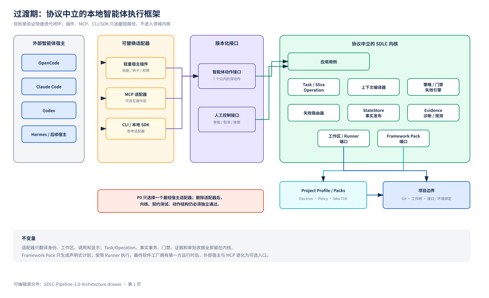
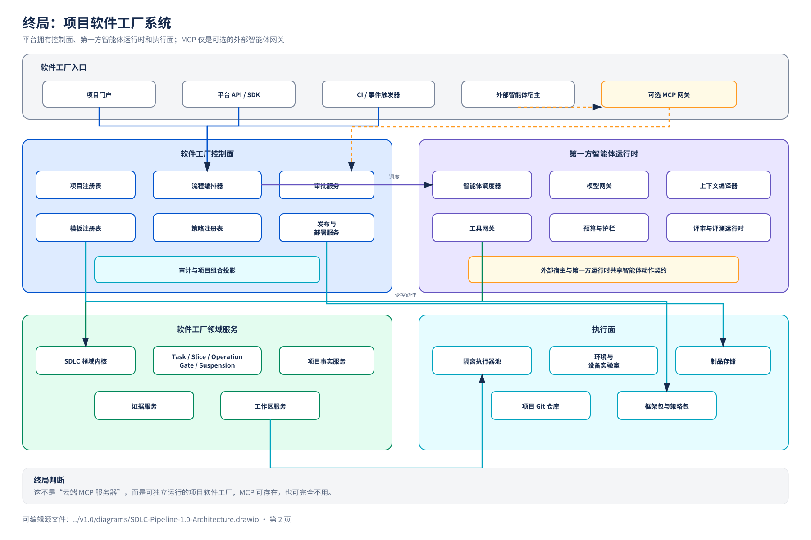
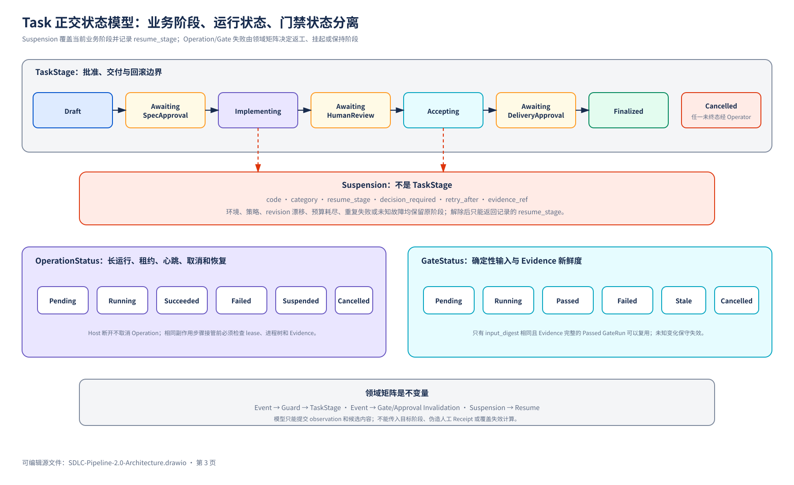
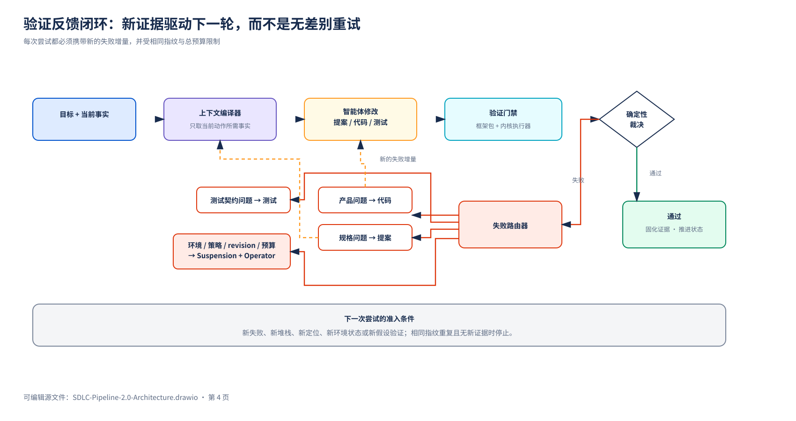

# SDLC Pipeline 2.0：Core-first Agent Harness 与项目软件工厂演进方案

状态：架构提案，评审修订版，待确认
日期：2026-07-30
适用范围：从零设计 SDLC Pipeline 2.0；现有实现与既有方案仅作为问题样本，不作为继承基线

---

## 0. 执行摘要

2.0 不应再被定义为“一个更大的 OpenCode 插件”，而应被定义为：

> **一个协议中立的软件工厂内核：用确定性 Core 管理项目事实、Task、门禁、证据和返工；用 Agent Action API 服务模型执行；用 Operator API 承载真正的人类审批；用 Framework Pack 适配不同项目模板；在过渡期通过 OpenCode Plugin、MCP、CLI 或 SDK Adapter 接入现有 Agent，最终演进为拥有一等 Agent Runtime 的项目软件工厂系统。**

核心结论：

1. **采用 Core-first、协议可插拔。** MCP、OpenCode Plugin、CLI、HTTP/SDK 都是过渡接入 Adapter；任何一个都不是状态机、审批系统、执行引擎或软件工厂内部总线。
2. **Core 不依赖固定模型或 Host Session。** 过渡期由 OpenCode、Claude Code、Codex、Hermes 等外部 Host 执行；终局由软件工厂自己的 Agent Runtime 调度模型和工具。
3. **模型工具与人工控制接口必须分离。** `approve spec`、`approve delivery`、发布、豁免门禁等操作不能作为普通模型工具暴露。
4. **模板不是一组 prompt。** Framework Pack 必须提供机器可验证的能力清单、命令、路径边界、环境变量白名单、结果解析器和 TCK。
5. **模板能力不直接暴露给模型。** 模型只能请求“运行本 Task 的 mandatory gates”；Core 决定调用哪个模板能力、以什么顺序、用什么解析器裁决。
6. **项目仓库是长期事实来源。** Project 长期存在；Task 是一次独立批准、交付和回滚的增量；Execution Slice 是 Task 内可恢复的纵向切片；Attempt 是某切片某阶段的一次有预算执行；Operation 承载长运行、心跳、取消和恢复；Session 只是临时入口。
7. **第一步不建设完整软件工厂平台。** 先在一个真实 Electron 项目上，用一个最薄 Adapter 跑通快速迭代闭环；Adapter 选 OpenCode Plugin、MCP 或 SDK，只由验证成本决定。
8. **第一阶段只验证一条最短闭环：**

   ```text
   恢复项目上下文
     → 创建/恢复 Task
     → 编辑增量提案
     → 确定性校验
     → 人工批准
     → Agent 实现
     → Harness 执行门禁
     → 结构化失败返工
     → 人工验收
     → Delivery Ready
   ```

9. **不在 P0 引入** Baseline 快照目录、SQLite、远程服务、多项目调度、动态多 Agent 组织、自动学习、模板 RPC、自动提交或发布；但 P0 必须定义可替换 StateStore、最小 Interface/Environment Binding、本地受限 Runner 和结构化诊断契约。
10. **以切片验收决定是否继续。** P0 不再共享一个“10 个工作日”总窗口；每个 Slice 有独立 timebox、黑盒退出条件和停止决策。按一名工程师配合 AI 的初始规划，完整 P0 约为 17–25 个工作日，时间是风险控制而不是完成证据。

---

## 1. 重新定义问题

### 1.1 要解决的不是“如何让 Agent 多做事”

真正要解决的是五个可验证问题：

1. 一个项目长期演进时，新的 Task 如何复用当前有效的需求、设计、接口和测试事实。
2. Agent 中断、换 Session、换模型或换宿主后，如何从业务检查点恢复，而不是依赖聊天记录。
3. Agent 修改代码后，谁用什么不可篡改的规则判断“可以继续”。
4. 不同框架模板如何用同一套编排接口完成准备、构建、测试、启动、就绪、功能验证和清理。
5. 从单项目 Harness 演进到多项目软件工厂时，哪些契约可以保留，哪些能力应上移到控制面。

### 1.2 本方案采纳的约束

`codex意见.md` 中称为“十一条建议”的部分实际列出了 12 条不变量。本方案不直接继承其具体布局，但采纳其中经重新论证后仍成立的约束：

- Project 是长期实体；Task 是一次有明确目标的增量变更。
- Session 只用于交互和尽力恢复，不是业务生命周期实体。
- Task 是批准、交付和回滚边界；可以修改多个 Feature，但必须声明影响范围并拆成可恢复的 Execution Slice。
- Attempt 绑定 `slice_id + phase`；长时间 Gate 使用可查询 Operation，不依赖宿主同步调用或 transcript。
- 项目当前事实使用仓库内、可阅读、可版本化的文档表达。
- JSON 只保存索引、状态、引用、哈希和紧凑诊断，不保存大段需求或对话正文。
- Git 是项目文档和代码的历史系统，不再复制一套“历史文件系统”。
- Finalized Task 不回退；后续缺陷创建关联 Task。
- Core 决定状态、门禁、证据新鲜度和失效范围，Prompt 不能解释或覆盖状态机。
- Approval、GateRun 和 Delivery 使用同一 Revision Vector；事实、工作区、Framework Pack、Policy 和 Environment 任一相关输入漂移都必须可检测。
- 外部接口、SIT/UAT/设备环境以版本化 Interface Catalog 和 Environment Binding 进入 Core；密钥只保存 Secret Ref。

### 1.3 参考方案中不预设保留的内容

下列内容全部重新验证，不作为前提：

- `Change + Task` 双层聚合；
- Baseline 快照目录或 Baseline 编号；
- SQLite 作为单项目初期必需存储；
- “v1 MCP 协议就是最终协议”；
- 每 Project 一个常驻 Core 实例；
- MCP 可以替代审批 UI、宿主 hooks 或 CI API；
- v1 只做 compile/unit test、把真实运行和功能验证推迟到软件工厂阶段；
- 由模型直接调用 `approve`、`merge`、`finalize` 或 `publish`。

---

## 2. 为什么是 Core-first，而不是先押注某个接入协议

### 2.1 三种形态比较

| 过渡接入形态 | 优点 | 结构性问题 | 使用位置 |
|---|---|---|---|
| OpenCode 薄插件 | 复用现有宿主事件、权限、Session、工具拦截 | 锁定宿主；Plugin API 变化；CI/平台复用差 | 若它是 P0 最短路径就继续用，但只做代理 |
| MCP Adapter | 跨宿主；typed tools 标准化；容易做 Inspector/契约测试 | 不能统一观察 prompt/edit/session；Host 支持不一致；协议仍在快速变化 | 适合互操作和外部 Host 接入，不是内核 |
| CLI/本地 SDK Adapter | 实现和测试最直接；可供 CI 与黑盒测试调用 | 模型宿主体验需要再包装 | 应作为参考 Adapter 和 Operator 入口 |
| HTTP/Event API | 适合最终平台、远程 Runner 和控制面 | P0 服务化成本高 | 软件工厂阶段启用 |
| First-party Agent Runtime | 可以统一上下文、预算、权限、作业、审批和观测 | 只有平台形成后才值得建设 | **终局执行入口** |

推荐结构不是 `Core + MCP`，而是：

```text
Protocol-neutral Core
  + versioned Agent Action API
  + Operator API
  + Framework Pack API
  + replaceable Adapters
```

P0 先实现 in-process/CLI reference adapter 和一个最短 Host Adapter。MCP 是否进入 P0，由一项限时兼容性探针决定，不能反向决定 Domain。

### 2.2 MCP 作为过渡 Adapter 时的正确职责

MCP 当前规范将 Host、Client、Server 分开，Server 负责提供 Resources、Prompts 和 Tools；协议本身不拥有业务状态机。2026-07-28 规范又改为无状态、自包含请求和按请求能力协商，并把 Tasks、Skills over MCP 等放到可选扩展中。这说明 Domain 必须与 MCP 版本隔离，不能把某一版协议语义写进 TaskEngine。

若选择实现 MCP Adapter，它只负责：

- 暴露稳定、少量、结构化的 Agent Tool API；
- 将 MCP 输入转换为 Application Use Case；
- 将 Core 结果转换为 `structuredContent + outputSchema`；
- 协商 Resources、Prompts、Tasks 等可选能力；
- 提供协议版本与宿主兼容性诊断。

MCP Adapter 不负责：

- 推断或改变 Task 状态；
- 判定测试是否通过；
- 直接执行模板命令；
- 证明用户已经批准；
- 保存 Host transcript；
- 选择模型或组织多 Agent；
- 充当软件工厂内部所有服务的通信协议。

### 2.3 为什么审批不能是普通 MCP Tool

MCP Tool 是 model-controlled。Host 可以提示用户确认调用，但不同 Host 的 UI、权限和审计能力不同；Server 不能仅凭 `confirmed: true` 证明它来自人类。

因此 2.0 必须划分两个信任域：

```text
Agent Tool API
  模型可见、可调用
  用于读取上下文、提交待验证内容、运行受控门禁、记录不可信 observation

Operator Control API
  模型不可直接调用
  通过 CLI、Host UI、Web Portal 或签名审批消息触发
  用于批准 Spec、确认人工验收、批准 Delivery、取消 Task、未来的门禁豁免
```

Host 自带的 tool approval 仍可作为第一道交互保护，但不能代替 Core 的 Operator Receipt。

### 2.4 为什么过渡期仍可能需要 Host Adapter

纯 MCP 无法统一获得以下事件：

- 用户提交 prompt；
- Session start/stop/compact；
- 普通 Read/Edit/Bash 工具调用；
- 子 Agent 创建和结束；
- 宿主 permission decision；
- 当前消息、Session 与 worktree 的稳定关联。

OpenCode 和 Claude Code 都提供 hooks、skills、agents 和权限能力，但 API 不相同。因此 Host Adapter 只做：

- 安装或发现所选连接方式（MCP、Plugin tool、CLI/SDK）；
- 提供一个短入口 Skill/Command；
- 将 Host session/worktree 作为非权威 metadata 传给 Core；
- 在宿主支持时，将高风险操作映射到 `ask/deny`；
- 记录 Host 事件或提示用户恢复当前 Task；
- 不实现任何生命周期判断。

OpenCode V2 Plugin API 当前仍标记为 beta，更应保持可替换和可删除。软件工厂拥有 First-party Agent Runtime 后，Host Adapter 退化为外部入口，不再是主执行面。

---

## 3. 外部 Agent/Harness 生态：采用什么，不采用什么

| 来源 | 值得采用 | 不应照搬 |
|---|---|---|
| Claude-Code-Game-Studios | 领域边界、path-scoped rules、文档模板、显式协作/批准、变更传播意识 | 49 agents、73 skills 和模拟组织层级不是通用软件交付的最小内核 |
| Superpowers | 先设计后实现、worktree、TDD、完成前新鲜证据、失败后系统诊断 | 每个微任务都冷启动 Agent、双重 review、所有任务强制完整流程 |
| ECC | minimal/profile 安装、能力 opt-in、共享实现配多宿主适配器、上下文节制 | 把 agents、hooks、memory、security、continuous learning 全部放入关键路径 |
| mattpocock/skills | 小而可组合的 skills、deep module、先建立紧反馈回路、domain vocabulary | 让一个 workflow framework 拥有所有过程，或把 skill 当成状态机 |
| Claude Code | Skills 按需加载、Subagent 上下文隔离、Hooks 执行确定性边界动作、MCP 按 Agent 缩小暴露面 | 把 transcript/checkpoint 当业务存储；用模型 hook 判定可编码规则 |
| OpenCode | MCP 本地/远程接入、Agent 级权限、按需 Skills、可选 Plugin hooks | 将 beta Plugin API 变成 Core 依赖；一次暴露大量 MCP 工具挤占上下文 |
| Hermes | Skills 与 Memory 分工、渐进披露、模型/工具提供方可替换 | 让自动学习即时修改当前项目的权威规则、门禁或模板 |
| OpenAI Harness Engineering | 仓库知识作为系统事实、给 Agent 地图而不是大手册、每 worktree 可运行、日志/指标对 Agent 可读、机械执行架构约束 | 在 P0 就复制百万行项目所需的完整可观测性和自治规模 |

由这些项目共同指向的不是“更多 Agent”，而是以下 Harness 形状：

```text
小上下文入口
  + 可发现的深层项目知识
  + 隔离且可运行的工作区
  + 不可由 Agent 改写的验证器
  + 有预算的证据反馈循环
  + 明确的人类决策边界
```

---

## 4. 目标架构

### 4.1 过渡期：本地 Agent Harness



可编辑源文件：[SDLC-Pipeline-2.0-Architecture.drawio](SDLC-Pipeline-2.0-Architecture.drawio) 第 1 页。

过渡期只要求“所选 Adapter 足够薄、可替换”。如果现有 OpenCode 插件是最快验证路径，可以继续用；如果 MCP 能更低成本地提供 typed tools，就使用 MCP；如果两者都拖慢 P0，则直接用本地 SDK/CLI 驱动黑盒闭环。

### 4.2 八个架构模块与接口

1. **Domain Kernel**：状态、失效规则、不变量、错误分类；纯代码、无 MCP、无 Host、无模型调用。
2. **Application Layer**：编排 Use Case、Execution Slice、Operation、幂等、乐观并发、FactChangeSet、Operator Receipt 和证据绑定。
3. **State/Evidence Ports**：用深接口隐藏事件、快照、幂等、恢复和证据提交；P0 文件实现与未来控制面数据库实现都跨越同一 seam。
4. **Harness Runtime**：工作区、受限进程树、就绪、测试、超时、取消、清理、日志、脱敏与 Evidence。
5. **Framework Pack Port**：把框架差异收敛成 CapabilityRequest/ExecutionPlan，不把命令暴露给模型，也不让 Pack 直接执行状态转换。
6. **Agent Action Interface**：协议中立、版本化的模型动作接口；Adapter 只能映射它。
7. **Operator/Factory Interface**：人与平台使用的控制接口，不与模型权限混合。
8. **Adapters**：Plugin、MCP、CLI、SDK、HTTP 都可替换；删除任一 Adapter 不应破坏 Core 测试。

### 4.3 终局：项目软件工厂系统



可编辑源文件：[SDLC-Pipeline-2.0-Architecture.drawio](SDLC-Pipeline-2.0-Architecture.drawio) 第 2 页。

终局变化不是“把本地 MCP Server 部署到云上”，而是：

- 平台拥有 Project、Task、Run、Approval、Template、Policy、Environment 和 Delivery 的控制面；
- 平台拥有一等 Agent Runtime，统一模型路由、上下文、预算、工具、隔离、评审和观测；
- Harness Runtime 下沉为可水平扩展的 Execution Plane；
- MCP 只保留为外部 Agent Host Gateway，可存在，也可以完全不用；
- 本地 2.0 Core 的 Domain、Action、Template、Evidence 契约成为平台服务的种子，而不是部署拓扑。

P2/P3 初期的控制面应优先是模块化单体；执行不可信项目命令的 Runner 独立隔离。Project Registry、Approval、Policy 和 Template Registry 只有在独立扩缩容、安全域或故障域确有需要时才拆成远程模块。

### 4.4 软件工厂内部不用 MCP 一统天下

未来的 Project Registry、Template Registry、Runner、Artifact Store、Approval Service、Event Bus 应使用适合服务间通信的 HTTP/gRPC/Queue/Object Storage 接口。MCP 只在需要让外部模型发现和调用能力时作为可选 Gateway。

---

## 5. 最小领域模型

| 概念 | 语义 | 是否长期 |
|---|---|---:|
| Project | 产品、仓库和项目事实边界 | 是 |
| ProjectFacts | 已完成 Task 形成的当前有效需求、架构、接口和验证事实 | 是 |
| Feature | 稳定产品能力，用于组织 Requirement 和依赖 | 是 |
| Requirement | 当前有效产品行为及验收条件 | 是 |
| Task | 一次可独立批准、交付和回滚的增量变更，可跨 Feature | 是 |
| ExecutionSlice | Task 内按 Requirement/AC 划分的可恢复纵向执行单元 | Task 完成后保留摘要 |
| Attempt | 某 Execution Slice 某阶段的一次有预算执行 | 是，紧凑索引 |
| Operation | Gate/准备/运行等长操作的租约、心跳、取消与恢复记录 | 是，紧凑索引 |
| GateRun | 一次确定性门禁运行，绑定输入 revision | 是，证据化 |
| Evidence | 日志、测试结果、截图、差异、运行收据的引用 | 是或按保留策略 |
| FactChangeSet | 已批准 Proposal 对 ProjectFacts 的确定性补丁及验证结果 | 是 |
| RevisionVector | facts/workspace/pack/policy/environment 等输入版本集合 | 随 Receipt/Evidence 保存 |
| Suspension | 阻塞原因、恢复阶段、所需决策与重试条件 | 阻塞期间及完成摘要 |
| Delivery | Task 达到可交付状态的签名收据，不等同于部署 | 是 |
| Session | 某宿主的一次交互入口 | 否，仅 metadata |

不引入独立 `Change` 聚合。Task 已经表达一次变更；若未来需要把多个 Task 打包发布，新增的是 Release/Delivery Group，不应再在 Task 上方复制一套变更生命周期。

### 5.1 正交状态模型



可编辑源文件：[SDLC-Pipeline-2.0-Architecture.drawio](SDLC-Pipeline-2.0-Architecture.drawio) 第 3 页。

Task 的业务阶段、运行状态和门禁状态不得混在一个枚举中：

```text
TaskStage
  Draft
  AwaitingSpecApproval
  Implementing
  AwaitingHumanReview
  Accepting
  AwaitingDeliveryApproval
  Finalized
  Cancelled

OperationStatus
  Pending
  Running
  Succeeded
  Failed
  Suspended
  Cancelled

GateStatus
  Pending
  Running
  Passed
  Failed
  Stale
  Cancelled
```

`Skipped` 和 `Waived` 预留给未来 Policy/Operator 能力，不进入 P0 正常路径。原来的 `Blocked` 不再是 TaskStage，而是覆盖在当前阶段之上的 Suspension：

```json
{
  "code": "EXTERNAL_SSO_UNAVAILABLE",
  "category": "environment",
  "resume_stage": "Accepting",
  "decision_required": "provide_environment",
  "retry_after": null,
  "evidence_ref": "sdlc://evidence/..."
}
```

状态规则：

- 状态转换由领域事件和 Core guard 决定，模型不能传入目标状态。
- Operation 失败不自动等于 TaskStage 回退；Failure Router 生成领域事件后，由矩阵决定回退、挂起或保持阶段。
- 返工只使受影响的下游 GateRun/Approval 失效，不删除历史 Evidence。
- Suspension 解除时必须返回记录的 `resume_stage`，不得由 Host 或模型猜测。
- Finalized 后发现问题时创建 `related_to` 原 Task 的新 Task。
- Operator 可从任一非终态取消 Task；Cancelled 和 Finalized 都是终态，不能互相转换。
- 同一失败指纹连续出现两次且没有新的 failure delta，或超过 Attempt 预算时创建 Suspension，不继续无差别重试。
- Slice 0 必须交付 Event → Guard → TaskStage、Event → Gate/Approval 失效、Suspension → Resume 三张可执行矩阵。

### 5.2 Task 粒度与 Execution Slice

Task 是 Operator 理解和批准的交付接口，不是“能塞下多少工作”的容器。一个 Task 必须同时满足：

- 只有一个可清晰表达的业务交付目标和闭合的 Requirement/AC 集合；
- 具有一个一致的批准范围、Delivery Preview 和回滚策略；
- 影响范围有限且可声明，mandatory gates 可以枚举；
- 即使跨 Feature，也确实需要原子交付，而不是为了减少 Task 数量。

出现以下任一情况时应拆成多个 Task：

- 多个结果可以独立批准、发布或回滚；
- Feature 之间没有必须同时成立的不变量；
- 需要不同环境、不同责任人或不同 Delivery 时间；
- 无法为整个变更给出有限、可复验的 Gate 集合。

保留为一个 Task 时，必须按 Requirement/AC 拆成 Execution Slice。Slice 应是端到端纵向结果，不按“先全部后端、再全部前端”分层；每个 Slice 完成后固化：

```text
slice_id
goal + covered_requirement_ids/ac_ids
base_revision_vector
changed_paths
handoff_ref
gate_delta
result_revision_vector
next_slice
```

Attempt 绑定 `slice_id + phase`。超过 Attempt 预算时应继续缩小 Slice 或请求人工决策，不能只延长宿主超时。

### 5.3 Revision Vector 与协调协议

P0 使用以下最小 Revision Vector：

```json
{
  "facts_revision": "sha256:...",
  "workspace_revision": "sha256:...",
  "framework_pack_digest": "sha256:...",
  "policy_digest": "sha256:...",
  "environment_binding_digest": "sha256:..."
}
```

`workspace_revision` 是受控路径 content manifest 的哈希，必须覆盖 tracked、staged、unstaged 和 untracked 文件，不能只使用 Git commit。

Core 在 `approve-spec`、获取写租约、`gate-run` 和 `delivery-prepare/finalize` 前比较 Revision Vector：

- 未漂移：继续。
- 变化与 Task 声明影响范围、引用事实和 Gate 输入均不相交：生成显式 Reconciliation Receipt，更新基线并按输入摘要计算失效范围；禁止静默 rebase。
- 相关事实、接口、环境或代码发生变化：创建 `RevisionDriftDetected` 和 Suspension，刷新 Proposal/FactChangeSet，并重新校验；已受影响的 Approval 必须重新批准。
- VCS 文本冲突或语义冲突：保持 Suspension，由 Operator 决定合并、拆分或取消。

Core 不直接执行 Git rebase。Workspace Provider 只在隔离 worktree 中应用 Operator 选择，Core 重新计算 revision 和证据。P0 是单 Project、单活动可写 Task，必须实现漂移检测与拒绝；P1 才实现多 Task worktree 协调、只读并存和写租约收敛。

---

## 6. 项目事实、Task 与运行态存储

### 6.1 推荐布局

```text
docs/sdlc/                              # Git 管理，当前有效事实
  project.md                            # 产品目标、Feature 地图、依赖、索引
  requirements.md                       # 当前有效 Requirement / AC
  architecture.md                       # 模块、接口、数据流、ADR 引用
  verification.md                       # R/AC -> Gate/Test 追溯
  interfaces/catalog.yaml               # 内部/外部接口与 contractRef
  environments/SIT-001.yaml             # 非秘密环境绑定与 Secret Ref
  tasks/
    active/TASK-0001/proposal.md        # 待批准增量，不是全量 Spec
    active/TASK-0001/plan.md            # Execution Slice 与 handoff
    active/TASK-0001/fact-change-set.json
    completed/TASK-0000/delivery.md     # 完成摘要与 Evidence 引用

.sdlc/                                  # Orchestrator 运行态
  project.json                          # project_id、模板绑定、facts_revision
  tasks/TASK-0001/
    state.json                          # 紧凑状态、版本、引用
    events.jsonl                        # 只追加领域事件
    attempts/
      ATTEMPT-0001.json                 # 输入/结果/evidence refs
  operations/OP-0001.json               # lease/heartbeat/cancel/result refs
  transactions/TXN-0001.json            # 文件事务意图与恢复状态
  leases/WORKSPACE-0001.json             # 可写工作区租约
  evidence/TASK-0001/
    GATE-0001/
      result.json
      stdout.log
      stderr.log
  logs/core.jsonl                        # 结构化且脱敏的 Debug Log
```

### 6.2 存储原则

- `docs/sdlc/*.md` 表达当前事实，不按 Task 复制完整项目文档。
- `proposal.md` 表达 Task 对当前事实的增量，不创建 Candidate 分片工具。
- `plan.md` 保存可阅读的 Slice 目标、顺序与 handoff；JSON 只保存 ID、状态、引用和哈希。
- `facts_revision` 由正式文档和 Interface Catalog 的规范化内容哈希组成；Environment Binding 以独立 digest 进入 Revision Vector，避免运行环境变化被误写成产品事实变化。
- Spec Approval 绑定 Proposal、FactChangeSet 和基线 Revision Vector；Delivery Approval 绑定待提交的结果 Revision Vector 与全部新鲜 Evidence。
- Git 保存历史，不创建 `baselines/<id>/` 快照树。
- SQLite 不进入 P0。文件系统只是 `StateStorePort` 的 P0 Adapter；未来控制面数据库只是运行索引/投影，不取代仓库事实。
- 大日志永远通过 Evidence URI/路径引用，不塞进 Tool result、JSON 索引或模型上下文。
- 外部文件默认只是用户/宿主提供的参考。只有明确需要长期保存时才进入项目仓库并由 Git 管理；Core 不自动建立 Source 归档系统。
- 密钥和 Token 只通过 Secret Ref 由 Runtime Secret Provider 注入；允许把非秘密设备地址、接口地址和测试数据 profile 写入经批准的 Environment Binding。
- 本地 hash chain/checksum 只能检测一致性和篡改迹象，不能证明本机 Operator 身份或抵抗拥有文件写权限的攻击者。

### 6.3 路径所有权

| 路径 | 写入者 | 规则 |
|---|---|---|
| `.sdlc/**` | Core/StateStore Adapter | Agent、Pack、Harness 均不可写 |
| `docs/sdlc/tasks/active/**` | Agent 在 Workspace Policy 允许下编辑；Core 校验/冻结 | 仅当前 Task 的 proposal/plan/FactChangeSet |
| `docs/sdlc/project.md`、`requirements.md`、`architecture.md`、`verification.md` | Core 的 Fact Publisher | 只能应用已批准 FactChangeSet |
| `docs/sdlc/interfaces/**` | Core 的 Fact Publisher | 作为 ProjectFacts 的接口契约，只能应用已批准 FactChangeSet |
| `docs/sdlc/environments/**` | Core 的 Environment Publisher | 只接受 Operator 批准的绑定；Secret 只能保存引用 |
| `src/**`、`tests/**`、批准的迁移目录 | Agent | 受 Task scope 和 Pack path policy 约束 |
| `coverage/**`、`test-results/**`、临时运行目录 | Harness Runtime | 受输出配额和清理策略约束 |

Framework Pack 的 `protected` 规则必须区分权威事实和 Task authoring 路径，不能用一个 `docs/sdlc/**` glob 同时禁止合法 proposal 编辑。

### 6.4 FactChangeSet 与事实发布事务

Spec Approval 只冻结 Proposal 和 FactChangeSet，不立即把未来行为写成“当前有效事实”。Agent 执行时由 Context Compiler 同时读取当前 ProjectFacts 和已批准增量。Delivery Finalization 才发布新事实：

```json
{
  "base_facts_revision": "sha256:...",
  "proposal_hash": "sha256:...",
  "changes": [
    {
      "target": "docs/sdlc/requirements.md",
      "patch_ref": "sdlc://artifact/FACT-PATCH-001"
    }
  ],
  "expected_result_facts_revision": "sha256:...",
  "validation_report_ref": "sdlc://evidence/FACT-VALIDATION-001"
}
```

Finalization 顺序固定：

```text
重检 Revision Vector 和 Delivery Approval
  → 写 FinalizationStarted 事务意图
  → 在临时目录应用并校验全部 FactChangeSet
  → 原子替换可提交文件并记录结果 manifest
  → 写 Delivery/Finalized 事件和 Receipt
  → 刷新 snapshot
```

冲突或校验失败时不产生 Finalized，Task 创建 Suspension 并回到协调流程。崩溃恢复必须能根据事务意图判断“尚未发布、已全部发布、需要补写事件”，禁止出现事实已更新但 Task 仍被当作未完成的模糊状态。下一 Task 只以完成上述事务后的 `facts_revision` 为基线。

### 6.5 StateStorePort 与文件事务

Domain 不感知 JSON、JSONL、文件锁或数据库。Application 只依赖一个小而深的接口：

```text
load(project_ref, task_id) -> TaskView
transact(TaskCommand, expected_version, idempotency) -> TaskResult
recover(project_ref) -> RecoveryReport
```

`transact` 内部必须同时负责 CAS、事件追加、幂等结果、snapshot 刷新意图和 Evidence/Receipt 引用提交。P0 FileStateStore Adapter 至少满足：

- project/task 文件锁和 workspace lease；
- 单调 `sequence` 与 `expected_task_version` CAS；
- idempotency key 同时绑定 action 名和规范化 request hash；
- 同 key 同 payload 重放原结果，同 key 不同 payload 返回 `IDEMPOTENCY_CONFLICT`；
- 事件先于 snapshot，snapshot 可由事件重建；
- event schema version、checksum/hash chain 和启动恢复；
- Evidence 写入临时文件、校验完成后原子移动；
- 写事件后、写 snapshot 前崩溃可自动恢复；
- 所有写入返回稳定 transaction/action/correlation ID。

### 6.6 Interface Catalog 与 Environment Binding

P0 只实现支持真实 canary 的最小模型，不提前建设组织级环境平台。Interface Catalog 可以由 Task FactChangeSet 修改；Environment Binding 由 Operator 提供或批准，Agent 只能报告缺失需求：

```yaml
apiVersion: sdlc.dev/interface-catalog/v1alpha1
interfaces:
  - id: EXT-SSO
    classification: external
    provider: enterprise-sso
    consumer: application
    protocol: oidc
    contractRef: contracts/sso.md
    endpointRef: env://sso.issuer
    requiredSecretRefs: [secret://sso/client-secret]
```

```yaml
apiVersion: sdlc.dev/environment-binding/v1alpha1
metadata:
  id: SIT-001
  type: sit
bindings:
  sso.issuer:
    value: https://sso-sit.example.test
readiness:
  - interfaceId: EXT-SSO
    type: http
    path: /.well-known/openid-configuration
    timeoutSeconds: 10
testData:
  profileRef: testdata://sit/default-users
```

缺失绑定在运行前产生 Environment Suspension；外部依赖不可用是 `environment` failure；外部依赖可用但产品处理错误才可能是 `product` failure。GateRun 记录 environment binding digest，不把 Secret 明文写入日志、Evidence 或模型上下文。

---

## 7. 四类接口

### 7.1 Agent Action API：供 Agent Runtime 或外部模型 Adapter 调用

P0 最多定义 7 个深动作。它们先作为 Python Application API 和 JSON Schema 固化，再由所选 Adapter 映射为 Plugin tools、MCP tools、SDK methods 或 HTTP actions：

| Tool | 作用 | 是否修改状态 |
|---|---|---:|
| `sdlc_status` | 返回当前 TaskStage、Suspension、Slice、Operation、有效/失效 gate 和下一步 | 否 |
| `sdlc_task_open` | 根据目标创建 Task，或显式恢复已有 Task | 是，低风险且幂等 |
| `sdlc_context_get` | 按 Feature/R/D/T/失败指纹编译最小上下文包 | 否 |
| `sdlc_spec_validate` | 读取 proposal/plan/FactChangeSet，校验并冻结 subject hash | 是 |
| `sdlc_gate_run` | 请求 Core 创建当前状态允许的 Gate Operation，立即返回 operation ID | 是 |
| `sdlc_observation_record` | 记录 Agent/Test/Parser observation 或不可信用户文本 | 是 |
| `sdlc_delivery_prepare` | 检查新鲜证据并生成待人工批准的 Delivery Preview | 是 |

明确不向模型暴露：

- `approve_spec`
- `approve_review`
- `approve_delivery`
- `override_gate`
- `git_commit`
- `git_push`
- `release_publish`
- 任意模板原始命令执行
- 任意状态跳转

所有修改类工具必须携带：

```json
{
  "project_ref": "...",
  "task_id": "TASK-0001",
  "expected_task_version": 7,
  "idempotency_key": "caller-stable-key",
  "request_hash": "sha256:..."
}
```

所有 Action 使用统一输出包络：

```json
{
  "schema_version": "sdlc.tool-result/v1alpha1",
  "ok": false,
  "project_id": "PRJ-0001",
  "task_id": "TASK-0001",
  "task_version": 8,
  "task_stage": "Implementing",
  "suspension": null,
  "accepted": false,
  "operation_id": null,
  "summary": "unit gate failed",
  "next_actions": [
    {
      "kind": "agent_action",
      "tool": "sdlc_context_get",
      "reason": "读取本轮新增 failure delta"
    }
  ],
  "diagnostics": [
    {
      "code": "GATE_TEST_UNIT_FAILED",
      "category": "product",
      "retryable": true,
      "fingerprint": "sha256:...",
      "evidence_ref": "sdlc://evidence/GATE-0007"
    }
  ],
  "artifact_refs": []
}
```

设计要求：

- Action Schema 与传输协议无关；状态码、诊断、Artifact/Evidence 引用在所有 Adapter 中保持一致。
- 映射为 MCP 时提供 `outputSchema`、`structuredContent` 和兼容旧 Host 的短文本摘要。
- 映射为模型工具时，工具列表稳定、顺序稳定、描述短，避免破坏 prompt cache 和挤占上下文。
- MCP Resources 可映射 `sdlc://project/map`、`sdlc://task/...` 和 Evidence，但必须有等价 Action 查询路径。
- Prompts、Skills over MCP、MCP Tasks 只是 MCP Adapter 的增强能力，Core 和 P0 不依赖。
- 长 Gate 不占用一次 Host 调用直到结束；`sdlc_gate_run` 返回 `accepted + operation_id`，后续通过 `sdlc_status` 查询，必要时可由 MCP Adapter 映射为 Tasks extension。
- `sdlc_observation_record` 不产生可信人工事实；可信评审、审批、挂起、恢复和豁免只能来自 Operator Interface。

### 7.2 Operator Control API：供人调用

P0 提供本地 CLI，Host Pack 可把它包装为 UI：

```text
sdlc task approve-spec TASK-0001 --proposal-hash sha256:...
sdlc task accept-review TASK-0001 --task-version 12
sdlc task approve-delivery TASK-0001 --delivery-hash sha256:...
sdlc task suspend TASK-0001 --reason "等待真机" --resume-stage Accepting
sdlc task reconcile TASK-0001 --onto <workspace-revision>
sdlc task cancel TASK-0001 --reason "范围取消"
sdlc operation cancel OP-0001 --reason "人工停止"
sdlc diagnose show TASK-0001
sdlc diagnose export TASK-0001
```

每次控制操作生成只追加 Operator Receipt：

```json
{
  "receipt_id": "APR-...",
  "action": "approve_spec",
  "project_id": "PRJ-0001",
  "task_id": "TASK-0001",
  "task_version": 8,
  "subject_type": "task_proposal",
  "subject_hash": "sha256:...",
  "revision_vector": {
    "facts_revision": "sha256:...",
    "workspace_revision": "sha256:...",
    "framework_pack_digest": "sha256:...",
    "policy_digest": "sha256:...",
    "environment_binding_digest": "sha256:..."
  },
  "actor_id": "local-operator",
  "actor_roles": ["reviewer"],
  "authn_level": "local_unverified",
  "issued_at": "...",
  "expires_at": null,
  "nonce": "...",
  "previous_receipt_hash": "sha256:...",
  "signature": null
}
```

P0 不做企业身份认证，因此 Receipt 必须诚实标记 `local_unverified`。hash chain 用于检测重排或修改迹象，不等同于可信签名；远程控制面阶段再接 OIDC/RBAC、签名和外部审计锚点。

P0 的 Operator Adapter 必须运行在 Agent/Runner 权限域之外，Operator control endpoint、nonce 和状态写路径不进入 Agent 工具白名单；普通项目 shell 直接调用审批命令必须被拒绝。`local_unverified` 表示不能证明企业身份，也不能抵抗同一 OS 用户已被攻陷，但仍必须证明请求来自独立 Operator channel，而不是普通 Agent Action 参数。

### 7.3 Framework Template Provider API：供 Core 调用

Framework Pack 的逻辑接口：

```text
describe()                         -> PackDescriptor
inspect_project(ProjectView)       -> ProjectInspection
materialize(MaterializeRequest)    -> ExecutionPlan    # 新项目时可选
plan(CapabilityRequest)            -> ExecutionPlan
```

调用方向固定：

```text
Host Adapter
  → Agent Action Interface
  → Application Use Case
  → Domain Kernel
  → Framework Pack Port（生成计划）
  → Harness Runtime Port（受控执行）
```

Framework Pack 不直接调用 Adapter、Task 生命周期或 Operator Interface。P0 只实现声明式 Provider，由 Core 将 Manifest 编译为 ExecutionPlan，再交给 Harness Runtime；不允许 Pack 自带常驻 RPC 服务。遇到两个真实 Pack 都无法由声明式计划表达的案例后，才形成 executable provider seam。

Harness Runtime 使用的最小深接口是：

```text
run(ExecutionPlan, RevisionVector, EnvironmentBinding, CancellationToken)
  -> OperationRef
inspect(OperationRef)
  -> ExecutionReceipt
```

Runtime 内部可使用 ProcessRunner、ProbeRunner、WorkspaceAccess、ArtifactWriter、EvidenceWriter、SecretResolver、PortAllocator 和 Clock 等内部 seam，但这些不暴露到 Agent Action Interface。

### 7.4 Factory Control API：未来平台调用

软件工厂阶段再增加：

- Project Catalog API
- Template Registry API
- Policy Registry API
- Run Queue / Runner API
- Artifact & Evidence API
- Approval API
- Release / Deployment API
- Audit Event Feed

这些接口面向平台和服务，不直接全部暴露给模型。

---

## 8. Framework Pack 契约

### 8.1 Pack 结构

```text
framework-packs/electron-react/
  template.yaml
  scaffold/                   # 可选，创建新项目时使用
  context/
    architecture.md
    testing.md
  policies/
    paths.yaml
  parsers/                    # P0 仅允许 Core 内置 parser ID
  tck/
    success-fixture/
    failure-fixture/
```

### 8.2 Manifest v1alpha1

```yaml
apiVersion: sdlc.dev/framework-pack/v1alpha1
kind: FrameworkPack
metadata:
  id: electron-react
  version: 0.1.0
  digest: sha256:...

compatibility:
  core: ">=2.0.0-alpha <2.1.0"
  supportedOs: [windows, linux, darwin]
  supportedArch: [x64, arm64]

requires:
  packs: []
  toolchains:
    - id: node
      version: ">=22 <23"

project:
  markers:
    allOf: ["package.json"]
    anyOf: ["forge.config.*", "electron.vite.config.*"]
  contextEntries:
    - path: docs/architecture.md
      when: architecture

paths:
  writable:
    - src/**
    - tests/**
    - docs/sdlc/tasks/active/${task_id}/**
  protected:
    - .sdlc/**
    - docs/sdlc/project.md
    - docs/sdlc/requirements.md
    - docs/sdlc/architecture.md
    - docs/sdlc/verification.md
    - docs/sdlc/interfaces/**
    - docs/sdlc/environments/**
    - docs/sdlc/tasks/completed/**
    - .github/**

capabilities:
  project.inspect:
    runner: builtin

  dependencies.restore:
    runner: process
    argv: ["pnpm", "install", "--frozen-lockfile"]
    cwd: "."
    timeoutSeconds: 900
    environmentAllowlist: ["CI", "PNPM_HOME"]
    writes: ["node_modules/**"]
    resultParser: exit-code
    sideEffectClass: workspace
    networkPolicy:
      mode: allowlist
      hosts: ["registry.npmjs.org"]
    resourceLimits:
      maxLogBytes: 10485760
      maxDiskBytes: 2147483648
    invalidationInputs:
      paths: ["package.json", "pnpm-lock.yaml"]
      bindings: ["framework_pack_digest", "policy_digest"]

  code.check:
    runner: process
    argv: ["pnpm", "check"]
    cwd: "."
    timeoutSeconds: 600
    environmentAllowlist: ["CI"]
    writes: []
    resultParser: exit-code
    blocking: true
    inputs:
      paths: ["src/**", "tests/**", "package.json", "tsconfig*.json"]
    outputs:
      evidenceTypes: ["diagnostic", "log"]
    invalidationInputs:
      paths: ["src/**", "tests/**", "package.json", "tsconfig*.json"]
      facts: ["architecture", "interfaces"]

  test.unit:
    runner: process
    argv: ["pnpm", "test", "--", "--run"]
    cwd: "."
    timeoutSeconds: 900
    environmentAllowlist: ["CI"]
    writes: ["coverage/**", "test-results/**"]
    resultParser: junit-or-exit-code
    blocking: true
    invalidationInputs:
      paths: ["src/**", "tests/**", "package.json"]
      facts: ["requirements", "interfaces", "verification"]

  app.start:
    runner: process
    argv: ["pnpm", "start"]
    lifecycle: background
    timeoutSeconds: 120
    readiness: app.ready
    requiredSecrets: []
    requiredEnvironment: ["runtime.port"]
    retryPolicy:
      maxAttempts: 1

  app.ready:
    runner: probe
    probe:
      type: process
      argv: ["node", "scripts/readiness.mjs"]
    timeoutSeconds: 60

  test.functional:
    runner: process
    argv: ["pnpm", "test:functional"]
    timeoutSeconds: 1200
    resultParser: playwright-json
    blocking: true
    requiredEnvironment: ["runtime.port", "sso.issuer"]
    invalidationInputs:
      paths: ["src/**", "tests/functional/**", "package.json"]
      facts: ["requirements", "interfaces", "verification"]
      bindings: ["environment_binding_digest", "framework_pack_digest", "policy_digest"]

  app.stop:
    runner: builtin
    lifecycle: cleanup
```

### 8.3 稳定 Capability 命名

Core 标准能力：

```text
project.inspect
scaffold.materialize
workspace.prepare
dependencies.restore
code.check
test.unit
app.start
app.ready
test.functional
app.stop
package.build
```

未来能力使用命名空间扩展，例如：

```text
contract.openapi.validate
security.sbom.generate
deploy.sit
device.yealink.smoke
```

Capability 只是执行能力，不得定义 Task 状态转换或审批策略。

### 8.4 Project Profile 与 Pack 组合

一个项目不能被永久限制为“一个 Framework Pack”。目标绑定模型是：

```text
Project Profile
  + 0..N Framework Capability Pack
  + 0..N Policy Pack
```

P0 只实现 `electron-react + default-local-policy`，但 Schema 必须预留：

- pack ID/version/digest pinning；
- `requires` 依赖；
- Capability provider 唯一性；
- 显式优先级，不允许按安装顺序覆盖；
- 冲突检测和不兼容报告；
- Project Profile 对接口、环境、工具链和 mandatory gates 的选择。

P1/P2 再验证前后端组合 Pack、CSCI/接口/SBOM Policy/Capability Pack，不修改 Task 核心语义。

### 8.5 标准执行对象

Framework Pack Interface 只交换以下稳定对象：

```text
CapabilityRequest
ExecutionPlan
ExecutionReceipt
CleanupToken
Diagnostic
ArtifactDescriptor
EnvironmentRequirement
GateInputManifest
```

ExecutionPlan 必须是 Core 可检查的声明式计划，包含 argv、cwd、输入/输出、side-effect class、环境与 Secret 引用、网络策略、资源限制、取消点、readiness、cleanup 和 parser ID。Framework Pack 不拥有 Runtime SPI，也不能在计划之外执行代码。

### 8.6 Framework Pack Contract Test Kit

每个 Framework Pack 必须通过：

1. Manifest Schema 和 Core version range 校验。
2. 禁止 shell 字符串，只允许 `argv` 数组。
3. `cwd`、writable/protected path 在 realpath/canonicalize 后不能通过 symlink、junction、大小写或 `..` 逃逸项目边界。
4. 未声明环境变量不得注入。
5. 每个后台进程必须有 readiness、timeout 和 cleanup。
6. success fixture 必须成功；failure fixture 必须被 parser 稳定识别为失败。
7. cleanup 至少执行两次仍安全。
8. Evidence 必须包含 capability、开始/结束时间、exit code、revision、stdout/stderr refs。
9. Pack 不得修改 `.sdlc/**`、审批收据或 Core policy。
10. 同一输入重复运行应得到相同裁决；允许日志时间等非语义字段不同。
11. Pack digest 改变后，旧 GateRun 必须失效。
12. 同一 Capability 的依赖、输入/输出和 invalidationInputs 必须可形成确定性 GateInputManifest。

Framework Pack 由平台/Core 调用，模型没有 `execute_raw_capability`。

### 8.7 P0 Runner 安全边界

`argv` 数组只减少 shell 拼接风险，不等于安全执行。P0 Runner 至少提供：

- 只注入声明的 clean environment，不继承完整父进程环境；
- canonical path、symlink/junction escape 和路径大小写归一检查；
- Windows Job Object 或等价进程树管理，POSIX process group；timeout 后 TERM → KILL；
- orphan process 检测和 cleanup receipt；
- Electron 独立临时 `user-data-dir`、动态端口和端口回收；
- Secret/网络白名单、日志脱敏；
- CPU、内存、磁盘、进程数和日志大小限制；若当前 OS 无法强制某项限制，Receipt 必须记录 `not_enforced`，高风险 Gate 进入 Suspension；
- Framework Pack digest pinning，运行前后均验证；
- 输入 revision 在 Operation 开始和结束各采样一次，变化则 GateStatus=`Stale`。

P0 的安全等级明确标记为 `local_constrained`，只验证受控 canary 和受信项目；不得宣称已经能隔离敌对代码。真正的 hostile-code sandbox、容器/VM Runner 和网络强隔离属于 P2/P3 Execution Plane。

---

## 9. Harness 闭环



可编辑源文件：[SDLC-Pipeline-2.0-Architecture.drawio](SDLC-Pipeline-2.0-Architecture.drawio) 第 4 页。

### 9.1 Failure Router

统一分类：

| Category | 默认去向 | 示例 |
|---|---|---|
| `product` | 回到 Implementing | 编译失败、业务测试失败、运行崩溃 |
| `spec` | 回到 Draft，并失效 Spec Approval | Requirement/AC/设计本身错误或缺失 |
| `test_contract` | 项目测试回 Implementing；Pack/parser 问题创建 Suspension | 测试脚本或 parser 错误 |
| `environment` | Suspension，保留 resume_stage | 设备未到、端口占用、外部服务不可用 |
| `policy` | Suspension/Operator | Protected path、许可、安全策略 |
| `infrastructure` | 有预算重试后 Suspension | Runner 中断、磁盘、网络临时故障 |
| `unknown` | 一次诊断 Attempt 后 Suspension | 无法稳定复现 |

每次重试必须携带新的 failure delta：

- 新失败用例；
- 新堆栈；
- 新差异定位；
- 新环境状态；
- 新假设验证结果。

仅“再试一次”不构成新的 Attempt 依据。

### 9.2 Context Compiler

Agent 每次只获得当前动作需要的内容：

```text
项目地图摘要
+ 相关 Feature / Requirement / AC
+ 相关架构接口与 ADR
+ 当前 Interface Contract / Environment Binding 摘要
+ 当前 Task proposal、Execution Slice、FactChangeSet 和决策
+ 当前 diff / Revision Vector
+ 上一次新增 failure delta
+ 当前 Framework Pack 的相关规则
+ 允许与禁止路径
```

明确排除：

- 全部历史 transcript；
- 全部 Task 正文；
- 全量测试日志；
- 所有 Framework Pack；
- 所有无关 Tool/Action 描述；
- 已通过且未失效的 GateRun 详细输出。

### 9.3 Gate 输入、失效与新鲜度

每个 GateRun 必须保存 GateInputManifest：

```json
{
  "gate_id": "test.functional",
  "capability": "test.functional",
  "source_manifest_digest": "sha256:...",
  "fact_refs": {
    "requirements": "sha256:...",
    "interfaces": "sha256:...",
    "verification": "sha256:..."
  },
  "upstream_gate_digests": ["sha256:..."],
  "framework_pack_digest": "sha256:...",
  "policy_digest": "sha256:...",
  "environment_binding_digest": "sha256:...",
  "toolchain_digest": "sha256:...",
  "runner_version": "2.0.0-alpha.1",
  "parser_version": "playwright-json/1.0",
  "input_digest": "sha256:..."
}
```

复用 GateRun 的必要且充分条件是 `input_digest` 相同且 Evidence 完整性校验通过。失效计算由 Core 的确定性模块完成：

1. 根据 Git/content manifest 得到 changed paths。
2. 根据 Requirement/AC/interface/verification 引用得到 changed fact nodes。
3. 与 Pack 声明的 `invalidationInputs`、上游 Gate、Policy、Environment、toolchain 和 parser 版本求交。
4. 命中则将 GateRun 标记为 `Stale` 并向下游传播；未知输入或无法解析的变化默认保守失效。
5. Operation 开始和结束 revision 不一致时，本轮 GateRun 直接为 `Stale`，不能作为 Delivery Evidence。

示例：只改前端代码时，输入仅包含后端目录的 unit gate 可以复用；覆盖端到端用户流程的 functional gate 必须失效。接口契约变化时，所有声明依赖该接口的前后端 Gate 都失效。

Slice 0 必须提交可执行的 Evidence Invalidation Matrix 和相应 TCK；P0-03 不接受“由实现自行判断”的模糊规则。

### 9.4 Operation：长运行与恢复

长时间 GateRun 由 Core 自己的 Operation 表达：

```json
{
  "operation_id": "OP-0001",
  "kind": "gate_run",
  "status": "Running",
  "project_id": "PRJ-0001",
  "task_id": "TASK-0001",
  "slice_id": "SLICE-0002",
  "gate_run_id": "GATE-0007",
  "lease_owner": "runner-001",
  "heartbeat_at": "...",
  "cancellation_requested": false,
  "revision_vector": {}
}
```

规则：

- `sdlc_gate_run` 在持久化 Operation 后立即返回 `accepted + operation_id`。
- Host 断开不取消 Operation；`sdlc_status` 可恢复查询。
- Runner lease 超时后先检查进程树和 Evidence，再判定可接管、失败或需要人工清理，不能直接重复执行有副作用步骤。
- 取消是协作式请求；Runtime 必须执行进程树终止和 cleanup，最终记录 Cancellation/Cleanup Receipt。
- MCP Tasks 若可用只做映射，Domain Operation 始终是状态真相。

### 9.5 P0 最小可观测性

P0 就区分五类记录：

| 类型 | 用途 |
|---|---|
| Debug Log | 定位 Core、Adapter、Runner 和 Pack 问题 |
| Audit Event | 记录谁在何时请求了什么控制动作 |
| Domain Event | 重建 Task/Operation/Gate 状态 |
| Evidence | 支撑 Gate 和 Delivery 结论 |
| Metric | 统计耗时、失败、恢复、返工和清理 |

Trace 在 P0 以 correlation 字段实现，不要求部署 OpenTelemetry Collector；P2/P3 可接 OTLP。所有结构化日志至少包含适用的：

```text
trace_id
correlation_id
action_id
transaction_id
project_id
task_id
slice_id
attempt_id
operation_id
gate_run_id
workspace_id
framework_pack_digest
facts_revision
```

默认启用 JSONL、Secret/Token/credential redaction、日志大小限制和失败诊断包。`sdlc diagnose export` 只导出脱敏后的状态、事件、Gate/Evidence 引用、Environment 摘要、revision 和进程清理报告，不复制 Secret 或完整原始环境变量。

---

## 10. P0：快速迭代骨架验证

### 10.1 P0 只回答七个问题

1. 同一 Core 能否在不依赖 Host Session 的情况下创建、按 Slice 恢复并完成一个 Task。
2. TaskStage、Operation、Gate 和 Suspension 能否由可执行矩阵确定推进与恢复。
3. FileStateStore 能否在并发、幂等、崩溃和部分写入后保持一致。
4. 失败和输入变化能否只失效相关证据，而不是重跑整个流程或漏跑 Gate。
5. 一个真实 Framework Pack 能否在 `local_constrained` Runner 中驱动 compile/unit/start/readiness/functional/cleanup。
6. Interface Catalog、Environment Binding 和 Secret Ref 能否支持一个真实外部依赖 canary。
7. Agent Action Interface 能否先被 reference adapter 和一个真实 Host Adapter 使用，且 Adapter 不拥有状态或门禁。

### 10.2 推荐技术切片

- 语言：Python，沿用现有 Core 工程经验。
- Core 调用：in-process Python API + JSON Schema reference adapter。
- Host 接入：在 OpenCode 薄插件、MCP stdio、CLI/SDK 中选择实测成本最低的一种；P0 只实现一个。
- MCP 探针：限时验证官方 SDK 的 typed tools/structured result；验证不通过即延后，不阻塞 Core。
- 状态：`StateStorePort` + FileStateStore Adapter；Markdown + JSON + JSONL + transaction journal + filesystem atomic replace。
- 目标项目：隔离的 Electron canary project。
- 第一执行宿主：优先复用当前 OpenCode，但不把它写入领域契约。
- 第二宿主：不是 P0 完成条件；P1 用于验证 Adapter 可替换性。
- Operator：本地 CLI。
- Framework Pack：`electron-react` 一个真实 Pack + 一个最小 fake Pack 用于 TCK。
- 环境：一个最小 Interface Catalog、一个 SIT/fake external binding 和 Secret Resolver fake。
- 执行：单 Project、单活动可写 Task；Execution Slice 串行，Gate 通过 Operation 可异步运行。
- 安全：本地受限 Runner，digest pinning、进程树回收、clean environment、路径规范化、配额和脱敏；不宣称敌对代码隔离。

### 10.3 推荐骨架

```text
src/
  sdlc_core/
    domain/
      task/
      operation/
      gate/
      revisions/
    application/
    ports/
  sdlc_adapters/
    state/
      file/
    runtime/
      local_constrained/
    reference.py
    opencode/               # 或 mcp/，P0 二选一
    schemas/
      action/
      operator/
      framework-pack/
      interface-catalog/
      environment-binding/
  sdlc_observability/
    diagnostics/
    redaction/
  sdlc_operator/
    cli.py

adapters/
  mcp/                      # 可选兼容层，不是 Core 依赖
  host-packs/
    opencode/
    claude-code/

framework-packs/
  electron-react/
  fake-canary/

tck/
  action-api/
  state-store/
  runner/
  adapters/
  framework-pack/
  lifecycle/

examples/
  electron-canary/
```

这是 clean-break 目标结构。默认 Cutover 候选见 [ADR-001：SDLC Pipeline 2.0 Core 切换策略](ADR-001-SDLC-Pipeline-2.0-Core-Cutover.md)：旧 Core 冻结处理既有 Task，新 Core 在隔离副本做 shadow replay，随后只接收新 Task；禁止两个 Core 双写同一 Task。ADR 必须在实现前转为 Accepted，不能长期维护两套正式 Core。

### 10.4 实施顺序

#### Slice 0：契约与不变量

- 固化领域词汇、Task/ExecutionSlice/Operation/Suspension 和三张状态/失效/恢复矩阵。
- 写 Agent Action、Operator Receipt、Framework Pack、Interface Catalog、Environment Binding Schema。
- 写 Revision Vector、GateInputManifest、FactChangeSet、StateStore transaction 和 Diagnostic Code 契约。
- 把 10.5 节场景先写成可失败的黑盒/TCK；此时不接 Host。

#### Slice 1：可靠 Core

- `sdlc_status`
- `sdlc_task_open`
- proposal/plan/FactChangeSet validation
- FileStateStore、workspace lease、幂等和 crash recovery
- Operator spec approval、Receipt 重放防护
- Operation/GateRun/Evidence、Failure Router
- Delivery Preview、事实发布事务和 approval/finalization

#### Slice 2：Harness Runtime

- `local_constrained` process tree、timeout/cancellation 和 orphan cleanup
- canonical path、clean environment、Secret/网络白名单和资源/日志限制
- background runtime + readiness + cleanup
- revision manifest、Artifact/Evidence writer、脱敏和结构化日志
- Operation lease/heartbeat/recovery

#### Slice 3：Framework Pack 与真实 canary

- reference adapter contract tests
- fake Pack 先通过完整 TCK
- Electron Pack、unit/functional parser、start/readiness/cleanup
- Interface Catalog、Environment Binding 和一个外部依赖 failure 场景
- Gate invalidation、pack digest 和 Evidence freshness

#### Slice 4：选定一个过渡 Adapter

- reference CLI/SDK 先完成 Action 黑盒测试
- OpenCode 薄插件或 MCP stdio 二选一
- 最小入口 Skill/Command
- Adapter 不含状态机的静态检查
- MCP 若未入选，只保留限时探针结论，不扩大实现

每个 Slice 独立验收，不以总窗口掩盖部分完成：

| Slice | 初始 timebox | 退出条件 |
|---|---:|---|
| 0 | 3–4 个工作日 | Schema、矩阵和黑盒场景可执行，关键术语无歧义 |
| 1 | 4–6 个工作日 | 纯 Core/FileStateStore 在故障注入下通过 |
| 2 | 5–7 个工作日 | Runner 安全、Operation、Evidence 和诊断通过 |
| 3 | 3–5 个工作日 | fake + Electron Pack 在真实 canary 通过 |
| 4 | 2–3 个工作日 | reference + 一个 Host Adapter conformance 通过 |

完整 P0 初始规划为 17–25 个工作日。到达 timebox 仍未满足退出条件时，必须记录已完成场景、失败证据和缩减/转向决定，不能把“做到下一个 Slice”描述为当前 Slice 通过。

### 10.5 P0 黑盒验收

| ID | 场景 | 必须观察到的结果 |
|---|---|---|
| P0-01 | 新项目创建 Task | 生成 Task ID、proposal/plan/FactChangeSet path 和 Revision Vector；不创建 Baseline 快照 |
| P0-02 | 模型尝试直接完成 Spec | 没有 Operator Receipt 时保持 `AwaitingSpecApproval` |
| P0-03 | 编译失败后修复 | 只重跑失效 gate；已通过且输入未变的 gate 不重复 |
| P0-04 | 同一失败指纹重复两次 | 创建 Suspension，保留 resume_stage、Evidence 和人工所需决策 |
| P0-05 | 新 Session 恢复 | 两次 Action 调用内得到 Task/Slice/Operation、下一步和最小上下文；不重复询问已确认事实 |
| P0-06 | 功能测试需要 Runtime | start → readiness → functional → cleanup 顺序确定，失败也执行 cleanup |
| P0-07 | 修改 protected path | Core 拒绝进入 GateRun；Host 是否有 hook 不影响裁决 |
| P0-08 | Delivery Preview | 绑定结果 Revision Vector、FactChangeSet 和全部 mandatory GateRun；批准后事实发布与 Finalized 可恢复 |
| P0-09 | reference adapter 调用 Core | 不经过任何 Host 也能完成状态和 Gate 黑盒测试 |
| P0-10 | 选定 Host Adapter 调用 Core | input/output schema 与 reference adapter 一致，Host 不拥有状态 |
| P0-11 | 同一 idempotency key 并发调用 | 只产生一个领域事件和一个 GateRun/Operation |
| P0-12 | 相同 key、不同请求参数 | 返回 `IDEMPOTENCY_CONFLICT` |
| P0-13 | 写事件后、写 snapshot 前崩溃 | 重启后由 event/transaction journal 自动恢复 |
| P0-14 | GateRun 期间受控源码变化 | GateStatus=`Stale`，Evidence 不可用于 Delivery |
| P0-15 | symlink/junction 指向项目外部 | Core/Runner 拒绝执行并返回路径诊断 |
| P0-16 | 后台进程生成子进程后测试失败 | 所有进程被清理，无 orphan，并产生 Cleanup Receipt |
| P0-17 | 日志包含 Token/Secret | Debug Log、Evidence 和诊断包均完成脱敏 |
| P0-18 | 必需外部接口绑定缺失 | 运行前创建 Environment Suspension，不启动进程 |
| P0-19 | 重放旧 Approval Receipt | 因 subject/task/revision 不匹配被拒绝 |
| P0-20 | Evidence 文件被修改或缺失 | 完整性校验失败，Delivery Preview 被拒绝 |
| P0-21 | Framework Pack digest 改变 | 相关 GateRun 自动 Stale |
| P0-22 | Adapter 被删除 | Core、Action TCK、StateStore/Runner TCK 和 lifecycle 测试仍通过 |
| P0-23 | 多 AC Task 跨 Session 执行 | 从最后一个 Slice handoff 恢复，不重做已完成 Slice |
| P0-24 | Spec Approval 后 facts/workspace 漂移 | 创建 Revision Suspension；相关 Approval/Gate 失效，禁止静默 rebase |
| P0-25 | 事实文件替换中途崩溃 | 恢复后要么旧事实完整有效，要么新事实完整有效，不出现部分发布 |

### 10.6 P0 成功指标

- 模型可见 SDLC Actions 不超过 7 个。
- 大日志不进入模型 Action result。
- Session 恢复不依赖 transcript。
- 同一 idempotency key 不产生重复事件、Operation 或 GateRun，不同 payload 不会误重放。
- 所有完成声明都能追到当前 Revision Vector 的新鲜 Evidence。
- Template 命令、parser、path policy 不能被模型参数覆盖。
- Operator Approval 无法由普通 Agent Tool 伪造，P0 身份强度明确标为 `local_unverified`。
- 选定 Adapter 删除后，Core、Action TCK 和 lifecycle 测试仍通过。
- 一次窄 Feature 的失败修正不重新执行 init/spec 全流程。
- 崩溃恢复、事实发布和长 Operation 不依赖 Host Session。
- 缺少外部环境、Runner 隔离能力或 Secret 时 fail closed，不以空值继续。

### 10.7 P0 停止/转向条件

出现任一情况即停止加功能：

- 同一结构性失败连续三轮没有新证据；
- 任何 Adapter 要求把状态机或裁决逻辑搬出 Core；
- Framework Pack 为表达真实 Electron 生命周期必须绕过 Core runner；
- Operator Approval 仍能被模型路径伪造；
- 跨 Session 恢复仍必须读取 Host transcript；
- FileStateStore 在故障注入后无法确定恢复到唯一状态；
- Runner 无法稳定回收进程树或无法报告未强制的安全限制；
- Gate 复用无法由 GateInputManifest 确定性重算；
- 为跑通一个 Feature 被迫先引入数据库、多项目调度或远程控制面。

---

## 11. 软件工厂演进路线

路线按“能力门槛”推进，不按版本号堆功能。

### 阶段 P0：Contract & Canary

交付：

- Core Kernel
- FileStateStore + Operation + FactChangeSet
- Agent Action reference adapter
- Operator CLI
- Electron Framework Pack
- 最小 Interface Catalog / Environment Binding
- `local_constrained` Runner 与诊断包
- 一个最薄的真实 Host Adapter
- TCK + canary

退出条件：第 10.5 节全部通过。

### 阶段 P1：Local Project Harness

新增：

- Task worktree provider
- 多 Task 只读并存、单 worktree 写租约
- Revision Reconciliation：非重叠显式协调、重叠变更重新审批、语义冲突人工处理
- UI/浏览器可读 Evidence
- 更完整的 spec/product/test/environment Failure Router
- 第二 Adapter conformance；可选验证 MCP/Claude Code，但不绑定产品方向
- Delivery 与 Git commit 的显式 Operator 集成，但不自动 push
- 面向近期真实项目选择一个合规 canary：CSCI/接口追溯或 SBOM Gate
- 第二种 Environment Binding（SIT/UAT/设备三者择一）和真实外部依赖故障演练

退出条件：两个真实项目持续使用；两个基于同一旧 revision 的 Task 能在首个 Task 完成后确定性协调；跨 Session 恢复、定向返工和一个合规 canary 稳定。

### 阶段 P2：Factory Kernel & First-party Agent Runtime

新增：

- 第一方 Agent Scheduler、Model Gateway、Context Compiler 和 Tool Gateway
- 可恢复的 Agent Job、预算、取消、人工接管和 Review/Eval Runtime
- 本地单节点 Project Service 与 Runner Service
- Framework Pack Registry
- Pack 签名、兼容性、升级/回滚和信任策略；digest pinning 已在 P0
- Policy Pack 与 Framework Pack 分离
- CSCI/接口/SBOM 能力形成版本化 Capability/Policy Pack
- Spring Boot/前后端分离等第二类真实模板
- Project Profile + 多 Pack 依赖/冲突/优先级解析
- Pack conformance matrix
- CI headless client

退出条件：

- 至少两种显著不同技术栈无需修改 Core 状态机即可完成同一流程；
- 不依赖 OpenCode/Claude Code Session，也能由第一方 Agent Runtime 完成 canary；
- 外部 Host Adapter 与第一方 Runtime 共享同一 Agent Action 契约。

### 阶段 P3：Project Software Factory MVP

新增控制面：

- Project Registry
- 项目创建/导入、模板绑定与项目地图
- 面向单项目的 Task/Feature/Requirement/Verification 工作台
- Run Queue 和隔离 Runner
- Artifact/Evidence Store
- Approval Service
- Secrets/Environment Provider
- Release/Deployment 编排
- 项目级 RBAC、审计锚点和运行态可观测性聚合；日志/诊断契约已在 P0
- Web Portal 与 Platform API

此时产品已经是可独立使用的“项目软件工厂系统”。MCP 可以是外部 Agent Gateway，也可以完全不部署；Core 内部服务使用普通平台协议。

退出条件：一个项目可以从创建/导入、需求 Task、实现、验证、审批一直编排到 Release/Deployment，且执行证据完整可审计。

### 阶段 P4：Multi-project & Organization Governance

新增：

- 组织级 Template/Policy 分发
- 项目组合视图
- 多项目队列、配额和 Runner 调度
- 合规证据投影
- 组织级 CSCI/接口/供应链/SBOM Pack 分发、豁免治理和组合报表
- SIT/UAT/设备实验室 Environment Registry、容量和预约治理；Environment Binding 已在 P0
- 成本、时延、成功率和返工原因指标

这些能力通过新增 Capability/Policy/Projection 实现，不修改 P0 Task 核心语义。

### 阶段 P5：Adaptive Agent Factory

最后才引入：

- 多 Agent 调度与依赖图；
- 基于风险选择 reviewer/tester；
- 模型路由和预算优化；
- 历史 Evidence 检索；
- Skill/Prompt 建议与自动评估；
- 受控经验沉淀。

自动学习只能先进入 shadow/evaluation：

```text
历史数据
  → 生成候选 Skill/Policy
  → 离线 Eval / TCK
  → 人工批准
  → 新版本发布
```

它不得直接修改当前 Task 的 Gate、审批规则或 Framework Pack。

---

## 12. 对参考方案与评审意见的取舍

### 12.1 `codex意见.md`

保留：

- Project/Task/Session/Attempt 分离；
- 项目级当前事实；
- Task 增量提案；
- JSON 索引、Markdown 正文；
- Git 历史；
- Finalized 后以新 Task 修复；
- Core 决定状态和门禁。

调整：

- P0 明确为单 Project、单活动可写 Task，并用写租约防止 Adapter 竞态；P1 才允许多 worktree Task 并发和 revision 协调。
- 工具面不再只按 `status/task/spec/execute/finalize` 粗分，而按 Agent/Operator 信任域分离。
- `execute` 不让模型选择原始模板命令。
- 增加 Context Compiler、Template Port、Evidence、Failure Router 和 Host Pack。
- 不把“外部文件永不管理”写成绝对规则；默认不归档，但项目可显式纳入 Git。
- Release/Delivery 不从终态蓝图删除，只从 P0 自动化范围移出。

### 12.2 `SDLC-Pipeline-最终版设计方案.md`

保留：

- 可插拔跨宿主入口的方向；MCP 只是候选实现；
- Harness 中 AI 生成、规则裁决；
- 模板 Capability；
- Evidence 指针；
- 从单项目向软件工厂演进。

拒绝或调整：

- 不采用 Baseline 快照树。
- 不在 P0 默认引入 Change 聚合和 SQLite。
- 不声称 MCP 协议“零迁移成本”或 v1 即最终协议。
- 不把人类审批设计成模型可调用工具。
- 不把 Integration/E2E 全部推迟；P0 必须至少验证一个真实 start/readiness/functional/cleanup 闭环。
- 不固定每 Project 一个 Core 实例；Project 是权限和状态作用域，不是部署拓扑。
- 不用 MCP 替代 CI、Registry、Runner 和工厂内部 API。

### 12.3 Claude 与 ChatGPT Pro 评审

两轮评审的逐项处置见 [Review-Disposition-2026-07-30.md](Review-Disposition-2026-07-30.md)。本版合并采纳：

- Task 粒度与 Execution Slice；
- Revision 协调和显式 Reconciliation；
- 正交 TaskStage/Operation/Gate/Suspension；
- FactChangeSet 和事实发布事务；
- StateStorePort、幂等、租约和 crash recovery；
- GateInputManifest 与确定性失效；
- P0 Interface/Environment、Runner 安全和最小可观测性；
- 独立 Slice timebox、合规 canary 前移和默认 Cutover 候选。

同时收敛两点：P0 Runner 只承诺 `local_constrained`，不声称生产级敌对代码隔离；P0 Operator Receipt 标记 `local_unverified`，本地 hash chain 不冒充可信身份或不可篡改签名。

---

## 13. 需要确认的架构决策

进入实现前需要确认以下 12 项：

1. 产品形态采用 **Protocol-neutral Core + Agent Action API + Operator API + Framework Pack + 可替换 Adapter**。
2. MCP、OpenCode Plugin、CLI/SDK 都只可能是过渡 Adapter；终局是第一方 Agent Runtime 和项目软件工厂控制面。
3. P0 不采用 Baseline 快照、Change 聚合和 SQLite。
4. Task 是批准/交付/回滚边界；Execution Slice 是可恢复执行单元；TaskStage、Operation、Gate 和 Suspension 正交。
5. 项目当前事实使用仓库内 Markdown/结构化契约；Git 管历史；Task 通过批准的 FactChangeSet 在 Finalization 事务中发布事实。
6. Approval、GateRun 和 Delivery 绑定同一 Revision Vector；漂移必须显式协调，禁止静默 rebase。
7. P0 使用 StateStorePort + FileStateStore，必须通过 CAS、幂等、租约、事务日志和 crash recovery 验收。
8. P0 Framework Pack 采用声明式 Manifest/ExecutionPlan；模板命令不直接暴露给模型，Pack 不直接驱动 Runtime 或状态机。
9. P0 包含最小 Interface Catalog、Environment Binding、Secret Ref、GateInputManifest 和确定性失效规则。
10. P0 Runner 安全等级是 `local_constrained`，必须完成进程树、路径、环境、配额、digest 和脱敏控制，但不宣称敌对代码隔离。
11. P0 用 Electron 真实项目验证快速迭代主流程，只选择一个最短 Host Adapter；跨宿主和 MCP 不作为 P0 完成条件。
12. P0 先达到 Delivery Ready；commit、push、release、deploy 始终需要独立 Operator 授权。

确认这些架构决策不是发布授权。后续应先提交：

- Domain vocabulary；
- TaskStage/Operation/Gate/Suspension 事件、守卫、失效和恢复矩阵；
- Agent/Operator/Framework/StateStore/Environment/Interface Schema；
- Revision Vector、FactChangeSet、GateInputManifest 和 Diagnostic Catalog；
- Framework Pack Manifest + fake TCK；
- P0 黑盒验收测试；
- [ADR-001](ADR-001-SDLC-Pipeline-2.0-Core-Cutover.md) 转为 Accepted；

再开始搭建骨架。

---

## 14. 一手资料

- [Model Context Protocol 2026-07-28 Specification](https://modelcontextprotocol.io/specification/2026-07-28)
- [MCP Tools](https://modelcontextprotocol.io/specification/2026-07-28/server/tools)
- [MCP Transports](https://modelcontextprotocol.io/specification/2026-07-28/basic/transports)
- [Official MCP Python SDK](https://github.com/modelcontextprotocol/python-sdk)
- [OpenCode MCP Servers](https://opencode.ai/v2/docs/mcp-servers)
- [OpenCode Plugins](https://opencode.ai/v2/docs/build/plugins)
- [OpenCode Skills](https://opencode.ai/v2/docs/skills)
- [OpenCode Permissions](https://opencode.ai/v2/docs/permissions)
- [Claude Code Features Overview](https://code.claude.com/docs/en/features-overview)
- [Claude Code MCP](https://code.claude.com/docs/en/mcp)
- [Claude Code Hooks](https://code.claude.com/docs/en/hooks)
- [Claude Code Subagents](https://code.claude.com/docs/en/sub-agents)
- [Donchitos/Claude-Code-Game-Studios](https://github.com/Donchitos/Claude-Code-Game-Studios)
- [obra/superpowers](https://github.com/obra/superpowers)
- [affaan-m/ECC](https://github.com/affaan-m/ECC)
- [mattpocock/skills](https://github.com/mattpocock/skills)
- [NousResearch/hermes-agent](https://github.com/NousResearch/hermes-agent)
- [OpenAI Harness Engineering](https://openai.com/index/harness-engineering/)
